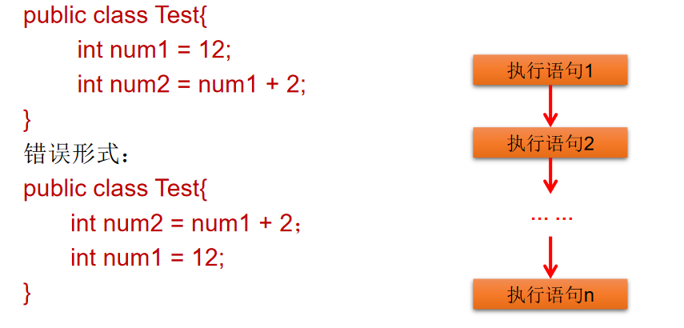
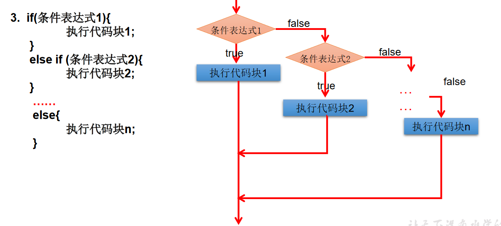
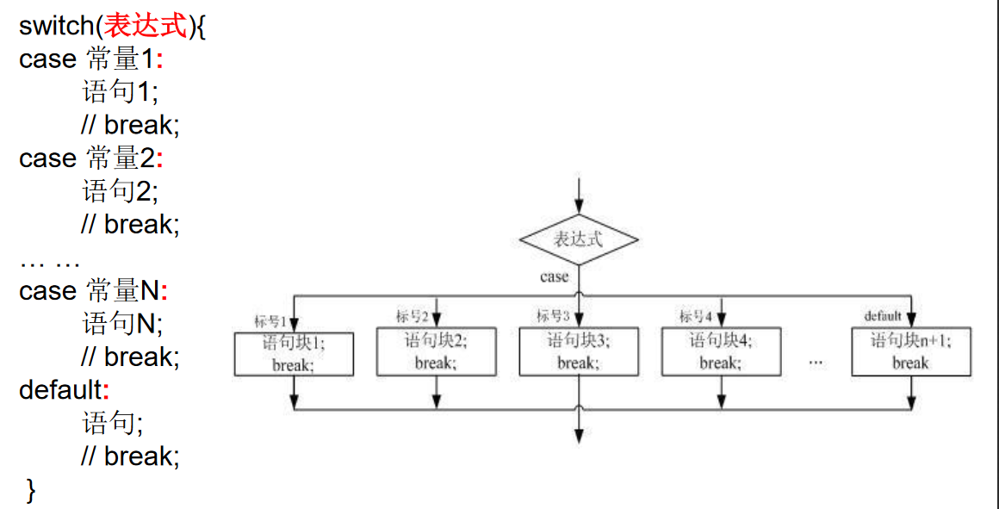
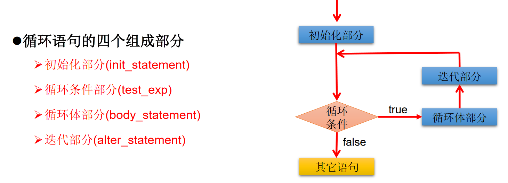
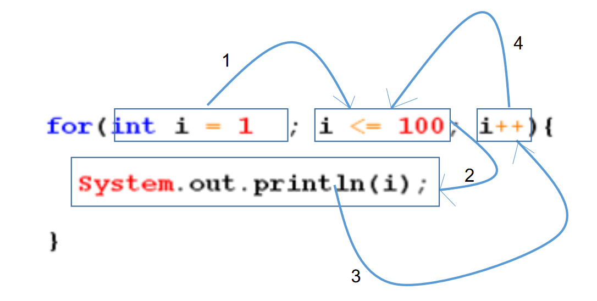

## 01、 程序流程控概述

流程控制语句是用来控制程序中各语句执行顺序的语句，可以把语句组合成能完成一定功能的小逻辑模块。

其流程控制方式采用结构化程序设计中规定的三种基本流程结构，即：

* 顺序结构
* 分支结构
* 循环结构

> 1、顺序结构
>

程序从上到下逐行地执行，中间没有任何判断和跳转。

> 2、分支结构
>

* 根据条件，选择性地执行某段代码。
* 有`if…else`和`switch-case`两种分支语句。

> 3、循环结构
>

* 根据循环条件，重复性的执行某段代码。
* 有`while、do…while、for`三种循环语句。
* 注：JDK1.5提供了`foreach`循环，方便的遍历集合、数组元素。

## 02、 顺序结构

Java中定义成员变量时采用合法的前向引用。如：



## 03、分支语句

## 2.1、分支语句1：if-else结构




> 1、if-else使用说明：
>

* 条件表达式必须是布尔表达式（关系表达式或逻辑表达式）、布尔变量；
* 语句块只有一条执行语句时，一对{}可以省略，但建议保留；
* if-else语句结构，根据需要可以嵌套使用；
* 当if-else结构是“多选一”时，最后的else是可选的，根据需要可以省略；
* 当多个条件是“互斥”关系时，条件判断语句及执行语句间顺序无所谓当多个条件是“包含”关系时，“小上大下/ 子上父下”。

> 2、练习
>

```java
/*
分支结构中的if-else（条件判断结构）
一、三种结构
第一种：
if(条件表达式){
	执行表达式
}
第二种：
if(条件表达式){
	执行表达式1
}else{
	执行表达式2
}
第三种：
if(条件表达式){
	执行表达式1
}else if{
	执行表达式2
}else if(条件表达式){
	执行表达式3
}
...
else{
	执行表达式n
}

*/
class IfTest{ 
	public static void main(String[] args){ 
		//举例1
		int heartBeats = 75;
		if(heartBeats < 60 || heartBeats > 100){ 
			System.out.println("需要进一步做检查");
		}
		System.out.println("检查结束");

		//举例2
		int age = 23;
		if(age < 18){ 
			System.out.println("你还可以看动画片");
		}else{ 
			System.out.println("你可以看科技电影了");
		}

		//举例3
		if(age < 0){ 
			System.out.println("你输入的数据不合适");
		}else if(age < 18){ 
			System.out.println("你还是个青少年");
		}else if(age < 35){ 
			System.out.println("你还是个青壮年");
		}else if(age < 60){ 
			System.out.println("你还是个中年");
		}else if(age < 120){ 
			System.out.println("你进入老年了");
		}else{ 
			System.out.println("你成仙了");
		}
	}
}
123456789101112131415161718192021222324252627282930313233343536373839404142434445464748495051525354555657585960
```

### 2.1.1、输入语句

```java
/*
如何从键盘获取不同类型的变量，需要使用Scanner类

具体步骤：
1.导包：import java.util.Scanner;
2.Scanner的实例化;
3.调用Scanner类的相关方法，来获取指定的变量。
*/
import java.util.Scanner;

class IFTest{ 
	public static void main(String[] args){ 
		//声明一个Scanner
		Scanner scan = new Scanner(System.in);

		int num = scan.nextInt();

		System.out.println(num);
	}
}
1234567891011121314151617181920
```

```java
/*
如何从键盘获取不同类型的变量，需要使用Scanner类

具体步骤：
1.导包：import java.util.Scanner;
2.Scanner的实例化;
3.调用Scanner类的相关方法，来获取指定的变量。
*/
import java.util.Scanner;

class IFTest{ 
	public static void main(String[] args){ 
		//Scanner实例化
		Scanner scan = new Scanner(System.in);

		System.out.println("请输入你的姓名：");
		String name = scan.next();
		System.out.println(name);

		System.out.println("请输入你的年龄：");
		int age = scan.nextInt();
		System.out.println(age);

		System.out.println("请输入你的体重：");
		double weight = scan.nextDouble();
		System.out.println(weight);

		System.out.println("你是否单身？(true/false)");
		boolean isLive = scan.nextBoolean();
		System.out.println(isLive);

		//char型的获取，Scanner没有提供相关方法，只能获取一个字符串
		System.out.println("请输入你的性别：(男/女)");
		String TF = scan.next();
		char TFChar = TF.charAt(0);
		System.out.println(TFChar);
	}
}
1234567891011121314151617181920212223242526272829303132333435363738
```

> 1、练习1
>

```java
/*
岳小鹏参加Java考试，他和父亲岳不群达成承诺：
如果：成绩为100分时，奖励一辆BMW；
成绩为(80，99]时，奖励一台iphone xs max；
当成绩为[60,80]时，奖励一个iPad；
其它时，什么奖励也没有。
请从键盘输入岳小鹏的期末成绩，并加以判断

说明：
1.else结构是可选的。
2.针对于条件表达式：
	① 如果多个条件表达式之间的关系是“互斥”关系(或没有交集的关系),哪个判断和执行语句声明在上面还是下面，无所谓；
	② 如果多个条件表达式之间是有交集的关系，需要根据实际情况，需要考虑实际情况，考虑清楚应该将哪个结构声明在上面。
	③ 如果多个条件表达式之间有包含的关系，通常情况下，需要将范围小的声明在范围大的上面。否则，范围小的就没机会运行。
*/
import java.util.Scanner;
class IFTest02{ 
	public static void main(String[] args){ 
		Scanner scan = new Scanner(System.in);
		System.out.println("请输入岳小鹏的成绩：");
		int score = scan.nextInt();

		if(score == 100){ 
			System.out.println("奖励一辆BMW");
		}else if(score >80 && score <=99){ 
			System.out.println("奖励一台iphone xs max");
		}else if(score >= 60 && score <= 80){ 
			System.out.println("奖励一个iPad");
		}else{ 
			System.out.println("奖励？学习去！！！");
		}
	}
}
123456789101112131415161718192021222324252627282930313233
```

> 2、练习2
>

```java
/*
编写程序：由键盘输入三个整数分别存入变量num1、num2、num3，
对它们进行排序(使用if-else if-else),并且从小到大输出。

*/
import java.util.Scanner;

class Sorting{ 
	public static void main(String[] args){ 
		//Scanner实例化
		Scanner scan = new Scanner(System.in);
		System.out.println("请输入第一个整数：");
		int num1 = scan.nextInt();
		System.out.println("请输入第二个整数：");
		int num2 = scan.nextInt();
		System.out.println("请输入第三个整数：");
		int num3 = scan.nextInt();

		int MaxNumber = 0;
		if(num1 >= num2 ){ 
			if(num3 >= num1){ 
				System.out.println(num2 + "," + num1 + "," + num3);
			}else if(num3 <= num2){ 
				System.out.println(num3 + "," + num2 + "," + num1);
			}else{ 
				System.out.println(num2 + "," + num3 + "," + num1);
			}
		}else{ 
			if(num3 >= num2){ 
				System.out.println(num1 + "," + num2 + "," + num3);
			}else if(num3 <= num1){ 
				System.out.println(num3 + "," + num1 + "," + num2);
			}else{ 
				System.out.println(num1 + "," + num3 + "," + num2);
			}
		}
	}
}
1234567891011121314151617181920212223242526272829303132333435363738
```

> 3、练习3
>

```java
/*
我家的狗5岁了，5岁的狗相当于人类多大呢？
其实，狗的前两年每一年相当于人类的10.5岁，之后每增加一年就增加四岁。
那么5岁的狗相当于人类多少年龄呢？应该是：10.5 + 10.5 + 4 + 4 + 4 = 33岁。
如果用户输入负数，请显示一个提示信息。

*/
import java.util.Scanner;

class DogYear{ 
	public static void main(String[] args) { 
		Scanner scan = new Scanner(System.in);
		System.out.println("请输入狗的年龄：");
		double Dyear = scan.nextDouble();
		if(Dyear <= 2 &&  Dyear > 0){ 
			System.out.println("狗的年龄等同于人的：" + Dyear * 10.5);
		}else if(Dyear <= 0){ 
			System.out.println("你输入的不正确。");
		}else{ 
			double number = 2 * 10.5 + (Dyear - 2) * 4;
			System.out.println("狗的年龄等同于人的：" + number);
		}	
	}
}
123456789101112131415161718192021222324
```

> 4、练习4
>

```java
/*
假设你想开发一个玩彩票的游戏，程序随机地产生一个两位数的彩票，
提示用户输入一个两位数，然后按照下面的规则判定用户是否能赢。
1)如果用户输入的数匹配彩票的实际顺序，奖金10 000美元。
2)如果用户输入的所有数字匹配彩票的所有数字，但顺序不一致，奖金3 000美元。
3)如果用户输入的一个数字仅满足顺序情况下匹配彩票的一个数字，奖金1 000美元。
4)如果用户输入的一个数字仅满足非顺序情况下匹配彩票的一个数字，奖金500美元。
5)如果用户输入的数字没有匹配任何一个数字，则彩票作废。
提示：使用(int)(Math.random() * 90  + 10)产生随机数。
Math.random() : [0,1)  * 90 [0,90) + 10 [10,100)[10,99]

*/
import java.util.Scanner;

class CaiTest{ 
	public static void main(String[] args){ 
		//1、随机产生一个两位数
		//System.out.println(Math.random());//产生[0,1)
		int number = (int)(Math.random()*90 + 10);//得到[10,99]，即[10,100)
		//System.out.println(number);
	
		int numberShi = number/10;
		int numberGe = number%10;
	
		//2、用户输入一个两位数
		Scanner input = new Scanner(System.in);
		System.out.print("请输入一个两位数：");
		int guess = input.nextInt();
	
		int guessShi = guess/10;
		int guessGe = guess%10;
	
		if(number == guess){ 
			System.out.println("奖金10 000美元");
		}else if(numberShi == guessGe && numberGe == guessShi){ 
			System.out.println("奖金3 000美元");
		}else if(numberShi==guessShi || numberGe == guessGe){ 
			System.out.println("奖金1 000美元");
		}else if(numberShi==guessGe || numberGe == guessShi){ 
			System.out.println("奖金500美元");
		}else{ 
			System.out.println("没中奖");
		}
	
		System.out.println("中奖号码是：" + number);
	}
}
1234567891011121314151617181920212223242526272829303132333435363738394041424344454647
```

> 6、练习5
>

```java
/*
大家都知道，男大当婚，女大当嫁。
那么女方家长要嫁女儿，当然要提出一定的条件：高：180cm以上；
富：财富1千万以上；帅：是。如果这三个条件同时满足，则：“我一定要嫁给他!!!”
如果三个条件有为真的情况，则：“嫁吧，比上不足，比下有余。”
如果三个条件都不满足，则：“不嫁！”

*/
import java.util.Scanner;

class GaoFuTest{ 
	public static void main(String[] args){ 
		Scanner scan = new Scanner(System.in);

		System.out.println("请输入你的身高：(cm)");
		int height = scan.nextInt();
		System.out.println("请输入你的财富：(千万)");
		double weight = scan.nextDouble();
//		System.out.println("请输入你是否帅：(true/false)");
//		boolean isHandSome = scan.nextBoolean();

//		if(height >= 180 && weight >= 1 && isHandSome){ 
//			System.out.println("我一定要嫁给他!!!");
//		}else if(height >= 180 || weight >= 1 || isHandSome){ 
//			System.out.println("嫁吧，比上不足，比下有余。");
//		}else{ 
//			System.out.println("不嫁！");
//		}

		//方式二
		System.out.println("请输入你是否帅: (是or否)");
		String isHandsome = scan.next();

		if(height >= 100 && weight >= 1 && isHandsome.equals("是")){ 
			System.out.println("我一定要嫁给他!!!");
		}else if(height >= 180 || weight >= 1 || isHandsome.equals("是")){ 
			System.out.println("嫁吧，比上不足，比下有余。");
		}else{ 
			System.out.println("不嫁！");
		}
	}
}
123456789101112131415161718192021222324252627282930313233343536373839404142
```

## 2.2、 分支语句2：switch-case结构

> **注意： switch结构中的表达式，只能是如下的六种数据类型之一：`byte`、`short`、`char`、`int`、`枚举类型`(JDK5.0)、`String类型`(JDK7.0)**
>
> **不能是：long，float，double，boolean** 。
>



```java
/*
分支结构之二：switch-case

1.格式
switch(表达式){
case 常量1:
	执行语句1;
	//break;
case 常量2:
	执行语句2;
	//break;

...

default:
	执行语句n:
	//break;
}

2.说明:
① 根据switch表达式中的值，依次匹配各个case中的常量。一旦匹配成功，进入相应case结构中，执行相关语句。
  当调用完执行语句后，则仍然继续向下执行其他case语句，直到遇到break关键字或末尾结束为止。

② break, 可以使用switch-case结构中，表示一旦执行到此关键字，就跳出switch-case结构。

③ switch结构中的表达式，只能是如下的六种数据类型之一：byte、short、char、int、枚举类型(JDK5.0)、String类型(JDK7.0)
④ case 之后之能声明常量。不能声明范围。

⑤ break关键字是可选的。
⑥ default：相当于if-else结构中的else。
			default 结构是可选的，而且位置是灵活的。
*/

class SwitchTest{ 
	public static void main(String[] args){ 

		int number = 2;
		switch(number){ 
		case 0:
			System.out.println("zero");
			break;
		case 1:
			System.out.println("one");
			break;
		case 2:
			System.out.println("twe");
			break;
		case 3:
			System.out.println("three");
			break;
		default:
			System.out.println("other");
			break;
		}

		//*********************************
		//运行报错，不能运行boolean类型
/*		boolean isHandSome = true;
		switch(isHandSome){ 
		case true:
			System.out.println("可乐吗？？");
			break;
		case false:
			System.out.println("薯条吗？？");
			break;
		default:
			System.out.println("输入有误！！！");
		}
*/
		//*********************************
		String season= "summer";
		switch(season) { 
		case"spring":
			System.out.println("春暖花开");
			break;
		case"summer":
			System.out.println("夏日炎炎");
			break;
		case"autumn":
			System.out.println("秋高气爽");
			break;
		case"winter":
			System.out.println("冬雪皑皑");
			break;
		default:
			System.out.println("季节输入有误");
			break;
		}

		//**************************************
		//运行报错
/*		int age = 10;
		switch(age){ 		
		case age > 18:
			System.out.println("成年了");
			break;
		default:
			System.out.println("未成年");
		}	*/
	}
}
123456789101112131415161718192021222324252627282930313233343536373839404142434445464748495051525354555657585960616263646566676869707172737475767778798081828384858687888990919293949596979899100101
```

> 1、练习1
>

```java
/*
使用switch 把小写类型的char型转为大写。只转换a, b, c, d, e. 其它的输出“other”。
提示：String word = scan.next();  char c = word.charAt(0); switch(c){}
*/
import java.util.Scanner;
class  SwitchCaseTest1{ 
	public static void main(String[] args) { 
		Scanner scan = new Scanner(System.in);
		String word = scan.next();  
		char c = word.charAt(0); 
		switch(c){ 
		case 'a':
			System.out.println("A");
			break;
		case 'b':
			System.out.println("B");
			break;
		case 'c':
			System.out.println("C");
			break;
		case 'd':
			System.out.println("D");
			break;
		case 'e':
			System.out.println("E");
			break;
		default:
			System.out.println("other");
		}
	}
}
12345678910111213141516171819202122232425262728293031
```

> 2、练习2
>

```java
/*
对学生成绩大于60分的，输出“合格”。低于60分的，输出“不合格”。

说明：如果switch-case语句中多个相同语句，可以进行合并。
*/
class  SwitchTest1{ 
	public static void main(String[] args){ 
		int score = 78;
		//方案一
		switch(score / 10){ 
		case 0:
		case 1:
		case 2:
		case 3:
		case 4:
		case 5:
			System.out.println("不合格");
			break;
		case 6:
		case 7:
		case 8:
		case 9:
		case 10:
			System.out.println("合格");
			break;
		}

		//更优的解法
		switch(score /60){ 
		case 0:
			System.out.println("不及格");
			break;
		case 1:
			System.out.println("合格");
			break;
		}
	}
}
1234567891011121314151617181920212223242526272829303132333435363738
```

> 3、练习3
>

```java
/*
根据用于指定月份，打印该月份所属的季节。
3,4,5 春季6,7,8 夏季9,10,11 秋季12, 1, 2 冬季

*/
class MonthTest{ 
	public static void main(String[] args){ 
		int month = 6;
		switch(month){ 
		case 12:
		case 1:
		case 2:
			System.out.println("冬季");
			break;
		case 3:
		case 4:
		case 5:
			System.out.println("春季");
			break;
		case 6:
		case 7:
		case 8:
			System.out.println("夏季");
			break;
		case 9:
		case 10:
		case 11:
			System.out.println("秋季");
			break;
		}
	}
}
1234567891011121314151617181920212223242526272829303132
```

> 4、练习4
>

```java
/*
编写程序：从键盘上输入2020年的“month”和“day”，
要求通过程序输出输入的日期为2019年的第几天。
2 15 : 31 + 15

5 7: 31 + 28 +31 +30 + 7
...
说明：break在switch-case中是可选的。
*/
import java.util.Scanner;
class DayTest{ 
	public static void main(String[] args) { 
		Scanner scan = new Scanner(System.in);
		System.out.println("请输入2020年的month");
		int month = scan.nextInt();
		System.out.println("请输入2020年的day");
		int day = scan.nextInt();

		//定义一个变量来保存天数
		int sumDays = 0;
		switch(month){ 
		case 12:
			sumDays += 30;
		case 11:
			sumDays += 31;
		case 10:
			sumDays += 30;
		case 9:
			sumDays += 31;
		case 8:
			sumDays += 31;
		case 7:
			sumDays += 30;
		case 6:
			sumDays += 31;
		case 5:
			sumDays += 30;
		case 4:
			sumDays += 31;
		case 3:
			sumDays += 29;
		case 2:
			sumDays += 31;
		case 1:
			sumDays += day;
		}

		System.out.println("2020年" + month + "月" + day + "日是当年的第" + sumDays + "天");
	}
}
1234567891011121314151617181920212223242526272829303132333435363738394041424344454647484950
```

> 5、练习5
>

```java
/*
从键盘分别输入年、月、日，判断这一天是当年的第几天注：判断一年是否是闰年的标准：
1）可以被4整除，但不可被100整除或
2）可以被400整除
(year % 4 == 0 && year % 100 != 0) || year %400 == 0)

说明:
1凡是可以使用switch-case的结构,都可以转换为if-else。反之,不成立。
2.我们写分支结构时,当发现既可以使用switch-case,〔(同时,switch中表达式的取值情况不太多),
又可以使用，我们优先选择使用switch-case。原因:switch-case执行效率稍高。

*/
import java.util.Scanner;
class YearDayTest{ 
	public static void main(String[] args) { 
		Scanner scan = new Scanner(System.in);
		System.out.println("请输入year");
		int year = scan.nextInt();
		System.out.println("请输入month");
		int month = scan.nextInt();
		System.out.println("请输入day");
		int day = scan.nextInt();

		//定义一个变量来保存天数
		int sumDays = 0;
		switch(month){ 
		case 12:
			sumDays += 30;
		case 11:
			sumDays += 31;
		case 10:
			sumDays += 30;
		case 9:
			sumDays += 31;
		case 8:
			sumDays += 31;
		case 7:
			sumDays += 30;
		case 6:
			sumDays += 31;
		case 5:
			sumDays += 30;
		case 4:
			sumDays += 31;
		case 3:
			//判断是否为闰年
			if((year % 4 == 0 && year % 100 != 0) || year %400 == 0){ 
				sumDays += 29;
			}else{ 
				sumDays += 28;
			}
		case 2:
			sumDays += 31;
		case 1:
			sumDays += day;
		}

		System.out.println(year + "年" + month + "月" + day + "日是当年的第" + sumDays + "天");
	}
}
123456789101112131415161718192021222324252627282930313233343536373839404142434445464748495051525354555657585960
```

> 6、练习六
>

```java
/*
编写一个程序，为一个给定的年份找出其对应的中国生肖。
中国的生肖基于12年一个周期，每年用一个动物代表：
rat、ox、tiger、rabbit、dragon、snake、horse、sheep、monkey、rooster、dog、pig。
提示：2019年：猪2019 % 12 == 3
*/
import java.util.Scanner;
class ZodiacSignTest{ 
	public static void main(String[] args){ 
		Scanner scan = new Scanner(System.in);
		System.out.println("请输入年份：");
		int year = scan.nextInt();
		switch (year % 12){ 
		case 1:
			System.out.println("rooster");
			break;
		case 2:
			System.out.println("dog");
			break;
		case 3:
			System.out.println("pig");
			break;
		case 4:
			System.out.println("rat");
			break;
		case 5:
			System.out.println("ox");
			break;
		case 6:
			System.out.println("tiger");
			break;
		case 7:
			System.out.println("rabbit");
			break;
		case 8:
			System.out.println("dragon");
			break;
		case 9:
			System.out.println("snake");
			break;
		case 10:
			System.out.println("horse");
			break;
		case 11:
			System.out.println("sheep");
			break;
		case 12:
			System.out.println("monkey");
			break;
		}
	}
}
12345678910111213141516171819202122232425262728293031323334353637383940414243444546474849505152
```

## 04、循环结构

> 1、循环结构
>

在某些条件满足的情况下，反复执行特定代码的功能

> 2、循环语句分类
>

* for 循环
* while 循环
* do-while 循环



## 4.1、for循环

```java
语法格式
for(①初始化部分;②循环条件部分;④迭代部分)｛
            ③循环体部分;
｝


执行过程：①-②-③-④-②-③-④-②-③-④-.....-②


说明：
②循环条件部分为boolean类型表达式，当值为false时，退出循环
①初始化部分可以声明多个变量，但必须是同一个类型，用逗号分隔
④可以有多个变量更新，用逗号分隔
12345678910111213
```



```java
/*
For循环结构的使用
一、循环结构的四个要素
① 初始化条件
② 循环条件
③ 循环体
④ 迭代条件

二、for循环的结构
for(①;②;④){
	③
}
*/
class ForTest{ 
	public static void main(String[] args){ 
		for(int i=1;i <= 5 ;i++){ 
			System.out.println("Hello World!");
		}

		//练习：
		int num = 1;
		for(System.out.print('a');num <= 3;System.out.print('c'),num++){ 
			System.out.print('b');
		}

		//遍历100以内的偶数,获取所有偶数的和,输出偶数的个数
		int sum = 0;	//记录所有偶数的和
		int count = 0;
		for(int i = 1;i <= 100;i++){ 
			if(i %2 == 0){ 
				System.out.println(i);
				sum += i;
				count++;
			}
		}
		System.out.println("100以内的偶数的和：" + sum);
		System.out.println("个数为：" + count);
	}
}
123456789101112131415161718192021222324252627282930313233343536373839
```

> 1、练习1
>

```java
/*
编写程序从1循环到150，并在每行打印一个值，
另外在每个3的倍数行上打印出“foo”,
在每个5的倍数行上打印“biz”,
在每个7的倍数行上打印输出“baz”。

*/
class ForTest1{ 
	public static void main(String[] args){ 
	
		for(int i = 1;i <= 150;i++ ){ 
			System.out.print(i + " ");
			if(i % 3 == 0){ 
				System.out.print("foo ");
			}
			if(i % 5 == 0){ 
				System.out.print("biz ");
			}
			if(i % 7 == 0){ 
				System.out.print("baz ");
			}

			//换行
			System.out.println();
		}
	}
}
123456789101112131415161718192021222324252627
```

> 2、练习2
>

```java
/*
输入两个正整数m和n，求其最大公约数和最小公倍数。
比如：12和20的最大公约数是4，最小公倍数是60。说明：break关键字的使用

*/
import java.util.Scanner;
class GnumberTest{ 
	public static void main(String[] args){ 
		Scanner scan = new Scanner(System.in);
		System.out.println("请输入m:");
		int m = scan.nextInt();
		System.out.println("请输入n:");
		int n = scan.nextInt();
		//获取m和n的较大值
		int max = (m > n) ? m : n;
		//获取m和n的最小值
		int min = (m < n) ? m : n;
	
		//求最大公约数
		for(int i = min;i >= 1;i--){ 
			if(m % i == 0 && n % i == 0){ 
				System.out.println("m和n的最大公约数：" + i);
				break;
			}
		}

		//求最小公倍数
		for(int i = max;i <= m * n;i++){ 
			if( i % m == 0 && i % n == 0){ 
				System.out.println("m和n的最小公倍数是：" + i);
				break;
			}
		}
	}
}
1234567891011121314151617181920212223242526272829303132333435
```

> 3、练习3
>

```java
/*
输出所有的水仙花数，所谓水仙花数是指一个3位数，其各个位上数字立方和等于其本身。
例如：153 = 1*1*1 + 3*3*3 + 5*5*5

*/
class ForTest2{ 
	public static void main(String[] args){ 
		for(int i = 100;i <= 999;i++){ 
			int a = i / 100;	//获取百位
			int b = i % 100 /10;	//获取十位
			int c = i % 10;	//获取个位
			if(a*a*a + b*b*b + c*c*c == i){ 
				System.out.println("此数值为满足条件的水仙花数:" + i);
			}
		}
	}
}
1234567891011121314151617
```

## 4.2、while循环

> 语法格式
>

```java
①初始化部分
while(②循环条件部分)｛
    ③循环体部分;
    ④迭代部分;
}
12345
```

执行过程：①-②-③-④-②-③-④-②-③-④-…-②

> 说明：
>

* 注意不要忘记声明④迭代部分。否则，循环将不能结束，变成死循环。
* for循环和while循环可以相互转换。

```java
public class WhileLoop { 
    public static void main(String args[]) { 
        int result = 0;
        int i= 1;
        while(i<= 100) { 
            result += i;
            i++;
        }
        System.out.println("result="+ result);
    }
}
1234567891011
```

> 1、练习
>

```java
/*
While循环结构的使用
一、循环结构的四个要素
① 初始化条件
② 循环条件
③ 循环体
④ 迭代条件

二、while循环的结构
①初始化部分
while(②循环条件部分)｛
    ③循环体部分;
    ④迭代部分;
}

执行过程： ① - ② - ③ - ④ - ② -  ③ - ④ - ... - ② 

说明：
1.写while循环千万要小心不要丢了迭代条件。一旦丢了，就可能导致死循环！
2.写程序要避免死循环。
3.能用while循环的，可以用for循环，反之亦然。二者可以相互转换。
区别：for循环和while循环的初始化条件部分的作用范围不同。

算法：有限性。
*/
class WhileTest{ 
	public static void main(String[] args){ 
		//遍历100以内的所有偶数
		int i = 1;
		while(i <= 100){ 
			if(i % 2 == 0){ 
				System.out.println(i);
			}
			i++;
		}
	}
}
12345678910111213141516171819202122232425262728293031323334353637
```

## 4.3、do-while循环

```java
do-while循环结构的使用
一、循环结构的四个要素
① 初始化条件
② 循环条件 --->是boolean类型
③ 循环体
④ 迭代条件

二、do-while循环的结构
①
do{ 
	③;
	④;
}while(②);

执行过程：① - ③ - ④ - ② - ① - ③ - ④ - ... - ②
 
说明：do-while循环至少执行一次循环体。
1234567891011121314151617
```

> 1、练习1
>

```java
class DoWhileTest{ 
	public static void main(String[] args){ 
		//遍历100以内的所有偶数,并计算所有偶数的和和偶数的个数
		int number = 1;
		int sum = 0;	//记录总和
		int count = 0;	//记录个数
		do{ 
			if(number % 2 == 0){ 
				System.out.println(number);
				sum += number;
				count++;
			}
			number++;
		}while(number <= 100);

		System.out.println("总和为：" + sum);
		System.out.println("个数为：" + count);

		//*********************************
		int numb = 10;
		while(numb > 10){ 
			System.out.println("hello:while");
			numb--;
		}

		int numb2 = 10;
		do{ 
			System.out.println("hello：do-while");
			numb2--;
		}while(numb2 > 10);
	}
}
1234567891011121314151617181920212223242526272829303132
```

> 2、练习2
>

```java
/*
从键盘读入个数不确定的整数，并判断读入的正数和负数的个数，输入为0时结束程序。

说明：
1.不在循环条件部分限制次数的结构：while(true) , for(true)
2.结束循环的几种方式：
	方式一：循环条件部分返回false;
	方式二：在循环体中，执行break;
*/
import java.util.Scanner;
class XunTest{ 
	public static void main(String[] args) { 
		Scanner scan = new Scanner(System.in);
		int Positive = 0;	//正数个数
		int Negative = 0;	//负数个数
		while(true){ 
			int number = scan.nextInt();
			if(number > 0){ 
				Positive++;
			}else if(number < 0){ 
				Negative++;
			}else{ 
				//一旦执行，跳出循环。
				break;
			}
		}

		System.out.println("正数的个数：" + Positive);
		System.out.println("负数的个数：" + Negative);
	}
}
12345678910111213141516171819202122232425262728293031
```

## 4.4、[嵌套](https://so.csdn.net/so/search?q=%E5%B5%8C%E5%A5%97&spm=1001.2101.3001.7020)循环结构

> 1、嵌套循环(多重循环)
>

* 将一个循环放在另一个循环体内，就形成了嵌套循环。其中，for ,while ,do…while均可以作为外层循环或内层循环。
* 实质上，嵌套循环就是把内层循环当成外层循环的循环体。当只有内层循环的循环条件为false时，才会完全跳出内层循环，才可结束外层的当次循环，开始下一次的循环。
* 设外层循环次数为m次，内层为n次，则内层循环体实际上需要执行m*n次。

> 2、例题：
>

1. 九九乘法表
2. 100以内的所有质数

> 3、练习1
>

```java
/*
嵌套循环的使用
1.嵌套循环：将一个循环结构A声明在另一个循环结构B的循环体中，就构成了嵌套循环

2.
外层循环：循环结构B
内层循环：循环结构A
3.说明
① 内层循环遍历一遍，只相当于外层循环循环体执行了一次
② 假设外层循环需要执行m次，内层循环需要执行n次。此时内层循环的循环体一共执行了m * n次

4.技巧
外层循环控制行数，内层循环控制列数
*/
class  ForForTest{ 
	public static void main(String[] args) { 
		//******
		for(int i = 1;i <= 6;i++){ 
			System.out.print("*");
		}
		System.out.println();//换行

		/*
		******
		******
		******
		******
		*/
		for(int i = 1;i <= 4;i++){   
			for(int j = 1;j <= 6;j++){   
				System.out.print('*');
			}
			System.out.println();	//换行
		}
		/*
		*
		**
		***
		****
		*****
		*/
		for(int i = 1;i <= 5;i++){   //控制行数
			for(int j = 1;j <= i;j++){   //控制列数
				System.out.print("*");
			}
			System.out.println();
		}
		/*
		*****
		****
		***
		**
		*
		*/
		for(int i = 1;i <= 6;i++){ 
			for(int j = 1;j <= 6-i;j++){ 
				System.out.print("*");
			}
			System.out.println();
		}

		/*
		*
		**
		***
		****
		*****
		****
		***
		**
		*
		*/
		for(int i = 1;i <= 5;i++){ 
			for(int j = 1;j <= i;j++){ 
				System.out.print("*");
			}
			System.out.println();
		}

		for(int i = 1;i <= 5;i++){ 
			for(int j = 1;j <= 5-i;j++){ 
				System.out.print("*");
			}
			System.out.println();
		}

		//九九乘法表
		for(int i = 1;i <= 9;i++){ 
			for(int j = 1;j <= i;j++){ 
				System.out.print(i + "*" + j + "=" + i*j + " ");
			}
			System.out.println();	//换行
		}

	}
}
123456789101112131415161718192021222324252627282930313233343536373839404142434445464748495051525354555657585960616263646566676869707172737475767778798081828384858687888990919293949596
```

> 练习2
>

```java
/*
100以内的所有质数
质数：素数，只能被1和它本身整除的自然数。

最小的质数是：2
*/
class PrimeNuberTest{ 
	public static void main(String[] args){ 
		boolean isFlag = true;	//标识是否被除尽，一旦除尽，修改其值。

		for(int i = 2;i <= 100;i++){ 	//遍历100以内的自然数
			for(int j =2;j < i;j++){ 	//j:被i去除
				if(i % j == 0){ 	//i被j除尽
					isFlag = false;
				}
			}
			if(isFlag == true){ 
				System.out.println(i);
			}

			//重置isFlag
			isFlag = true;
		}
	}
}
12345678910111213141516171819202122232425
```

> 练习2的优化
>

```java
/*
100000以内的所有质数
质数：素数，只能被1和它本身整除的自然数。

最小的质数是：2
*/

class PrimeNuberTest{ 
	public static void main(String[] args){ 
		boolean isFlag = true;	//标识是否被除尽，一旦除尽，修改其值。
		int count = 0;	//记录质数的个数

		//获取当前时间举例1970-01-01 00:00:00 的毫秒数
		long start = System.currentTimeMillis();

		for(int i = 2;i <= 100000;i++){ 	//遍历100以内的自然数
			//优化2：对本身是质数的自然数有效 5447---> 11
		//	for(int j =2;j < i;j++){	//j:被i去除
			for(int j =2;j <= Math.sqrt(i);j++){ 	//j:被i去除
				if(i % j == 0){ 	//i被j除尽
					isFlag = false;
					break;	//优化一：只对本身非质数的自然数是有效的。
				}
			}
			if(isFlag == true){ 
			//	System.out.println(i);
				count++;
			}

			//重置isFlag
			isFlag = true;
		}

		//获取当前时间举例1970-01-01 00:00:00 的毫秒数
		long end = System.currentTimeMillis();


		System.out.println("质数的个数:" + count);
		System.out.println("所花费的时间为:" + (end - start));	//16843 --> 5447	优化一
	}
}
1234567891011121314151617181920212223242526272829303132333435363738394041
```

## 4.5、break、continue的使用

> 1、break的使用
>

* break语句用于终止某个语句块的执行

  ```java
  {   
  	......
  	break;
  	......
  }
  12345
  ```
* **break语句出现在多层嵌套的语句块中时，可以通过标签指明要终止的是哪一层语句块**

  ```java
  label1:	{ 	......
  label2:		{ 	......
  label3:			{ 	......
  					break label2;
  					......
  				}
  			}
  		}
  12345678
  ```

> 2、continue的使用
>

* continue 语句

  * continue只能使用在循环结构中
  * continue语句用于跳过其所在循环语句块的一次执行，继续下一次循环
  * **continue语句出现在多层嵌套的循环语句体中时，可以通过标签指明要跳过的是哪一层循环**

> 3、return的使用
>

* return：并非专门用于结束循环的，它的功能是结束一个方法。当一个方法执行到一个return语句时，这个方法将被结束。
* 与break和continue不同的是，return直接结束整个方法，不管这个return处于多少层循环之内。

> 4、特殊流程控制语句说明
>

* break只能用于switch语句和循环语句中。
* continue 只能用于循环语句中。
* 二者功能类似，但continue是终止本次循环，break是终止本层循环。
* break、continue之后不能有其他的语句，因为程序永远不会执行其后的语句。
* 标号语句必须紧接在循环的头部。标号语句不能用在非循环语句的前面。
* 很多语言都有goto语句，goto语句可以随意将控制转移到程序中的任意一条语句上，然后执行它。但使程序容易出错。Java中的break和continue是不同于goto的。

> 5、练习1
>

```java
/*
break和countinue关键字的使用
				使用范围			循环中使用的作用(不同点)	相同点
break:			switch-case			结束当前循环				关键字后面不能声明执行语句
				循环结构中


countinue:		循环结构中			结束当次循环				关键字后面不能声明执行语句

*/
class BreakContinueTest{ 
	public static void main(String[] args){ 
	
		for(int i = 1;i <= 10;i++){ 
			if(i % 4 == 0){ 
			//	break;	//1、2、3
				continue;	//1、2、3、5、6、7、9、10
			//	System.out.println("该吃饭了！！！");
			}
		//	System.out.println(i);
		}
		//********************************
		for(int i = 1;i <= 4;i++){ 
		
				for(int j = 1;j <= 10; j++){ 
					if(i % 4 == 0){ 
				//		break;	//默认跳出包裹此关键字最近的一层的循环
						continue;
					}
					System.out.print(j);
				}
				System.out.println();
		}
	}
}
1234567891011121314151617181920212223242526272829303132333435
```

> 作者做笔记不容易，请评个分吧！
>

* 1、如果觉得文章写行不错就点个  **赞** 。✌
* 2、如果觉得写得好就  **一键三连** ！✌✌✌
* 3、如果文章对你很有帮助，请  **打赏** 。 💃💃💃💃💃
