## 01、面向过程与面向对象

何谓面向对象的编程思想？  
 首先解释一下“思想”。  
 先问你个问题：你想做个怎样的人？  
 可能你会回答：我想做个好人，孝敬父母，尊重长辈，关爱亲朋…  
 你看，这就是思想。这是你做人的思想，或者说，是你做人的原则。做人有做人的原则，编程也有编程的原则。这些编程的原则呢，就是编程思想。

> 面向过程(POP) 与面向对象(OOP)
>

* 面向对象：Object Oriented Programming
* 面向过程：Procedure Oriented Programming

```java
/*
 * 一、学习面向对象内容的三条主线
 * 1.Java 类及类的成员：属性、方法、构造器、代码块、内部类
 * 2.面向对象的三大特征：封装、继承、多态性、(抽象性)
 * 3.其它关键字：this、super、static、final、abstract、interface、package、import 等
 * 
 * 二、人把大象装进冰箱
 * 1.面向过程:强调的是功能行为，以函数为最小单位，考虑怎么做。
 * 
 * ① 打开冰箱
 * ② 把大象装进冰箱
 * ③ 把冰箱门关住 
 * 
 * 2.面向对象:强调具备了功能的对象，以类/对象为最小单位，考虑谁来做。
 * 人{
 * 		打开(冰箱){
 * 			冰箱.开门();
 * 		}操作(大象){
 * 			大象.进入(冰箱);
 * 		}关闭(冰箱){
 * 			 冰箱.关门();   
 * 		}
 * }
 * 
 * 冰箱{
 * 		开门(){
 * 		}  
 * 		关门(){
 * 		}
 * }
 * 
 * 大象{
 * 		进入(冰箱){
 * 		}
 * }
 */
```

> 面向对象的思想概述
>

* 程序员从面向过程的执行者转化成了面向对象的指挥者
* 面向对象分析方法分析问题的思路和步骤：

  * 根据问题需要，选择问题所针对的现实世界中的实体。
  * 从实体中寻找解决问题相关的属性和功能，这些属性和功能就形成了概念世界中的类。
  * 把抽象的实体用计算机语言进行描述，形成计算机世界中类的定义。即借助某种程序语言，把类构造成计算机能够识别和处理的数据结构。
  * 将类实例化成计算机世界中的对象。对象是计算机世界中解决问题的最终工具。

## 02、 类和对象

```java
/* 
 * 三、面向对象的两个要素：
 * 类:对一类事物的描述，是抽象的、概念上的定义
 * 对象:是实际存在的该类事物的每个个体，因而也称为实	例(instance)。
 * 可以理解为：类= 抽象概念的人；对象= 实实在在的某个人
 * 面向对象程序设计的重点是类的设计；
 * 设计类，其实就是设计类的成员。
 */
12345678
```

## 2.1、Java 类及类的成员

现实世界的生物体，大到鲸鱼，小到蚂蚁，都是由最基本的细胞构成的。同理，Java 代码世界是由诸多个不同功能的类构成的。

现实生物世界中的细胞又是由什么构成的呢？细胞核、细胞质、… 那么，Java 中用类 class 来描述事物也是如此。常见的类的成员有：

* 属性：对应类中的成员变量
* 行为：对应类中的成员方法

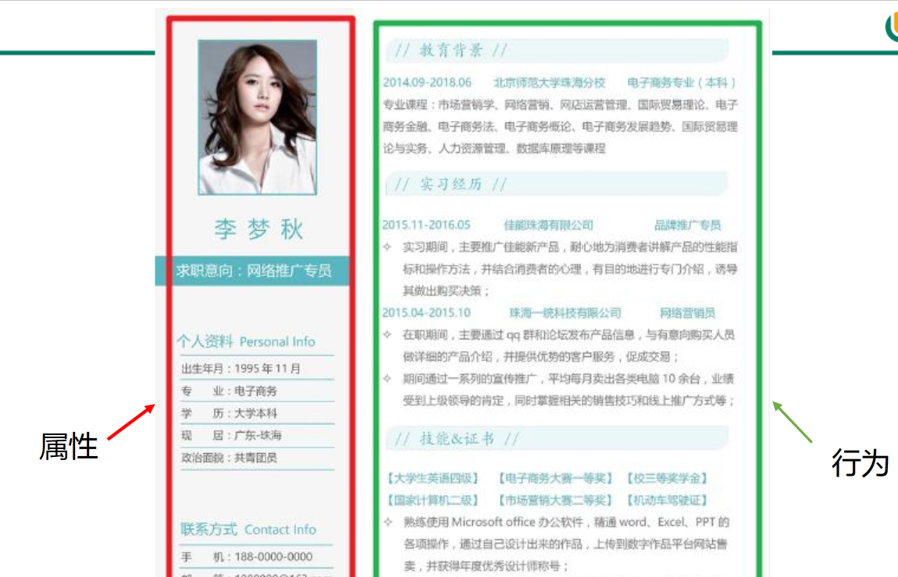

## 2.2、类与对象的创建及使用

```java
/*
 * 一、设计类、其实就是设计类的成员
 * Field = 属性 = 成员变量 = 域、字段
 * Method = (成员)方法 = 函数 
 * 
 * 创建类 = 类的实例化 = 实例化类
 * 
 * 二.类和对象的使用(面向对象思想落地的实现)
 * 1.创建类，设计类的成员
 * 2.创建类的对象
 * 3.通过“对象.属性”或“对象.方法”调用对象的结构
 * 三、如果创建类一个类的多个对象，则每个对象都独立的拥有一套类的属性。(非 static 的)
 * 	  意味着:如果我们修改一个对象的属性 a，则不影响另外一个对象属性 a 的值。
 */
//测试类
public class PersonTest { 
	public static void main(String[] args) { 
		//2.创建 Person 类的对象
		//创建对象语法：类名对象名= new 类名();
		Person p1 = new Person();
		//Scanner scan = new Scanner(System.in);
	
		//调用类的结构：属性、方法
		//调用属性:“对象.属性”
		p1.name = "Tom";
		p1.age = 25;
		p1.isMale = true;
		System.out.println(p1.name);
	
		//调用方法:“对象.方法”
		p1.eat();
		p1.sleep();
		p1.talk("chinese");
		//**********************
		Person p2 = new Person();
		System.out.println(p2.name); //null
		System.out.println(p2.isMale);
		//**********************
		//将 p1 变量保存的对象地址值赋给 p3,导致 p1 和 p3 指向了堆空间中的一个对象实体。
		Person p3 = p1;
		System.out.println(p3.name);
	
		p3.age = 10;
		System.out.println(p1.age); //10
	}
}
/*
 * 类的语法格式：
 * 修饰符 class 类名{ 
 * 		属性声明;
 * 		方法声明;
 * }
 * 说明：修饰符 public：类可以被任意访问类的正文要用{   }括起来
 */
//1.创建类，设计类的成员
class Person{ 

	//属性:对应类中的成员变量
	String name;
	int age;
	boolean isMale;

	//方法:对应类中的成员方法
	public void eat(){ 
		System.out.println("吃饭");
	}

	public void sleep(){ 
		System.out.println("睡觉");
	}

	public void talk(String language){ 
		System.out.println("人可以说话，使用的是：" + language);
	}
}
```

## 2.3、对象的创建和使用：内存解析

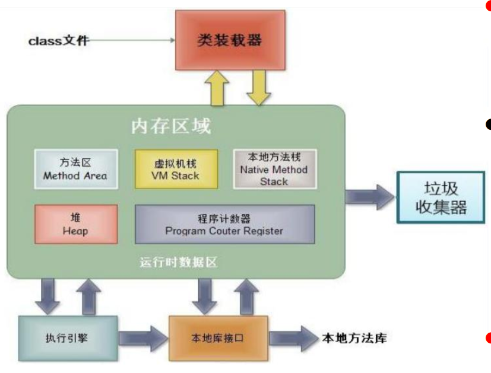

* 堆（Heap），此内存区域的唯一目的就是存放对象实例，几乎所有的对象实例都在这里分配内存。这一点在 Java 虚拟机规范中的描述是：所有的对象实例以及数组都要在堆上分配。
* 通常所说的栈（Stack），是指虚拟机栈。虚拟机栈用于存储局部变量等。局部变量表存放了编译期可知长度的各种基本数据类型（boolean、byte、char、short、int、float、long、double）、对象引用（reference 类型，它不等同于对象本身，是对象在堆内存的首地址）。方法执行完，自动释放。
* 方法区（MethodArea），用于存储已被虚拟机加载的类信息、常量、静态变量、即时编译器编译后的代码等数据。

> 1、案例 1
>

```java
Person p1= newPerson();
p1.name = "Tom";
p1.isMale = true;
Person p2 = new Person();
sysout(p2.name);//null
Person p3 = p1;
p3.age = 10;
1234567
```

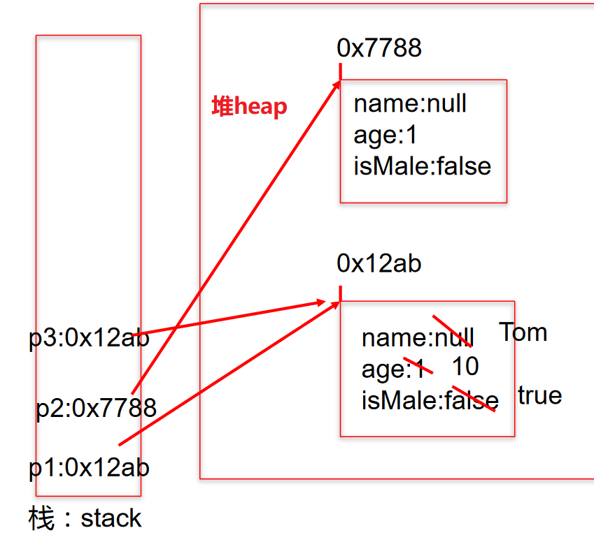

> 2、案例 2
>

```java
Person p1= newPerson();
p1.name = "胡利民";
p1.age = 23;
Person p2 = new Person();
p2.age = 10;
12345
```

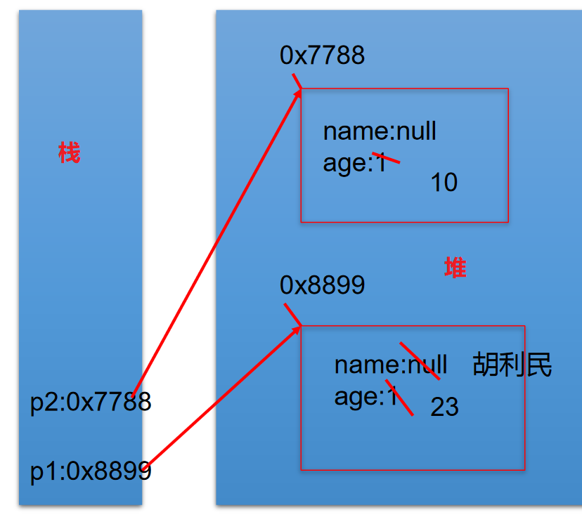

## 03、类的成员之一：属性

```java
/*
 * 类中属性的使用
 * 
 * 属性(成员变量)	vs	局部变量
 * 1.相同点:
 * 		1.1 定义变量的格式:数据类型 变量名 = 变量值
 * 		1.2 先声明，后使用
 * 		1.3 变量都有其对应的作用域
 * 			
 * 2.不同点:
 * 		2.1 在类中声明的位置不同
 * 		属性:直接定义在类的一对{}内
 * 		局部变量:声明在方法内、方法形参、构造器形参、构造器内部的变量
 * 
 * 		2.2 关于权限修饰符的不同
 * 		属性:可以在声明属性时，指明其权限，使用权限修饰符。
 * 			常用的权限修饰符:private、public、缺省、protected
 * 			目前声明属性时，都使用缺省即可。
 * 		局部变量:不可以使用权限修饰符。
 * 
 * 		2.3 默认初始化值的情况:
 * 		属性:类的属性，根据其类型，都有默认初始化值。
 * 			整型(byte、short、int、long):0
 * 			浮点型(float、double):0.0
 * 			字符型(char):0(或‘\u0000’)
 * 			布尔型(boolean):false
 * 
 * 			引用数据类型(类、数组、接口):null
 * 
 * 		局部变量:没有默认初始化值
 * 			意味着:在调用局部变量之前，一定要显式赋值。
 * 			特别地:形参在调用时,赋值即可。例，45 行
 * 
 * 		2.4 在内存中加载的位置，亦各不相同。
 * 		属性:加载到堆空间中(非 static)
 * 		局部变量:加载到栈空间
 */
public class UserTest { 
	public static void main(String[] args) { 
		User u1 = new User();
		System.out.println(u1.name);
		System.out.println(u1.age);
		System.out.println(u1.isMale);
	
		u1.talk("俄语");
	}
}
class User{ 
	//属性(或成员变量)
	String name;	//不加 private 即为缺省
	public int age;	//不加 public 即为缺省
	boolean isMale;

	public void talk(String language){ //language:形参，也是局部变量
		System.out.println("我们使用" + language + "进行交流。");
	}

	public void eat(){ 
		String food = "石头饼";	//石头饼:局部变量
		System.out.println("北方人喜欢吃:" + food);
	}
}
```

> 1、练习1
>

```java
/*
编写教师类和学生类，并通过测试类创建对象进行测试
Student类
属性:
name:String age:int major:String interests:String
方法:say() 返回学生的个人信息
Teacher类
属性:
name:String age:int teachAge:int course:String
方法:say() 输出教师的个人信息
*/
public class School { 
	public static void main(String[] args) { 
		Student stu = new Student();
        stu.name = "小明";
        stu.age = 16;
	
		Teacher tea = new Teacher();
		tea.name = "王老师";
        tea.age = 27;
      
        tea.say(stu.name,stu.age);
        stu.say(tea.name, tea.age);
	}
}
class Student{ 
	String name;
	int age;
	String major;
	String interests;

	void say(String name, int age){ 
		System.out.println("这个学生是："+name+"年龄是："+age);	}
}
class Teacher{ 
	String name;
	int age;
	String teachAge;
	String course;

	void say(String name, int age){ 
		System.out.println("这个老师是："+name+"年龄是："+age);
	}
}
```

## 04、 类的成员之二：方法

## 4.1、类中方法的声明和使用

```java
/*
 * 类中方法的声明和使用
 * 
 * 方法：描述类应该具有的功能。
 * 比如：Math类：sqrt()\random() \...
 *     Scanner类：nextXxx() ...
 *     Arrays类：sort() \ binarySearch() \ toString() \ equals() \ ...
 * 
 * 1.举例：
 * public void eat(){}
 * public void sleep(int hour){}
 * public String getName(){}
 * public String getNation(String nation){}
 * 
 * 2. 方法的声明：权限修饰符  返回值类型  方法名(形参列表){
 * 					方法体
 * 			  }
 *   注意：static、final、abstract 来修饰的方法，后面再讲。
 *   
 * 3. 说明：
 * 		3.1 关于权限修饰符：默认方法的权限修饰符先都使用public
 * 			Java规定的4种权限修饰符：private、public、缺省、protected  -->封装性再细说
 * 
 * 		3.2 返回值类型： 有返回值  vs 没有返回值
 * 			3.2.1  如果方法有返回值，则必须在方法声明时，指定返回值的类型。同时，方法中，需要使用
 *                return关键字来返回指定类型的变量或常量：“return 数据”。
 * 				  如果方法没有返回值，则方法声明时，使用void来表示。通常，没有返回值的方法中，就不需要
 *               使用return.但是，如果使用的话，只能“return;”表示结束此方法的意思。
 * 
 * 			3.2.2 我们定义方法该不该有返回值？
 * 				① 题目要求
 * 				② 凭经验：具体问题具体分析
 * 
 *      3.3 方法名：属于标识符，遵循标识符的规则和规范，“见名知意”
 *      3.4 形参列表:方法名可以声明0个、1个，或多个形参。
 *      	3.4.1 格式:数据类型1 形参1，数据类型2 形参2,...
 *    
 *      	3.4.2 我们定义方法时，该不该定义形参？
 *      		① 题目要求
 *      		② 凭经验，具体问题具体分析
 *      3.5 方法体:方法功能的体现。
 *  4. return关键字的使用：
 *  	1.使用范围:使用在方法体中
 *  	2.作业:① 结束方法
 *  		  ② 针对于有返回值类型的方法，使用"return 数据"方法返回所要的数据。
 *  	3.注意点:return关键字后不可声明执行语句。
 *  5. 方法的使用中，可以调用当前类的属性或方法。
 *  		特殊的:方法A中又调用了方法A:递归方法。
 *  	方法中不能定义其他方法。
 */
public class CustomerTest { 
	public static void main(String[] args) { 
	
		Customer cust1 = new Customer();
	
		cust1.eat();
	
		//测试形参是否需要设置的问题
//		int[] arr = new int[]{3,4,5,2,5};
//		cust1.sort();
	
		cust1.sleep(8);
	
	}
}
//客户类
class Customer{ 

	//属性
	String name;
	int age;
	boolean isMale;

	//方法
	public void eat(){ 
		System.out.println("客户吃饭");
		return;
		//return后不可以声明表达式
//		System.out.println("hello");
	}

	public void sleep(int hour){ 
		System.out.println("休息了" + hour + "个小时");
	
		eat();
//		sleep(10);
	}

	public String getName(){ 
	
		if(age > 18){ 
			return name;
		
		}else{ 
			return "Tom";
		}
	}

	public String getNation(String nation){ 
		String info = "我的国籍是：" + nation;
		return info;
	}

	//体会形参是否需要设置的问题
//	public void sort(int[] arr){ 
//	
//	}
//	public void sort(){ 
//		int[] arr = new int[]{3,4,5,2,5,63,2,5};
//		//。。。。
//	}

	public void info(){ 
		//错误的
//		public void swim(){ 
//		
//		}
	
	}
}
```

> 1、练习1
>

创建一个Person类，其定义如下：


```java
public class Person { 
	String name;
	int age;
	/*
	 * sex:1表示为男性
	 * sex:0表示为女性
	 */
	int sex;

	public void study(){ 
		System.out.println("studying");
	}

	public void showAge(){ 
		System.out.println("age:" + age);
	}

	public int addAge(int i){ 
		age += i;
		return age;
	}
}
```

测试类

```java
/*
 * 要求:
 * (1)创建Person类的对象，设置该对象的name、age和sex属性，
 * 	调用study方法，输出字符串“studying”，
 * 	调用showAge()方法显示age值，
 * 	调用addAge()方法给对象的age属性值增加2岁。
 * (2)创建第二个对象，执行上述操作，体会同一个类的不同对象之间的关系。
 * 
 */
public class PersonTest { 
	public static void main(String[] args) { 
		Person p1 = new Person();
	
		p1.name = "Tom";
		p1.age = 18;
		p1.sex = 1;
	
		p1.study();
	
		p1.showAge();
	
		int newAge = p1.addAge(2);
		System.out.println(p1.name + "的年龄为" + newAge);
	
		System.out.println(p1.age);	//20
	
		//*******************************
		Person p2 = new Person();
		p2.showAge();	//0
		p2.addAge(10);
		p2.showAge();	//10
	
		p1.showAge();	//20
	}
}
```

> 2、练习2
>

```java
/*
 * 2.利用面向对象的编程方法，设计类Circle计算圆的面积。
 */
//测试类
public class CircleTest { 
	public static void main(String[] args) { 
		Circle c1 = new Circle();
	
		c1.radius = 2.1;
	
		//对应方式一:
//		double area = c1.findArea();
//		System.out.println(area);
	
		//对应方式二:
		c1.findArea();
		//错误的调用
		double area = c1.findArea(3.4);
		System.out.println(area);
	}
}
//圆:3.14*r*r
class Circle{ 
	//属性
	double radius;

	//圆的面积方法
	//方法1：
//	public double findArea(){ 
//		double area = 3.14 * radius * radius;
//		return area;
//	}
	//方法2：
	public void findArea(){ 
		double area = Math.PI * radius * radius;
		System.out.println("面积为:" + area);
	}
	//错误情况:
	public double findArea(Double r){ 
		double area = 3.14 * r * r;
		return area;
	}
}
```

> 3、练习3
>

```java
/*
 * 3.1 编写程序，声明一个method方法，在方法中打印一个10*8的*型矩形，在main方法中调用该方法。
 * 3.2修改上一个程序，在method方法中，除打印一个10*8的*型矩形外，再计算该矩形的面积，
 * 并将其作为方法返回值。在main方法中调用该方法，接收返回的面积值并打印。
 * 
 * 3.3 修改上一个程序，在method方法提供m和n两个参数，方法中打印一个m*n的*型矩形，
 * 并计算该矩形的面积，将其作为方法返回值。在main方法中调用该方法，接收返回的面积值并打印。
 * 
 */
public class ExerTest { 

	public static void main(String[] args) { 
	
		ExerTest esr = new ExerTest();
		//3.1测试
//		esr.method();
	
		//3.2测试
		//方式一：
//		int area = esr.method();
//		System.out.println("面积为:" + area);
	
		//方式二:
//		System.out.println("面积为:" + esr.method());
	
		//3.3测试
		System.out.println("面积为:" + esr.method(6,5));
	}
	//3.1
//	public void method(){ 
//		for(int i = 0;i < 10;i++){ 
//			for(int j = 0;j < 8;j++){ 
//				System.out.print("* ");
//			}
//			System.out.println();
//		}
//	}

	//3.2
//	public int method(){ 
//		for(int i = 0;i < 10;i++){ 
//			for(int j = 0;j < 8;j++){ 
//				System.out.print("* ");
//			}
//			System.out.println();
//		}
//		return 10 * 8;
//	}

	//3.3
	public int method(int m,int n){ 
		for(int i = 0;i < m;i++){ 
			for(int j = 0;j < n;j++){ 
				System.out.print("* ");
			}
			System.out.println();
		}
		return m * n;
	}
}
```

> 4、练习四
>

```java
/*
 * 4. 对象数组题目：定义类Student，包含三个属性：
 * 学号number(int)，年级state(int)，成绩score(int)。
 * 创建20个学生对象，学号为1到20，年级和成绩都由随机数确定。
 * 问题一：打印出3年级(state值为3）的学生信息。
 * 问题二：使用冒泡排序按学生成绩排序，并遍历所有学生信息
 * 提示：  1) 生成随机数：Math.random()，返回值类型double;  
 * 		2) 四舍五入取整：Math.round(double d)，返回值类型long。
 * 
 */
public class StudentTest { 
	public static void main(String[] args) { 
		//声明一个Student类型的数组
		Student[] stu = new Student[20];
	
		for(int i = 0;i <stu.length;i++){ 
			//给数组元素赋值
			stu[i] = new Student();
			//给Student的对象的属性赋值
			stu[i].number = i + 1;
			//年级:[1,6]
			stu[i].state = (int)(Math.random() * (6 - 1 + 1) + 1);
			//成绩:[0,100]
			stu[i].score = (int)(Math.random() * (100 - 0 + 1));
		}
	
		//遍历学生数组
		for(int i = 0;i < stu.length;i++){ 
//			System.out.println(stu[i].number + "," + stu[i].state 
//				+  "," + stu[i].score);
		
			System.out.println(stu[i].info());
		}
		System.out.println("*********以下是问题1*********");
	
		//问题一：打印出3年级(state值为3）的学生信息。
		for(int i = 0;i < stu.length;i++){ 
			if(stu[i].state == 3){ 
				System.out.println(stu[i].info());
			}
		}
		System.out.println("********以下是问题2**********");
	
		//问题二：使用冒泡排序按学生成绩排序，并遍历所有学生信息。
		for(int i = 0;i < stu.length - 1;i++){ 
			for(int j = 0;j <stu.length - 1 - i;j++){ 
				if(stu[j].score >stu[j+1].score){ 
					//如果需要换序，交换的是数组的元素，Student对象！！！
					Student temp = stu[j];
					stu[j] = stu[j+1];
					stu[j+1] = temp;
				}
			}
		}
	
		//遍历学生数组
		for(int i = 0;i < stu.length;i++){ 
			System.out.println(stu[i].info());
		}
	
	}
}
class Student{ 
	int number;	//学号
	int state;	//年级
	int score;	//成绩

	//显示学生信息的方法
	public String info(){ 
		return "学号:" + number + ",年级:" + state + ",成绩:" + score;
	}
}
```

> 4-1、练习四优化
>

```java
/*
 * 4. 对象数组题目：定义类Student，包含三个属性：
 * 学号number(int)，年级state(int)，成绩score(int)。
 * 创建20个学生对象，学号为1到20，年级和成绩都由随机数确定。
 * 问题一：打印出3年级(state值为3）的学生信息。
 * 问题二：使用冒泡排序按学生成绩排序，并遍历所有学生信息
 * 提示：  1) 生成随机数：Math.random()，返回值类型double;  
 * 		2) 四舍五入取整：Math.round(double d)，返回值类型long。
 * 
 * 此代码是对StudentTest.java的改进，将操作数组的功能封装到方法中。
 */
public class StudentTest2 { 
	public static void main(String[] args) { 
		//声明一个Student类型的数组
		Student2[] stu = new Student2[20];
	
		for(int i = 0;i <stu.length;i++){ 
			//给数组元素赋值
			stu[i] = new Student2();
			//给Student的对象的属性赋值
			stu[i].number = i + 1;
			//年级:[1,6]
			stu[i].state = (int)(Math.random() * (6 - 1 + 1) + 1);
			//成绩:[0,100]
			stu[i].score = (int)(Math.random() * (100 - 0 + 1));
		}
	
		StudentTest2 test = new StudentTest2();
	
		//遍历学生数组
		test.print(stu);
	
		System.out.println("*********以下是问题1*********");
	
		//问题一：打印出3年级(state值为3）的学生信息。
		test.searchState(stu, 3);
		System.out.println("********以下是问题2**********");
	
		//问题二：使用冒泡排序按学生成绩排序，并遍历所有学生信息。
		test.sort(stu);
	
		//遍历学生数组
		for(int i = 0;i < stu.length;i++){ 
			System.out.println(stu[i].info());
		}
	}

	/**
	  * 
	  * @Description 遍历Student[]数组的操作
	 */
	public void print(Student2[] stu){ 
		for(int i = 0;i < stu.length;i++){ 
			System.out.println(stu[i].info());
		}
	}

	/**
	  * 
	  * @Description 查找Student数组中指定年级的学习信息
	 */
	public void searchState(Student2[] stu,int state){ 
		for(int i = 0;i < stu.length;i++){ 
			if(stu[i].state == state){ 
				System.out.println(stu[i].info());
			}
		}
	}

	/**
	  * 
	  * @Description 给Student数组排序
	 */
	public void sort(Student2[] stu){ 
		for(int i = 0;i < stu.length - 1;i++){ 
			for(int j = 0;j <stu.length - 1 - i;j++){ 
				if(stu[j].score >stu[j+1].score){ 
					//如果需要换序，交换的是数组的元素，Student对象！！！
					Student2 temp = stu[j];
					stu[j] = stu[j+1];
					stu[j+1] = temp;
				}
			}
		}
	}
}
class Student2{ 
	int number;	//学号
	int state;	//年级
	int score;	//成绩

	//显示学生信息的方法
	public String info(){ 
		return "学号:" + number + ",年级:" + state + ",成绩:" + score;
	}
}
```

## 4.2、理解“万事万物皆对象”

```java
/* 1.在Java语言范畴中，我们都将功能、结构等封装到类中，通过类的实例化，来调用具体的功能结构。
 * 		》Scanner,String等
 * 		》文件：File
 * 		》网络资源：URL
 * 2.涉及到Java语言与前端html、后端的数据库交互时，前后端的结构在Java层面交互时，都体现为类、对象。
 */
```

## 4.3、[对象数组](https://so.csdn.net/so/search?q=%E5%AF%B9%E8%B1%A1%E6%95%B0%E7%BB%84&spm=1001.2101.3001.7020)的内存解析

```java
/*引用类型的变量，只可能存储量两类值：null或地址值（含变量类型）*/
Student[] stus= newStudent[5];
stus[0] = new Student();
sysout(stus[0].state);//1
sysout(stus[1]);//null
sysout(stus[1].number);//异常
stus[1] = new Student();
sysout(stus[1].number);//0

class Student{ 
  int number;//学号
  int state = 1;//年级
  int score;//成绩
}
1234567891011121314
```

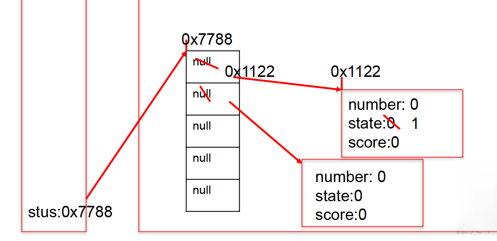

## 4.4、匿名对象的使用

```java
/* 
 * 三、匿名对象的使用
 * 1.理解:我们创建的对象，没有显示的赋值给一个变量名。即为匿名对象。
 * 2.特征：匿名对象只能调用一次。
 * 3.使用:如下
 */
public class InstanceTest { 
	public static void main(String[] args) { 
		Phone p = new Phone();
//		p = null;
		System.out.println(p);
	
		p.sendEmail();
		p.playGame();
	
		//匿名对象
//		new Phone().sendEmail();
//		new Phone().playGame();
	
		new Phone().price = 1999;
		new Phone().showPrice();	//0.0
	
		//*******************************
		PhoneMall mall = new PhoneMall();
//		mall.show(p);
		//匿名对象的使用
		mall.show(new Phone());
	}
}

class PhoneMall{ 

	public void show(Phone phone){ 
		phone.sendEmail();
		phone.playGame();
	}
}

class Phone{ 
	double price;	//价格

	public void sendEmail(){ 
		System.out.println("发邮件");
	}
	public void playGame(){ 
		System.out.println("打游戏");
	}
	public void showPrice(){ 
		System.out.println("手机价格为:" + price);
	}
}
```

## 4.5、自定义数组的工具类

> 1、**工具类**
>

```java
/*
 * 自定义数组工具类
 */
public class ArrayUtil { 

	// 求数组的最大值
	public int getMax(int[] arr) { 
		int maxValue = arr[0];
		for (int i = 1; i < arr.length; i++) { 
			if (maxValue < arr[i]) { 
				maxValue = arr[i];
			}
		}
		return maxValue;
	}

	// 求数组的最小值
	public int getMin(int[] arr) { 
		int minValue = arr[0];
		for (int i = 1; i < arr.length; i++) { 
			if (minValue > arr[i]) { 
				minValue = arr[i];
			}
		}
		return minValue;
	}

	// 求数组总和
	public int getSum(int[] arr) { 
		int sum = 0;
		for (int i = 0; i < arr.length; i++) { 
			sum += arr[i];
		}
		return sum;
	}

	// 求数组平均值
	public int getAvg(int[] arr) { 
		int avgValue = getSum(arr) / arr.length;
		return avgValue;
	}

	// 反转数组
	public void reverse(int[] arr) { 
		for (int i = 0; i < arr.length / 2; i++) { 
			int temp = arr[i];
			arr[i] = arr[arr.length - i - 1];
			arr[arr.length - i - 1] = temp;
		}
	}

	// 复制数组
	public int[] copy(int[] arr) { 
		int[] arr1 = new int[arr.length];
		for (int i = 0; i < arr1.length; i++) { 
			arr1[i] = arr[i];
		}
		return null;
	}

	// 数组排序
	public void sort(int[] arr) { 
		for (int i = 0; i < arr.length - 1; i++) { 
			for (int j = 0; j < arr.length - 1 - i; j++) { 
				if (arr[j] > arr[j + 1]) { 
					int temp = arr[j];
					arr[j] = arr[j + 1];
					arr[j + 1] = temp;
				}
			}
		}
	}

	// 遍历数组
	public void print(int[] arr) { 
		System.out.print("[");
		for (int i = 0; i < arr.length; i++) { 
			System.out.print(arr[i] + ",");
		}
		System.out.println("]");
	}

	// 查找指定元素
	public int getIndex(int[] arr, int dest) { 
		//线性查找
		for (int i = 0; i < arr.length; i++) { 
			if (dest==arr[i]) { 
				return i;
			}
		}
		return -1;
	}
}
```

> 2、**测试类**
>

```java
/**
  * @Description 测试类
  *
 */
public class ArrayUtilTest { 


	public static void main(String[] args) { 
		ArrayUtil util = new ArrayUtil();
		int[] arr = new int[]{ 32,5,26,74,0,96,14,-98,25};
		int max = util.getMax(arr);
		System.out.println("最大值为:" + max);
	
//		System.out.print("排序前:");
//		util.print(arr);
//	
//		util.sort(arr);
//		System.out.print("排序后:");
//		util.print(arr);
	
		System.out.println("查找:");
		int index = util.getIndex(arr, 5);
		if(index > 0){ 
			System.out.println("找到了，索引地址:" + index);
		}else{ 
			System.out.println("没找到");
		}
	}
}
```

## 4.6、方法的重载(overload)

```java
/*
 * 方法的重载(overload) loading...
 * 
 * 1.定义:在同一个类中，允许存在一个以上的同名方法，只要它们的参数个数或者参数类型不同即可。
 * 
 * 		“两同一不同”:同一个类、相同方法名
 * 				  参数列表不同：参数个数不同，参数类型不同
 * 
 * 2.举例:
 * 		Arrays类中重载的sort() / binarySearch()
 * 
 * 3.判断是否重载
 * 		与方法的返回值类型、权限修饰符、形参变量名、方法体都无关。
 * 
 * 4.在通过对象调用方法时，如何确定某一个指定的方法：
 * 		方法名---》参数列表
 */
public class OverLoadTest { 

	public static void main(String[] args) { 
		OverLoadTest test = new OverLoadTest();
		test.getSum(1, 2);	//调用的第一个，输出1
	}

	//如下的四个方法构成了重载
	public void getSum(int i,int j){ 
		System.out.println("1");
	}
	public void getSum(double d1,double d2){ 
		System.out.println("2");
	}
	public void getSum(String s,int i){ 
		System.out.println("3");
	}

	public void getSum(int i,String s){ 
	
	}

	//以下3个是错误的重载
//	public int getSum(int i,int j){ 
//		return 0;
//	}

//	public void getSum(int m,int n){ 
//	
//	}

//	private void getSum(int i,int j){ 
//	
//	}
}
```

> 1、**举例**
>

```java
1.判断：与void show(int a,char b,double c){ }构成重载的有：
  
a)void show(int x,char y,double z){ } // no
b)int show(int a,double c,char b){ } // yes
c) void show(int a,double c,char b){ } // yes
d) boolean show(int c,char b){ } // yes
e) void show(double c){ } // yes 
f) double show(int x,char y,double z){ } // no
g) void shows(){ double c} // no
123456789
```

> 2、**编程**
>

```java
/*
 * 1.编写程序，定义三个重载方法并调用。方法名为mOL。
 * 三个方法分别接收一个int参数、两个int参数、一个字符串参数。
 * 分别执行平方运算并输出结果，相乘并输出结果，输出字符串信息。
 * 在主类的main ()方法中分别用参数区别调用三个方法。
 * 2.定义三个重载方法max()，
 * 第一个方法求两个int值中的最大值，
 * 第二个方法求两个double值中的最大值，
 * 第三个方法求三个double值中的最大值，并分别调用三个方法。
 * 
 */
public class OverLoadever { 

	public static void main(String[] args) { 
		OverLoadever test = new OverLoadever();
		//1.调用3个方法
		test.mOL(5);
		test.mOL(6, 4);
		test.mOL("fg");
	
		//2.调用3个方法
		int num1 = test.max(18, 452);
		System.out.println(num1);
		double num2 = test.max(5.6, -78.6);
		System.out.println(num2);
		double num3 = test.max(15, 52, 42);
		System.out.println(num3);
	}

	//1.如下三个方法构成重载
	public void mOL(int i){ 
		System.out.println(i*i);
	}
	public void mOL(int i,int j){ 
		System.out.println(i*j);
	}
	public void mOL(String s){ 
		System.out.println(s);
	}

	//2.如下三个方法构成重载
	public int max(int i,int j){ 
		return (i > j) ? i : j;
	}
	public double max(double i,double j){ 
		return (i > j) ? i : j;
	}
	public double max(double d1,double d2,double d3){ 
		double max = (d1 > d2) ? d1 : d2;
		return (max > d3) ? max : d3;
	}
}
```

## 4.7、可变个数的形参

JavaSE 5.0 中提供了Varargs(variable number of arguments)机制，允许`直接定义能和多个实参相匹配的形参`。从而，可以用一种更简单的方式，来传递个数可变的实参。

```java
/*
 * 可变个数形参的方法
 * 1.jdk 5.0新增的内容
 * 2.具体使用：
 * 	2.1 可变个数形参的格式：数据类型 ... 变量名
 * 	2.2 当调用可变个数形参的方法时，传入的参数的个数可以是：0个，1个，2个...
 * 	2.3可变个数形参的方法与本类中方法名相同，形参不同的方法之间构成重载。
 *  2.4可变个数形参的方法与本类中方法名相同，形参类型也相同的数组之间不构成重载。即二者不可共存。
 *  2.5可变个数形参在方法中的形参中,必须声明在末尾。
 *  2.6可变个数形参在方法中的形参中，最多只能声明一个可变形参。
 */
public class MethodArgs { 

	public static void main(String[] args) { 
		MethodArgs test = new MethodArgs();
		test.show(12);
		// test.show("hell0");
		// test.show("hello","world");
		// test.show();

		test.show(new String[] {  "AA", "BB", "CC" });
	}

	public void show(int i) { 

	}

	// public void show(String s){ 
	// System.out.println("show(String)");
	// }
	public void show(String... strs) { 
		System.out.println("show(String ...strs)");


		for (int i = 0; i < strs.length; i++) { 
			System.out.println(strs[i]);
		}
	}

	// 此方法与上一方法不可共存
	// public void show(String[] strs){ 
	//
	// }

	public void show(int i, String... strs) { 

	}

	//The variable argument type String of the method show must be the last parameter
//	public void show(String... strs,int i,) { 
//
//	}
}
```

## 4.8、方法参数的值传递机制(重点)

```java
/*
 * 关于变量的赋值
 * 
 * 	如果变量是基本数据类型，此时赋值的是变量所保存的数据值。
 * 	如果变量是引用数据类型，此时赋值的是变量所保存的数据的地址值。
 * 
 */
public class ValueTransferTest { 

	public static void main(String[] args) { 
	
		System.out.println("**********基本数据类型：***********");
		int m = 10;
		int n = m;
	
		System.out.println("m = " + m + ", n = " + n);
	
		n = 20;
	
		System.out.println("m = " + m + ", n = " + n);

		System.out.println("***********引用数据类型:********");
	
		Order o1 = new Order();
		o1.orderId = 1001;
	
		Order o2 = o1;	//赋值后，o1和o2的地址值相同，都指向了堆空间中同一个对象实体
		System.out.println("o1.orderId = " + o1.orderId + ",o2.orderId = " + o2.orderId);
	
		o2.orderId = 1002;
		System.out.println("o1.orderId = " + o1.orderId + ",o2.orderId = " + o2.orderId);
	
	}
}

class Order{ 
	int orderId;
}
```

### 4.8.1、**针对基本数据类型**

```java
/*
 * 方法的形参的传递机制：值传递
 * 
 * 1.形参：方法定义时，声明的小括号内的参数
 *   实参：方法调用时，实际传递给形参的数据
 * 
 * 2.值传递机制：
 *  如果参数是基本数据类型，此时实参赋值给形参的是实参真是存储的数据值。
 */
public class ValueTransferTest1 { 

	public static void main(String[] args) { 
	
		int m = 10;
		int n = 20;
	
		System.out.println("m = " + m + ", n = " + n);
		//交换两个变量的值的操作
//		int temp = m;
//		m = n;
//		n = temp;
	
		ValueTransferTest1 test = new ValueTransferTest1();
		test.swap(m, n);
	
		System.out.println("m = " + m + ", n = " + n);
	
	}

	public void swap(int m,int n){ 
		int temp = m;
		m = n;
		n = temp;
	}
}
```


### 4.8.2、**针对引用数据类型**

```java
/*
 *  如果参数是引用数据类型，此时实参赋值给形参的是实参存储数据的地址值。
 */
public class ValueTransferTest2 { 

	public static void main(String[] args) { 
		Data data = new Data();
	
		data.m = 10;
		data.n = 20;
	
		System.out.println("m = " + data.m + ", n = " + data.n);

		//交换m和n的值
//		int temp = data.m;
//		data.m = data.n;
//		data.n = temp;

		ValueTransferTest2 test = new ValueTransferTest2();
		test.swap(data);
	
		System.out.println("m = " + data.m + ", n = " + data.n);

	}

	public void swap(Data data){ 
		int temp = data.m;
		data.m = data.n;
		data.n = temp;
	}
}


class Data{ 

	int m;
	int n;
}
```

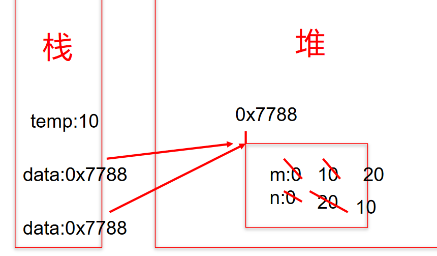

### 4.8.3、**练习1**

```java
public class TransferTest3{ 
	public static void main(String args[]){ 
		TransferTest3 test=new TransferTest3();
		test.first();
	}

	public void first(){ 
		int i=5;
		Value v=new Value();
		v.i=25;
		second(v,i);
		System.out.println(v.i);
	}

	public void second(Value v,int i){ 
		i=0;
		v.i=20;
		Value val=new Value();
		v=val;
		System.out.println(v.i+" "+i);
	
	}
}
class Value { 
	int i= 15;
} 
```


### 4.8.4、**练习2**

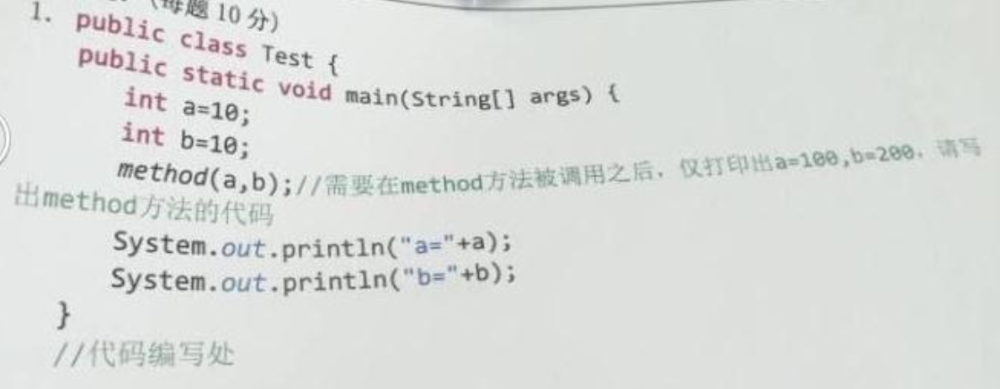

```java
public static void method(int a,int b){ 
	a = a * 10;
	b = b * 20;
	System.out.println(a);
	System.out.println(b);
	System.exit(0);
}
```

### 4.8.5、**练习3**

```java
/*
 * 微软：
 * 定义一个int型的数组：int[] arr = new int[]{12,3,3,34,56,77,432};
 * 让数组的每个位置上的值去除以首位置的元素，得到的结果，作为该位置上的新值。遍历新的数组。 
 */
 
//错误写法
for(int i= 0;i < arr.length;i++){ 
	arr[i] = arr[i] / arr[0];
}

//正确写法1
for(int i = arr.length –1;i >= 0;i--){ 
	arr[i] = arr[i] / arr[0];
}

//正确写法2
int temp = arr[0];
for(int i= 0;i < arr.length;i++){ 
	arr[i] = arr[i] / temp;
}
```

### 4.8.6、**练习4**

```java
/*
 * int[] arr = new int[10];
 * System.out.println(arr);//地址值?
 * 
 * char[] arr1 = new char[10];
 * System.out.println(arr1);//地址值?
 */
public class ArrayPrint { 

	public static void main(String[] args) { 
		int[] arr = new int[]{ 1,2,3};
        //传进去的是一个Object的对象
		System.out.println(arr);//地址值
	
		char[] arr1 = new char[]{ 'a','b','c'};
        //传进去的是一个数组，里面遍历数据了
		System.out.println(arr1);//abc
	}
}
```

### 4.8.7、**练习5：将对象作为参数传递给方法**

```java
/*
 * 练习5：将对象作为参数传递给方法
 * (1)定义一个Circle类，包含一个double型的radius属性代表圆的半径，一个findArea()方法返回圆的面积。
 * 
 * (2)定义一个类PassObject，在类中定义一个方法printAreas()，该方法的定义如下：
 * public void printAreas(Circle c,int time)
 * 在printAreas方法中打印输出1到time之间的每个整数半径值，以及对应的面积。
 * 例如，times为5，则输出半径1，2，3，4，5，以及对应的圆面积。
 * 
 * (3)在main方法中调用printAreas()方法，调用完毕后输出当前半径值。
 *
 */
public class Circle { 

	double radius;	//半径

	//返回圆的面积
	public double findArea(){ 
		return radius * radius * Math.PI;
	}
}
```

> **PassObject类**
>

```java
public class PassObject { 

	public static void main(String[] args) { 
		PassObject test = new PassObject();
	
		Circle c = new Circle();
	
		test.printAreas(c, 5);
	
		System.out.println("no radius is:" + c.radius);
	}

	public void printAreas(Circle c,int time){ 
	
		System.out.println("Radius\t\tAreas");
	
		//设置圆的半径
		for(int i = 1;i <= time ;i++){ 
			c.radius = i;
			System.out.println(c.radius + "\t\t" + c.findArea());
		}
	
		//重新赋值
		c.radius = time + 1;
	}
}
```

## 4.9、递归(recursion)方法

```java
/*
 * 递归方法的使用(了解)
 * 1.递归方法：一个方法体内调用它自身。
 * 2.方法递归包含了一种隐式的循环，它会重复执行某段代码，但这种重复执行无须循环控制。
 * 
 * 3.递归一定要向已知方向递归，否则这种递归就变成了无穷递归，类似于死循环。
 * 
 */
public class RecursionTest { 

	public static void main(String[] args) { 

		// 例1:计算1-100之间所有自然数的和
		// 方法1:
		int sum = 0;
		for (int i = 1; i <= 100; i++) { 
			sum += i;
		}
		System.out.println("sum = " + sum);

		// 方法2:
		RecursionTest test = new RecursionTest();
		int sum1 = test.getSum(100);
		System.out.println("sum1 = " + sum1);
	}

	// 例1:计算1-n之间所有自然数的和
	public int getSum(int n) { 

		if (n == 1) { 
			return 1;
		} else { 
			return n + getSum(n - 1);
		}
	}

	// 例2:计算1-n之间所有自然数的乘积
	//归求阶乘(n!)的算法
	public int getSum1(int n) { 


		if (n == 1) { 
			return 1;
		} else { 
			return n * getSum1(n - 1);
		}
	}
}
```

> 1、**练习1**
>

```java
public class RecursionTest { 

	public static void main(String[] args) { 

		int value = test.f(10);
		System.out.println(value);
	}

	//例3:已知有一个数列：f(0) = 1,f(1) = 4,f(n+2)=2*f(n+1) + f(n),
	//其中n是大于0的整数，求f(10)的值。
	public int f(int n){ 
		if(n == 0){ 
			return 1;
		}else if(n == 1){ 
			return 4;
		}else{ 
			return 2*f(n-1) + f(n-2);
		}
	}

	//例4:已知一个数列：f(20) = 1,f(21) = 4,f(n+2) = 2*f(n+1)+f(n),
	//其中n是大于0的整数，求f(10)的值。
	public int f1(int n){ 
		if(n == 20){ 
			return 1;
		}else if(n == 21){ 
			return 4;
		}else{ 
			return 2*f1(n-1) + f1(n-2);
		}
	}
}
```

> 2、**练习2**
>

```java
/*
 * 输入一个数据n，计算斐波那契数列(Fibonacci)的第n个值
 * 1  1  2  3  5  8  13  21  34  55
 * 规律：一个数等于前两个数之和
 * 要求：计算斐波那契数列(Fibonacci)的第n个值，并将整个数列打印出来
 * 
 */
public class Recursion2 { 

	public static void main(String[] args) { 
	
		Recursion2 test = new Recursion2();
		int value = test.f(10);
		System.out.println(value);
	}

	public int f(int n) { 

		if (n == 1 || n == 2) { 
			return 1;
		} else { 
			return f(n - 1) + f(n - 2);
		}
	}
}
```

## 05、面向对象特征之一：封装与隐藏

> 1、封装性的引入与体现
>

为什么需要封装？封装的作用和含义？  
 我要用洗衣机，只需要按一下开关和洗涤模式就可以了。有必要了解洗衣机内部的结构吗？有必要碰电动机吗？  
 我要开车，…

> 2、我们程序设计追求“高内聚，低耦合”。
>

高内聚：类的内部数据操作细节自己完成，不允许外部干涉；  
 低耦合：仅对外暴露少量的方法用于使用。

> 3、隐藏对象内部的复杂性，只对外公开简单的接口。
>

便于外界调用，从而提高系统的可扩展性、可维护性。通俗的说，**把该隐藏的隐藏起来，该暴露的暴露出来。这就是封装性的设计思想。**

```java
/*
 * 面向对象的特征一:封装与隐藏
 * 一、问题的引入：
 *    当我们创建一个类的对象以后，我们可以通过"对象.属性"的方式，对对象的属性进行赋值。这里，赋值操作要受到
 *    属性的数据类型和存储范围的制约。但除此之外，没有其他制约条件。但是，实际问题中，我们往往需要给属性赋值
 *    加入额外限制条件。这个条件就不能在属性声明时体现，我们只能通过方法进行条件的添加。比如说，setLegs
 *    同时，我们需要避免用户再使用“对象.属性”的方式对属性进行赋值。则需要将属性声明为私有的(private)
 *    --》此时，针对于属性就体现了封装性。
 *  
 * 二、封装性的体现：
 *    我们将类的属性私有化(private),同时,提供公共的(public)方法来获取(getXxx)和设置(setXxx)
 *  
 *    拓展：封装性的体现：① 如上 ② 单例模式 ③ 不对外暴露的私有方法
 *
 */
public class AnimalTest { 

	public static void main(String[] args) { 
		Animal a = new Animal();
		a.name = "大黄";
//		a.age = 1;
//		a.legs = 4;//The field Animal.legs is not visible
	
		a.show();
	
//		a.legs = -4;
//		a.setLegs(6);
		a.setLegs(-6);
	
//		a.legs = -4;//The field Animal.legs is not visible
		a.show();
	
		System.out.println(a.name);
		System.out.println(a.getLegs());
	}
}
class Animal{ 

	String name;
	private int age;
	private int legs; //腿的个数

	//对于属性的设置
	public void setLegs(int l){ 
		if(l >= 0 && l % 2 == 0){ 
			legs = l;
		}else{ 
			legs = 0;
		}
	}

	//对于属性的获取
	public int getLegs(){ 
		return legs;
	}

	public void eat(){ 
		System.out.println("动物进食");
	}

	public void show(){ 
		System.out.println("name = " + name + ",age = " + age + ",legs = " + legs);
	}

	//提供关于属性 age 的 get 和 set 方法
	public int getAge(){ 
		return age;
	}

	public void setAge(int a){ 
		age = a;
	}
}
```

## 5.1、四种权限修饰符的理解与测试

Java 权限修饰符`public、protected、default(缺省)、private` 置于类的成员定义前，用来限定对象对该类成员的访问权限。


**对于 class 的权限修饰只可以用 public 和 default(缺省)。**

* public 类可以在任意地方被访问。
* default 类只可以被同一个包内部的类访问。

> 1、**Order 类**
>

```java
/*
 * 三、封装性的体现，需要权限修饰符来配合。
 *   1.Java 规定的 4 种权限：(从小到大排序)private、缺省、protected、public
 *   2.4 种权限用来修饰类及类的内部结构：属性、方法、构造器、内部类
 *   3.具体的，4 种权限都可以用来修饰类的内部结构：属性、方法、构造器、内部类
 * 		 修饰类的话，只能使用：缺省、public
 *  总结封装性：Java 提供了 4 中权限修饰符来修饰类积累的内部结构，体现类及类的内部结构的可见性的方法。
 * 
 */
public class Order { 

	private int orderPrivate;
	int orderDefault;
	public int orderPublic;

	private void methodPrivate(){ 
		orderPrivate = 1;
		orderDefault = 2;
		orderPublic = 3;
	}

	void methodDefault(){ 
		orderPrivate = 1;
		orderDefault = 2;
		orderPublic = 3;
	}

	public void methodPublic(){ 
		orderPrivate = 1;
		orderDefault = 2;
		orderPublic = 3;
	}
}
123456789101112131415161718192021222324252627282930313233
```

> 2、**OrderTest 类**
>

```java
public class OrderTest { 

	public static void main(String[] args) { 
	
		Order order = new Order();
	
		order.orderDefault = 1;
		order.orderPublic = 2;
		//出了 Order 类之后，私有的结构就不可调用了
//		order.orderPrivate = 3;//The field Order.orderPrivate is not visible
	
		order.methodDefault();
		order.methodPublic();
		//出了 Order 类之后，私有的结构就不可调用了
//		order.methodPrivate();//The method methodPrivate() from the type Order is not visible
	}
}
```

> **相同项目不同包的 OrderTest 类**
>

```java
import github.Order;

public class OrderTest { 

	public static void main(String[] args) { 
		Order order = new Order();
	
		order.orderPublic = 2;
		//出了 Order 类之后，私有的结构、缺省的声明结构就不可调用了
//		order.orderDefault = 1;
//		order.orderPrivate = 3;//The field Order.orderPrivate is not visible
	
		order.methodPublic();
		//出了 Order 类之后，私有的结构、缺省的声明结构就不可调用了
//		order.methodDefault();
//		order.methodPrivate();//The method methodPrivate() from the type Order is not visible
	}
}
```


## 5.2、封装性的练习

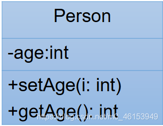

```java
/*
 * 1.创建程序,在其中定义两个类：Person 和 PersonTest 类。
 * 定义如下：用 setAge()设置人的合法年龄(0~130)，用 getAge()返回人的年龄。
 * 
 */
public class Person { 

	private int age;

	public void setAge(int a){ 
		if(a < 0 || a > 130){ 
//			throw new RuntimeException("传入的数据据非法");
			System.out.println("传入的数据据非法");
			return;
		}
	
		age = a;
	
	}

	public int getAge(){ 
		return age;
	}

	//绝对不能这样写！！！
	public int doAge(int a){ 
		age = a;
		return age;
	}
}
```

> 3、**测试类**
>

```java
/*
 *  在 PersonTest 类中实例化 Person 类的对象 b，
 *  调用 setAge()和 getAge()方法，体会 Java 的封装性。
 */
public class PersonTest { 

	public static void main(String[] args) { 
		Person p1 = new Person();
//		p1.age = 1;	//编译不通过
	
		p1.setAge(12);
	
		System.out.println("年龄为:" + p1.getAge());
	}
}
```

## 06、 构造器(构造方法)

## 6.1、构造器的理解

```java
/*
 * 类的结构之三:构造器(构造方法、constructor)的使用
 * constructor:
 * 
 * 一、构造器的作用:
 * 1.创建对象
 * 2.初始化对象的属性
 * 
 * 二、说明
 * 1.如果没有显示的定义类的构造器的话，则系统默认提供一个空参的构造器。
 * 2.定义构造器的格式:
 * 			权限修饰符  类名(形参列表) { }
 * 3.一个类中定义的多个构造器，彼此构成重载。
 * 4.一旦显示的定义了类的构造器之后，系统不再提供默认的空参构造器。
 * 5.一个类中，至少会有一个构造器	
 */
public class PersonTest { 

	public static void main(String[] args) { 
		//创建类的对象:new + 构造器
		Person p = new Person();	//Person()这就是构造器
	
		p.eat();
	
		Person p1 = new Person("Tom");
		System.out.println(p1.name);
	}
}
class Person{ 
	//属性
	String name;
	int age;

	//构造器
	public Person(){ 
		System.out.println("Person()......");
	}

	public Person(String n){ 
		name = n;
	}

	public Person(String n,int a){ 
		name = n;
		age = a;
	}

	//方法
	public void eat(){ 
		System.out.println("人吃饭");
	}

	public void study(){ 
		System.out.println("人学习");
	}
}
```

> 1、**练习 1**
>

```java
/* 2.在前面定义的 Person 类中添加构造器，
 * 利用构造器设置所有人的 age 属性初始值都为 18。
 * 
 */
public class Person { 

	private int age;

	public Person(){ 
		age = 18;
	}
}

public class PersonTest { 

	public static void main(String[] args) { 
		Person p1 = new Person();

		System.out.println("年龄为:" + p1.getAge());
	}
}
123456789101112131415161718192021
```

> 2、**练习 2**
>

```java
/* 3.修改上题中类和构造器，增加 name 属性,
 *   使得每次创建 Person 对象的同时初始化对象的 age 属性值和 name 属性值。
 */
public class Person { 

	private int age;
	private String name;

	public Person(){ 
		age = 18;
	}

	public Person(String n,int a){ 
		name = n;
		age = a;
	}

	public void setName(String n){ 
		name = n;
	}

	public String getName(){ 
		return name;
	}

	public void setAge(int a){ 
		if(a < 0 || a > 130){ 
//			throw new RuntimeException("传入的数据据非法");
			System.out.println("传入的数据据非法");
			return;
		}
	
		age = a;
	
	}

	public int getAge(){ 
		return age;
	}
}

public class PersonTest { 

	public static void main(String[] args) { 
	
		Person p2 = new Person("Tom",21);
	
		System.out.println("name = " + p2.getName() + ",age = " + p2.getAge());
	}
}
```

> 3、**练习 3**
>

```java
/*
 * 编写两个类，TriAngle 和 TriAngleTest，
 * 其中 TriAngle 类中声明私有的底边长 base 和高 height，同时声明公共方法访问私有变量。
 * 此外，提供类必要的构造器。另一个类中使用这些公共方法，计算三角形的面积。
 * 
 */
public class TriAngle { 

	private double base;//底边长
	private double height;//高

	public TriAngle(){ 
	
	}

	public TriAngle(double b,double h){ 
		base = b;
		height = h;
	}

	public void setBase(double b){ 
		base = b;
	}

	public double getBase(){ 
		return base;
	}

	public void setHeight(double h){ 
		height = h;
	}

	public double getHeight(){ 
		return height;
	}
}

public class TriAngleTest { 

	public static void main(String[] args) { 
	
		TriAngle t1 = new TriAngle();
		t1.setBase(2.0);
		t1.setHeight(2.5);
//		t1.base = 2.5;//The field TriAngle.base is not visible
//		t1.height = 4.3;	
		System.out.println("base : " + t1.getBase() + ",height : " + t1.getHeight());
	
		TriAngle t2 = new TriAngle(5.1,5.6);
		System.out.println("面积 : " + t2.getBase() * t2.getHeight() / 2);

	}
}
```

## 6.2、总结属性赋值的过程

```java
/*
 * 总结:属性赋值的先后顺序
 * 
 * ① 默认初始化值
 * ② 显式初始化
 * ③ 构造器中赋值
 * ④ 通过"对象.方法" 或 “对象.属性”的方式，赋值
 * 
 * 以上操作的先后顺序:① - ② - ③ - ④
 * 
 */
public class UserTest { 

	public static void main(String[] args) { 
		User u = new User();
	
		System.out.println(u.age);
	
		User u1 = new User(2);
	
		u1.setAge(3);
	
		System.out.println(u1.age);
	}
}
class User{ 
	String name;
	int age = 1;

	public User(){ 
	
	}

	public User(int a){ 
		age = a;
	}

	public void setAge(int a){ 
		age = a;
	}
}
1234567891011121314151617181920212223242526272829303132333435363738394041
```

## 6.3、JavaBean 的使用

```java
/*
 * JavaBean 是一种 Java 语言写成的可重用组件。
 * 所谓 javaBean，是指符合如下标准的 Java 类：
 * 		> 类是公共的
 * 		> 有一个无参的公共的构造器
 * 		> 有属性，且有对应的 get、set 方法
 * 
 */
public class Customer { 

	private int id;
	private String name;

	public Customer(){ 
	
	}

	public void setId(int i){ 
		id = i;
	}

	public int getId(){ 
		return id;
	}

	public void setName(String n){ 
		name = n;
	}

	public String getName(){ 
		return name;
	}
}
123456789101112131415161718192021222324252627282930313233
```

## 6.4、UML 类图

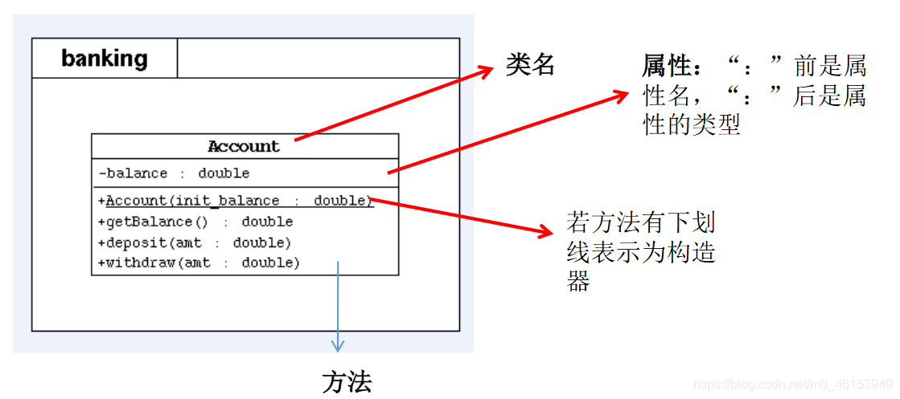

* 表示 public 类型，-表示 private 类型，#表示 protected 类型
* 方法的写法: 方法的类型(+、-) 方法名(参数名：参数类型)：返回值类型

## 07、关键字：this 的使用

## 7.1、this 调用属性、方法、构造器

```java
/*
 * this 关键字的使用
 * 1.this 用来修饰、调用：属性、方法、构造器
 * 
 * 2.this 修饰属性和方法:
 * 		this 理解为：当前对象,或当前正在创建的对象。
 * 	 
 *  2.1 在类的方法中，我们可以使用"this.属性"或"this.方法"的方式，调用当前对象属性和方法。
 *  	通常情况下，我们都选择省略“this.”。特殊情况下，如果方法的形参和类的属性同名，我们必须显式
 *  	的使用"this.变量"的方式，表明此变量是属性，而非形参。
 * 
 *  2.2 在类的构造器中，我们可以使用"this.属性"或"this.方法"的方式，调用正在创建的对象属性和方法。
 *  	但是，通常情况下，我们都选择省略“this.”。特殊情况下，如果构造器的形参和类的属性同名，我们必须显式
 *  	的使用"this.变量"的方式，表明此变量是属性，而非形参。
 *  
 *  3.this 调用构造器
 *  	① 我们可以在类的构造器中，显式的使用"this(形参列表)"的方式，调用本类中重载的其他的构造器！
 *  	② 构造器中不能通过"this(形参列表)"的方式调用自己。
 *  	③ 如果一个类中声明了n个构造器，则最多有n -1个构造器中使用了"this(形参列表)"。
 *  	④ "this(形参列表)"必须声明在类的构造器的首行！
 *  	⑤ 在类的一个构造器中，最多只能声明一个"this(形参列表)"。
 */
public class PersonTest { 

	public static void main(String[] args) { 
		Person p1 = new Person();
	
		p1.setAge(1);
		System.out.println(p1.getAge());
	
		p1.eat();
		System.out.println();
	
		Person p2 = new Person("jerry" ,20);
		System.out.println(p2.getAge());
	}
}
class Person{ 

	private String name;
	private int age;

	public Person(){ 
		this.eat();
		String info = "Person 初始化时，需要考虑如下的 1,2,3,4...(共 40 行代码)";
		System.out.println(info);
	}

	public Person(String name){ 
		this();
		this.name = name;
	}

	public Person(int age){ 
		this();
		this.age = age;
	}

	public Person(String name,int age){ 
		this(age);	//调用构造器的一种方式
		this.name = name;
//		this.age = age;
	}

	public void setNmea(String name){ 
		this.name = name;
	}

	public String getName(){ 
		return this.name;
	}

	public void setAge(int age){ 
		this.age = age;
	}

	public int getAge(){ 
		return this.age;
	}

	public void eat(){ 
		System.out.println("人吃饭");
		this.study();
	}

	public void study(){ 
		System.out.println("学习");
	}
}
1234567891011121314151617181920212223242526272829303132333435363738394041424344454647484950515253545556575859606162636465666768697071727374757677787980818283848586878889
```

## 7.2、this 的练习

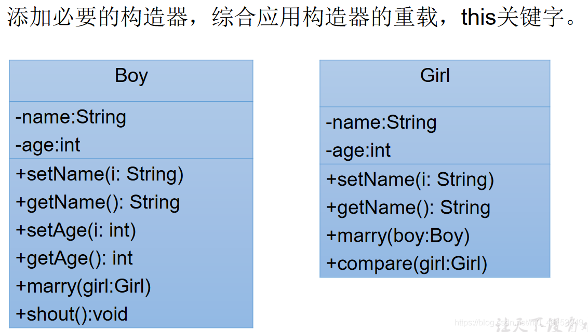

> 1、**Boy 类**
>

```java
public class Boy { 

	private String name;
	private int age;

	public void setName(String name){ 
		this.name = name;
	}

	public String getName(){ 
		return name;
	}

	public void setAge(int ahe){ 
		this.age = age;
	}

	public int getAge(){ 
		return age;
	}

	public Boy(String name, int age) { 
		this.name = name;
		this.age = age;
	}


	public void marry(Girl girl){ 
		System.out.println("我想娶" + girl.getName());
	}

	public void shout(){ 
		if(this.age >= 22){ 
			System.out.println("可以考虑结婚");
		}else{ 
			System.out.println("好好学习");
		}
	}
}
123456789101112131415161718192021222324252627282930313233343536373839
```

> 2、**Girl 类**
>

```java
public class Girl { 

	private String name;
	private int age;

	public String getName() { 
		return name;
	}
	public void setName(String name) { 
		this.name = name;
	}

	public Girl(){ 
	
	}
	public Girl(String name, int age) { 
		this.name = name;
		this.age = age;
	}

	public void marry(Boy boy){ 
		System.out.println("我想嫁给" + boy.getName());
	}
	/**
	  * 
	  * @Description 比较两个对象的大小
	  * @author subei
	  * @date 2020 年 4 月 21 日上午 9:17:35
	  * @param girl
	  * @return
	 */
	public int compare(Girl girl){ 
//		if(this.age >girl.age){ 
//			return 1;
//		}else if(this.age < girl.age){ 
//			return -1;
//		}else{ 
//			return 0;
//		}
	
		return this.age - girl.age;
	}

}
1234567891011121314151617181920212223242526272829303132333435363738394041424344
```

> 3、**测试类**
>

```java
public class BoyGirlTest { 

	public static void main(String[] args) { 
	
		Boy boy = new Boy("罗密欧",21);
		boy.shout();
	
		Girl girl = new Girl("朱丽叶", 18);
		girl.marry(boy);
	
		Girl girl1 = new Girl("祝英台", 19);
		int compare = girl.compare(girl1);
		if(compare > 0){ 
			System.out.println(girl.getName() + "大");
		}else if(compare < 0){ 
			System.out.println(girl1.getName() + "大");
		}else{ 
			System.out.println("一样的");
		}
	}
}
123456789101112131415161718192021
```

> 2、练习2
>

**Account 类**

```java
public class Account { 

	private int id; // 账号
	private double balance; // 余额
	private double annualInterestRate; // 年利率

	public void setId(int id) { 

	}

	public double getBalance() { 
		return balance;
	}

	public void setBalance(double balance) { 
		this.balance = balance;
	}

	public double getAnnualInterestRate() { 
		return annualInterestRate;
	}

	public void setAnnualInterestRate(double annualInterestRate) { 
		this.annualInterestRate = annualInterestRate;
	}

	public int getId() { 
		return id;
	}

	public void withdraw(double amount) {  // 取钱
		if(balance < amount){ 
			System.out.println("余额不足，取款失败");
			return;
		}
		balance -= amount;
		System.out.println("成功取出" + amount);
	}

	public void deposit(double amount) {  // 存钱
		if(amount > 0){ 
			balance += amount;
			System.out.println("成功存入" + amount);
		}
	}

	public Account(int id, double balance, double annualInterestRate) { 
		this.id = id;
		this.balance = balance;
		this.annualInterestRate = annualInterestRate;
	}


}
123456789101112131415161718192021222324252627282930313233343536373839404142434445464748495051525354
```

**Customer 类**

```java
public class Customer { 

	private String firstName;
	private String lastName;
	private Account account;

	public Customer(String f, String l) { 
		this.firstName = f;
		this.lastName = l;
	}

	public String getFirstName() { 
		return firstName;
	}

	public String getLastName() { 
		return lastName;
	}

	public Account getAccount() { 
		return account;
	}

	public void setAccount(Account account) { 
		this.account = account;
	}

}
12345678910111213141516171819202122232425262728
```

**CustomerTest 类**

```java
/*
 * 写一个测试程序。
 * （1）创建一个 Customer，名字叫 Jane Smith, 他有一个账号为 1000，
 * 余额为 2000 元，年利率为 1.23％的账户。
 * （2）对 Jane Smith 操作。存入 100 元，再取出 960 元。再取出 2000 元。
 * 打印出 Jane Smith 的基本信息
 * 
 * 成功存入：100.0
 * 成功取出：960.0
 * 余额不足，取款失败
 * Customer  [Smith,  Jane]  has  a  account:  id  is 1000, 
 *  annualInterestRate  is 1.23％,  balance  is 1140.0
 *  
 */
public class CustomerTest { 

	public static void main(String[] args) { 
		Customer cust = new Customer("Jane" , "Smith");
	
		Account acct = new Account(1000,2000,0.0123);
	
		cust.setAccount(acct);
	
		cust.getAccount().deposit(100); //存入 100
		cust.getAccount().withdraw(960); //取钱 960
		cust.getAccount().withdraw(2000); //取钱 2000
	
		System.out.println("Customer[" + cust.getLastName() + cust.getFirstName() + "]  has  a  account:  id  is "
				+ cust.getAccount().getId() + ",annualInterestRate  is " + cust.getAccount().getAnnualInterestRate() * 100 + "%,  balance  is "
				+ cust.getAccount().getBalance());
	}
}
1234567891011121314151617181920212223242526272829303132
```

> 3、练习3
>

**Account 类**

```java
public class Account { 

	private double balance;

	public double getBalance() { 
		return balance;
	}

	public Account(double init_balance){ 
		this.balance = init_balance;
	}

	//存钱操作
	public void deposit(double amt){ 
		if(amt > 0){ 
			balance += amt;
			System.out.println("存钱成功");
		}
	}

	//取钱操作
	public void withdraw(double amt){ 
		if(balance >= amt){ 
			balance -= amt;
			System.out.println("取钱成功");
		}else{ 
			System.out.println("余额不足");
		}
	}
}
123456789101112131415161718192021222324252627282930
```

**Customer 类**

```java
public class Customer { 

	private String firstName;
	private String lastName;
	private Account account;

	public String getFirstName() { 
		return firstName;
	}
	public String getLastName() { 
		return lastName;
	}
	public Account getAccount() { 
		return account;
	}
	public void setAccount(Account account) { 
		this.account = account;
	}
	public Customer(String f, String l) { 
		this.firstName = f;
		this.lastName = l;
	}
}
1234567891011121314151617181920212223
```

**Bank 类**

```java
public class Bank { 

	private int numberOfCustomers;	//记录客户的个数
	private Customer[] customers;	//存放多个客户的数组

	public Bank(){ 
		customers = new Customer[10];
	}

	//添加客户
	public void addCustomer(String f,String l){ 
		Customer cust = new Customer(f,l);
//		customers[numberOfCustomers] = cust;
//		numberOfCustomers++;
		customers[numberOfCustomers++] = cust;
	}

	//获取客户的个数
	public int getNumberOfCustomers() { 
		return numberOfCustomers;
	}

	//获取指定位置上的客户
	public Customer getCustomers(int index) { 
//		return customers;	//可能报异常
		if(index >= 0 && index < numberOfCustomers){ 
			return customers[index];
		}
	
		return null;
	}

}
123456789101112131415161718192021222324252627282930313233
```

**BankTest 类**

```java
public class BankTest { 

	public static void main(String[] args) { 
	
		Bank bank = new Bank();
	
		bank.addCustomer("Jane", "Smith");
	
		bank.getCustomers(0).setAccount(new Account(2000));
	
		bank.getCustomers(0).getAccount().withdraw(500);
	
		double balance = bank.getCustomers(0).getAccount().getBalance();
	
		System.out.println("客户: " + bank.getCustomers(0).getFirstName() + "的账户余额为：" + balance);
	
		System.out.println("***************************");
		bank.addCustomer("万里", "杨");
	
		System.out.println("银行客户的个数为: " + bank.getNumberOfCustomers());
	
	}
}
1234567891011121314151617181920212223
```

## 8、 关键字：package、import 的使用

## 8.1、关键字—package

```java
/*
 * 一、package 关键字的使用
 * 1.为了更好的实现项目中类的管理，提供包的概念
 * 2.使用 package 声明类或接口所属的包，声明在源文件的首行
 * 3.包，属于标识符，遵循标识符的命名规则、规范"见名知意"
 * 4.每“.”一次,就代表一层文件目录。
 * 
 * 补充:同一个包下，不能命名同名接口或同名类
 *     不同包下，可以命名同名的接口、类。
 *
 */
public class PackageImportTest { 

}
1234567891011121314
```

> **JDK 中主要的包介绍**
>

```java
1.java.lang----包含一些 Java 语言的核心类，如 String、Math、Integer、System 和 Thread，提供常用功能
2.java.net----包含执行与网络相关的操作的类和接口。
3.java.io----包含能提供多种输入/输出功能的类。
4.java.util----包含一些实用工具类，如定义系统特性、接口的集合框架类、使用与日期日历相关的函数。
5.java.text----包含了一些 java 格式化相关的类
6.java.sql----包含了 java 进行 JDBC 数据库编程的相关类/接口
7.java.awt----包含了构成抽象窗口工具集（abstractwindowtoolkits）的多个类，这些类被用来构建和管理应用程序的图形用户界面(GUI)。B/S  C/S
1234567
```

## 8.2、MVC 设计模式

MVC 是常用的设计模式之一，将整个程序分为三个层次： **视图模型层，控制器层，数据模型层** 。这种将程序输入输出、数据处理，以及数据的展示分离开来的设计模式使程序结构变的灵活而且清晰，同时也描述了程序各个对象间的通信方式，降低了程序的耦合性。

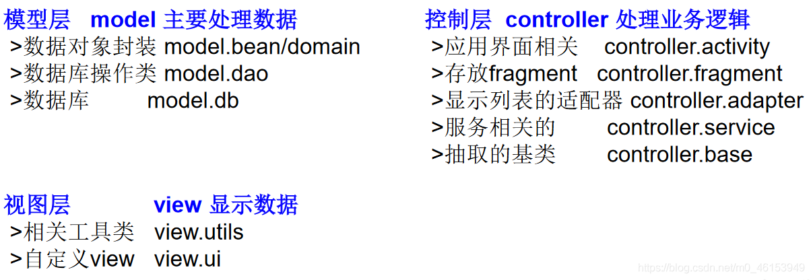  
 

## 8.3、关键字—import

```java
import java.util.*;

import account2.Bank;

/*
 * 二、import关键字的使用
 * import:导入
 * 1.在源文件中显式的使用import结构导入指定包下的类、接口
 * 2.声明在包的声明和类的声明之间
 * 3.如果需要导入多个结构，则并列写出即可
 * 4.可以使用"xxx.*"的方式,表示可以导入xxx包下的所有结构。
 * 5.如果导入的类或接口是java.lang包下的，或者是当前包下的，则可以省略此import语句。
 * 6.如果在代码中使用不同包下的同名的类。那么就需要使用类的全类名的方式指明调用的是哪个类。
 * 7.如果已经导入java.a包下的类。那么如果需要使用a包的子包下的类的话，仍然需要导入。
 * 8.import static组合的使用：调用指定类或接口下的静态的属性或方法.
 * 
 */
public class PackageImportTest { 

	public static void main(String[] args) { 
		String info = Arrays.toString(new int[]{ 1,2,3});
	
		Bank bank = new Bank();
	
		ArrayList list = new ArrayList();
		HashMap map = new HashMap();
	
		Scanner s = null;
	
		System.out.println("hello");
	
		UserTest us = new UserTest();
	
	}
}
1234567891011121314151617181920212223242526272829303132333435
```
