## 01. 关键字

## 1.1. static 的使用

当我们编写一个类时，其实就是在描述其对象的属性和行为，而并没有产生实质上的对象，只有通过 new 关键字才会产生出对象，这时系统才会分配[内存](https://so.csdn.net/so/search?q=%E5%86%85%E5%AD%98&spm=1001.2101.3001.7020)空间给对象，其方法才可以供外部调用。

我们有时候希望无论是否产生了对象或无论产生了多少对象的情况下，**某些特定的数据在内存空间里只有一份。**

例如所有的中国人都有个国家名称，每一个中国人都共享这个国家名称，不必在每一个中国人的实例对象中都单独分配一个用于代表国家名称的变量。

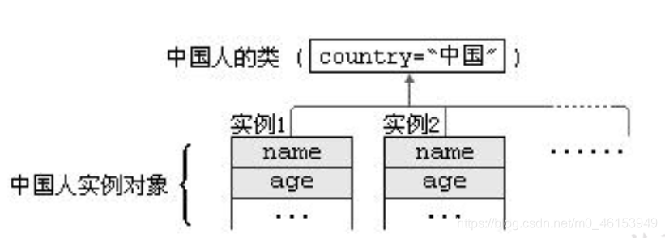

```java
/*
 * static 关键字的使用
 * 
 * 1.static:静态的。
 * 2.static 可以用来修饰:属性、方法、代码块、内部类。
 * 
 * 3.使用 static 修饰属性:静态变量(或类变量)。
 * 		3.1  属性:是否使用 static 修饰，又分为:静态属性 VS 非静态属性(实例变量)
 * 		   实例变量:我们创建了类的多个对象，每个对象都独立的拥有了一套类中的非静态属性。
 * 				当修改其中一个非静态属性时，不会导致其他对象中同样的属性值的修饰。
 * 		   静态变量:我们创建了类的多个对象，多个对象共享同一个静态变量。当通过静态变量去修改某一个变量时，
 * 				会导致其他对象调用此静态变量时，是修改过的。
 * 		3.2 static 修饰属性的其他说明:
 * 			① 静态变量随着类的加载而加载。可以通过"类.静态变量"的方式进行调用。
 * 			② 静态变量的加载要早于对象的创建。
 * 			③ 由于类只会加载一次，则静态变量在内存中也只会存在一次。存在方法区的静态域中。
 * 
 * 			④ 		类变量		实例变量
 * 			类		yes			no
 * 			对象		yes			yes
 * 
 * 		3.3 静态属性举例:System.out.Math.PI;
 *  
 */
public class StaticTest { 
	public static void main(String[] args) { 
	
		Chinese.nation = "中国";
	
		Chinese c1 = new Chinese();
		c1.name = "姚明";
		c1.age = 40;
		c1.nation = "CHN";
	
		Chinese c2 = new Chinese();
		c2.name = "马龙";
		c2.age = 30;
		c2.nation = "CHINA";
	
		System.out.println(c1.nation); 
	
		//编译不通过
//		Chinese.name = "张继科";
	
	}
}
//中国人
class Chinese{ 

	String name;
	int age;
	static String nation;
}
```

## 1.2. 类变量 vs 实例变量内存解析

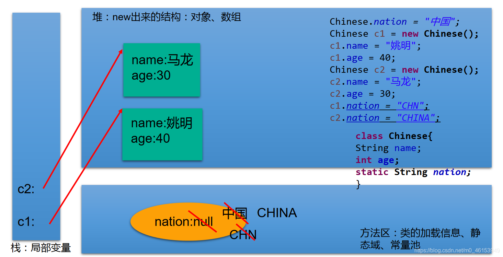

## 1.3、static 修饰方法

```java
/* 
 * 4.使用 static 修饰方法:静态方法
 * 		① 随着类的加载而加载，可以通过"类.静态方法"的方式调用
 * 		② 			静态方法		非静态方法
 * 			类		yes			no
 * 			对象		yes			yes
 * 		③ 静态方法中，只能调用静态的方法或属性
 * 		  非静态的方法中，可以调用所有的方法或属性
 * 
 * 5.static 注意点:
 * 	 5.1  在静态的方法内，不能使用 this 关键字、super 关键字
 *   5.2 关于静态属性和静态方法的使用，大家从生命周期的角度去理解。
 *   
 * 6.开发中，如何确定一个属性是否需要声明 static 的？
 * 	 》 属性是可以被多个对象所共享的，不会随着对象的不同而不同的。
 * 	 》 类中的常量也常常声明为 static
 *   
 *   开发中，如何确定一个方法是否要声明为 static 的？
 *   》 操作静态属性的方法，通常设置为 static 的
 *   》 工具类中的方法，习惯上声明为 static 的。比如：Math、Arrays、Collections
 * 	 
 */
public class StaticTest { 
	public static void main(String[] args) { 
	
		Chinese.nation = "中国";
	
		Chinese c1 = new Chinese();
	
		//编译不通过
//		Chinese.name = "张继科";
	
		c1.eat();
	
		Chinese.show();
		//编译不通过
//		chinese.eat();
//		Chinese.info();
	}
}
//中国人
class Chinese{ 

	String name;
	int age;
	static String nation;

	public void eat(){ 
		System.out.println("中国人吃中餐");
		//调用非静态结构
		this.info();
		System.out.println("name : " + name);
		//调用静态结构
		walk();
		System.out.println("nation : " + Chinese.nation);
	}

	public static void show(){ 
		System.out.println("我是一个中国人！");
//		eat();
//		name = "Tom";
		//可以调用静态的结构
		System.out.println(Chinese.nation);
		walk();
	}

	public void info(){ 
		System.out.println("name : " + name + ",age : " + age);
	}

	public static void walk(){ 
	
	}
}
1234567891011121314151617181920212223242526272829303132333435363738394041424344454647484950515253545556575859606162636465666768697071727374
```

## 1.4、自定义 ArrayUtil 的优化

```java
/*
 * 自定义数组工具类
 */
public class ArrayUtil { 

	// 求数组的最大值
	public static int getMax(int[] arr) { 
		int maxValue = arr[0];
		for (int i = 1; i < arr.length; i++) { 
			if (maxValue < arr[i]) { 
				maxValue = arr[i];
			}
		}
		return maxValue;
	}

	// 求数组的最小值
	public static int getMin(int[] arr) { 
		int minValue = arr[0];
		for (int i = 1; i < arr.length; i++) { 
			if (minValue > arr[i]) { 
				minValue = arr[i];
			}
		}
		return minValue;
	}

	// 求数组总和
	public static int getSum(int[] arr) { 
		int sum = 0;
		for (int i = 0; i < arr.length; i++) { 
			sum += arr[i];
		}
		return sum;
	}

	// 求数组平均值
	public static int getAvg(int[] arr) { 
		int avgValue = getSum(arr) / arr.length;
		return avgValue;
	}

	//如下两个同名方法构成重载
	// 反转数组
	public static void reverse(int[] arr) { 
		for (int i = 0; i < arr.length / 2; i++) { 
			int temp = arr[i];
			arr[i] = arr[arr.length - i - 1];
			arr[arr.length - i - 1] = temp;
		}
	}

	public void reverse(String[] arr){ 
	
	}

	// 复制数组
	public static int[] copy(int[] arr) { 
		int[] arr1 = new int[arr.length];
		for (int i = 0; i < arr1.length; i++) { 
			arr1[i] = arr[i];
		}
		return null;
	}

	// 数组排序
	public static void sort(int[] arr) { 
		for (int i = 0; i < arr.length - 1; i++) { 
			for (int j = 0; j < arr.length - 1 - i; j++) { 
				if (arr[j] > arr[j + 1]) { 
//					int temp = arr[j];
//					arr[j] = arr[j + 1];
//					arr[j + 1] = temp;
					//错误的：
//					swap(arr[j],arr[j+1]);
				
					swap(arr,j ,j+1);
				}
			}
		}
	}

	//错误的:交换数组中两个指定位置元素的值
//	public void swap(int i,int j){ 
//		int temp = i;
//		i = j;
//		j = temp;
//	}

	//正确的：
	private static void swap(int[] arr,int i,int j){ 
		int temp = arr[i];
		arr[i] = arr[j];
		arr[j] = temp;
	}

	// 遍历数组
	public static void print(int[] arr) { 
		System.out.print("[");
		for (int i = 0; i < arr.length; i++) { 
			System.out.print(arr[i] + ",");
		}
		System.out.println("]");
	}

	// 查找指定元素
	public static int getIndex(int[] arr, int dest) { 
		//线性查找
		for (int i = 0; i < arr.length; i++) { 

			if (dest==arr[i]) { 
				return i;
			}

		}
		return -1;
	}

}
123456789101112131415161718192021222324252627282930313233343536373839404142434445464748495051525354555657585960616263646566676869707172737475767778798081828384858687888990919293949596979899100101102103104105106107108109110111112113114115116117118119
```

> 测试类
>

```java
public class ArrayUtilTest { 

	public static void main(String[] args) { 
//		ArrayUtil util = new ArrayUtil();
		int[] arr = new int[]{ 32,5,26,74,0,96,14,-98,25};
		int max = ArrayUtil.getMax(arr);
		System.out.println("最大值为:" + max);
	
		System.out.print("排序前:");
		ArrayUtil.print(arr);
	
		ArrayUtil.sort(arr);
		System.out.print("排序后:");
		ArrayUtil.print(arr);
	
//		System.out.println("查找:");
//		int index = util.getIndex(arr, 5);
//		if(index > 0){ 
//			System.out.println("找到了，索引地址:" + index);
//		}else{ 
//			System.out.println("没找到");
//		}
	}
}
123456789101112131415161718192021222324
```

## 1.5、static 的应用举例

```java
//static 关键字的应用
public class CircleTest { 
	public static void main(String[] args) { 
	
		Circle c1 = new Circle();
	
		Circle c2 = new Circle();
	
		Circle c3 = new Circle();
	
		System.out.println("c1 的 ID:" + c1.getId());
		System.out.println("c2 的 ID:" + c2.getId());
		System.out.println("c3 的 ID:" + c3.getId());
	
		System.out.println("创建圆的个数: " + Circle.getTotal());
	
	}

}

class Circle{ 

	private double radius;
	private int id;	//需要自动赋值

	public Circle(){ 
		id = init++;
		total++;
	}

	public Circle(double radius){ 
		this();
		//或
//		id = init++;
//		total++;
		this.radius = radius;
	}

	private static int total;//记录创建圆的个数
	private static int init = 1001;//static 声明的属性被所有对象所共享

	public double findArea(){ 
		return 3.14 * radius * radius;
	}

	public double getRadius() { 
		return radius;
	}

	public void setRadius(double radius) { 
		this.radius = radius;
	}

	public int getId() { 
		return id;
	}

	public static int getTotal() { 
		return total;
	}

}
1234567891011121314151617181920212223242526272829303132333435363738394041424344454647484950515253545556575859606162
```

## 1.6、static 的练习

```java
/*
 * 编写一个类实现银行账户的概念，包含的属性有“帐号”、“密码”、“存款余额”、
 * “利率”、“最小余额”，定义封装这些属性的方法。
 * 账号要自动生成。编写主类，使用银行账户类，输入、输出 3 个储户的上述信息。
 * 考虑：哪些属性可以设计成 static 属性。
 * 
 */
public class Account { 

	private int id;	//账号
	private String pwd = "000000";	//密码
	private double balance; //存款余额

	private static double interestRate; //利率
	private static double minMoney = 1.0;  //最小余额
	private static int init = 1001;	//用于自动生成 id

	public Account(){ 	//账号自动生成
		id = init++;
	}

	public Account(String pwd,double balance){ 
		id = init++;
		this.pwd = pwd;
		this.balance = balance;
	}

	public String getPwd() { 
		return pwd;
	}

	public void setPwd(String pwd) { 
		this.pwd = pwd;
	}

	public static double getInterestRate() { 
		return interestRate;
	}

	public static void setInterestRate(double interestRate) { 
		Account.interestRate = interestRate;
	}

	public static double getMinMoney() { 
		return minMoney;
	}

	public static void setMinMoney(double minMoney) { 
		Account.minMoney = minMoney;
	}

	public int getId() { 
		return id;
	}

	public double getBalance() { 
		return balance;
	}

	@Override
	public String toString() { 
		return "Account [id=" + id + ", pwd=" + pwd + ", balance=" + balance + "]";
	}

}
1234567891011121314151617181920212223242526272829303132333435363738394041424344454647484950515253545556575859606162636465
```

> **测试类**
>

```java
public class AccountTest { 
	public static void main(String[] args) { 
	
		Account acct1 = new Account();
		Account acct2 = new Account("qwerty",2000);
	
		Account.setInterestRate(0.012); 
		Account.setMinMoney(100);
	
		System.out.println(acct1);
		System.out.println(acct2);
	
		System.out.println(acct1.getInterestRate()); 
		System.out.println(acct1.getMinMoney());
	}
}
12345678910111213141516
```

## 1.7、单例([Singleton](https://so.csdn.net/so/search?q=Singleton&spm=1001.2101.3001.7020))设计模式

[设计模式](https://so.csdn.net/so/search?q=%E8%AE%BE%E8%AE%A1%E6%A8%A1%E5%BC%8F&spm=1001.2101.3001.7020)是**在大量的实践中总结和理论化之后优选的代码结构、编程风格、以及解决问题的思考方式。**设计模免去我们自己再思考和摸索。就像是经典的棋谱，不同的棋局，我们用不同的棋谱。”套路”

所谓类的单例设计模式，就是采取一定的方法保证在整个的软件系统中，对 **某个类只能存在一个对象实例** 。并且该类只提供一个取得其对象实例的方法。如果我们要让类在一个虚拟机中只能产生一个对象，我们首先必须将类的 **构造器的访问权限设置为 private** ，这样，就不能用 new 操作符在类的外部产生类的对象了，但在类内部仍可以产生该类的对象。因为在类的外部开始还无法得到类的对象，**只能调用该类的某个静态方法以返回类内部创建的对象，静态方法只能访问类中的静态成员变量，所以，指向类内部产生的该类对象的变量也必须定义成静态的。**

> 1、**单例模式的饿汉式**
>

```java
/*
 * 单例设计模式:
 * 1.所谓类的单例设计模式，就是采取一定的方法保证在整个的软件系统中，对某个类只能存在一个对象实例
 *  
 * 2.如何实现？
 *   饿汉式	VS	懒汉式
 * 
 * 3.区分饿汉式和懒汉式。
 * 	   饿汉式：坏处:对象加载时间过长。
 * 	 	       好处:饿汉式是线程安全的。
 * 
 *   懒汉式：好处:延迟对象的创建。
 * 		       坏处:目前的写法，会线程不安全。---》到多线程内容时，再修改
 */
public class SingletonTest { 
	public static void main(String[] args) { 
//		Bank bank1 = new Bank(); 
//		Bank bank2 = new Bank(); 
	
		Bank bank1 = Bank.getInstance();
		Bank bank2 = Bank.getInstance();
	
		System.out.println(bank1 == bank2);
	
	}
}

//单例的饿汉式
class Bank{ 

	//1.私有化类的构造器
	private Bank(){ 
	
	}

	//2.内部创见类的对象
	//4.要求此对象也必须声明为静态的
	private static Bank instance = new Bank();

	//3.提供公共的静态的方法，返回类的对象。
	public static Bank getInstance(){ 
		return instance;
	}
}
1234567891011121314151617181920212223242526272829303132333435363738394041424344
```

> 2、**单例模式的懒汉式**
>

```java
/*
 * 单例的懒汉式实现
 * 
 */
public class SingletonTest2 { 
	public static void main(String[] args) { 
	
		Order order1 = Order.getInstance();
		Order order2 = Order.getInstance();
	
		System.out.println(order1 == order2);
	}
}
class Order{ 
	//1.私有化类的构造器
	private Order(){ 
	
	}

	//2.声明当前类对象，没有初始化。
	//此对象也必须声明为 static 的
	private static Order instance = null;

	//3.声明 public、static 的返回当前类对象的方法
	public static Order getInstance(){ 
		if(instance == null){ 
			instance = new Order();		
		}
		return instance;
	}
}
12345678910111213141516171819202122232425262728293031
```

> 3、**单例模式的优点**
>

由于单例模式只生成一个实例， **减少了系统性能开销** ，当一个对象的产生需要比较多的资源时，如读取配置、产生其他依赖对象时，则可以通过在应用启动时直接产生一个单例对象，然后永久驻留内存的方式来解决。  
 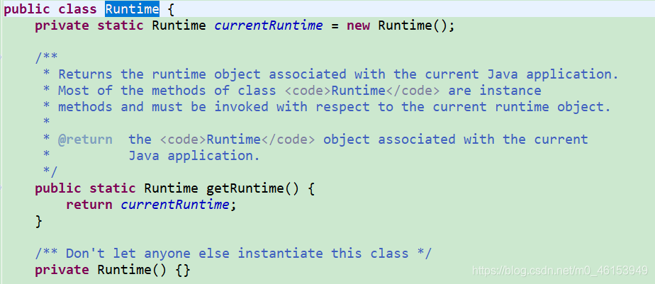

> 4、单例(Singleton)设计模式-应用场景
>

* **网站的计数器** ，一般也是单例模式实现，否则难以同步。
* **应用程序的日志应用** ，一般都使用单例模式实现，这一般是由于共享的日志文件一直处于打开状态，因为只能有一个实例去操作，否则内容不好追加。
* **数据库连接池**的设计一般也是采用单例模式，因为数据库连接是一种数据库资源。
* 项目中， **读取配置文件的类** ，一般也只有一个对象。没有必要每次使用配置文件数据，都生成一个对象去读取。
* **Application**也是单例的典型应用
* Windows 的 **Task Manager (任务管理器)**就是很典型的单例模式
* Windows 的 **Recycle Bin(回收站)**也是典型的单例应用。在整个系统运行过程中，回收站一直维护着仅有的一个实例。

## 02、理解 main 方法的语法（了解)

由于 Java 虚拟机需要调用类的 main()方法，所以该方法的访问权限必须是 public，又因为 Java 虚拟机在执行 main()方法时不必创建对象，所以该方法必须是 static 的，该方法接收一个 String 类型的数组参数，该数组中保存执行 Java 命令时传递给所运行的类的参数。

又因为 main() 方法是静态的，我们不能直接访问该类中的非静态成员，必须创建该类的一个实例对象后，才能通过这个对象去访问类中的非静态成员，这种情况，我们在之前的例子中多次碰到。

```java
/*
 * main()方法的使用说明
 * 1.main()方法作为程序的入口;
 * 2.main()方法也是一个普通的静态方法
 * 3.main()方法也可以作为我们与控制台交互的方式。(之前，使用 Scanner)
 * 
 * 
 */
public class MainTest { 
	public static void main(String[] args) { 	//入口
	
		Main.main(new String[100]);
	
		MainTest test = new MainTest();
		test.show();
	}

	public void show(){ 
	
	}
}

class Main{ 
	public static void main(String[] args) { 
		args = new String[100];
		for(int i = 0;i < args.length;i++){ 
			args[i] = "args_" + i;
			System.out.println(args[i]);
		}
	}
}
12345678910111213141516171819202122232425262728293031
```

> **命令行参数用法举例**
>

```java
public class MainDemo { 
	public static void main(String[] args) { 
	
		for(int i = 0;i < args.length;i++){ 
			System.out.println("/*/*/*/"+ args[i]);
		}
	}
}
12345678
```

> //运行程序 MainDemo.java
>

```java
javac MainDemo.java
java MainDemo “Tom” “Jerry” “Shkstart”
12
```


## 03、类的成员之四：代码块

```java
/*
 * 类的成员之四:代码块（或初始化块）
 * 
 * 1.代码块的作用：用来初始化类、对象的
 * 2.代码块如果有修饰的话，只能使用 static
 * 3.分类:静态代码块 vs 非静态代码块
 * 
 * 4.静态代码块
 * 	》内部可以有输出语句
 *  》随着类的加载而执行,而且只执行一次
 *  》作用:初始化类的信息
 *  》如果一个类中，定义了多个静态代码块，则按照声明的先后顺序执行
 *  》静态代码块的执行，优先于非静态代码块的执行
 *  》静态代码块内只能调用静态的属性、静态的方法，不能调用非静态的结构
 * 
 * 5.非静态代码块
 *  >内部可以有输出语句
 *  >随着对象的创建而执行
 *  >每创建一个对象，就执行一次非静态代码块。
 *  >作用:可以在创建对象时，对对象的属性等进行初始化。
 *  >如果一个类中，定义了多个非静态代码块，则按照声明的先后顺序执行
 *  >非静态代码块内可以调用静态的属性、静态的方法，或非静态的属性、非静态的方法。
 *  
 * 对属性可以赋值的位置:
 *  ①默认初始化
 *  ②显式初始化
 *  ③构造器中初始化
 *  ④有了对象以后，可以通过"对象.属性"或"对象.方法"的方式，进行赋值。
 *  ⑤在代码块中赋值
 */
public class BlockTest { 
	public static void main(String[] args) { 
	
		String desc = Person.desc;
		System.out.println(desc);
	
		Person p1 = new Person();
		Person p2 = new Person();
		System.out.println(p1.age);
	
		Person.info();
	}
}

class Person{ 
	//属性
	String name;
	int age;
	static String desc = "我是一个青年";

	//构造器
	public Person(){ 
	
	}

	//static 的代码块
	static{ 
		System.out.println("hello,static block-1");
		//调用静态结构
		desc = "我是一个爱小说的人";
		info();
		//不能调用非静态结构
//		eat();
//		name = "Tom";
	}

	static{ 
		System.out.println("hello,static block-2");
	}

	//非 static 的代码块
	{ 
		System.out.println("hello,block-2");
	}
	{ 
		System.out.println("hello,block-1");
		//调用非静态结构
		age = 1;
		eat();
		//调用静态结构
		desc = "我是一个爱小说的人 1";
		info();
	}

	//方法
	public Person(String name,int age){ 
		this.name = name;
		this.age = age;
	}

	public void eat(){ 
		System.out.println("吃饭");
	}

	@Override
	public String toString() { 
		return "Person [name=" + name + ", age=" + age + "]";
	}
	public static void info(){ 
		System.out.println("我是一个快乐的人。");
	}

}
123456789101112131415161718192021222324252627282930313233343536373839404142434445464748495051525354555657585960616263646566676869707172737475767778798081828384858687888990919293949596979899100101102103
```

> **静态初始化块举例 1**
>

```java
//总结:由父类到子类，静态先行
class Root{ 
	static{ 
		System.out.println("Root 的静态初始化块");
	}
	{ 
		System.out.println("Root 的普通初始化块");
	}
	public Root(){ 
		System.out.println("Root 的无参数的构造器");
	}
}
class Mid extends Root{ 
	static{ 
		System.out.println("Mid 的静态初始化块");
	}
	{ 
		System.out.println("Mid 的普通初始化块");
	}
	public Mid(){ 
		System.out.println("Mid 的无参数的构造器");
	}
	public Mid(String msg){ 
		//通过 this 调用同一类中重载的构造器
		this();
		System.out.println("Mid 的带参数构造器，其参数值："
			+ msg);
	}
}
class Leaf extends Mid{ 
	static{ 
		System.out.println("Leaf 的静态初始化块");
	}
	{ 
		System.out.println("Leaf 的普通初始化块");
	}
	public Leaf(){ 
		//通过 super 调用父类中有一个字符串参数的构造器
		super("尚硅谷");
		System.out.println("Leaf 的构造器");
	}
}
public class LeafTest{ 
	public static void main(String[] args){ 
		new Leaf(); 
		//new Leaf();
	}
}
123456789101112131415161718192021222324252627282930313233343536373839404142434445464748
```

> **静态初始化块举例 2**
>

```java
class Father { 
	static { 
		System.out.println("11111111111");
	}
	{ 
		System.out.println("22222222222");
	}

	public Father() { 
		System.out.println("33333333333");

	}

}

public class Son extends Father { 
	static { 
		System.out.println("44444444444");
	}
	{ 
		System.out.println("55555555555");
	}
	public Son() { 
		System.out.println("66666666666");
	}

	public static void main(String[] args) {  // 由父及子 静态先行
		System.out.println("77777777777");
		System.out.println("************************");
		new Son();
		System.out.println("************************");

		new Son();
		System.out.println("************************");
		new Father();
	}

}
1234567891011121314151617181920212223242526272829303132333435363738
```

> **总结：程序中成员变量赋值的执行顺序**
>

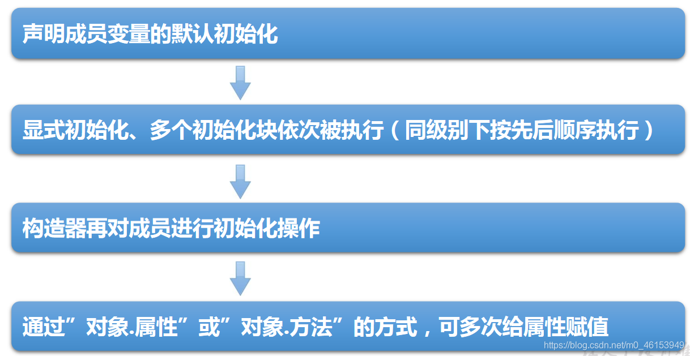

```java
/*
 * 对属性可以赋值的位置:
 *  ①默认初始化
 *  ②显式初始化 / ⑤在代码块中赋值
 *  ③构造器中初始化
 *  ④有了对象以后，可以通过"对象.属性"或"对象.方法"的方式，进行赋值。
 *  
 *  执行的先后顺序:① - ② / ⑤ - ③ - ④
 */
public class OrderTest { 
	public static void main(String[] args) { 
		Order order = new Order();
		System.out.println(order.orderId);
	}
}
class Order{ 

	int orderId = 3;
	{ 
		orderId = 4;
	}

}
1234567891011121314151617181920212223
```

## 04、关键字：final

```java
/*
 * final:最终的
 * 
 * 1.final可以用来修饰的结构:类、方法、变量
 * 
 * 2.final用来修饰一个类:此类不能被其他类所继承。
 * 		  比如:String类、System类、StringBuffer类
 * 3.final修饰一个方法:final标记的方法不能被子类重写。
 * 		  比如：Object类中的getClass()。 
 * 4.final用来修饰变量:此时的"变量"(成员变量或局部变量)就是一个常量。名称大写，且只能被赋值一次。
 * 	 4.1 final修饰属性，可以考虑赋值的位置有:显式初始化、代码块中初始化、构造器中初始化
 *   4.2 final修饰局部变量:
 *   	 尤其是使用final修饰形参时，表明此形参是一个常量。当我们调用此方法时，给常量形参赋一个实参。
 *      一旦赋值以后，就只能在方法体内使用此形参，但不能进行重新赋值。
 *    
 * static final 用来修饰:全局常量
 */
public class FinalTest { 

	final int WIDTH = 0;
	final int LEFT;
	final int RIGHT;
//	final int DOWN;

	{ 
		LEFT = 1;
	}

	public FinalTest(){ 
		RIGHT = 2;
	}

	public FinalTest(int n){ 
		RIGHT = n;
	}

//	public void setDown(int down){ 
//		this.DOWN = down;
//	}

	public void dowidth(){ 
//		width = 20;	//width cannot be resolved to a variable
	}

	public void show(){ 
		final int NUM = 10;	//常量
//		num += 20;
	}

	public void show(final int num){ 
		System.out.println(num);
	}

	public static void main(String[] args) { 
	
		int num = 10;
	
		num = num + 5;
	
		FinalTest test = new FinalTest();
//		test.setDown(5);
	
		test.show(10);
	}
}

final class FianlA{ 

}

//class B extends FinalA{     //错误，不能被继承。
//
//}

//class C extends String{ 
//
//}

class AA{ 
	public final void show(){ 
	
	}
}

//class BB extends AA{	// 错误，不能被重写。
//	public void show(){ 
//	
//	}
//}
1234567891011121314151617181920212223242526272829303132333435363738394041424344454647484950515253545556575859606162636465666768697071727374757677787980818283848586878889
```

> 1、**面试题1**
>

```java
public class Something { 
	public int addOne(final int x) { 
		return ++x; // return x + 1;
	}
}
12345
```

> 2、**面试题2**
>

```java
public class Something { 

	public static void main(String[] args) { 
		Other o = new Other();
		new Something().addOne(o);
	}

	public void addOne(final Other o) { 
		// o = new Other();
		o.i++;
	}
}

class Other { 
	public int i;
}
12345678910111213141516
```

## 05、抽象类与[抽象方法](https://so.csdn.net/so/search?q=%E6%8A%BD%E8%B1%A1%E6%96%B9%E6%B3%95&spm=1001.2101.3001.7020)

随着继承层次中一个个新[子类](https://so.csdn.net/so/search?q=%E5%AD%90%E7%B1%BB&spm=1001.2101.3001.7020)的定义，类变得越来越具体，而父类则更一般，更通用。类的设计应该保证父类和子类能够共享特征。有时将一个父类设计得非常抽象，以至于它没有具体的实例，这样的类叫做 **抽象类** 。

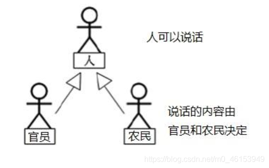

```java
/*
 * abstract 关键字的使用
 * 
 * 1.abstract:抽象的
 * 2.abstract 可以用来修饰的结构:类、方法
 * 3.abstract 修饰类:抽象类
 * 	》 此类不能实例化
 *  》 抽象类中一定有构造器，便于子类实例化时调用(涉及:子类对象实例化全过程)
 *  》 开发中，都会提供抽象类的子类，让子类对象实例化，实现相关的操作
 * 
 * 4.abstract 修饰方法:抽象方法
 *  > 抽象方法，只有方法的声明，没有方法体。
 *  > 包含抽象方法的类，一定是一个抽象类。反之，抽象类中可以没有抽象方法
 *  > 若子类重写了父类中所有的抽象方法，此子类，
 *
 * abstract 使用上的注意点:
 * 1.abstract 不能用来修饰变量、代码块、构造器；
 * 
 * 2.abstract 不能用来修饰私有方法、静态方法、final 的方法、final 的类。
 * 
 */
public class AbstractTest { 
	public static void main(String[] args) { 
		//一旦 Person 类抽象了，就不可实例化
//		Person p1 = new Person();
//		p1.eat();
	
	}
}

abstract class Creature{ 
	public abstract void breath();
}

abstract class Person extends Creature{ 
	String name;
	int age;

	public Person(){ 
	
	}

	public Person(String name,int age){ 
		this.name = name;
		this.age = age;
	}

	//不是抽象方法
//	public void eat(){ 
//		System.out.println("人吃饭");
//	}

	//抽象方法
	public abstract void eat();

	public void walk(){ 
		System.out.println("人走路");
	}
}

class Student extends Person{ 
	public Student(String name,int age){ 
		super(name,age);
	}
	public void eat(){ 
		System.out.println("学生应该多吃有营养的。");
	}
	@Override
	public void breath() { 
		System.out.println("学生应该呼吸新鲜的无雾霾空气");
	}
}
123456789101112131415161718192021222324252627282930313233343536373839404142434445464748495051525354555657585960616263646566676869707172
```

## 5.1、抽象类应用

> 抽象类是用来模型化那些父类无法确定全部实现，而是由其子类提供具体实现的对象的类。
>


> 问题：卡车(Truck)和驳船(RiverBarge)的燃料效率和行驶距离的计算方法完全不同。Vehicle 类不能提供计算方法，但子类可以。
>

```java
/* Java 允许类设计者指定：超类声明一个方法但不提供实现，该方法的实现由子类提  供。这样的方法称为抽象方法。有一个或更多抽象方法的类称为抽象类。
 * Vehicle 是一个抽象类，有两个抽象方法。
 * 注意：抽象类不能实例化 new Vihicle()是非法的
 */
public abstract class Vehicle{ 
	public abstract double calcFuelEfficiency();//计算燃料效率的抽象方法
	public abstract double calcTripDistance();//计算行驶距离的抽象方法
}
public class Truck extends Vehicle{ 
	public double calcFuelEfficiency(){  
		//写出计算卡车的燃料效率的具体方法
	}
	public double calcTripDistance(){  
		//写出计算卡车行驶距离的具体方法
	}
}
public class RiverBarge extends Vehicle{ 
	public double calcFuelEfficiency() {  
		//写出计算驳船的燃料效率的具体方法
	}
	public double calcTripDistance( )  {   
		//写出计算驳船行驶距离的具体方法
	}
}
123456789101112131415161718192021222324
```

## 5.2、练习

```java
/*
 * 编写一个 Employee 类，声明为抽象类，
 * 包含如下三个属性：name，id，salary。
 * 提供必要的构造器和抽象方法：work()。
 * 对于 Manager 类来说，他既是员工，还具有奖金(bonus)的属性。
 * 请使用继承的思想，设计 CommonEmployee 类和 Manager 类，
 * 要求类中提供必要的方法进行属性访问。
 * 
 */
public abstract class Employee { 

	private String name;
	private int id;
	private double salary;

	public Employee(){ 
		super();
	}

	public Employee(String name, int id, double salary) { 
		super();
		this.name = name;
		this.id = id;
		this.salary = salary;
	}

	public abstract void work();
}
12345678910111213141516171819202122232425262728
```

> Manager 类
>

```java
/*
 * 对于 Manager 类来说，他既是员工，还具有奖金(bonus)的属性。
 * 
 */
public class Manager extends Employee{ 

	private double bonus;	//奖金

	public Manager(double bonus) { 
		super();
		this.bonus = bonus;
	}

	public Manager(String name, int id, double salary, double bonus) { 
		super(name, id, salary);
		this.bonus = bonus;
	}


	@Override
	public void work() { 
		System.out.println("管理员工，提高公司运行效率。");	
	}
}
123456789101112131415161718192021222324
```

> CommonEmployee 类
>

```java
public class CommonEmployee extends Employee { 

	@Override
	public void work() { 
		System.out.println("员工在一线车间生产产品。");
	}

}
12345678
```

> 测试类
>

```java
/*
 * 请使用继承的思想，设计 CommonEmployee 类和 Manager 类，
 */
public class EmployeeTest { 
	public static void main(String[] args) { 
	
		Employee manager = new Manager("库克",1001,5000,50000);
	
		manager.work();
	
		CommonEmployee commonEmployee = new CommonEmployee();
		commonEmployee.work();
	}
}
1234567891011121314
```

## 5.3、创建抽象类的匿名子类对象

```java
public class Num { 

}

abstract class Creature{ 
	public abstract void breath();
}

abstract class Person extends Creature{ 
	String name;
	int age;

	public Person(){ 
	
	}

	public Person(String name,int age){ 
		this.name = name;
		this.age = age;
	}

	//不是抽象方法
//	public void eat(){ 
//		System.out.println("人吃饭");
//	}

	//抽象方法
	public abstract void eat();

	public void walk(){ 
		System.out.println("人走路");
	}
}

class Student extends Person{ 
	public Student(String name,int age){ 
		super(name,age);
	}
	public Student(){ 

	}
	public void eat(){ 
		System.out.println("学生应该多吃有营养的。");
	}
	@Override
	public void breath() { 
		System.out.println("学生应该呼吸新鲜的无雾霾空气");
	}
}
12345678910111213141516171819202122232425262728293031323334353637383940414243444546474849
```

> PersonTest 类
>

```java
/*
 * 抽象类的匿名子类
 * 
 */
public class PersonTest { 
	public static void main(String[] args) { 
	
		method(new Student());	//匿名对象
	
		Worker worker = new Worker(); 
		method1(worker);	//非匿名的类非匿名的对象
	
		method1(new Worker());	//非匿名的类匿名的对象
	
		System.out.println("*********************");
	
		//创建了一个匿名子类的对象:p
		Person p = new Person(){ 

			@Override
			public void eat() { 
				System.out.println("吃东西");
			}

			@Override
			public void breath() { 
				System.out.println("呼吸空气");
			}
		
		};
		method1(p);
		System.out.println("**********************"); 
		//创建匿名子类的匿名对象
		method1(new Person(){ 

			@Override
			public void eat() { 
				System.out.println("吃零食");
			}

			@Override
			public void breath() { 
				System.out.println("云南的空气");
			}
		
		});
	}

	public static void method1(Person p){ 
		p.eat();
		p.walk();
	}

	public static void method(Student s){ 
	
	}
}
class Worker extends Person{ 

	@Override
	public void eat() { 
	}

	@Override
	public void breath() { 
	}
}
12345678910111213141516171819202122232425262728293031323334353637383940414243444546474849505152535455565758596061626364656667
```

## 5.4、多态的应用：模板方法设计模式(TemplateMethod)

抽象类体现的就是一种模板模式的设计，抽象类作为多个子类的通用模板，子类在抽象类的基础上进行扩展、改造，但子类总体上会保留抽象类的行为方式。

> 解决的问题：
>

当功能内部一部分实现是确定的，一部分实现是不确定的。这时可以把不确定的部分暴露出去，让子类去实现。  
 换句话说，**在软件开发中实现一个算法时，整体步骤很固定、通用，这些步骤已经在父类中写好了。但是某些部分易变，易变部分可以抽象出来，供不同子类实现。这就是一种模板模式。**

> 1、例 1
>

```java
/*
 * 抽象类的应用:模板方法的设计模式
 */
public class TemplateTest { 
	public static void main(String[] args) { 
	
		SubTemlate t = new SubTemlate();
	
		t.sendTime();
	}
}
abstract class Template{ 

	//计算某段代码执行所需花费的时间
	public void sendTime(){ 
	
		long start = System.currentTimeMillis();
	
		code();	//不确定部分，易变的部分
	
		long end = System.currentTimeMillis();
	
		System.out.println("花费的时间为:" + (end - start));
	}

	public abstract void code();
}

class SubTemlate extends Template{ 

	@Override
	public void code() { 
	
		for(int i = 2;i <= 1000;i++){ 
			boolean isFlag = true;
			for(int j = 2;j <= Math.sqrt(i);j++){ 
				if(i % j == 0){ 
					isFlag = false;
					break;
				}
			}
			if(isFlag){ 
				System.out.println(i);
			}
		}
	}
}
1234567891011121314151617181920212223242526272829303132333435363738394041424344454647
```

> 2、例 2
>

```java
//抽象类的应用：模板方法的设计模式
public class TemplateMethodTest { 

	public static void main(String[] args) { 
		BankTemplateMethod btm = new DrawMoney();
		btm.process();

		BankTemplateMethod btm2 = new ManageMoney();
		btm2.process();
	}
}
abstract class BankTemplateMethod { 
	// 具体方法
	public void takeNumber() { 
		System.out.println("取号排队");
	}

	public abstract void transact(); // 办理具体的业务 //钩子方法

	public void evaluate() { 
		System.out.println("反馈评分");
	}

	// 模板方法，把基本操作组合到一起，子类一般不能重写
	public final void process() { 
		this.takeNumber();

		this.transact();// 像个钩子，具体执行时，挂哪个子类，就执行哪个子类的实现代码

		this.evaluate();
	}
}

class DrawMoney extends BankTemplateMethod { 
	public void transact() { 
		System.out.println("我要取款！！！");
	}
}

class ManageMoney extends BankTemplateMethod { 
	public void transact() { 
		System.out.println("我要理财！我这里有 2000 万美元!!");
	}
}
1234567891011121314151617181920212223242526272829303132333435363738394041424344
```

> 模板方法设计模式是编程中经常用得到的模式。各个框架、类库中都有他的影子，比如常见的有：
>

* 数据库访问的封装
* Junit 单元测试
* JavaWeb 的 Servlet 中关于 doGet/doPost 方法调用
* Hibernate 中模板程序
* Spring 中 JDBCTemlate、HibernateTemplate 等

## 5.5、抽象类的练习

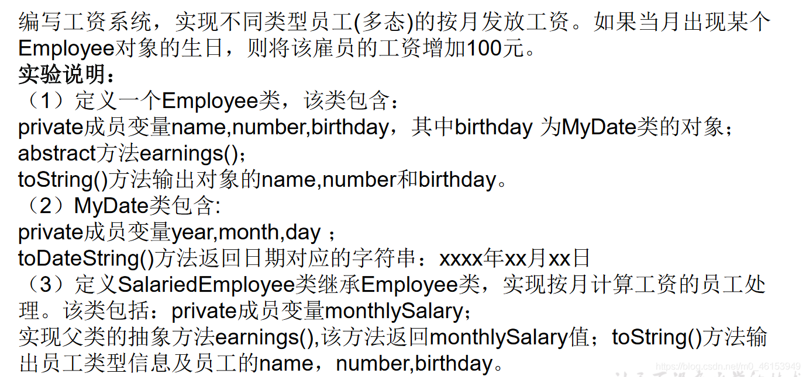  
 

> 1、Employee 类
>

```java
/*
 * 定义一个 Employee 类，
 * 该类包含：private 成员变量 name,number,birthday，
 * 其中 birthday 为 MyDate 类的对象；
 * abstract 方法 earnings()；
 * toString()方法输出对象的 name,number 和 birthday。
 * 
 */
public abstract class Employee { 
	private String name;
	private int number;
	private MyDate birthday;

	public Employee(String name, int number, MyDate birthday) { 
		super();
		this.name = name;
		this.number = number;
		this.birthday = birthday;
	}

	public String getName() { 
		return name;
	}

	public void setName(String name) { 
		this.name = name;
	}

	public int getNumber() { 
		return number;
	}

	public void setNumber(int number) { 
		this.number = number;
	}

	public MyDate getBirthday() { 
		return birthday;
	}

	public void setBirthday(MyDate birthday) { 
		this.birthday = birthday;
	}

	public abstract double earnings();

	@Override
	public String toString() { 
		return "name=" + name + ", number=" + number + ", birthday=" + birthday.toDateString() + "]";
	}

}
12345678910111213141516171819202122232425262728293031323334353637383940414243444546474849505152
```

> 2、MyDate 类
>

```java
/*
 * MyDate 类包含:private 成员变量 year,month,day；
 * toDateString()方法返回日期对应的字符串：xxxx 年 xx 月 xx 日
 */
public class MyDate { 
	private int year;
	private int month;
	private int day;

	public MyDate(int year, int month, int day) { 
		super();
		this.year = year;
		this.month = month;
		this.day = day;
	}

	public int getYear() { 
		return year;
	}

	public void setYear(int year) { 
		this.year = year;
	}

	public int getMonth() { 
		return month;
	}

	public void setMonth(int month) { 
		this.month = month;
	}

	public int getDay() { 
		return day;
	}

	public void setDay(int day) { 
		this.day = day;
	}

	public String toDateString(){ 
		return year + "年" + month + "月" + day + "日";
	}
}
1234567891011121314151617181920212223242526272829303132333435363738394041424344
```

> 3、SalariedEmployee 类
>

```java
/*
 * 定义 SalariedEmployee 类继承 Employee 类，实现按月计算工资的员工处理。
 * 该类包括：private 成员变量 monthlySalary；实现父类的抽象方法 earnings(),
 * 该方法返回 monthlySalary 值；
 * toString()方法输出员工类型信息及员工的 name，number,birthday。
 * 
 */
public class SalariedEmployee extends Employee{ 
	private double monthlySalary;	//月工资

	public SalariedEmployee(String name,int number,MyDate birthday) { 
		super(name,number,birthday);
	}

	public SalariedEmployee(String name, int number, MyDate birthday, double monthlySalary) { 
		super(name, number, birthday);
		this.monthlySalary = monthlySalary;
	}

	@Override
	public double earnings() { 
		return monthlySalary;	
	}

	@Override
	public String toString() { 
		return "SalariedEmployee [" + super.toString() + "]";
	}
}
1234567891011121314151617181920212223242526272829
```

> 4、HourlyEmployee 类
>

```java
/*
 * 参照 SalariedEmployee 类定义 HourlyEmployee 类，
 * 实现按小时计算工资的员工处理。该类包括：private 成员变量 wage 和 hour；
 * 实现父类的抽象方法 earnings(),该方法返回 wage*hour 值；
 * toString()方法输出员工类型信息及员工的 name，number,birthday。
 * 
 */
public class HourlyEmployee extends Employee{ 
	private int wage;	//每小时的工资
	private int hour;	//月工作的小时数

	public HourlyEmployee(String name, int number, MyDate birthday) { 
		super(name, number, birthday);
	}

	public HourlyEmployee(String name, int number, MyDate birthday, int wage, int hour) { 
		super(name, number, birthday);
		this.wage = wage;
		this.hour = hour;
	}

	@Override
	public double earnings() { 
		return wage*hour;
	}

	public int getWage() { 
		return wage;
	}

	public void setWage(int wage) { 
		this.wage = wage;
	}

	public int getHour() { 
		return hour;
	}

	public void setHour(int hour) { 
		this.hour = hour;
	}

	public String toString(){ 
		return "HourlyEmployee[" + super.toString() + "]"; 
	}
}
12345678910111213141516171819202122232425262728293031323334353637383940414243444546
```

> 5、PayrollSystem 类
>

```java
import java.util.Calendar;
import java.util.Scanner;
/*
 * 定义 PayrollSystem 类，创建 Employee 变量数组并初始化，
 * 该数组存放各类雇员对象的引用。利用循环结构遍历数组元素，
 * 输出各个对象的类型,name,number,birthday,以及该对象生日。
 * 当键盘输入本月月份值时，
 * 如果本月是某个 Employee 对象的生日，还要输出增加工资信息。
 * 
 */
public class PayrollSystem { 
	public static void main(String[] args) { 
		//方式一：
//		Scanner scanner = new Scanner(System.in);
//		System.out.println("请输入当月的月份：");
//		int month = scanner.nextInt();
	
		//方式二：
		Calendar calendar = Calendar.getInstance();
		int month = calendar.get(Calendar.MONTH);//获取当前的月份
//		System.out.println(month);//一月份：0
	
		Employee[] emps = new Employee[2];
	
		emps[0] = new SalariedEmployee("马良", 1002,new MyDate(1992, 2, 28),10000);
		emps[1] = new HourlyEmployee("博西", 2001, new MyDate(1991, 1, 6),60,240);
	
		for(int i = 0;i < emps.length;i++){ 
			System.out.println(emps[i]);
			double salary = emps[i].earnings();
			System.out.println("月工资为：" + salary);
		
			if((month+1) == emps[i].getBirthday().getMonth()){ 
				System.out.println("生日快乐！奖励 100 元");
			}
		
		}
	}
}
123456789101112131415161718192021222324252627282930313233343536373839
```

## 06、接口(interface)

## 6.1、概述

一方面，有时必须从几个类中派生出一个子类，继承它们所有的属性和方法。但是，Java 不支持多重继承。有了接口，就可以得到多重继承的效果。

另一方面，有时必须从几个类中抽取出一些共同的行为特征，而它们之间又没有 is-a 的关系，仅仅是具有相同的行为特征而已。例如：鼠标、键盘、打印机、扫描仪、摄像头、充电器、MP3 机、手机、数码相机、移动硬盘等都支持 USB 连接。

接口就是规范，定义的是一组规则，体现了现实世界中“如果你是/要…则必须能…”的思想。**继承是一个"是不是"的关系，而接口实现则是"能不能"的关系。**

 **接口的本质是契约，标准，规范** ，就像我们的法律一样。制定好后大家都要遵守。  
 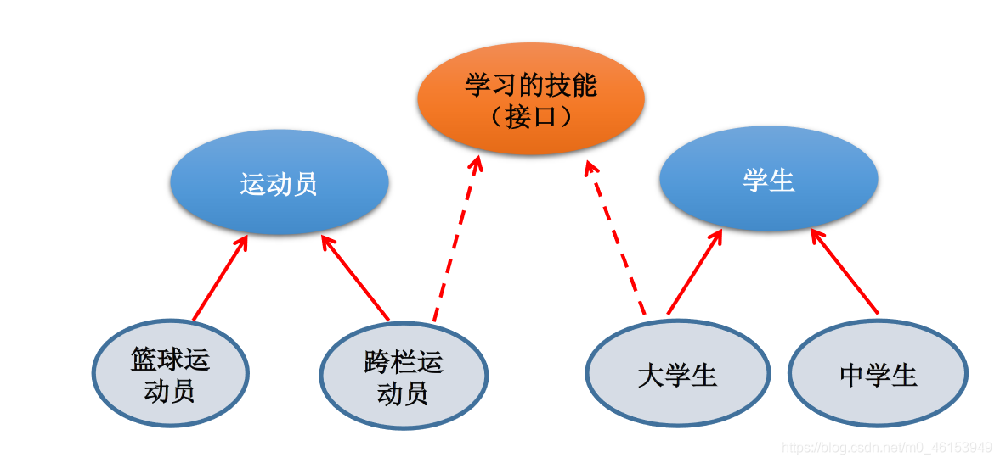

```java
/* 接口(interface)是抽象方法和常量值定义的集合。
 * 接口的特点：
 * 用 interface 来定义。
 * 接口中的所有成员变量都默认是由 public static final 修饰的。
 * 接口中的所有抽象方法都默认是由 public abstract 修饰的。
 * 接口中没有构造器。
 * 接口采用多继承机制。
 */
12345678
```

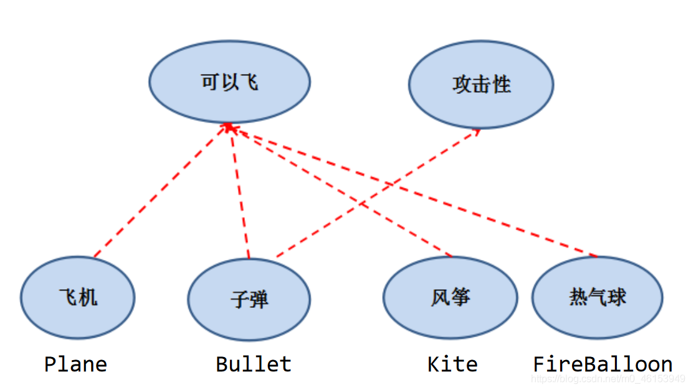

```java
/*
 * 接口的使用
 * 1.接口使用 interface 来定义。
 * 2.在 Java 中:接口和类是并列的两个结构
 * 3.如何去定义两个接口:定义接口中的成员
 * 	》3.1 JDK7 及以前:只能定义全局常量和抽象方法
 * 		》全局常量:public static final 的,但是书写中，可以省略不写。
 * 		》抽象方法:public abstract 的
 * 
 *  》3.2 JDK8:除了全局常量和抽象方法之外，还可以定义静态方法、默认方法(略)。
 * 
 * 4.接口中不能定义构造器！意味着接口不可以实例化。
 * 
 * 5.Java 开发中，接口通过让类去实现(implements)的方式来使用。
 *   如果实现类覆盖了接口中的所有方法，则此实现类就可以实例化
 *   如果实现类没有覆盖接口中所有的抽象方法，则此实现类仍为一个抽象类
 * 
 * 6.Java 类可以实现多个接口 ---》弥补了 Java 单继承性的局限性
 *  格式:class AA extends BB implementd CC,DD,EE
 *  
 *  7.接口与接口之间是继承,而且可以多继承
 *  
 **********************************
 * 8.接口的具体使用，体现多态性
 * 	   接口的主要用途就是被实现类实现。（面向接口编程）
 * 9.接口，实际可以看作是一种规范
 * 
 * 面试题:抽象类与接口有哪些异同？
 *  
 */
public class InterfaceTest { 
	public static void main(String[] args) { 
		System.out.println(Flayable.MAX_SPEED);
		System.out.println(Flayable.MIN_SPEED);
	}
}
interface Flayable{ 

	//全局变量
	public static final int MAX_SPEED = 7900;
	int MIN_SPEED = 1;//省略了 public static final 

	//抽象方法
	public abstract void fly();

	void stop();//省略了 public abstract 
	//Interfaces cannot have constructors
//	public Flayable(){ 
//	
//	}
}
interface Attackable{ 
	void attack();
}

class Plane implements Flayable{ 

	@Override
	public void fly() { 
		System.out.println("飞机通过引擎起飞");
	
	}

	@Override
	public void stop() { 
		System.out.println("驾驶员减速停止");
	}

}
abstract class Kite implements Flayable{ 

	@Override
	public void fly() { 
	
	}
}

class Bullet extends Object implements Flayable,Attackable,CC{ 

	@Override
	public void attack() { 
		// TODO Auto-generated method stub
	
	}

	@Override
	public void fly() { 
		// TODO Auto-generated method stub
	
	}

	@Override
	public void stop() { 
		// TODO Auto-generated method stub
	
	}

	@Override
	public void method1() { 
		// TODO Auto-generated method stub
	
	}

	@Override
	public void method2() { 
		// TODO Auto-generated method stub
	
	}
}

//*********************************
interface AA{ 
	void method1();
}
interface BB{ 
	void method2();
}
interface CC extends AA,BB{ 

}
123456789101112131415161718192021222324252627282930313233343536373839404142434445464748495051525354555657585960616263646566676869707172737475767778798081828384858687888990919293949596979899100101102103104105106107108109110111112113114115116117118119120
```

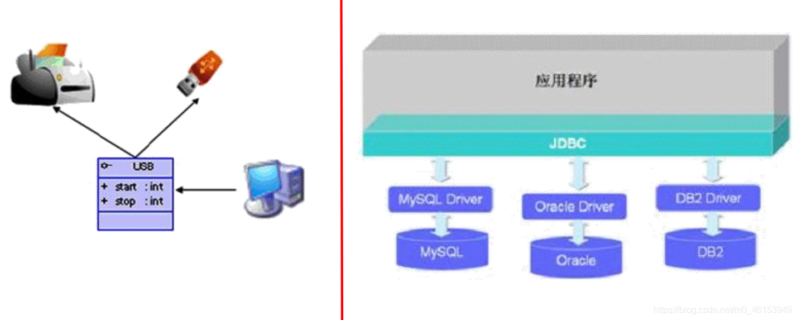  
 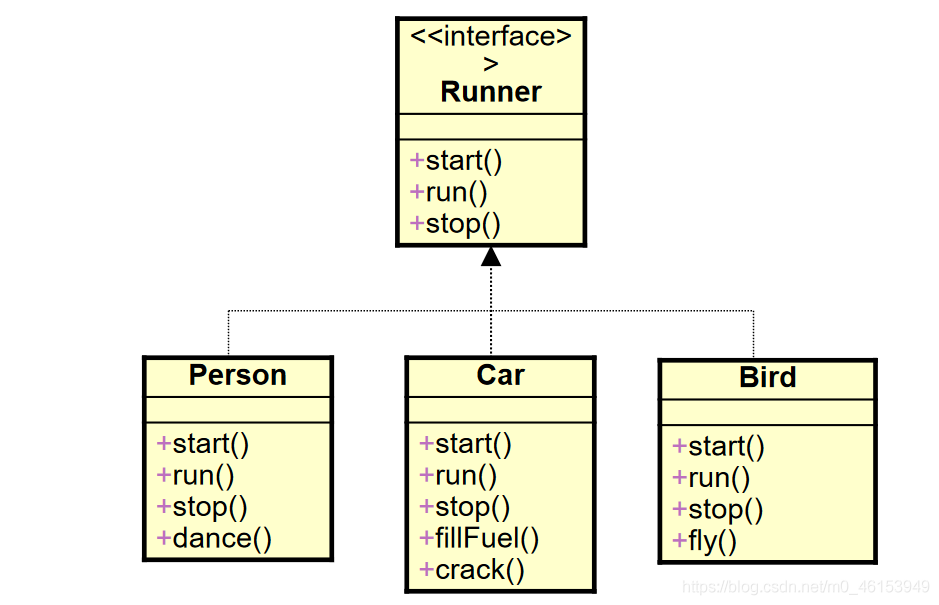

## 6.2、举例

```java
/*
 * 接口的使用
 * 1.接口使用上也满足多态性
 * 2.接口，实际上就是定义了一种规范
 * 3.开发中，体会面向接口编程！
 * 
 */
public class USBTest { 
	public static void main(String[] args) { 
	
		Computer com = new Computer();
		//1.创建了接口的非匿名实现类的非匿名对象
		Flash flash = new Flash();
		com.transferData(flash); 
		//2. 创建了接口的非匿名实现类的匿名对象
		com.transferData(new Printer());
		//3. 创建了接口的匿名实现类的非匿名对象
		USB phone = new USB(){ 

			@Override
			public void start() { 
				System.out.println("手机开始工作");
			}

			@Override
			public void stop() { 
				System.out.println("手机结束工作");
			}
		
		};
		com.transferData(phone);
		//4. 创建了接口的匿名实现类的匿名对象
		com.transferData(new USB(){ 
			@Override
			public void start() { 
				System.out.println("mp3 开始工作");
			}

			@Override
			public void stop() { 
				System.out.println("mp3 结束工作");
			}
		});
	}
}

class Computer{ 

	public void transferData(USB usb){ //USB usb = new Flash();
		usb.start();
	
		System.out.println("具体传输数据的细节");
	
		usb.stop();
	}

}

interface USB{ 
	//常量:定义了长、宽
	void start();

	void stop();
}
class Flash implements USB{ 

	@Override
	public void start() { 
		System.out.println("U 盘开始工作");
	}

	@Override
	public void stop() { 
		System.out.println("U 盘结束工作");
	}
}
class Printer implements USB{ 
	@Override
	public void start() { 
		System.out.println("打印机开启工作");
	}

	@Override
	public void stop() { 
		System.out.println("打印机结束工作");
	}

}
12345678910111213141516171819202122232425262728293031323334353637383940414243444546474849505152535455565758596061626364656667686970717273747576777879808182838485868788
```

## 6.3、接口的应用：代理模式(Proxy)

代理模式是 Java 开发中使用较多的一种设计模式。代理设计就是为其他对象提供一种代理以控制对这个对象的访问。

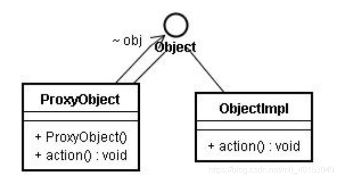

```java
/*
 * 接口的应用:代理模式
 * 
 * 
 */
public class NetWorkTest { 
	public static void main(String[] args) { 
	
		Server server = new Server();
//		server.browse();
		ProxyServer proxyServer = new ProxyServer(server);
	
		proxyServer.browse();
	}
}
interface NetWork{ 
	public void browse();

}
//被代理类
class Server implements NetWork{ 


	@Override
	public void browse() { 
		System.out.println("真实的服务器来访问网络");
	}
}
//代理类
class ProxyServer implements NetWork{ 

	private NetWork work;

	public ProxyServer(NetWork work){ 
		this.work = work;
	}

	public void check(){ 
		System.out.println("联网前的检查工作");
	}

	@Override
	public void browse() { 
		check();
	
		work.browse();
	}

}
12345678910111213141516171819202122232425262728293031323334353637383940414243444546474849
```

> 应用场景：
>

* 安全代理：屏蔽对真实角色的直接访问。
* 远程代理：通过代理类处理远程方法调用（RMI）
* 延迟加载：先加载轻量级的代理对象，真正需要再加载真实对象

比如你要开发一个大文档查看软件，大文档中有大的图片，有可能一个图片有 100MB，在打开文件时，不可能将所有的图片都显示出来，这样就可以使用代理模式，当需要查看图片时，用 proxy 来进行大图片的打开。

> 分类
>

* 静态代理（静态定义代理类）
* 动态代理（动态生成代理类）

  * JDK 自带的动态代理，需要反射等知识

```java
public class StaticProxyTest { 

	public static void main(String[] args) { 
		Proxy s = new Proxy(new RealStar());
		s.confer();
		s.signContract();
		s.bookTicket();
		s.sing();
		s.collectMoney();
	}
}

interface Star { 
	void confer();// 面谈

	void signContract();// 签合同

	void bookTicket();// 订票

	void sing();// 唱歌

	void collectMoney();// 收钱
}
//被代理类
class RealStar implements Star { 

	public void confer() { 
	}

	public void signContract() { 
	}

	public void bookTicket() { 
	}

	public void sing() { 
		System.out.println("明星：歌唱~~~");
	}

	public void collectMoney() { 
	}
}

//代理类
class Proxy implements Star { 
	private Star real;

	public Proxy(Star real) { 
		this.real = real;
	}

	public void confer() { 
		System.out.println("经纪人面谈");
	}

	public void signContract() { 
		System.out.println("经纪人签合同");
	}

	public void bookTicket() { 
		System.out.println("经纪人订票");
	}

	public void sing() { 
		real.sing();
	}

	public void collectMoney() { 
		System.out.println("经纪人收钱");
	}
}
1234567891011121314151617181920212223242526272829303132333435363738394041424344454647484950515253545556575859606162636465666768697071
```

## 6.4、接口的应用：工厂模式

拓展：[工厂设计模式.pdf](https://www.yuque.com/nizhegechouloudetuboshu/library/mlenxx)

> 接口和抽象类之间的对比
>

|No.|区别点|抽象类|接口|
| -----| --------------| --------------------------------------------------------------------| ---------------------------------------------|
|1|定义|包含抽象方法的类|主要是抽象方法和全局常量的集合|
|2|组成|构造方法、抽象方法、普通方法、常量、变量|常量、抽象方法、(jdk8.0:默认方法、静态方法)|
|3|使用|子类继承抽象类(extends)|子类实现接口(implements)|
|4|关系|抽象类可以实现多个接口|接口不能继承抽象类，但允许继承多个接口|
|5|常见设计模式|模板方法|简单工厂、工厂方法、代理模式|
|6|对象|都通过对象的多态性产生实例化对象||
|7|局限|抽象类有单继承的局限|接口没有此局限|
|8|实际|作为一个模板|是作为一个标准或是表示一种能力|
|9|选择|如果抽象类和接口都可以使用的话，优先使用接口，因为避免单继承的局限||

> 在开发中，常看到一个类不是去继承一个已经实现好的类，而是要么继承抽象类，要么实现接口。  
> -【面试题】排错：
>

```java
interface A { 
	int x = 0;
}
class B { 
	int x = 1;
}
class C extends B implements A { 
	public void pX() { 
//		编译不通过，x 不明确
		System.out.println(x);
//		System.out.println(super.x); //1
//		System.out.println(A.x);//0
	}
	public static void main(String[] args) { 
		new C().pX();
	}
}
1234567891011121314151617
```

> 排错 2：
>

```java
interface Playable { 
	void play();
}
interface Bounceable { 
	void play();
}
interface Rollable extends Playable, Bounceable { 
	Ball ball= new Ball("PingPang"); //省略了 public static final
}
public class Ball implements Rollable { 
	private String name;
	public String getName() { 
		return name;
	}
	public Ball(String name) { 
		this.name= name;
	}
	public void play() { 
		ball = new Ball("Football"); //The final field Rollable.ball cannot be assigned
		System.out.println(ball.getName());
	}
}
12345678910111213141516171819202122
```

> 练习
>

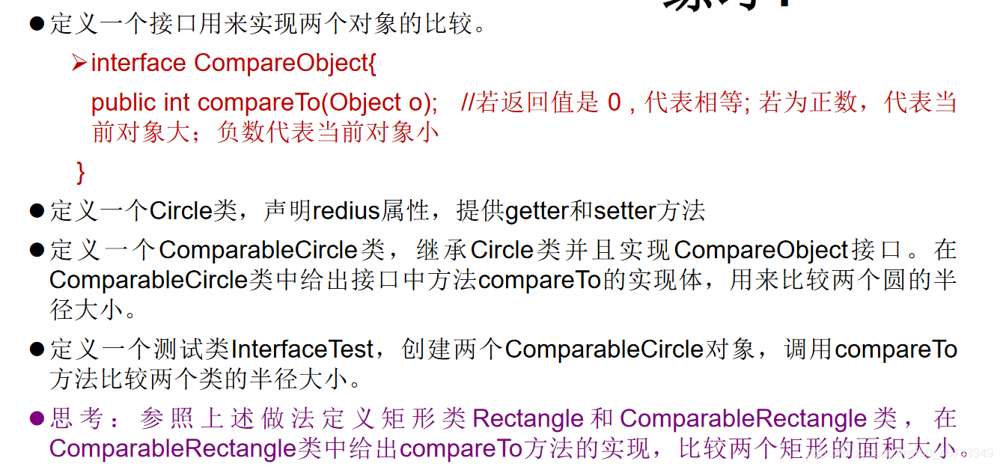

CompareObject 类

```java
/*
 * 定义一个接口用来实现两个对象的比较。
 * 
 */
public interface CompareObject { 
	public int compareTo(Object o);
	//若返回值是 0,代表相等;若为正数，代表当前对象大；负数代表当前对象小

}
123456789
```

Circle 类

```java
/*
 * 定义一个 Circle 类，声明 redius 属性，提供 getter 和 setter 方法
 */
public class Circle { 

	private Double radius;

	public Double getRadius() { 
		return radius;
	}

	public void setRadius(Double radius) { 
		this.radius = radius;
	}

	public Circle() { 
		super();
	}

	public Circle(Double radius) { 
		super();
		this.radius = radius;
	}
	
}
12345678910111213141516171819202122232425
```

ComparableCircle 类

```java
/*
 * 定义一个 ComparableCircle 类，继承 Circle 类并且实现 CompareObject 接口。在 ComparableCircle 类中给出接口中方法 compareTo 的实现体，
 * 用来比较两个圆的半径大小。
 */
public class ComparableCircle extends Circle implements CompareObject{ 

	public ComparableCircle(double radius) { 
		super(radius);
	}
	@Override
	public int compareTo(Object o) { 
		if(this == o){ 
			return 0;
		}
		if(o instanceof ComparableCircle){ 
			ComparableCircle c = (ComparableCircle)o;
			//错误的写法
//			return (int)(this.getRedius() - c.getRedius());
			//正确的方式一：
//			if(this.getRadius() > c.getRadius()){ 
//				return 1;
//			}else if(this.getRadius() < c.getRadius()){ 
//				return -1;
//			}else{ 
//				return 0;
//			}
			//当属性 radius 声明为 Double 类型时，可以调用包装类的方法
			//正确的方式二：
			return this.getRadius().compareTo(c.getRadius());
		}else{ 
			return 0;
//			throw new RuntimeException("传入数据类型不匹配");
		}
	}
}
1234567891011121314151617181920212223242526272829303132333435
```

InterfaceTest 类

```java
/*
 * 定义一个测试类 InterfaceTest，创建两个 ComparableCircle 对象，
 * 调用 compareTo 方法比较两个类的半径大小。
 * 
 */
public class InterfaceTest { 
	public static void main(String[] args) { 
	
		ComparableCircle c1 = new ComparableCircle(3.4);
		ComparableCircle c2 = new ComparableCircle(3.6);
	
		int compareValue = c1.compareTo(c2);
		if(compareValue > 0){ 
			System.out.println("c1 对象大");
		}else if(compareValue < 0){ 
			System.out.println("c2 对象大");
		}else{ 
			System.out.println("两个一样的");
		}
	
		int compareValue1 = c1.compareTo(new String("AA"));
		System.out.println(compareValue1);
	}
}
123456789101112131415161718192021222324
```

## 07、Java 8 中关于接口的改进

Java 8 中，你可以为接口添加静态方法和默认方法。从技术角度来说，这是完全合法的，只是它看起来违反了接口作为一个抽象定义的理念。

> 静态方法：
>

使用 static 关键字修饰。可以通过接口直接调用静态方法，并执行其方法体。我们经常在相互一起使用的类中使用静态方法。你可以在标准库中找到像 Collection/Collections 或者 Path/Paths 这样成对的接口和类。

> 默认方法：
>

默认方法使用 default 关键字修饰。可以通过实现类对象来调用。我们在已有的接口中提供新方法的同时，还保持了与旧版本代码的兼容性。比如：java 8 API 中对 Collection、List、Comparator 等接口提供了丰富的默认方法。

> 例1
>

interface 类

```java
/*
 * JDK8:除了全局常量和抽象方法之外，还可以定义静态方法、默认方法(略)。
 * 
 * 
 */
public interface CompareA { 

	//静态方法
	public static void method1() { 
		System.out.println("CompareA:西安");
	}

	//默认方法
	public default void method2(){ 
		System.out.println("CompareA:深圳");
	}

	default void method3(){ 
		System.out.println("CompareA:杭州");
	}
}
123456789101112131415161718192021
```

SubClassTest 类

```java
public class SubClassTest { 

	public static void main(String[] args) { 
		SubClass s = new SubClass();
//		s.method1();
//		SubClass.method1();
//		知识点 1：接口中定义的静态方法，只能通过接口来调用。
		CompareA.method1();
//		知识点 2：通过实现类的对象，可以调用接口中的默认方法。
//		如果实现类重写了接口中的默认方法，调用时，仍然调用的是重写以后的方法
		s.method2();
//		知识点 3：如果子类(或实现类)继承的父类和实现的接口中声明了同名同参数的默认方法，
//		那么子类在没有重写此方法的情况下，默认调用的是父类中的同名同参数的方法。-->类优先原则
//		知识点 4：如果实现类实现了多个接口，而这多个接口中定义了同名同参数的默认方法，
//		那么在实现类没有重写此方法的情况下，报错。-->接口冲突。
//		这就需要我们必须在实现类中重写此方法
		s.method3();
	
	}
}
class SubClass extends SuperClass implements CompareA,CompareB{ 

	public void method2(){ 
		System.out.println("SubClass：上海");
	}

	public void method3(){ 
		System.out.println("SubClass：深圳");
	}

//	知识点 5：如何在子类(或实现类)的方法中调用父类、接口中被重写的方法
	public void myMethod(){ 
		method3(); //调用自己定义的重写的方法
		super.method3(); //调用的是父类中声明的
//		调用接口中的默认方法
		CompareA.super.method3();
		CompareB.super.method3();
	}
}
123456789101112131415161718192021222324252627282930313233343536373839
```

SuperClass 类

```java
public class SuperClass { 
	public void method3(){ 
		System.out.println("SuperClass:北京");
	}
}
12345
```

CompareB 类

```java
public interface CompareB { 
	default void method3(){ 
		System.out.println("CompareB：上海");
	}
}
12345
```

> 例2
>

```java
/*
 * 练习：接口冲突的解决方式
 */
interface Filial { // 孝顺的
	default void help() { 
		System.out.println("老妈，我来救你了");
	}
}

interface Spoony { // 痴情的
	default void help() { 
		System.out.println("媳妇，别怕，我来了");
	}
}

class Father{ 
	public void help(){ 
		System.out.println("儿子，救我媳妇！");
	}
}

class Man extends Father implements Filial, Spoony { 

	@Override
	public void help() { 
		System.out.println("我该就谁呢？");
		Filial.super.help();
		Spoony.super.help();
	}

}
12345678910111213141516171819202122232425262728293031
```

## 08、类的内部成员之五：内部类

当一个事物的内部，还有一个部分需要一个完整的结构进行描述，而这个内部的完整的结构又只为外部事物提供服务，那么整个内部的完整结构最好使用内部类。

```java
/*
 * 类的内部成员之五:内部类
 * 
 * 1.Java中允许将一个类A声明在另一个类B中,则类A就是内部类,类B就是外部类.
 * 
 * 2.内部类的分类:成员内部类	VS	局部内部类(方法内、代码块内、构造器内)
 * 	
 * 3.成员内部类
 * 	》作为外部类的成员,
 * 		- 调用外部类的结构
 * 		- 可以被static修饰
 * 		- 可以被4种不同的权限修饰
 * 
 *  》作为一个类，
 *  	- 类内可以定义属性、方法、构造器等
 *  	- 可以被final修饰，表示此类不能被继承。言外之意，不使用final，就可以被继承
 *  	- 可以abstract修饰
 * 
 * 4.关注如下的3个问题
 *   》 如何实例化成员内部类的对象
 *   》 如何在成员内部类中区分调用外部类的结构
 *   》 开发中局部内部类的使用  见《InnerClassTest1.java》
 */
public class InnerClassTest { 
	public static void main(String[] args) { 
	
		//创建Dog实例(静态的成员内部类)
		Person.Dog dog = new Person.Dog();
		dog.show();
	
		//创建Bird实例(非静态的成员内部类)
//		Person.Bird bird = new Person.Bird();
		Person p = new Person();
		Person.Bird bird = p.new Bird();
		bird.sing();
	
		System.out.println();
	
		bird.display("喜鹊");
	}
}
class Person{ 
	String name = "李雷";
	int age;

	public void eat(){ 
		System.out.println("人，吃饭");
	}

	//静态成员内部类
	static class Dog{ 
		String name;
		int age;
	
		public void show(){ 
			System.out.println("卡拉是条狗");
//			eat();
		}
	}

	//非静态成员内部类
	class Bird{ 
		String name = "杜鹃";
		public Bird(){ 
		
		}
	
		public void sing(){ 
			System.out.println("我是一只猫头鹰");
			Person.this.eat();//调用外部类的非静态属性
			eat();
			System.out.println(age);
		}
	
		public void display(String name){ 
			System.out.println(name);	//方法的形参
			System.out.println(this.name);	//内部类的属性
			System.out.println(Person.this.name);	//外部类的属性
		}
	}
	public void method(){ 
		//局部内部类
		class AA{ 
		
		}
	}

	{ 
		//局部内部类
		class BB{ 
		
		}
	}

	public Person(){ 
		//局部内部类
		class CC{ 
		
		}
	}
}
123456789101112131415161718192021222324252627282930313233343536373839404142434445464748495051525354555657585960616263646566676869707172737475767778798081828384858687888990919293949596979899100101
```

> InnerClassTest1类
>

```java
public class InnerClassTest1 { 

//	开发中很少见
	public void method(){ 
//		局部内部类
		class AA{ 
		
		}
	}

//	返回一个实现了Comparable接口的类的对象
	public Comparable getComparable(){ 
	
//		创建一个实现了Comparable接口的类:局部内部类
		//方式一：
//		class MyComparable implements Comparable{ 
//
//			@Override
//			public int compareTo(Object o) { 
//				return 0;
//			}
//		
//		}
//	
//		return new MyComparable();
	
		//方式二：
		return new Comparable(){ 


			@Override
			public int compareTo(Object o) { 
				return 0;
			}
		
		};
	
	}
}
123456789101112131415161718192021222324252627282930313233343536373839
```

## 8.1、匿名内部类

```java
/*
 * 1.匿名内部类不能定义任何静态成员、方法和类，只能创建匿名内部类的一个实例。
 * 一个匿名内部类一定是在new的后面，用其隐含实现一个接口或实现一个类。
 * 
 * 2.格式：
 * 		new 父类构造器（实参列表）|实现接口(){
 * 				//匿名内部类的类体部分
 * 		}
 * 
 * 3.匿名内部类的特点
 * 		> 匿名内部类必须继承父类或实现接口
 * 		> 匿名内部类只能有一个对象
 * 		> 匿名内部类对象只能使用多态形式引用
 */
interface Product{ 
	public double getPrice();
	public String getName();
}
public class AnonymousTest{ 
	public void test(Product p){ 
		System.out.println("购买了一个" + p.getName() + "，花掉了" + p.getPrice());
	}
	public static void main(String[] args) { 
		AnonymousTest ta = new AnonymousTest();
		//调用test方法时，需要传入一个Product参数，
		//此处传入其匿名实现类的实例
		ta.test(new Product(){ 
			public double getPrice(){ 
				return 567.8;
			}
			public String getName(){ 
				return "AGP显卡";
			}
		});
	}
}
123456789101112131415161718192021222324252627282930313233343536
```

## 8.2、局部内部类的使用注意

```java
public class InnerClassTest { 

//	public void onCreate(){ 
//
//	int number = 10;
//
//	View.OnClickListern listener = new View.OnClickListener(){ 
//	
//		public void onClick(){ 
//			System.out.println("hello!");
//			System.out.println(number);
//		}
//	
//	}
//
//	button.setOnClickListener(listener);
//
//}

	/*
	 * 在局部内部类的方法中(比如:show)如果调用局部内部类所声明的方法(比如：method)中的局部变量(比如：num)的话,
	 * 要求此局部变量声明为final的。
	 * 
	 * jdk 7及之前版本：要求此局部变量显式的声明为final的
	 * jdk 8及之后的版本：可以省略final的声明
	 * 
	 */
	public void method(){ 
		//局部变量
		int num = 10;
	
		class AA{ 
		
			public void show(){ 
//				num = 20;	//Local variable num defined in an enclosing scope must be final or effectively final
				System.out.println(num);
			}
		}
	}
}
12345678910111213141516171819202122232425262728293031323334353637383940
```

> 作者做笔记不容易，请评个分吧！
>

* 1、如果觉得文章写行不错就点个  **赞** 。✌
* 2、如果觉得写得好就  **一键三连** ！✌✌✌
* 3、如果文章对你很有帮助，请  **打赏** 。 💃💃💃💃💃
