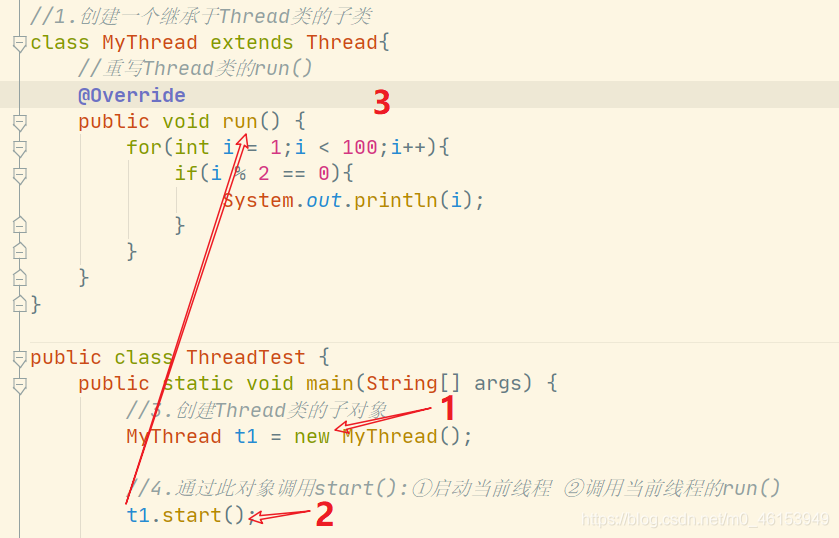
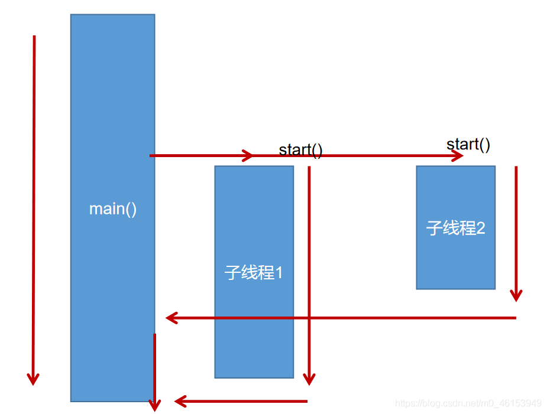
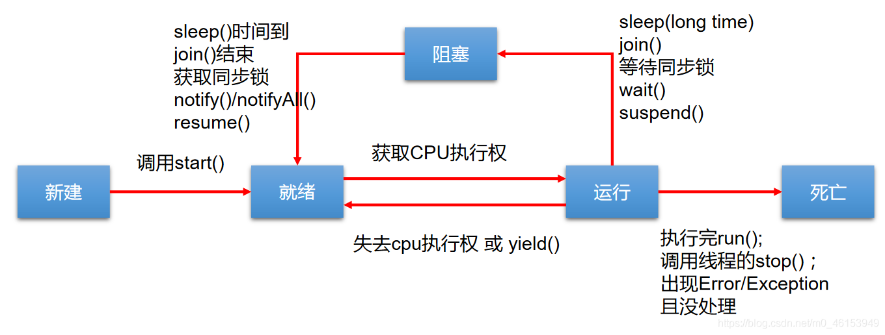
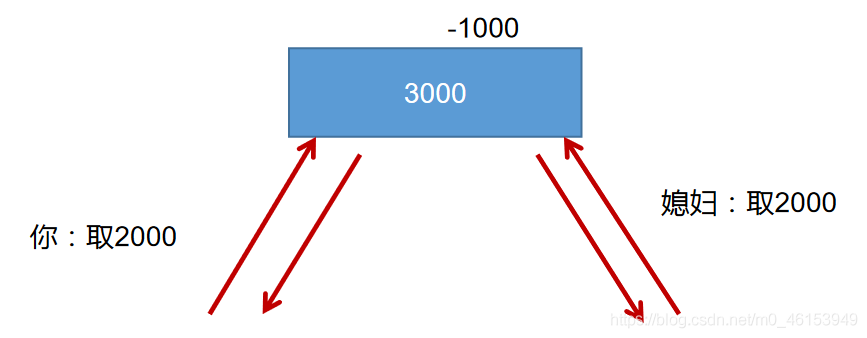
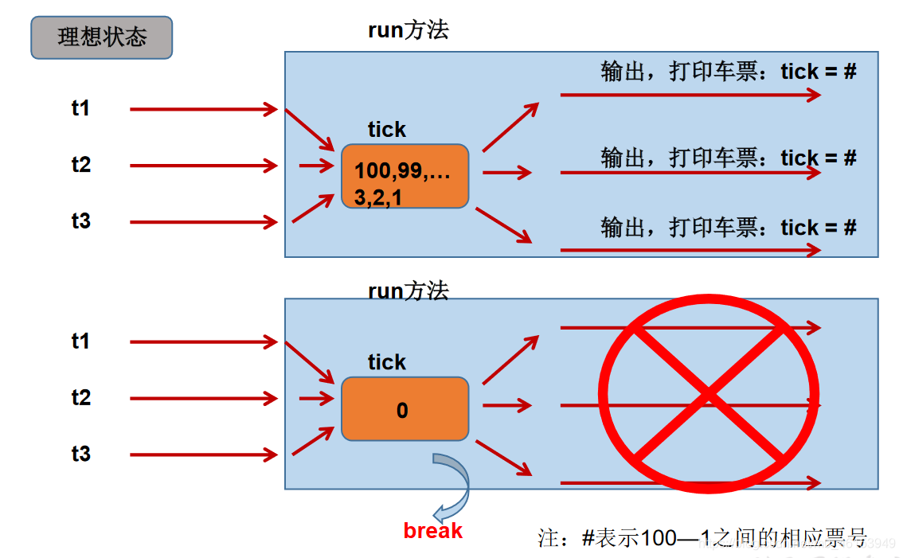
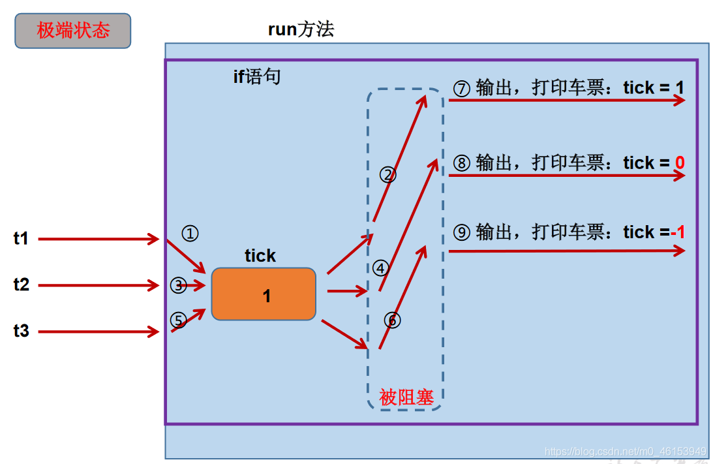
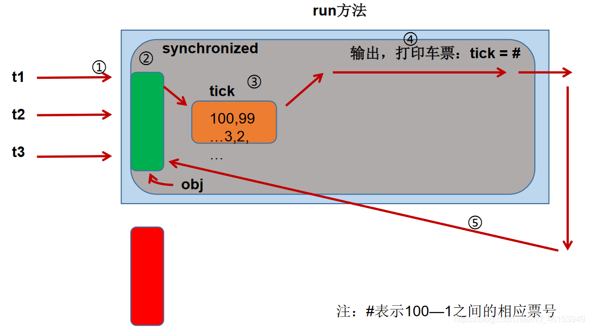
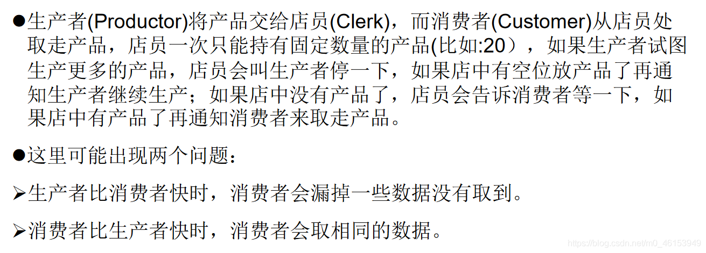

## 01、基本概念：程序、进程、线程

* **程序(program)** ： **为完成特定任务、用某种语言编写的一组指令的集合** 。即指一段静态的代码，静态对象。
* **进程(process)** ：程序的一次执行过程，或是 **正在运行的一个程序** 。是一个动态的过程：有它自身的产生、存在和消亡的过程。——生命周期

  * 如：运行中的QQ，运行中的MP3播放器程序是静态的，进程是动态的
  * 进程作为资源分配的单位，系统在运行时会为每个进程分配不同的内存区域
* **线程(thread)** ，进程可进一步细化为线程，是 **一个程序内部的一条执行路径** 。

  * 若一个进程同一时间并行执行多个线程，就是支持多线程的
  * **线程是调度和执行的单位** ，每个线程拥有独立的运行栈和程序计数器(pc)，线程切换的开销小
  * 一个进程中的多个线程共享相同的内存单元/内存地址空间—》它们从同一堆中分配对象，可以访问相同的变量和对象。这就使得线程间通信更简便、高效。但多个线程操作共享的系统资源可能就会带来安全的隐患。


## 1.1、进程与线程


> 单核CPU和多核CPU的理解
>

* 单核CPU，其实是一种假的多线程，因为在一个时间单元内，也只能执行一个线程的任务。例如：虽然有多车道，但是收费站只有一个工作人员在收费，只有收了费才能通过，那么CPU就好比收费人员。如果有某个人不想交钱，那么收费人员可以把他“挂起”（晾着他，等他想通了，准备好了钱，再去收费）。但是因为CPU时间单元特别短，因此感觉不出来。
* 如果是多核的话，才能更好的发挥多线程的效率。（现在的服务器都是多核的）
* 一个Java应用程序java.exe，其实至少有三个线程：main()主线程，gc()垃圾回收线程，异常处理线程。当然如果发生异常，会影响主线程。

> 并行与并发
>

* 并行：多个CPU同时执行多个任务。比如：多个人同时做不同的事。
* 并发：一个CPU(采用时间片)同时执行多个任务。比如：秒杀、多个人做同一件事。

## 1.2、使用多线程的优点

> 背景：
>

以单核CPU为例，只使用单个线程先后完成多个任务（调用多个方法），肯定比用多个线程来完成用的时间更短，为何仍需多线程呢？

> 多线程程序的优点：
>

1. 提高应用程序的响应。对图形化界面更有意义，可增强用户体验。
2. 提高计算机系统CPU的利用率
3. 改善程序结构。将既长又复杂的进程分为多个线程，独立运行，利于理解和修改

## 1.3、何时需要多线程

* 程序需要同时执行两个或多个任务。
* 程序需要实现一些需要等待的任务时，如用户输入、文件读写操作、网络操作、搜索等。
* 需要一些后台运行的程序时。

## 02、线程的创建和使用

## 2.1、线程的创建和启动

* Java语言的JVM允许程序运行多个线程，它通过`java.lang.Thread`类来体现。
* `Thread`类的特性

  * 每个线程都是通过某个特定`Thread`对象的`run()`方法来完成操作的，经常把`run()`方法的主体称为线程体
  * 通过该`Thread`对象的`start()方`法来启动这个线程，而非直接调用`run()`

## 2.2、[Thread类](https://so.csdn.net/so/search?q=Thread%E7%B1%BB&spm=1001.2101.3001.7020)

* `Thread()`：创建新的Thread对象
* `Thread(String threadname)`：创建线程并指定线程实例名
* `Thread(Runnabletarget)`：指定创建线程的目标对象，它实现了Runnable接口中的run方法
* `Thread(Runnable target, String name)`：创建新的Thread对象

## 2.3、[API](https://so.csdn.net/so/search?q=API&spm=1001.2101.3001.7020)中创建线程的两种方式

* JDK1.5之前创建新执行线程有两种方法：

  * 继承`Thread`类的方式
  * 实现`Runnable`接口的方式

### 2.3.1、创建多线程的方式一：继承Thread类

```java
/**
 * 多线程的创建，方式一：继承于Thread类
 * 1.创建一个继承于Thread类的子类
 * 2.重写Thread的run()方法 ---> 将此线程的方法声明在run()中
 * 3.创建Thread类的子对象
 * 4.通过此对象调用start()
 *
 * 例子:遍历100以内的所有的偶数
 */

//1.创建一个继承于Thread类的子类
class MyThread extends Thread{ 
    //重写Thread类的run()
    @Override
    public void run() { 
        for(int i = 1;i < 100;i++){ 
            if(i % 2 == 0){ 
                System.out.println(i);
            }
        }
    }
}

public class ThreadTest { 
    public static void main(String[] args) { 
        //3.创建Thread类的子对象
        MyThread t1 = new MyThread();

        //4.通过此对象调用start():①启动当前线程 ②调用当前线程的run()
        t1.start();

        //如下操作仍在main线程中执行的
        for(int i = 1;i < 100;i++){ 
            if(i % 2 == 0){ 
                System.out.println(i + "***main()***");
            }
        }
    }
}
123456789101112131415161718192021222324252627282930313233343536373839
```

> mt子线程的创建和启动过程
>

  
 

### 2.3.2、创建过程中的两个问题说明

```java
//1.创建一个继承于Thread类的子类
class MyThread extends Thread{ 
    //重写Thread类的run()
    @Override
    public void run() { 
        for(int i = 1;i < 100;i++){ 
            if(i % 2 == 0){ 
                System.out.println(Thread.currentThread().getName() + ":" + i);
            }
        }
    }
}

public class ThreadTest { 
    public static void main(String[] args) { 
        //3.创建Thread类的子对象
        MyThread t1 = new MyThread();

        //4.通过此对象调用start():①启动当前线程 ②调用当前线程的run()
        t1.start();
        //问题1:我们不能通过直接调用run()的方式启动线程。
//        t1.run();

        //问题二:再启动一个线程，遍历100以内的偶数。不可以还让已经start()的线程去执行。会报IllegalThreadStateException
//        t1.start();
        //我们需要重现创建一个线程的对象，去start().
        MyThread t2 = new MyThread();
        t2.start();

        //如下操作仍在main线程中执行的
        for(int i = 1;i < 100;i++){ 
            if(i % 2 == 0){ 
                System.out.println(Thread.currentThread().getName() + ":" + i + "***main()***");
            }
        }
    }
}
12345678910111213141516171819202122232425262728293031323334353637
```

### 2.3.3、练习1

> 1、写法一
>

```java
/**
 * 练习:创建两个分线程，其中一个遍历100以内的偶数，另一个遍历100以内的奇数
 */
public class ThreadDemo { 
    public static void main(String[] args) { 
        MyThread m1 = new MyThread();
        m1.start();

        MyThread2 m2 = new MyThread2();
        m2.start();
    }
}
class MyThread extends Thread{ 
    @Override
    public void run() { 
        for(int i = 0;i < 100;i++){ 
            if(i % 2 == 0){ 
                System.out.println(Thread.currentThread().getName() + ":" + i);
            }
        }
    }
}
class MyThread2 extends Thread{ 
    @Override
    public void run() { 
        for(int i = 0;i < 100;i++){ 
            if(i % 2 != 0){ 
                System.out.println(Thread.currentThread().getName() + ":" + i);
            }
        }
    }
}
1234567891011121314151617181920212223242526272829303132
```

> 2、写法二
>

```java
/**
 * 练习:创建两个分线程，其中一个遍历100以内的偶数，另一个遍历100以内的奇数
 */
public class ThreadDemo { 
    public static void main(String[] args) { 

        //创建Thread类的匿名子类的方式
        new Thread(){ 
            @Override
            public void run() { 
                for(int i = 0;i < 100;i++){ 
                    if(i % 2 == 0){ 
                        System.out.println(Thread.currentThread().getName() + ":" + i);
                    }
                }
            }
        }.start();

        new Thread(){ 
            @Override
            public void run() { 
                for(int i = 0;i < 100;i++){ 
                    if(i % 2 != 0){ 
                        System.out.println(Thread.currentThread().getName() + ":" + i);
                    }
                }
            }
        }.start();
    }
}
123456789101112131415161718192021222324252627282930
```

### 2.3.4、Thread类的有关方法

```java
/**
 * 测试Thread类的常用方法
 * 1.start():启动当前线程，执行当前线程的run()
 * 2.run():通常需要重写Thread类中的此方法，将创建的线程要执行的操作声明在此方法中
 * 3.currentThread(): 静态方法，返回当前代码执行的线程
 * 4.getName():获取当前线程的名字
 * 5.setName():设置当前线程的名字
 * 6.yield():释放当前CPU的执行权
 * 7.join():在线程a中调用线程b的join(),此时线程a就进入阻塞状态，直到线程b完全执行完以后，线程a才
 *          结束阻塞状态。
 * 8.stop():已过时。当执行此方法时，强制结束当前线程。
 * 9.sleep(long millitime)：让当前线程“睡眠”指定时间的millitime毫秒)。在指定的millitime毫秒时间内，
 *                          当前线程是阻塞状态的。
 * 10.isAlive()：返回boolean，判断线程是否还活着
 */

class HelloThread extends Thread{ 
    @Override
    public void run() { 
        for(int i = 0;i < 100; i++){ 

            try { 
                sleep(10);
            } catch (InterruptedException e) { 
                e.printStackTrace();
            }

            if(i % 2 == 0){ 
                System.out.println(Thread.currentThread().getName() + ":" + i);
            }
//            if(i % 20 == 0){ 
//                yield();
//            }
        }
    }

    public HelloThread(String name){ 
        super(name);
    }
}

public class ThreadModeTest { 
    public static void main(String[] args) { 
        HelloThread h1 = new HelloThread("Thread : 1");

//        h1.setName("线程一");

        h1.start();

        //给主线程命名
        Thread.currentThread().setName("主线程");

        for(int i = 0;i < 100; i++){ 
            if(i % 2 == 0){ 
                System.out.println(Thread.currentThread().getName() + ":" + i);
            }

            if(i == 20){ 
                try { 
                    h1.join();
                } catch (InterruptedException e) { 
                    e.printStackTrace();
                }
            }
        }

        System.out.println(h1.isAlive());
    }
}
123456789101112131415161718192021222324252627282930313233343536373839404142434445464748495051525354555657585960616263646566676869
```

### 2.3.5、线程的调度

* 调度策略

  * 时间片  
    ​
  * **抢占式：高优先级的线程抢占CPU**
* Java的调度方法

  * 同优先级线程组成先进先出队列（先到先服务），使用时间片策略
  * 对高优先级，使用优先调度的抢占式策略

### 2.3.6、线程的[优先级](https://so.csdn.net/so/search?q=%E4%BC%98%E5%85%88%E7%BA%A7&spm=1001.2101.3001.7020)

```java
/**
 * - 线程的优先级等级
 *   - MAX_PRIORITY：10
 *   - MIN _PRIORITY：1
 *   - NORM_PRIORITY：5 --->默认优先级
 * - 涉及的方法
 *   - getPriority() ：返回线程优先值
 *   - setPriority(intnewPriority) ：改变线程的优先级
 *
 *   说明:高优先级的线程要抢占低优先级线程cpu的执行权。
 *       但是只是从概率上讲，高优先级的线程高概率的情况下被执行。
 *       并不意味着只有当高优先级的线程执行完以后，低优先级的线程才会被执行。
 */

class HelloThread extends Thread { 
    @Override
    public void run() { 
        for (int j = 0; j < 100; j++) { 

//            try { 
//                sleep(10);
//            } catch (InterruptedException e) { 
//                e.printStackTrace();
//            }

            if (j % 2 == 0) { 
                System.out.println(getName() + ":" + getPriority() + ":" + j);
            }
        }
    }
    public HelloThread(String name){ 
        super(name);
    }
}

public class ThreadModeTest { 
    public static void main(String[] args) { 
        HelloThread h2 = new HelloThread("Thread : 1");
        h2.start();

        //设置分线程的优先级
        h2.setPriority(Thread.MAX_PRIORITY);

        //给主线程命名
        Thread.currentThread().setName("主线程");
        Thread.currentThread().setPriority((Thread.MIN_PRIORITY));

        for(int j = 0;j < 100; j++){ 
            if(j % 2 == 0){ 
                System.out.println(Thread.currentThread().getName() + ":" + Thread.currentThread().getPriority() + ":" + j);
            }

//            if(j == 20){ 
//                try { 
//                    h2.join();
//                } catch (InterruptedException e) { 
//                    e.printStackTrace();
//                }
//            }
        }

        System.out.println(h2.isAlive());
    }
}
12345678910111213141516171819202122232425262728293031323334353637383940414243444546474849505152535455565758596061626364
```

### 2.3.7、练习2

> 1、多窗口卖票
>

```java
/**
 * 例子：创建三个c窗口卖票，总票数为100张
 *
 * 存在线程的安全问题，待解决。
 */
class Windows extends Thread{ 

    private static int ticket = 100;

    @Override
    public void run() { 
        while(true){ 
            if(ticket > 0){ 
                System.out.println(getName() + ":卖票，票号为: " + ticket);
                ticket--;
            }else{ 
                break;
            }
        }
    }
}

public class WindowsTest { 
    public static void main(String[] args) { 
        Windows t1 = new Windows();
        Windows t2 = new Windows();
        Windows t3 = new Windows();

        t1.setName("窗口1");
        t2.setName("窗口2");
        t3.setName("窗口3");

        t1.start();
        t2.start();
        t3.start();
    }
}
12345678910111213141516171819202122232425262728293031323334353637
```

### 2.3.8、创建多线程的方式二：实现Runnable接口

```java
/**
 * 创建多线程的方式二：实现Runnable接口
 * 1.创建一个实现了Runnable接口得类
 * 2.实现类去实现Runnable中的抽象方法:run()
 * 3.创建实现类的对象
 * 4.将此对象作为参数传递到Thread类的构造器中，创建Thread类的对象
 * 5.通过Thread类的对象调用start()
 */
//1.创建一个实现了Runnable接口得类
class MThread implements Runnable{ 

    //2.实现类去实现Runnable中的抽象方法:run()
    @Override
    public void run() { 
        for(int i = 0;i < 100;i++){ 
            if(i % 2 == 0){ 
                System.out.println(Thread.currentThread().getName() + ":" + i);
            }
        }
    }
}

public class ThreadTest1 { 
    public static void main(String[] args) { 
        //3.创建实现类的对象
        MThread m1 = new MThread();
        //4.将此对象作为参数传递到Thread类的构造器中，创建Thread类的对象
        Thread t1 = new Thread(m1);
        //5.通过Thread类的对象调用start():①启动线程 ②调用当前线程的run() --> 调用了Runnable类型的target的run()
        t1.start();

        //再启动一个线程，遍历100以内的偶数
        Thread t2 = new Thread(m1);
        t2.setName("线程2");
        t2.start();
    }
}
12345678910111213141516171819202122232425262728293031323334353637
```

### 2.3.9、继承方式和实现方式的联系与区别

```java
/**
 *  比较创建线程的两种方式。
 *  开发中：优先选择：实现Runnable接口的方式
 *  原因：1. 实现的方式没有类的单继承性的局限性
 *       2. 实现的方式更适合来处理多个线程有共享数据的情况。
 *  
 *  联系：public class Thread implements Runnable
 *  相同点：两种方式都需要重写run(),将线程要执行的逻辑声明在run()中。
 */
123456789
```

### 2.3.10、补充：线程的分类

> Java中的线程分为两类：一种是守护线程，一种是用户线程。
>

* 它们在几乎每个方面都是相同的，唯一的区别是判断JVM何时离开。
* 守护线程是用来服务用户线程的，通过在`start()`方法前调用**`thread.setDaemon(true)`**可以把一个用户线程变成一个守护线程。
* Java垃圾回收就是一个典型的守护线程。
* 若JVM中都是守护线程，当前JVM将退出。
* 形象理解：兔死狗烹，鸟尽弓藏

## 03、线程的生命周期

> JDK中用Thread.State类定义了线程的几种状态
>

* 新建：当一个Thread类或其子类的对象被声明并创建时，新生的线程对象处于新建状态
* 就绪：处于新建状态的线程被`start()`后，将进入线程队列等待CPU时间片，此时它已具备了运行的条件，只是没分配到CPU资源
* 运行：当就绪的线程被调度并获得CPU资源时,便进入运行状态，`run()`方法定义了线程的操作和功能
* 阻塞：在某种特殊情况下，被人为挂起或执行输入输出操作时，让出CPU并临时中止自己的执行，进入阻塞状态
* 死亡：线程完成了它的全部工作或线程被提前强制性地中止或出现异常导致结束

> 线程的生命周期
>



## 04、线程的同步

> 1、提出问题：
>
>  多个线程执行的不确定性引起执行结果的不稳定
>
>  多个线程对账本的共享，会造成操作的不完整性，会破坏数据。
>



> 2、例题：模拟火车站售票程序，开启三个窗口售票。
>

```java
class Windows1 implements Runnable{ 

    private int ticket = 100;

    @Override
    public void run() { 
        while(true){ 
            if(ticket > 0){ 
                System.out.println(Thread.currentThread().getName() + ":卖票，票号为: " + ticket);
                ticket--;
            }else{ 
                break;
            }
        }
    }
}

public class WindowsTest1 { 
    public static void main(String[] args) { 
        Windows1 w = new Windows1();

        Thread t1 = new Thread(w);
        Thread t2 = new Thread(w);
        Thread t3 = new Thread(w);

        t1.setName("窗口1");
        t2.setName("窗口2");
        t3.setName("窗口3");

        t1.start();
        t2.start();
        t3.start();
    }
}
12345678910111213141516171819202122232425262728293031323334
```

> 3、理想状态
>



> 4、极端状态
>



## 4.1、同步代码块处理实现Runnable的线程安全问题

```java
/**
 *  例子：创建三个窗口卖票，总票数为100张.使用实现Runnable接口的方式
 *  1.卖票过程中出现重票、错票 ---》出现了线程的安全问题
 *  2.问题出现的原因:当某个线程操作车票的过程中，尚未操作完成时，其他线程参与进来，也操作车票
 *  3.如何解决：当一个线程在操作ticket的时候，其他线程不能参与进来。直到线程a操作完ticket时，其他
 *            线程才可以操作ticket。这种情况即使线程a出现了阻塞，也不能被改变。
 *  4.在java中，我们通过同步机制，来解决线程的安全问题。
 *
 *  方式一：同步代码块
 *  synchronized(同步监视器){
 *      //需要被同步的代码
 *
 *  }
 *  说明：1.操作共享数据的代码，即为需要被同步的代码 --->不能包含代码多了，也不能包含代码少了。
 *       2.共享数据：多个线程共同操作的变量。比如：ticket就是共享数据
 *       3.同步监视器，俗称：锁。任何一个类的对象，都可以来充当锁。
 *          要求：多个线程必须要共用同一把锁。
 *
 *       补充：在实现Runnable接口创建多线程的方式中，我们可以考虑使用this充当同步监视器。
 *
 *  方式二：同步方法
 *      如果操作共享数据的代码完整的声明在一个方法中，我们不妨将此方法声明同步的
 *
 *  5.同步的方式，解决了线程的安全问题。---好处
 *    操作同步代码时，只能有一个线程参与，其他线程等待。相当于是一个单线程的过程，效率低。---局限性
 */

class Windows1 implements Runnable{ 

    private int ticket = 100;
//    Object obj = new Object();
//    Dog dog = new Dog();

    @Override
    public void run() { 
        while(true){ 
            synchronized (this) { //此时的this:唯一的windows1的对象 //方式二:synchronized (dog) { 
                if (ticket > 0) { 

                    try{ 
                        Thread.sleep(100);
                    }catch (InterruptedException e){ 
                        e.printStackTrace();
                    }

                    System.out.println(Thread.currentThread().getName() + ":卖票，票号为: " + ticket);
                    ticket--;
                } else { 
                    break;
                }
            }
        }
    }
}

public class WindowsTest1 { 
    public static void main(String[] args) { 
        Windows1 w = new Windows1();

        Thread t1 = new Thread(w);
        Thread t2 = new Thread(w);
        Thread t3 = new Thread(w);

        t1.setName("窗口1");
        t2.setName("窗口2");
        t3.setName("窗口3");

        t1.start();
        t2.start();
        t3.start();
    }
}
class Dog{ 

}
123456789101112131415161718192021222324252627282930313233343536373839404142434445464748495051525354555657585960616263646566676869707172737475
```

> 分析同步原理
>



## 4.2、同步代码块处理继承Thread类的线程安全问题

```java
/**
 * 使用同步代码块解决继承Thread类的方式的线程安全问题
 *
 * 例子：创建三个c窗口卖票，总票数为100张
 */
class Windows extends Thread{ 

    private static int ticket = 100;
    private static Object obj = new Object();

    @Override
    public void run() { 
        while(true){ 
            //正确的
//            synchronized (obj) { 
            synchronized (Windows.class){    //Class clazz = Windows.class
            //错误的，因为此时this表示的是t1,t2,t3三个对象
//            synchronized (this) { 
                if (ticket > 0) { 

                    try { 
                        Thread.sleep(100);
                    } catch (InterruptedException e) { 
                        e.printStackTrace();
                    }

                    System.out.println(getName() + ":卖票，票号为: " + ticket);
                    ticket--;
                } else { 
                    break;
                }
            }
        }
    }
}

public class WindowsTest2 { 
    public static void main(String[] args) { 
        Windows t1 = new Windows();
        Windows t2 = new Windows();
        Windows t3 = new Windows();

        t1.setName("窗口1");
        t2.setName("窗口2");
        t3.setName("窗口3");

        t1.start();
        t2.start();
        t3.start();
    }
}
123456789101112131415161718192021222324252627282930313233343536373839404142434445464748495051
```

## 4.3、同步方法处理实现Runnable的线程安全问题

```java
/**
 * 使用同步方法解决实现Runnable接口的线程安全问题
 *
 * 关于同步方法的总结:
 *  1. 同步方法仍然涉及到同步监视器，只是不需要我们显式的声明。
 *  2. 非静态的同步方法，同步监视器是：this
 *     静态的同步方法，同步监视器是：当前类本身
 */

class Windows3 implements Runnable { 

    private int ticket = 100;

    @Override
    public void run() { 
        while (true) { 
            show();
        }
    }

    public synchronized void show() {  //同步监视器:this
//        synchronized (this){ 
            if (ticket > 0) { 
                try { 
                    Thread.sleep(100);
                } catch (InterruptedException e) { 
                    e.printStackTrace();
                }
                System.out.println(Thread.currentThread().getName() + ":卖票，票号为: " + ticket);
                ticket--;
            }
//        }
    }
}

public class WindowsTest3 { 
    public static void main(String[] args) { 
        Windows3 w3 = new Windows3();

        Thread t1 = new Thread(w3);
        Thread t2 = new Thread(w3);
        Thread t3 = new Thread(w3);

        t1.setName("窗口1");
        t2.setName("窗口2");
        t3.setName("窗口3");

        t1.start();
        t2.start();
        t3.start();
    }
}
12345678910111213141516171819202122232425262728293031323334353637383940414243444546474849505152
```

## 4.4、同步方法处理继承Thread类的线程安全问题

```java
/**
 * 使用同步方法处理继承Thread类的方式中的线程安全问题
 */
class Windows4 extends Thread { 

    private static int ticket = 100;

    @Override
    public void run() { 

        while (true) { 

            show();
        }

    }
    private static synchronized void show(){ //同步监视器：Window4.class
        //private synchronized void show(){ //同步监视器：t1,t2,t3。此种解决方式是错误的
        if (ticket > 0) { 

            try { 
                Thread.sleep(100);
            } catch (InterruptedException e) { 
                e.printStackTrace();
            }

            System.out.println(Thread.currentThread().getName() + "：卖票，票号为：" + ticket);
            ticket--;
        }
    }
}


public class WindowsTest4 { 
    public static void main(String[] args) { 
        Windows4 t1 = new Windows4();
        Windows4 t2 = new Windows4();
        Windows4 t3 = new Windows4();


        t1.setName("窗口1");
        t2.setName("窗口2");
        t3.setName("窗口3");

        t1.start();
        t2.start();
        t3.start();

    }
}
1234567891011121314151617181920212223242526272829303132333435363738394041424344454647484950
```

## 4.5、线程安全的单例模式之懒汉式

```java
/**
 * 使用同步机制将单例模式中的懒汉式改写为线程安全的
 */
public class BankTest { 
}
class Bank{ 

    private Bank(){ }

    private static Bank instance = null;

    public static Bank getInstance(){ 
        //方式一：效率稍差
        //快捷键:Alt+Shift+Z
//        synchronized (Bank.class) { 
//            if(instance == null){ 
//                instance = new Bank();
//            }
//            return instance;
//        }

        //方式二：效率较高
        if(instance == null) { 
            synchronized (Bank.class) { 
                if (instance == null) { 
                    instance = new Bank();
                }
            }
        }
        return instance;
    }
}
1234567891011121314151617181920212223242526272829303132
```

## 4.6、死锁的问题

> 1、例1
>

```java
/**
 * 演示线程的死锁
 *
 * 1.死锁的理解：不同的线程分别占用对方需要的同步资源不放弃，
 *       都在等待对方放弃自己需要的同步资源，就形成了线程的死锁
 * 2.说明:
 *      》出现死锁后，不会出现异常，不会出现提示，只是所有的线程都处于阻塞状态，无法继续
 *      》我们使用同步时，要避免出现死锁。
 */
public class ThreadTest { 
    public static void main(String[] args) { 

        StringBuffer s1 = new StringBuffer();
        StringBuffer s2 = new StringBuffer();

        new Thread(){ 
            @Override
            public void run() { 

                synchronized (s1){ 
                    s1.append("a");
                    s2.append("1");

                    try { 
                        Thread.sleep(100);
                    } catch (InterruptedException e) { 
                        e.printStackTrace();
                    }

                    synchronized (s2){ 
                        s1.append("b");
                        s2.append("2");

                        System.out.println(s1);
                        System.out.println(s2);
                    }
                }
            }
        }.start();

        new Thread(new Runnable() { 
            @Override
            public void run() { 
                synchronized (s2){ 
                    s1.append("c");
                    s2.append("3");

                    try { 
                        Thread.sleep(100);
                    } catch (InterruptedException e) { 
                        e.printStackTrace();
                    }

                    synchronized (s1){ 
                        s1.append("d");
                        s2.append("4");

                        System.out.println(s1);
                        System.out.println(s2);
                    }
                }
            }
        }).start();
    }
}
1234567891011121314151617181920212223242526272829303132333435363738394041424344454647484950515253545556575859606162636465
```

> 2、例2
>

```java
class A { 
	public synchronized void foo(B b) { 
		System.out.println("当前线程名: " + Thread.currentThread().getName()
				+ " 进入了A实例的foo方法"); // ①
		try { 
			Thread.sleep(200);
		} catch (InterruptedException ex) { 
			ex.printStackTrace();
		}
		System.out.println("当前线程名: " + Thread.currentThread().getName()
				+ " 企图调用B实例的last方法"); // ③
		b.last();
	}

	public synchronized void last() { 
		System.out.println("进入了A类的last方法内部");
	}
}

class B { 
	public synchronized void bar(A a) { 
		System.out.println("当前线程名: " + Thread.currentThread().getName()
				+ " 进入了B实例的bar方法"); // ②
		try { 
			Thread.sleep(200);
		} catch (InterruptedException ex) { 
			ex.printStackTrace();
		}
		System.out.println("当前线程名: " + Thread.currentThread().getName()
				+ " 企图调用A实例的last方法"); // ④
		a.last();
	}

	public synchronized void last() { 
		System.out.println("进入了B类的last方法内部");
	}
}

public class DeadLock implements Runnable { 
	A a = new A();
	B b = new B();

	public void init() { 
		Thread.currentThread().setName("主线程");
		// 调用a对象的foo方法
		a.foo(b);
		System.out.println("进入了主线程之后");
	}

	public void run() { 
		Thread.currentThread().setName("副线程");
		// 调用b对象的bar方法
		b.bar(a);
		System.out.println("进入了副线程之后");
	}

	public static void main(String[] args) { 
		DeadLock dl = new DeadLock();
		new Thread(dl).start();
		dl.init();
	}
}
1234567891011121314151617181920212223242526272829303132333435363738394041424344454647484950515253545556575859606162
```

## 4.7、Lock锁方式解决线程安全问题

* `java.util.concurrent.locks.Lock`接口是控制多个线程对共享资源进行访问的工具。锁提供了对共享资源的独占访问，每次只能有一个线程对`Lock`对象加锁，线程开始访问共享资源之前应先获得`Lock`对象。
* `ReentrantLock`类实现了`Lock` ，它拥有与`synchronized`相同的并发性和内存语义，在实现线程安全的控制中，比较常用的是`ReentrantLock`，可以显式加锁、释放锁。
* 从JDK 5.0开始，Java提供了更强大的线程同步机制——通过显式定义同步锁对象来实现同步。同步锁使用`Lock`对象充当。

```java
import java.util.concurrent.locks.ReentrantLock;

/**
 * 解决线程安全问题的方式三：lock锁---》JDK5.0新增
 *
 * 注意：如果同步代码有异常，要将unlock()写入finally语句块
 *
 * 1. 面试题：synchronized 与 Lock的异同？
 *    相同：二者都可以解决线程安全问题
 *    不同：synchronized机制在执行完相应的同步代码以后，自动的释放同步监视器
 *         Lock需要手动的启动同步（lock()），同时结束同步也需要手动的实现（unlock()）
 *
 * 2.优先使用顺序：
 *      Lock 同步代码块（已经进入了方法体，分配了相应资源）同步方法（在方法体之外）
 *
 * 面试题：如何解决线程安全问题？有几种方式
 */

class Windows implements Runnable{ 

    private int ticket = 100;
    //1.实例化ReentrantLock
    private ReentrantLock lock = new ReentrantLock();


    @Override
    public void run() { 
        while(true){ 
            try{ 

                //调用锁定方法：lock()
                lock.lock();

                if(ticket > 0){ 

                    try { 
                        Thread.sleep(100);
                    } catch (InterruptedException e) { 
                        e.printStackTrace();
                    }

                    System.out.println(Thread.currentThread().getName() + ":售票，票号为: " + ticket);
                    ticket --;
                }else{ 
                    break;
                }
            }finally { 
                //3.调用解锁方法：unlock()
                lock.unlock();
            }
        }
    }
}

public class LockTest { 
    public static void main(String[] args) { 
        Windows w = new Windows();

        Thread t1 = new Thread(w);
        Thread t2 = new Thread(w);
        Thread t3 = new Thread(w);

        t1.setName("窗口1");
        t2.setName("窗口2");
        t3.setName("窗口3");

        t1.start();
        t2.start();
        t3.start();
    }
}
1234567891011121314151617181920212223242526272829303132333435363738394041424344454647484950515253545556575859606162636465666768697071
```

> 练习
>

```java
/**
 * 银行有一个账户。
 * 有两个储户分别向同一个账户存3000元，每次存1000，存3次。
 * 每次存完打印账户余额。
 *
 * 分析：
 *      1.是否是多线程问题？是，两个储户线程
 *      2.是否有共享数据？有，账户（或账户余额）
 *      3.是否有线程安全问题？有
 *      4.需要考虑如何解决线程安全问题？同步机制：有三种方式。
 */
class Account{ 
    private double balance;

    public Account(double balance){ 
        this.balance = balance;
    }

    //存钱
    public synchronized void deposit(double amt){ 
        if(amt > 0){ 

            try { 
                Thread.sleep(1000);
            } catch (InterruptedException e) { 
                e.printStackTrace();
            }

            balance += amt;
            System.out.println(Thread.currentThread().getName() + ":" + "存钱成功，当前余额:" + balance);
        }
    }
}

class Customer extends Thread{ 

    private Account acct;
    public Customer(Account acct){ 
        this.acct = acct;
    }

    @Override
    public void run() { 

        for(int i = 0;i < 3;i++){ 
            acct.deposit(1000);
        }
    }
}

public class AccountTest { 
    public static void main(String[] args) { 
        Account acct = new Account(0);
        Customer c1 = new Customer(acct);
        Customer c2 = new Customer(acct);

        c1.setName("甲");
        c2.setName("乙");

        c1.start();
        c2.start();
    }
}
123456789101112131415161718192021222324252627282930313233343536373839404142434445464748495051525354555657585960616263
```

## 05、线程的通信

```java
/**
 * 线程通信的例子：使用两个线程打印1-100。线程1, 线程2 交替打印
 *
 * 涉及到的三个方法：
 * wait():一旦执行此方法，当前线程就进入阻塞状态，并释放同步监视器。
 * notify():一旦执行此方法，就会唤醒被wait的一个线程。如果有多个线程被wait，就唤醒优先级高的那个。
 * notifyAll():一旦执行此方法，就会唤醒所有被wait的线程。
 *
 * 说明：
 *      1.wait()，notify()，notifyAll()三个方法必须使用在同步代码块或同步方法中。
 *      2.wait()，notify()，notifyAll()三个方法的调用者必须是同步代码块或同步方法中的同步监视器。
 *         否则，会出现IllegalMonitorStateException异常
 *      3.wait()，notify()，notifyAll()三个方法是定义在java.lang.Object类中。
 */

class Number implements Runnable{ 

    private int number = 1;
    public Object obj = new Object();

    @Override
    public void run() { 

        while (true){ 
            synchronized (obj) { 

                obj.notify();

                if(number <= 100){ 

                    try { 
                        Thread.sleep(10);
                    } catch (InterruptedException e) { 
                        e.printStackTrace();
                    }

                    System.out.println(Thread.currentThread().getName() + ":" + number);
                    number++;

                    try { 
                        //使得调用如下wait()方法的线程进入阻塞状态
                        obj.wait();
                    } catch (InterruptedException e) { 
                        e.printStackTrace();
                    }

                }else{ 
                    break;
                }
            }
        }
    }
}

public class CommunicationTest { 
    public static void main(String[] args) { 
        Number number = new Number();
        Thread t1 = new Thread(number);
        Thread t2 = new Thread(number);

        t1.setName("线程1");
        t2.setName("线程2");

        t1.start();
        t2.start();
    }
}
12345678910111213141516171819202122232425262728293031323334353637383940414243444546474849505152535455565758596061626364656667
```

## 5.1、sleep()和wait()的异同

```java
 /**
 * 面试题：sleep() 和 wait()的异同？
 * 1.相同点：一旦执行方法，都可以使得当前的线程进入阻塞状态。
 * 2.不同点：1）两个方法声明的位置不同：Thread类中声明sleep() , Object类中声明wait()
 *          2）调用的要求不同：sleep()可以在任何需要的场景下调用。 wait()必须使用在同步代码块或同步方法中
 *          3）关于是否释放同步监视器：如果两个方法都使用在同步代码块或同步方法中，sleep()不会释放锁，wait()会释放锁。
 */
1234567
```

## 5.2、经典例题：生产者/消费者问题



```java
/**
 * 线程通信的应用：经典例题：生产者/消费者问题
 *
 * 生产者(Productor)将产品交给店员(Clerk)，而消费者(Customer)从店员处取走产品，
 * 店员一次只能持有固定数量的产品(比如:20），如果生产者试图生产更多的产品，
 * 店员会叫生产者停一下，如果店中有空位放产品了再通知生产者继续生产；
 * 如果店中没有产品了，店员会告诉消费者等一下，
 * 如果店中有产品了再通知消费者来取走产品。
 *
 * 分析：
 *      1.是否是多线程的问题？是，生产者的线程，消费者的线程
 *      2.是否有共享数据的问题？是，店员、产品、产品数
 *      3.如何解决线程的安全问题？同步机制，有三种方法
 *      4.是否涉及线程的通信？是
 */

class Clerk{ 

    private int productCount = 0;

    //生产产品
    public synchronized void produceProduct() { 

        if(productCount < 20){ 
            productCount++;
            System.out.println(Thread.currentThread().getName() + ": 开始生产第" + productCount + "个产品");

            notify();
        }else{ 
            //等待
            try { 
                wait();
            } catch (InterruptedException e) { 
                e.printStackTrace();
            }
        }

    }

    //消费产品
    public synchronized void consumeProduct() { 

        if(productCount > 0){ 
            System.out.println(Thread.currentThread().getName() + ":开始消费第" + productCount + "个产品");
            productCount--;

            notify();
        }else{ 
            //等待
            try { 
                wait();
            } catch (InterruptedException e) { 
                e.printStackTrace();
            }
        }
    }

}

class Producer extends Thread{ //生产者
    private Clerk clerk;

    public Producer(Clerk clerk){ 
        this.clerk = clerk;
    }

    @Override
    public void run() { 
        System.out.println(getName() + ": 开始生产产品......");

        while(true){ 

            try { 
                Thread.sleep(10);
            } catch (InterruptedException e) { 
                e.printStackTrace();
            }

            clerk.produceProduct();
        }
    }
}

class Consumer extends Thread{   //消费者
    private Clerk clerk;

    public Consumer(Clerk clerk){ 
        this.clerk = clerk;
    }

    @Override
    public void run() { 
        System.out.println(getName() + ": 开始消费产品......");

        while(true){ 

            try { 
                Thread.sleep(20);
            } catch (InterruptedException e) { 
                e.printStackTrace();
            }

            clerk.consumeProduct();
        }

    }
}

public class ProductTest { 
    public static void main(String[] args) { 
        Clerk clerk = new Clerk();

        Producer p1 = new Producer(clerk);
        p1.setName("生产者1");

        Consumer c1 = new Consumer(clerk);
        c1.setName("消费者1");
        Consumer c2 = new Consumer(clerk);
        c2.setName("消费者2");

        p1.start();
        c1.start();
        c2.start();
    }
}			
123456789101112131415161718192021222324252627282930313233343536373839404142434445464748495051525354555657585960616263646566676869707172737475767778798081828384858687888990919293949596979899100101102103104105106107108109110111112113114115116117118119120121122123124125
```

## 06、JDK5.0新增线程创建方式

## 6.1、创建多线程的方式三：实现Callable接口

```java
import java.util.concurrent.Callable;
import java.util.concurrent.ExecutionException;
import java.util.concurrent.FutureTask;

/**
 * 创建多线程的方式三：实现Callable接口 ---> JDK 5.0新增
 *
 * 如何理解实现Callable接口的方式创建多线程比实现Runnable接口创建多线程方式强大？
 *      1.call()可以有返回值的。
 *      2.call()可以抛出异常，被外面的操作捕获，获取异常的信息
 *      3.Callable是支持泛型的
 *      4.需要借助FutureTask类，比如获取返回结果
 */
//1.创建一个实现Callable的实现类
class NumThread implements Callable{ 

    //2.实现call方法，将此线程需要执行的操作声明在call()中
    @Override
    public Object call() throws Exception { 
        int sum = 0;
        for(int i = 1;i <= 100;i++){ 
            if(i % 2 == 0){ 
                System.out.println(i);
                sum += i;
            }
        }
        return sum;
    }
}

public class ThreadNew { 
    public static void main(String[] args) { 
        //3.创建Callable接口实现类的对象
        NumThread numThread = new NumThread();

        //4.将此Callable接口实现类的对象作为传递到FutureTask构造器中，创建FutureTask的对象
        FutureTask futureTask = new FutureTask(numThread);

        //5.将FutureTask的对象作为参数传递到Thread类的构造器中，创建Thread对象，并调用start()
        new Thread(futureTask).start();

        try { 
            //6.获取Callable中call方法的返回值
            //get()返回值即为FutureTask构造器参数Callable实现类重写的call()的返回值。
            Object sum = futureTask.get();
            System.out.println("总和为:" + sum);
        } catch (InterruptedException e) { 
            e.printStackTrace();
        } catch (ExecutionException e) { 
            e.printStackTrace();
        }
    }
}
1234567891011121314151617181920212223242526272829303132333435363738394041424344454647484950515253
```

> `Future`接口
>

* 可以对具体`Runnable、Callable`任务的执行结果进行取消、查询是否完成、获取结果等。
* `FutrueTask`是`Futrue`接口的唯一的实现类
* `FutureTask`同时实现了`Runnable, Future`接口。它既可以作为`Runnable`被线程执行，又可以作为`Future`得到`Callable`的返回值

## 6.2、使用线程池的好处

> 1、 **背景** ：
>

经常创建和销毁、使用量特别大的资源，比如并发情况下的线程，对性能影响很大。

> 2、 **思路** ：
>

提前创建好多个线程，放入线程池中，使用时直接获取，使用完放回池中。可以避免频繁创建销毁、实现重复利用。类似生活中的公共交通工具。

> 3、 **好处** ：
>

* 提高响应速度（减少了创建新线程的时间）
* 降低资源消耗（重复利用线程池中线程，不需要每次都创建）
* 便于线程管理

  * `corePoolSize`：核心池的大小
  * `maximumPoolSize`：最大线程数
  * `keepAliveTime`：线程没有任务时最多保持多长时间后会终止
  * …

## 6.3、创建多线程的方式四：使用线程池

```java
import java.util.concurrent.ExecutorService;
import java.util.concurrent.Executors;
import java.util.concurrent.ThreadPoolExecutor;

/**
 * 创建多线程的方式四：使用线程池
 *
 * 好处：
 *      1.提高响应速度（减少了创建新线程的时间）
 *      2.降低资源消耗（重复利用线程池中线程，不需要每次都创建）
 *      3.便于线程管理
 *          corePoolSize：核心池的大小
 *          maximumPoolSize：最大线程数
 *          keepAliveTime：线程没有任务时最多保持多长时间后会终止
 *
 * 面试题：创建多线程有几种方式？四种！
 */

class NumberThread implements Runnable{ 
    @Override
    public void run() { 
        for(int i = 0;i <= 100;i++){ 
            if(i % 2 == 0){ 
                System.out.println(Thread.currentThread().getName() + ":" + i);
            }
        }
    }
}

class NumberThread1 implements Runnable{ 
    @Override
    public void run() { 
        for(int i = 0;i <= 100;i++){ 
            if(i % 2 != 0){ 
                System.out.println(Thread.currentThread().getName() + ":" + i);
            }
        }
    }
}

public class ThreadPool { 
    public static void main(String[] args) { 

        //1. 提供指定线程数量的线程池
        ExecutorService service = Executors.newFixedThreadPool(10);
        ThreadPoolExecutor service1 = (ThreadPoolExecutor) service;
        //设置线程池的属性
//        System.out.println(service.getClass());
//        service1.setCorePoolSize(15);
//        service1.setKeepAliveTime();

        //2.执行指定的线程的操作。需要提供实现Runnable接口或Callable接口实现类的对象
        service.execute(new NumberThread());  //适合适用于Runable
        service.execute(new NumberThread1());  //适合适用于Runable

//        service.submit(Callable callable);   //适合适用于Callable

        //3.关闭连接池
        service.shutdown();
    }
}
12345678910111213141516171819202122232425262728293031323334353637383940414243444546474849505152535455565758596061
```

* 线程池相关API

  * JDK 5.0起提供了线程池相关API：**`ExecutorService`**和**`Executors`**
* `ExecutorService`：真正的线程池接口。常见子类`ThreadPoolExecutor`

  * `void execute(Runnable command)` ：执行任务/命令，没有返回值，一般用来执行`Runnable`
  * `Future submit(Callable task)`：执行任务，有返回值，一般又来执行`Callable`
  * `void shutdown()`：关闭连接池
* `Executors`：工具类、线程池的工厂类，用于创建并返回不同类型的线程池

  * `Executors.newCachedThreadPool(`)：创建一个可根据需要创建新线程的线程池
  * `Executors.newFixedThreadPool(n)`; 创建一个可重用固定线程数的线程池
  * `Executors.newSingleThreadExecutor()`：创建一个只有一个线程的线程池
  * `Executors.newScheduledThreadPool(n)`：创建一个线程池，它可安排在给定延迟后运行命令或者定期地执行。

> 作者做笔记不容易，请评个分吧！
>

* 1、如果觉得文章写行不错就点个  **赞** 。✌
* 2、如果觉得写得好就  **一键三连** ！✌✌✌
* 3、如果文章对你很有帮助，请  **打赏** 。 💃💃💃💃💃
