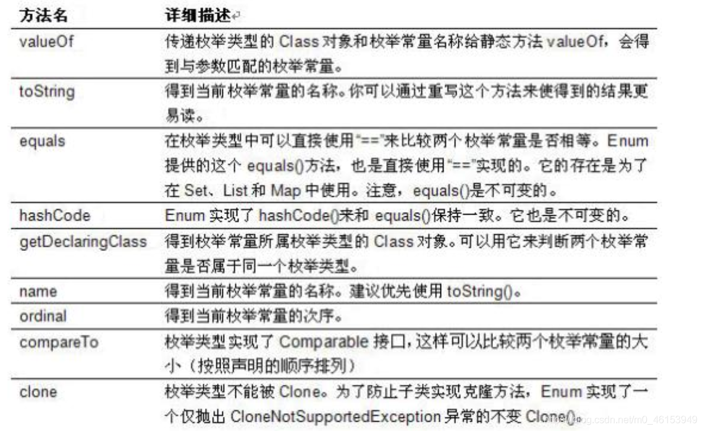
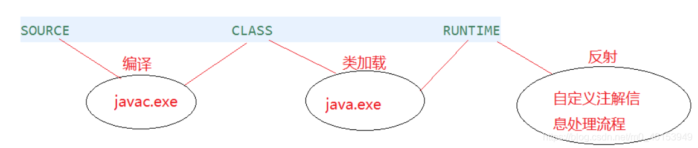
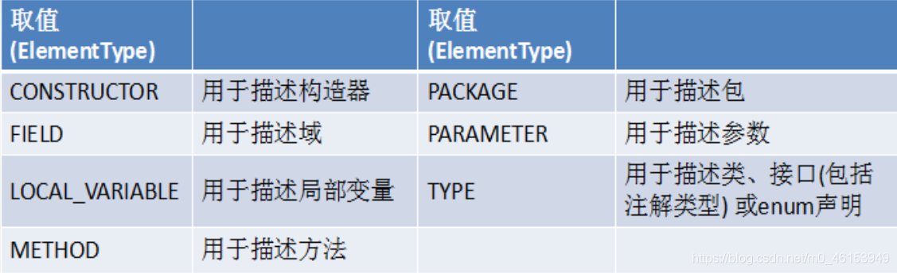
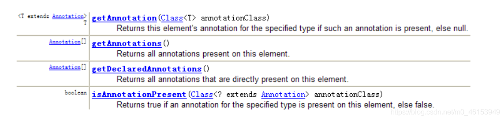

## 01、枚举类的使用

## 1.1、枚举类的理解

* 类的对象只有有限个，确定的。举例如下：

  * 星期：Monday(星期一)、…、Sunday(星期天)
  * 性别：Man(男)、Woman(女)
  * 季节：Spring(春节)…Winter(冬天)
  * 支付方式：Cash（现金）、WeChatPay（微信）、Alipay(支付宝)、BankCard(银行卡)、CreditCard(信用卡)
  * 就职状态：Busy、Free、Vocation、Dimission
  * 订单状态：Nonpayment（未付款）、Paid（已付款）、Delivered（已发货）、Return（退货）、Checked（已确认）Fulfilled（已配货）、
  * 线程状态：创建、就绪、运行、阻塞、死亡
* 当需要定义一组常量时，强烈建议使用枚举类
* 枚举类的实现

  * JDK1.5之前需要自定义枚举类
  * JDK 1.5 新增的enum 关键字用于定义枚举类
* 若枚举只有一个对象, 则可以作为一种单例模式的实现方式。

## 1.2、自定义枚举类

> 枚举类的属性
>

* 枚举类对象的属性不应允许被改动, 所以应该使用`private final`修饰
* 枚举类的使用`private final` 修饰的属性应该在构造器中为其赋值
* 若枚举类显式的定义了带参数的构造器, 则在列出枚举值时也必须对应的传入参数

```java
/**
 * 一、枚举类的使用
 * 1.枚举类的理解：类的对象只有有限个，确定的。我们称此类为枚举类。
 * 2.当需要定义一组常量时，强烈建议使用枚举类
 * 3.若枚举只有一个对象, 则可以作为一种单例模式的实现方式。
 *
 * 二、如何定义枚举类
 *     方式一：JDK1.5之前需要自定义枚举类
 *     方式二：JDK 1.5 新增的enum 关键字用于定义枚举类
 *
 */
public class SeasonTest { 
    public static void main(String[] args) { 
        Season spring = Season.SPRING;
        System.out.println(spring);
    }
}
//自定义枚举类
class Season{ 
    //1.声明Season对象的属性:private final修饰
    private final String seasonName;
    private final String seasonDesc;

    //2.私有化类的构造器,并给对象属性赋值
    private Season(String seasonName,String seasonDesc){ 
        this.seasonName = seasonName;
        this.seasonDesc = seasonDesc;
    }

    //3.提供当前枚举类的多个对象
    public static final Season SPRING = new Season("春天","万物复苏");
    public static final Season SUMMER = new Season("夏天","烈日炎炎");
    public static final Season AUTUMN = new Season("秋天","金秋送爽");
    public static final Season WINTER = new Season("冬天","白雪皑皑");

    //4.其他诉求：获取枚举类对象的属性
    public String getSeasonName() { 
        return seasonName;
    }

    public String getSeasonDesc() { 
        return seasonDesc;
    }

    //4.其他诉求1：提供toString()
    @Override
    public String toString() { 
        return "Season{" +
                "seasonName='" + seasonName + '\'' +
                ", seasonDesc='" + seasonDesc + '\'' +
                '}';
    }
}
1234567891011121314151617181920212223242526272829303132333435363738394041424344454647484950515253
```

## 1.3、使用[enum](https://so.csdn.net/so/search?q=enum&spm=1001.2101.3001.7020)关键字定义枚举类

> 使用说明
>

* 使用enum定义的枚举类默认继承了java.lang.Enum类，因此不能再继承其他类
* 枚举类的构造器只能使用private 权限修饰符
* 枚举类的所有实例必须在枚举类中显式列出(, 分隔; 结尾)。列出的实例系统会自动添加public static final 修饰
* 必须在枚举类的第一行声明枚举类对象

> JDK 1.5 中可以在switch 表达式中使用Enum定义的枚举类的对象作为表达式, case 子句可以直接使用枚举值的名字, 无需添加枚举类作为限定。
>

```java
/**
 * 使用enum关键字定义枚举类
 * 说明：定义的枚举类默认继承于java.lang.Enum类
 */
public class SeasonTest1 { 
    public static void main(String[] args) { 
        Season1 summer = Season1.SUMMER;
        //toString():
        System.out.println(summer.toString());
      
        System.out.println(Season1.class.getSuperclass());
    }
}

//使用enum关键字枚举类
enum Season1{ 
    //1.提供当前枚举类的对象，多个对象之间用","隔开，末尾对象";"结束
    SPRING("春天","万物复苏"),
    SUMMER("夏天","烈日炎炎"),
    AUTUMN("秋天","金秋送爽"),
    WINTER("冬天","白雪皑皑");

    //2.声明Season对象的属性:private final修饰
    private final String seasonName;
    private final String seasonDesc;

    //3.私有化类的构造器,并给对象属性赋值
    private Season1(String seasonName,String seasonDesc){ 
        this.seasonName = seasonName;
        this.seasonDesc = seasonDesc;
    }

    //4.其他诉求：获取枚举类对象的属性
    public String getSeasonName() { 
        return seasonName;
    }

    public String getSeasonDesc() { 
        return seasonDesc;
    }

    //4.其他诉求1：提供toString()
//    @Override
//    public String toString() { 
//        return "Season{" +
//                "seasonName='" + seasonName + '\'' +
//                ", seasonDesc='" + seasonDesc + '\'' +
//                '}';
//    }
}
1234567891011121314151617181920212223242526272829303132333435363738394041424344454647484950
```

## 1.4、Enum类中的常用方法



> Enum类的主要方法：
>

* `values()`方法：返回枚举类型的对象数组。该方法可以很方便地遍历所有的枚举值。
* `valueOf(String str)`：可以把一个字符串转为对应的枚举类对象。要求字符串必须是枚举类对象的“名字”。如不是，会有运行时异常：IllegalArgumentException。
* `toString()`：返回当前枚举类对象常量的名称

```java
/**
 * 使用enum关键字定义枚举类
 * 说明：定义的枚举类默认继承于java.lang.Enum类
 *
 * 三、Enum类的常用方法
 *      values()方法：返回枚举类型的对象数组。该方法可以很方便地遍历所有的枚举值。
 *      valueOf(String str)：可以把一个字符串转为对应的枚举类对象。要求字符串必须是枚举类对象的“名字”。如不是，会有运行时异常：IllegalArgumentException。
 *      toString()：返回当前枚举类对象常量的名称
 */
public class SeasonTest1 { 
    public static void main(String[] args) { 
        Season1 summer = Season1.SUMMER;
        //toString():
        System.out.println(summer.toString());

//        System.out.println(Season1.class.getSuperclass());
        System.out.println("**************************");
        //values():返回所有的枚举类对象构成的数组
        Season1[] values = Season1.values();
        for(int i = 0;i < values.length;i++){ 
            System.out.println(values[i]);
        }
        System.out.println("****************************");
        Thread.State[] values1 = Thread.State.values();
        for(int i = 0;i < values1.length;i++){ 
            System.out.println(values1[i]);
        }

        //valueOf(String objName):返回枚举类中对象名是objName的对象。
        Season1 winter = Season1.valueOf("WINTER");
        //如果没有objName的枚举类对象，则抛异常：IllegalArgumentException
//        Season1 winter = Season1.valueOf("WINTER1");
        System.out.println(winter);

    }
}

//使用enum关键字枚举类
enum Season1{ 
    //1.提供当前枚举类的对象，多个对象之间用","隔开，末尾对象";"结束
    SPRING("春天","万物复苏"),
    SUMMER("夏天","烈日炎炎"),
    AUTUMN("秋天","金秋送爽"),
    WINTER("冬天","白雪皑皑");

    //2.声明Season对象的属性:private final修饰
    private final String seasonName;
    private final String seasonDesc;

    //3.私有化类的构造器,并给对象属性赋值
    private Season1(String seasonName,String seasonDesc){ 
        this.seasonName = seasonName;
        this.seasonDesc = seasonDesc;
    }

    //4.其他诉求：获取枚举类对象的属性
    public String getSeasonName() { 
        return seasonName;
    }

    public String getSeasonDesc() { 
        return seasonDesc;
    }

    //4.其他诉求1：提供toString()
//    @Override
//    public String toString() { 
//        return "Season{" +
//                "seasonName='" + seasonName + '\'' +
//                ", seasonDesc='" + seasonDesc + '\'' +
//                '}';
//    }
}
12345678910111213141516171819202122232425262728293031323334353637383940414243444546474849505152535455565758596061626364656667686970717273
```

## 1.5、使用enum关键字定义的枚举类实现接口

```java
/**
 * 使用enum关键字定义枚举类
 * 说明：定义的枚举类默认继承于java.lang.Enum类
 *
 * 四、使用enum关键字定义的枚举类实现接口的情况
 *   情况一：实现接口，在enum类中实现抽象方法
 *   情况二：让枚举类的对象分别实现接口中的抽象方法
 */
public class SeasonTest1 { 
    public static void main(String[] args) { 
        //values():返回所有的枚举类对象构成的数组
        Season1[] values = Season1.values();
        for(int i = 0;i < values.length;i++){ 
            System.out.println(values[i]);
            values[i].show();
        }

        //valueOf(String objName):返回枚举类中对象名是objName的对象。
        Season1 winter = Season1.valueOf("WINTER");
        winter.show();
    }
}

interface Info{ 
    void show();
}

//使用enum关键字枚举类
enum Season1 implements Info{ 
    //1.提供当前枚举类的对象，多个对象之间用","隔开，末尾对象";"结束
    SPRING("春天","春暖花开"){ 
        @Override
        public void show() { 
            System.out.println("一元复始、万物复苏");
        }
    },
    SUMMER("夏天","夏日炎炎"){ 
        @Override
        public void show() { 
            System.out.println("蝉声阵阵、烈日当空");
        }
    },
    AUTUMN("秋天","秋高气爽"){ 
        @Override
        public void show() { 
            System.out.println("天高气清、金桂飘香");
        }
    },
    WINTER("冬天","冰天雪地"){ 
        @Override
        public void show() { 
            System.out.println("寒冬腊月、滴水成冰");
        }
    };

    //2.声明Season对象的属性:private final修饰
    private final String seasonName;
    private final String seasonDesc;

    //3.私有化类的构造器,并给对象属性赋值
    private Season1(String seasonName,String seasonDesc){ 
        this.seasonName = seasonName;
        this.seasonDesc = seasonDesc;
    }

    //4.其他诉求：获取枚举类对象的属性
    public String getSeasonName() { 
        return seasonName;
    }

    public String getSeasonDesc() { 
        return seasonDesc;
    }

    //4.其他诉求1：提供toString()
//    @Override
//    public String toString() { 
//        return "Season{" +
//                "seasonName='" + seasonName + '\'' +
//                ", seasonDesc='" + seasonDesc + '\'' +
//                '}';
//    }

//    @Override
//    public void show() { 
//        System.out.println("这是一个季节。");
//    }
}

1234567891011121314151617181920212223242526272829303132333435363738394041424344454647484950515253545556575859606162636465666768697071727374757677787980818283848586878889
```

## 02、注解的使用

## 2.1、注解的理解

* 从JDK 5.0 开始, Java 增加了对元数据(MetaData) 的支持, 也就是Annotation(注解)
* Annotation 其实就是代码里的 **特殊标记** , 这些标记可以在编译, 类加载, 运行时被读取, 并执行相应的处理。通过使用Annotation, 程序员可以在不改变原有逻辑的情况下, 在源文件中嵌入一些补充信息。代码分析工具、开发工具和部署工具可以通过这些补充信息进行验证或者进行部署。
* Annotation 可以像修饰符一样被使用, 可用于 **修饰包,类, 构造器, 方法, 成员变量, 参数, 局部变量的声明** , 这些信息被保存在Annotation 的“name=value” 对中。
* 在JavaSE中，注解的使用目的比较简单，例如标记过时的功能，忽略警告等。在JavaEE/Android中注解占据了更重要的角色，例如用来配置应用程序的任何切面，代替JavaEE旧版中所遗留的繁冗代码和XML配置等。
* 未来的开发模式都是基于注解的，JPA是基于注解的，Spring2.5以上都是基于注解的，Hibernate3.x以后也是基于注解的，现在的Struts2有一部分也是基于注解的了，注解是一种趋势，一定程度上可以说： **框架= 注解+ 反射+ 设计模式** 。

## 2.2、Annotation的使用示例

* 使用Annotation 时要在其前面增加@ 符号,  **并把该Annotation 当成一个修饰符使用** 。用于修饰它支持的程序元素
* 示例一：生成文档相关的注解

  * @author标明开发该类模块的作者，多个作者之间使用,分割
  * @version标明该类模块的版本
  * @see参考转向，也就是相关主题
  * @since从哪个版本开始增加的
  * @param对方法中某参数的说明，如果没有参数就不能写
  * @return对方法返回值的说明，如果方法的返回值类型是void就不能写
  * @exception对方法可能抛出的异常进行说明，如果方法没有用throws显式抛出的异常就不能写其中

    * @param@return和@exception这三个标记都是只用于方法的。
    * @param的格式要求：@param形参名形参类型形参说明
    * @return的格式要求：@return返回值类型返回值说明
    * @exception的格式要求：@exception异常类型异常说明
    * @param和@exception可以并列多个
* 示例二：在编译时进行格式检查(JDK内置的三个基本注解)

  * @Override: 限定重写父类方法, 该注解只能用于方法
  * @Deprecated: 用于表示所修饰的元素(类, 方法等)已过时。通常是因为所修饰的结构危险或存在更好的选择
  * @SuppressWarnings: 抑制编译器警告
* 示例三：跟踪代码依赖性，实现替代配置文件功能

  * Servlet3.0提供了注解(annotation),使得不再需要在web.xml文件中进行Servlet的部署。
  * spring框架中关于“事务”的管理

```java
import java.util.ArrayList;
import java.util.Date;

/**
 * 注解的使用
 *
 * 1. 理解Annotation:
 * ① jdk 5.0 新增的功能
 *
 * ② Annotation 其实就是代码里的特殊标记, 这些标记可以在编译, 类加载, 运行时被读取, 并执行相应的处理。通过使用 Annotation,
 *    程序员可以在不改变原有逻辑的情况下, 在源文件中嵌入一些补充信息。
 *
 * ③在JavaSE中，注解的使用目的比较简单，例如标记过时的功能，忽略警告等。在JavaEE/Android
 *  中注解占据了更重要的角色，例如用来配置应用程序的任何切面，代替JavaEE旧版中所遗留的繁冗
 *  代码和XML配置等。
 *
 * 2. Annocation的使用示例
 *  示例一：生成文档相关的注解
 *  示例二：在编译时进行格式检查(JDK内置的三个基本注解)
 *      @Override: 限定重写父类方法, 该注解只能用于方法
 *      @Deprecated: 用于表示所修饰的元素(类, 方法等)已过时。通常是因为所修饰的结构危险或存在更好的选择
 *      @SuppressWarnings: 抑制编译器警告
 *
 *  示例三：跟踪代码依赖性，实现替代配置文件功能
 */
public class AnnotationTest { 
    public static void main(String[] args) { 
        Person p = new Student();
        p.walk();

        Date date = new Date(2020, 10, 11);
        System.out.println(date);

        @SuppressWarnings("unused")
        int num = 10;

//        System.out.println(num);

        @SuppressWarnings({  "unused", "rawtypes" })
        ArrayList list = new ArrayList();
    }
}

class Person{ 
    private String name;
    private int age;

    public Person() { 
        super();
    }

    public Person(String name, int age) { 
        this.name = name;
        this.age = age;
    }
    public void walk(){ 
        System.out.println("学习中……");
    }
    public void eat(){ 
        System.out.println("摸鱼中……");
    }
}

interface Info{ 
    void show();
}

class Student extends Person implements Info{ 

    @Override
    public void walk() { 
        System.out.println("喷子走开");
    }

    @Override
    public void show() { 

    }
}
12345678910111213141516171819202122232425262728293031323334353637383940414243444546474849505152535455565758596061626364656667686970717273747576777879
```

## 2.3、如何自定义注解

* 定义新的`Annotation类`型使用**`@interface`**关键字
* 自定义注解自动继承了**`java.lang.annotation.Annotation`**接口
* `Annotation`的成员变量在`Annotation`定义中以无参数方法的形式来声明。其方法名和返回值定义了该成员的名字和类型。我们称为配置参数。类型只能是八种基本数据类型、 **String类型、Class类型、enum类型、Annotation类型、以上所有类型的数组** 。
* 可以在定义`Annotation`的成员变量时为其指定初始值,指定成员变量的初始值可使用**`default`**关键字
* 如果只有一个参数成员，建议使用**参数名为`value`**
* 如果定义的注解含有配置参数，那么使用时必须指定参数值，除非它有默认值。格式是“参数名=参数值”，如果只有一个参数成员，且名称为`value`，可以省略“`value=`”
* 没有成员定义的`Annotation`称为标记;包含成员变量的`Annotation`称为元数据`Annotation`
* 注意： **自定义注解必须配上注解的信息处理流程才有意义** 。

```java
public @interface MyAnnotation { 

    String value();
}
/**
 * 注解的使用
 *
 *  3.如何自定义注解：参照@SuppressWarnings定义
 *      ① 注解声明为：@interface
 *      ② 内部定义成员，通常使用value表示
 *      ③ 可以指定成员的默认值，使用default定义
 *      ④ 如果自定义注解没有成员，表明是一个标识作用。
 *
 *      如果注解有成员，在使用注解时，需要指明成员的值。
 *      自定义注解必须配上注解的信息处理流程(使用反射)才有意义。
 *      自定义注解通过都会指明两个元注解：Retention、Target
 *
 */

@MyAnnotation(value = "hello")
1234567891011121314151617181920
```

## 2.4、jdk中4个基本的[元注解](https://so.csdn.net/so/search?q=%E5%85%83%E6%B3%A8%E8%A7%A3&spm=1001.2101.3001.7020)的使用1

* JDK 的元`Annotation` 用于修饰其他`Annotation` 定义
* JDK5.0提供了4个标准的`meta-annotation`类型，分别是：

  * `Retention`
  * `Target`
  * `Documented`
  * `Inherited`

  > 元数据的理解：`String name = “MyBlog”`;
  >
* `@Retention`: 只能用于修饰一个`Annotation`定义, 用于指定该`Annotation` 的生命周期, `@Rentention`包含一个`RetentionPolicy`类型的成员变量, 使用`@Rentention`时必须为该`value` 成员变量指定值:

  * `RetentionPolicy.SOURCE`:在源文件中有效（即源文件保留），编译器直接丢弃这种策略的注释
  * `RetentionPolicy.CLASS`:在class文件中有效（即class保留），当运行Java 程序时, JVM 不会保留注解。这是默认值
  * `RetentionPolicy.RUNTIME`:在运行时有效（即运行时保留），当运行Java 程序时, JVM 会保留注释。程序可以通过反射获取该注释。



```java
import java.lang.annotation.Retention;
import java.lang.annotation.RetentionPolicy;

@Retention(RetentionPolicy.SOURCE)
public @interface MyAnnotation { 

    String value();

}
/**
 * 注解的使用
 *
 *   4.jdk 提供的4种元注解
 *     元注解：对现有的注解进行解释说明的注解
 *     Retention:指定所修饰的 Annotation 的生命周期：SOURCE\CLASS（默认行为）\RUNTIME
 *               只有声明为RUNTIME生命周期的注解，才能通过反射获取。
 *     Target:
 *     Documented:
 *     Inherited:
 *
 */
public class AnnotationTest { 
    public static void main(String[] args) { 

    }
}

@MyAnnotation(value = "hello")
class Person{ 
    private String name;
    private int age;

    public Person() { 
        super();
    }

    @MyAnnotation(value = "jack")
    public Person(String name, int age) { 
        this.name = name;
        this.age = age;
    }
  
    public void walk(){ 
        System.out.println("学习中……");
    }
    public void eat(){ 
        System.out.println("摸鱼中……");
    }
}
12345678910111213141516171819202122232425262728293031323334353637383940414243444546474849
```

## 2.5、jdk中4个基本的元注解的使用2

* `@Target`: 用于修饰Annotation 定义, 用于指定被修饰的Annotation 能用于修饰哪些程序元素。@Target 也包含一个名为value 的成员变量。



* `@Documented`: 用于指定被该元Annotation 修饰的Annotation 类将被javadoc工具提取成文档。默认情况下，javadoc是不包括注解的。

  * 定义为Documented的注解必须设置Retention值为RUNTIME。
* `@Inherited`: 被它修饰的Annotation 将具有继承性。如果某个类使用了被@Inherited 修饰的Annotation, 则其子类将自动具有该注解。

  * 比如：如果把标有@Inherited注解的自定义的注解标注在类级别上，子类则可以继承父类类级别的注解
  * 实际应用中，使用较少

```java
import org.junit.Test;

import java.lang.annotation.Annotation;
import java.util.ArrayList;
import java.util.Date;

/**
 * 注解的使用
 *
 *   4.jdk 提供的4种元注解
 *     元注解：对现有的注解进行解释说明的注解
 *     Retention:指定所修饰的 Annotation 的生命周期：SOURCE\CLASS（默认行为）\RUNTIME
 *               只有声明为RUNTIME生命周期的注解，才能通过反射获取。
 *     Target:用于指定被修饰的 Annotation 能用于修饰哪些程序元素
 *     *******出现的频率较低*******
 *     Documented:表示所修饰的注解在被javadoc解析时，保留下来。
 *     Inherited:被它修饰的 Annotation 将具有继承性。
 *   
 * 5.通过反射获取注解信息 ---到反射内容时系统讲解
 */
public class AnnotationTest { 
    public static void main(String[] args) { 

    }

    @Test
    public void testGetAnnotation(){ 
        Class clazz = Student.class;
        Annotation[] annotations = clazz.getAnnotations();
        for(int i = 0;i < annotations.length;i++){ 
            System.out.println(annotations[i]);
        }
    }
}

@MyAnnotation(value = "hello")
class Person{ 
    private String name;
    private int age;

    public Person() { 
        super();
    }

    @MyAnnotation
    public Person(String name, int age) { 
        this.name = name;
        this.age = age;
    }

    @MyAnnotation
    public void walk(){ 
        System.out.println("学习中……");
    }
    public void eat(){ 
        System.out.println("摸鱼中……");
    }
}


@Inherited
@Retention(RetentionPolicy.RUNTIME)
@Target({ TYPE, FIELD, METHOD, PARAMETER, CONSTRUCTOR, LOCAL_VARIABLE,TYPE_PARAMETER,TYPE_USE})
public @interface MyAnnotation { 
    String value() default "book";
}
12345678910111213141516171819202122232425262728293031323334353637383940414243444546474849505152535455565758596061626364656667
```

## 2.6、利用反射获取注解信息

* JDK 5.0 在`java.lang.reflect`包下新增了`AnnotatedElement`接口, 该接口代表程序中可以接受注解的程序元素
* 当一个`Annotation` 类型被定义为运行时`Annotation` 后, 该注解才是运行时可见, 当`class`文件被载入时保存在`class` 文件中的`Annotation` 才会被虚拟机读取
* 程序可以调用`AnnotatedElement`对象的如下方法来访问`Annotation` 信息



## 2.7、jdk8新特性：可[重复注解](https://so.csdn.net/so/search?q=%E9%87%8D%E5%A4%8D%E6%B3%A8%E8%A7%A3&spm=1001.2101.3001.7020)

Java 8对注解处理提供了两点改进：可重复的注解及可用于类型的注解。此外，反射也得到了加强，在Java8中能够得到方法参数的名称。这会简化标注在方法参数上的注解。

> 可重复注解示例：
>

```java
import java.lang.annotation.Retention;
import java.lang.annotation.RetentionPolicy;
import java.lang.annotation.Target;

import static java.lang.annotation.ElementType.*;

@Retention(RetentionPolicy.RUNTIME)
@Target({ TYPE, FIELD, METHOD, PARAMETER, CONSTRUCTOR, LOCAL_VARIABLE})
public @interface MyAnnotations { 

    MyAnnotation[] value();
}
123456789101112
```

```java
import java.lang.annotation.*;
import static java.lang.annotation.ElementType.*;

@Repeatable(MyAnnotations.class)
@Retention(RetentionPolicy.RUNTIME)
@Target({ TYPE, FIELD, METHOD, PARAMETER, CONSTRUCTOR, LOCAL_VARIABLE,TYPE_PARAMETER,TYPE_USE})
public @interface MyAnnotation { 

    String value() default "hello";

}
1234567891011
```

```java
import java.lang.annotation.Annotation;

/**
 * 注解的使用
 *
 * 6.jdk 8 中注解的新特性：可重复注解、类型注解
 *
 *   6.1可重复注解：① 在MyAnnotation上声明@Repeatable，成员值为MyAnnotations.class
 *                ② MyAnnotation的Target和Retention等元注解与MyAnnotations相同。
 *
 *
 * @author subei
 * @create 2020-05-11 11:19
 */
public class AnnotationTest { 
    public static void main(String[] args) { 
    }
}

@MyAnnotation(value = "hi")
@MyAnnotation(value = "abc")
//jdk 8之前的写法：
//@MyAnnotations({@MyAnnotation(value="hi"),@MyAnnotation(value="hi")})
1234567891011121314151617181920212223
```

## 2.8、jdk8新特性：类型注解

* JDK1.8之后，关于元注解`@Target`的参数类型`ElementType`枚举值多了两个：`TYPE_PARAMETER,TYPE_USE`。
* 在Java8之前，注解只能是在声明的地方所使用，Java8开始，注解可以应用在任何地方。

  * `ElementType.TYPE_PARAMETER`表示该注解能写在类型变量的声明语句中（如：泛型声明）。
  * `ElementType.TYPE_USE`表示该注解能写在使用类型的任何语句中。

```java
import java.util.ArrayList;

/**
 * 注解的使用
 *
 * 6.jdk 8 中注解的新特性：可重复注解、类型注解
 *
 *   6.1可重复注解：① 在MyAnnotation上声明@Repeatable，成员值为MyAnnotations.class
 *                ② MyAnnotation的Target和Retention等元注解与MyAnnotations相同。
 *
 *   6.2类型注解：
 *      ElementType.TYPE_PARAMETER 表示该注解能写在类型变量的声明语句中（如：泛型声明）。
 *      ElementType.TYPE_USE 表示该注解能写在使用类型的任何语句中。
 *
 */
public class AnnotationTest { 
 
}


class Generic<@MyAnnotation T>{ 

    public void show() throws @MyAnnotation RuntimeException{ 

        ArrayList<@MyAnnotation String> list = new ArrayList<>();

        int num = (@MyAnnotation int) 10L;
    }

}
123456789101112131415161718192021222324252627282930
```

> MyAnnotation
>

```java
import java.lang.annotation.*;

import static java.lang.annotation.ElementType.*;

@Retention(RetentionPolicy.RUNTIME)
@Target({ TYPE, FIELD, METHOD, PARAMETER, CONSTRUCTOR, LOCAL_VARIABLE,TYPE_PARAMETER,TYPE_USE})
public @interface MyAnnotation { 

    String value() default "hello";

}
1234567891011
```

> 作者做笔记不容易，请评个分吧！
>

* 1、如果觉得文章写行不错就点个  **赞** 。✌
* 2、如果觉得写得好就  **一键三连** ！✌✌✌
* 3、如果文章对你很有帮助，请  **打赏** 。 💃💃💃💃💃
