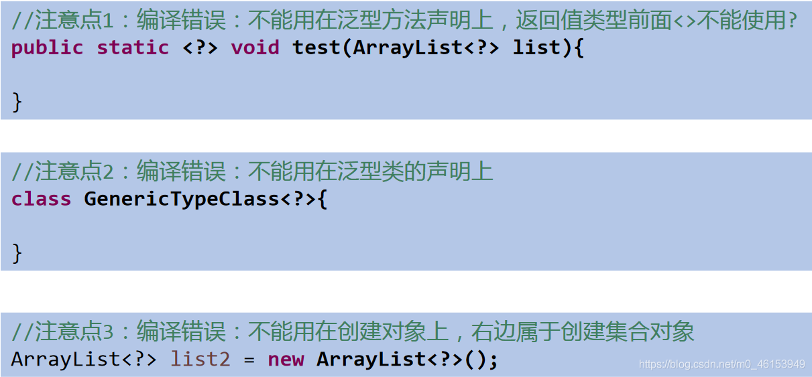
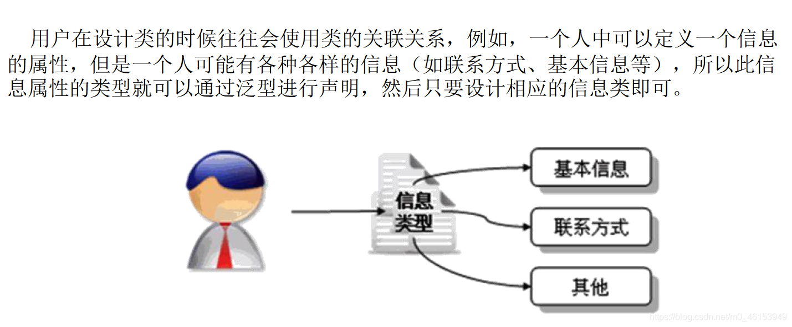

## 01、为什么要有泛型

泛型：标签

## 1.1、举例

* 中药店，每个抽屉外面贴着标签
* 超市购物架上很多瓶子，每个瓶子装的是什么，有标签。

## 1.2、泛型的设计背景

**集合** 容器类在设计阶段/声明阶段不能确定这个容器到底实际存的是什么类型的对象，所以 **在JDK1.5之前只能把元素类型设计为Object，JDK1.5之后使用泛型来解决** 。因为这个时候除了元素的类型不确定，其他的部分是确定的，例如关于这个元素如何保存，如何管理等是确定的，因此此时 **把元素的类型设计成一个参数，这个类型参数叫做泛型** 。Collection，List，ArrayList这个就是类型参数，即泛型。

## 1.3、其他说明

* 所谓泛型，就是允许在定义类、接口时通过一个标识表示类中某个属性的类型或者是某个方法的返回值及参数类型。这个类型参数将在使用时（例如，继承或实现这个接口，用这个类型声明变量、创建对象时）确定（即传入实际的类型参数，也称为类型实参）。
* 从JDK1.5以后，Java引入了“参数化类型（Parameterizedtype）”的概念，允许我们在创建集合时再指定集合元素的类型，正如：List，这表明该List只能保存字符串类型的对象。
* JDK1.5改写了集合框架中的全部接口和类，为这些接口、类增加了泛型支持，从而可以在声明集合变量、创建集合对象时传入类型实参。

## 1.3、那么为什么要有泛型呢

**那么为什么要有泛型呢，直接Object不是也可以存储数据吗？**

> **1、解决元素存储的安全性问题，好比商品、药品标签，不会弄错。2.解决获取数据元素时，需要类型强制转换的问题，好比不用每回拿商品、药品都要辨别。**
>


> **2、Java泛型可以保证如果程序在编译时没有发出警告，运行时就不会产生ClassCastException异常。同时，代码更加简洁、健壮。**
>

```java
import org.junit.Test;

import java.util.ArrayList;

/**
 * 泛型的使用
 * 1.jdk5.0新增的特征
 */
public class GenericTest { 

    //在集合中使用泛型之前的情况：
    @Test
    public void test(){ 
        ArrayList list = new ArrayList();
        //需求：存放学生的成绩
        list.add(78);
        list.add(49);
        list.add(72);
        list.add(81);
        list.add(89);
        //问题一：类型不安全
//        list.add("Tom");

        for(Object score : list){ 
            //问题二：强转时可能出现类型转化异常
            int stuScore = (Integer)score;

            System.out.println(stuScore);
        }

    }

}
123456789101112131415161718192021222324252627282930313233
```

## 02、在集合中使用泛型

> 注意点：泛型的类型必须是类，不能是基本数据类型。需要用到基本数据类型的位置，拿包装类替换
>

## 2.1、举例

```java
import org.junit.Test;

import java.util.*;

/**
 * 泛型的使用
 * 1.jdk5.0新增的特征
 *
 * 2.在集合中使用泛型：
 *  总结：
 *  ①集合接口或集合类在jdk5.0时都修改为带泛型的结构。
 *  ②在实例化集合类时，可以指明具体的泛型类型
 *  ③指明完以后，在集合类或接口中凡是定义类或接口时，内部结构（比如：方法、构造器、属性等）使用到类的泛型的位置，都指定为实例化的泛型类型。
 *    比如：add(E e)  --->实例化以后：add(Integer e)
 *  ④注意点：泛型的类型必须是类，不能是基本数据类型。需要用到基本数据类型的位置，拿包装类替换
 *  ⑤如果实例化时，没有指明泛型的类型。默认类型为java.lang.Object类型。
 *
 * 3.如何自定义泛型结构：泛型类、泛型接口；泛型方法。见 GenericTest1.java
 *
 */
public class GenericTest { 

    //在集合中使用泛型的情况：以HashMap为例
    @Test
    public void test3(){ 
//        Map<String,Integer> map = new HashMap<String,Integer>();
        //jdk7新特性：类型推断
        Map<String,Integer> map = new HashMap<>();

        map.put("Tom",87);
        map.put("Tone",81);
        map.put("Jack",64);

//        map.put(123,"ABC");

        //泛型的嵌套
        Set<Map.Entry<String,Integer>> entry = map.entrySet();
        Iterator<Map.Entry<String, Integer>> iterator = entry.iterator();

        while(iterator.hasNext()){ 
            Map.Entry<String, Integer> e = iterator.next();
            String key = e.getKey();
            Integer value = e.getValue();
            System.out.println(key + "----" + value);
        }
    }

    //在集合中使用泛型的情况：以ArrayList为例
    @Test
    public void test2(){ 
        ArrayList<Integer> list = new ArrayList<Integer>();

        list.add(78);
        list.add(49);
        list.add(72);
        list.add(81);
        list.add(89);
        //编译时，就会进行类型检查，保证数据的安全
//        list.add("Tom");

        //方式一：
//        for(Integer score :list){ 
//            //避免了强转的操作
//            int stuScore = score;
//
//            System.out.println(stuScore);
//        }

        //方式二：
        Iterator<Integer> iterator = list.iterator();
        while(iterator.hasNext()){ 
            int stuScore = iterator.next();
            System.out.println(stuScore);
        }
    }
}
12345678910111213141516171819202122232425262728293031323334353637383940414243444546474849505152535455565758596061626364656667686970717273747576
```

## 2.2、练习

> 练习1
>


> 1、MyDate类
>

```java
/**
 * MyDate类包含:
 * private成员变量year,month,day；并为每一个属性定义getter,  setter 方法；
 *
 */
public class MyDate implements Comparable<MyDate>{ 
    private int year;
    private int month;
    private int day;

    public int getYear() { 
        return year;
    }

    public void setYear(int year) { 
        this.year = year;
    }

    public int getMonth() { 
        return month;
    }

    public void setMonth(int month) { 
        this.month = month;
    }

    public int getDay() { 
        return day;
    }

    public void setDay(int day) { 
        this.day = day;
    }

    public MyDate() { 
    }

    public MyDate(int year, int month, int day) { 
        this.year = year;
        this.month = month;
        this.day = day;
    }

    @Override
    public String toString() { 
        return "MyDate{" +
                "year=" + year +
                ", month=" + month +
                ", day=" + day +
                '}';
    }

//    @Override
//    public int compareTo(Object o) { 
//        if(o instanceof MyDate){ 
//            MyDate m = (MyDate)o;
//
//            //比较年
//            int minusYear = this.getYear() - m.getYear();
//            if(minusYear != 0){ 
//                return minusYear;
//            }
//            //比较月
//            int minusMonth = this.getMonth() - m.getMonth();
//            if(minusMonth != 0){ 
//                return minusMonth;
//            }
//            //比较日
//            return this.getDay() - m.getDay();
//        }
//
//        throw new RuntimeException("传入的数据类型不一致！");
//
//    }

    @Override
    public int compareTo(MyDate m) { 
        //比较年
        int minusYear = this.getYear() - m.getYear();
        if(minusYear != 0){ 
            return minusYear;
        }
        //比较月
        int minusMonth = this.getMonth() - m.getMonth();
        if(minusMonth != 0){ 
            return minusMonth;
        }
        //比较日
        return this.getDay() - m.getDay();
    }
}
12345678910111213141516171819202122232425262728293031323334353637383940414243444546474849505152535455565758596061626364656667686970717273747576777879808182838485868788899091
```

> 2、Employee类
>

```java
/**
 * 定义一个Employee类。
 * 该类包含：private成员变量name,age,birthday，
 * 其中birthday 为MyDate 类的对象；
 * 并为每一个属性定义getter, setter 方法；
 * 并重写toString 方法输出name, age, birthday
 *
 */
public class Employee implements Comparable<Employee>{ 
    private String name;
    private int age;
    private MyDate birthday;

    public String getName() { 
        return name;
    }

    public void setName(String name) { 
        this.name = name;
    }

    public int getAge() { 
        return age;
    }

    public void setAge(int age) { 
        this.age = age;
    }

    public MyDate getBirthday() { 
        return birthday;
    }

    public void setBirthday(MyDate birthday) { 
        this.birthday = birthday;
    }

    public Employee() { 
    }

    public Employee(String name, int age, MyDate birthday) { 
        this.name = name;
        this.age = age;
        this.birthday = birthday;
    }

    @Override
    public String toString() { 
        return "Employee{" +
                "name='" + name + '\'' +
                ", age=" + age +
                ", birthday=" + birthday +
                '}';
    }

    //没有指明泛型时的写法
    //按name排序
//    @Override
//    public int compareTo(Object o){ 
//        if(o instanceof Employee){ 
//            Employee e = (Employee)o;
//            return this.name.compareTo(e.name);
//        }
        return 0;
//        throw new RuntimeException("传入的数据类型不一致");
//    }

    //指明泛型时的写法
    @Override
    public int compareTo(Employee o) { 
        return this.name.compareTo(o.name);
    }
}
12345678910111213141516171819202122232425262728293031323334353637383940414243444546474849505152535455565758596061626364656667686970717273
```

> 3、测试类
>

```java
import org.junit.Test;

import java.util.Comparator;
import java.util.Iterator;
import java.util.TreeSet;

/**
 * 创建该类的5 个对象，并把这些对象放入TreeSet 集合中
 * （下一章：TreeSet 需使用泛型来定义）分别按以下两种方式
 * 对集合中的元素进行排序，并遍历输出：
 *
 * 1). 使Employee 实现Comparable 接口，并按name 排序
 * 2). 创建TreeSet 时传入Comparator对象，按生日日期的先后排序。
 */
public class EmployeeTest { 

    //问题二：按生日日期的先后排序
    @Test
    public void test2(){ 
        TreeSet<Employee> set = new TreeSet<>(new Comparator<Employee>() { 
            //使用泛型以后的写法
            @Override
            public int compare(Employee o1, Employee o2) { 
                MyDate b1 = o1.getBirthday();
                MyDate b2 = o2.getBirthday();

                return b1.compareTo(b2);
            }
            //使用泛型之前的写法
            //@Override
//            public int compare(Object o1, Object o2) { 
//                if(o1 instanceof Employee && o2 instanceof Employee){ 
//                    Employee e1 = (Employee)o1;
//                    Employee e2 = (Employee)o2;
//
//                    MyDate b1 = e1.getBirthday();
//                    MyDate b2 = e2.getBirthday();
//                    //方式一：
                    //比较年
                    int minusYear = b1.getYear() - b2.getYear();
                    if(minusYear != 0){ 
                        return minusYear;
                    }
                    //比较月
                    int minusMonth = b1.getMonth() - b2.getMonth();
                    if(minusMonth != 0){ 
                        return minusMonth;
                    }
                    //比较日
                    return b1.getDay() - b2.getDay();
//
//                    //方式二：
//                    return b1.compareTo(b2);
//
//                }
                return 0;
//                throw new RuntimeException("传入的数据类型不一致！");
//            }
        });

        Employee e1 = new Employee("liudehua",55,new MyDate(1965,5,4));
        Employee e2 = new Employee("zhangxueyou",43,new MyDate(1987,5,4));
        Employee e3 = new Employee("guofucheng",44,new MyDate(1987,5,9));
        Employee e4 = new Employee("liming",51,new MyDate(1954,8,12));
        Employee e5 = new Employee("liangzhaowei",21,new MyDate(1978,12,4));

        set.add(e1);
        set.add(e2);
        set.add(e3);
        set.add(e4);
        set.add(e5);

        Iterator<Employee> iterator = set.iterator();
        while (iterator.hasNext()){ 
            System.out.println(iterator.next());
        }
    }

    //问题一：使用自然排序
    @Test
    public void test(){ 
        TreeSet<Employee> set = new TreeSet<Employee>();

        Employee e1 = new Employee("wangxianzhi",41,new MyDate(334,5,4));
        Employee e2 = new Employee("simaqian",43,new MyDate(-145,7,12));
        Employee e3 = new Employee("yanzhenqin",44,new MyDate(709,5,9));
        Employee e4 = new Employee("zhangqian",51,new MyDate(-179,8,12));
        Employee e5 = new Employee("quyuan",21,new MyDate(-340,12,4));

        set.add(e1);
        set.add(e2);
        set.add(e3);
        set.add(e4);
        set.add(e5);

        Iterator<Employee> iterator = set.iterator();
        while (iterator.hasNext()){ 
            Employee next = iterator.next();
            System.out.println(next);
        }
    }
}
123456789101112131415161718192021222324252627282930313233343536373839404142434445464748495051525354555657585960616263646566676869707172737475767778798081828384858687888990919293949596979899100101102
```

## 03、自定义泛型结构

## 3.1、自定义[泛型类](https://so.csdn.net/so/search?q=%E6%B3%9B%E5%9E%8B%E7%B1%BB&spm=1001.2101.3001.7020)举例

> 1、OrderTest类
>

```java
/**
 * 自定义泛型类
 *
 */
public class OrderTest<T> { 

    String orderName;
    int orderId;

    //类的内部结构就可以使用类的泛型
    T orderT;

    public OrderTest(){ 

    };

    public OrderTest(String orderName,int orderId,T orderT){ 
        this.orderName = orderName;
        this.orderId = orderId;
        this.orderT = orderT;
    }

    //如下的三个方法都不是泛型方法
    public T getOrderT(){ 
        return orderT;
    }

    public void setOrderT(T orderT){ 
        this.orderT = orderT;
    }

    @Override
    public String toString() { 
        return "Order{" +
                "orderName='" + orderName + '\'' +
                ", orderId=" + orderId +
                ", orderT=" + orderT +
                '}';
    }
  
    //泛型方法：在方法中出现了泛型的结构，泛型参数与类的泛型参数没有任何关系。
    //换句话说，泛型方法所属的类是不是泛型类都没有关系。
    //泛型方法，可以声明为静态的。原因：泛型参数是在调用方法时确定的。并非在实例化类时确定。
    public static <E>  List<E> copyFromArrayToList(E[] arr){ 

        ArrayList<E> list = new ArrayList<>();

        for(E e : arr){ 
            list.add(e);
        }
        return list;

    }
}
123456789101112131415161718192021222324252627282930313233343536373839404142434445464748495051525354
```

> 2、SubOrder类
>

```java
public class SubOrder extends OrderTest<Integer>{    //SubOrder:不是泛型类
}
12
```

> 3、SubOrder1类
>

```java
public class SubOrder1<T> extends OrderTest<T> { //SubOrder1<T>:仍然是泛型类
}
12
```

> 4、GenericTest1类
>

```java
import org.junit.Test;

/**
 * 如何自定义泛型结构：泛型类、泛型接口；泛型方法。
 *
 * 1.关于自定义泛型类、泛型接口：
 */
public class GenericTest1 { 

    @Test
    public void test(){ 
        /**
         * 如果定义了泛型类，实例化没有指明类的泛型，则认为此泛型类型为Object类型
         * 要求：如果大家定义了类是带泛型的，建议在实例化时要指明类的泛型。
         */
        OrderTest order = new OrderTest();
        order.setOrderT(123);
        order.setOrderT("ABC");

        //建议：实例化时指明类的泛型
        OrderTest<String> order1 = new OrderTest<String>("orderAA",1001,"order:AA");

        order1.setOrderT("AA:hello");
    }

    @Test
    public void test2(){ 
        SubOrder sub1 = new SubOrder();
        //由于子类在继承带泛型的父类时，指明了泛型类型。则实例化子类对象时，不再需要指明泛型。
        sub1.setOrderT(1122);

        SubOrder1<String> sub2 = new SubOrder1<>();
        sub2.setOrderT("order2...");
    }
}
1234567891011121314151617181920212223242526272829303132333435
```

## 3.2、自定义泛型类泛型接口的注意点

**注意点：**

1. **泛型类可能有多个参数，此时应将多个参数一起放在尖括号内。比如：<E1,E2,E3>**
2. 泛型类的构造器如下：public GenericClass(){}。而下面是错误的：public GenericClass(){}
3. 实例化后，操作原来泛型位置的结构必须与指定的泛型类型一致。
4. 泛型不同的引用不能相互赋值。尽管在编译时ArrayList和ArrayList是两种类型，但是，在运行时只有一个ArrayList被加载到JVM中。
5. 泛型如果不指定，将被擦除，泛型对应的类型均按照Object处理，但不等价于Object。  
    经验：泛型要使用一路都用。要不用，一路都不要用。
6. 如果泛型结构是一个接口或抽象类，则不可创建泛型类的对象。
7. jdk1.7，泛型的简化操作：ArrayList flist = new ArrayList<>();
8. **泛型的指定中不能使用基本数据类型，可以使用包装类替换。**
9. **在类/接口上声明的泛型，在本类或本接口中即代表某种类型，可以作为非静态属性的类型、非静态方法的参数类型、非静态方法的返回值类型。但在静态方法中不能使用类的泛型。**
10. **异常类不能是泛型的**

     ```java
     //异常类不能声明为泛型类
     //public class MyException<T> extends Exception{ 
     //}
     123
     ```

**代码演示：**

不能使用`new E[]`。但是可以：`E[] elements = (E[])new Object[capacity]`;参考：ArrayList源码中声明：Object[] elementData，而非泛型参数类型数组。

> 1、Person类
>

```java
public class Person { 
}
12
```

> 2、OrderTest类
>

```java
/**
 * 自定义泛型类
 */
public class OrderTest<T> { 

    String orderName;
    int orderId;

    //类的内部结构就可以使用类的泛型
    T orderT;

    public OrderTest(){ 
        //编译不通过
//        T[] arr = new T[10];
        //编译通过
        T[] arr = (T[]) new Object[10];
    };

    public OrderTest(String orderName,int orderId,T orderT){ 
        this.orderName = orderName;
        this.orderId = orderId;
        this.orderT = orderT;
    }

    public T getOrderT(){ 
        return orderT;
    }

    public void setOrderT(T orderT){ 
        this.orderT = orderT;
    }

    @Override
    public String toString() { 
        return "Order{" +
                "orderName='" + orderName + '\'' +
                ", orderId=" + orderId +
                ", orderT=" + orderT +
                '}';
    }

    //静态方法中不能使用类的泛型。
//    public static void show(T orderT){ 
//        System.out.println(orderT);
//    }

    public void show(){ 
        //编译不通过
//        try{ 
//
//
//        }catch(T t){ 
//
//        }
    }
}
1234567891011121314151617181920212223242526272829303132333435363738394041424344454647484950515253545556
```

> 3、GenericTest1类
>

```java
import org.junit.Test;

import java.util.ArrayList;

/**
 * 如何自定义泛型结构：泛型类、泛型接口；泛型方法。
 *
 * 1.关于自定义泛型类、泛型接口：
 *
 */
public class GenericTest1 { 

    @Test
    public void test3(){ 
        ArrayList<String> list1 = null;
        ArrayList<Integer> list2 = new ArrayList<Integer>();
        //泛型不同的引用不能相互赋值。
        //list1 = list2;

        Person p1 = null;
        Person p2 = null;
        p1 = p2;
    }
}
123456789101112131415161718192021222324
```

> 4、在继承中使用泛型
>

1. 父类有泛型，子类可以选择保留泛型也可以选择指定泛型类型：

    * 子类不保留父类的泛型：按需实现

      * 没有类型擦除
      * 具体类型
    * 子类保留父类的泛型：泛型子类

      * 全部保留
      * 部分保留

```java
class Father<T1, T2> { }
// 子类不保留父类的泛型
// 1)没有类型擦除
class Son1 extends Father { // 等价于class Son extends Father<Object,Object>{}
}
// 2)具体类型
class Son2 extends Father<Integer, String> { }
// 子类保留父类的泛型
// 1)全部保留
class Son3<T1, T2> extends Father<T1, T2> { }
// 2)部分保留
class Son4<T2> extends Father<Integer, T2> { }
123456789101112
```

**结论：子类必须是“富二代”，子类除了指定或保留父类的泛型，还可以增加自己的泛型。**

## 3.3、自定义泛型方法举例

**说明：**

* 方法，也可以被泛型化，不管此时定义在其中的类是不是泛型类。在泛型方法中可以定义泛型参数，此时，参数的类型就是传入数据的类型。
* 泛型方法的格式：

  ```
  [访问权限] <泛型> 返回类型  方法名([泛型标识参数名称]) 抛出的异常
  如：public static <E>  List<E> copyFromArrayToList(E[] arr)　throws  Exception{  }
  12
  ```

**代码演示：**

> 1、OrderTest类
>

```java
import java.util.ArrayList;
import java.util.List;

/**
 * 自定义泛型类
 */
public class OrderTest<T> { 

    /**
     * 泛型方法：在方法中出现了泛型的结构，泛型参数与类的泛型参数没有任何关系。
     * 换句话说，泛型方法所属的类是不是泛型类都没有关系。
     * 泛型方法，可以声明为静态的。原因：泛型参数是在调用方法时确定的。并非在实例化类时确定。
     */
    public static <E> List<E> copyFromArrayToList(E[] arr){ 

        ArrayList<E> list = new ArrayList<>();

        for(E e : arr){ 
            list.add(e);
        }
        return list;

    }
}
123456789101112131415161718192021222324
```

> 2、测试类
>

```java
import org.junit.Test;

import java.util.ArrayList;
import java.util.List;

/**
 * 如何自定义泛型结构：泛型类、泛型接口；泛型方法。
 *
 * 1.关于自定义泛型类、泛型接口：
 *
 */
public class GenericTest1 { 

    //测试泛型方法
    @Test
    public void test4(){ 
        OrderTest<String> order = new OrderTest<>();
        Integer[] arr = new Integer[]{ 1,2,3,4};
        //泛型方法在调用时，指明泛型参数的类型。
        List<Integer> list = order.copyFromArrayToList(arr);

        System.out.println(list);
    }
}
123456789101112131415161718192021222324
```

> 3、SubOrder类
>

```java
import java.util.ArrayList;
import java.util.List;

public class SubOrder extends OrderTest<Integer>{    //SubOrder:不是泛型类
  
    public static <E> List<E> copyFromArrayToList(E[] arr){ //静态的泛型方法

        ArrayList<E> list = new ArrayList<>();

        for(E e : arr){ 
            list.add(e);
        }
        return list;

    }
}
12345678910111213141516
```

## 3.4、举例泛型类和泛型方法的使用情境

> 1、DAO类
>

```java
import java.util.List;

public class DAO<T> {  //表的共性操作的DAO

    //添加一条记录
    public void add(T t){ 

    }

    //删除一条记录
    public boolean remove(int index){ 

        return false;
    }

    //修改一条记录
    public void update(int index,T t){ 

    }

    //查询一条记录
    public T getIndex(int index){ 

        return null;
    }

    //查询多条记录
    public List<T> getForList(int index){ 

        return null;
    }

    //泛型方法
    //举例：获取表中一共有多少条记录？获取最大的员工入职时间？
    public <E> E getValue(){ 

        return null;
    }

}
12345678910111213141516171819202122232425262728293031323334353637383940
```

> 2、Customer类
>

```java
public class Customer {  //此类对应数据库中的customers表
}
12
```

> 3、CustomerDAO类
>

```java
public class CustomerDAO extends DAO<Customer>{ //只能操作某一个表的DAO
}
12
```

> 4、Student类
>

```java
public class Student { 
}
12
```

> 5、StudentDAO类
>

```java
public class StudentDAO extends DAO<Student> { //只能操作某一个表的DAO
}
12
```

> 6、DAOTest类
>

```java
import org.junit.Test;

import java.util.List;

public class DAOTest { 

    @Test
    public void test(){ 
        CustomerDAO dao1 = new CustomerDAO();

        dao1.add(new Customer());
        List<Customer> list = dao1.getForList(10);


        StudentDAO dao2 = new StudentDAO();
        Student student = dao2.getIndex(1);
    }

}
12345678910111213141516171819
```

## 04、泛型在继承上的体现【通配符】

```java
import org.junit.Test;

import java.util.AbstractList;
import java.util.ArrayList;
import java.util.List;

/**
 * 1.泛型在继承方面的体现
 *
 * 2.通配符的使用
 *
 */
public class GenericTest { 

    /**
     * 1.泛型在继承方面的体现
     * 虽然类A是类B的父类，但是G<A> 和G<B>二者不具备子父类关系，二者是并列关系。
     * 补充：类A是类B的父类，A<G> 是 B<G> 的父类
     */
    @Test
    public void test(){ 

        Object obj = null;
        String str = null;
        obj = str;

        Object[] arr1 = null;
        String[] arr2 = null;
        arr1 = arr2;
        //编译不通过
//        Date date = new Date();
//        str = date;
        List<Object> list1 = null;
        List<String> list2 = new ArrayList<String>();
        //此时的list1和list2的类型不具有子父类关系
        //编译不通过
//        list1 = list2;
        /**
         * 反证法：
         *   假设list1 = list2;
         *      list1.add(123);导致混入非String的数据。出错。
         */
        show(list1);
        show2(list2);
    }

    public void show2(List<String> list){ 

    }

    public void show(List<Object> list){ 

    }

    @Test
    public void test2(){ 
        AbstractList<String> list1 = null;
        List<String> list2 = null;
        ArrayList<String> list3 = null;

        list1 = list3;
        list2 = list3;

        List<String> list4 = new ArrayList<>();
    }

}
12345678910111213141516171819202122232425262728293031323334353637383940414243444546474849505152535455565758596061626364656667
```

## 05、通配符的使用

**说明：**

1. 使用类型  
    通配符：？

    1. 比如：List<?> ，Map<?,?>
    2. List<?>是List、List等各种泛型List的父类。
2. 读取List<?>的对象list中的元素时，永远是安全的，因为不管list的真实类型是什么，它包含的都是Object。
3. 写入list中的元素时，不行。因为我们不知道c的元素类型，我们不能向其中添加对象。

    * **唯一的例外是null，它是所有类型的成员。**
    * 将任意元素加入到其中不是类型安全的：

      ```java
      - Collection<?> c = new ArrayList();
      - c.add(new Object()); // 编译时错误因为我们不知道c的元素类型，我们不能向其中添加对象。add方法有类型参数E作为集合的元素类型。我们传给add的任何参数都必须是一个未知类型的子类。因为我们不知道那是什么类型，所以我们无法传任何东西进去。
      12
      ```
4. **另一方面，我们可以调用get()方法并使用其返回值。返回值是一个未知的类型，但是我们知道，它总是一个Object** 。

**代码演示：**

```java
import org.junit.Test;

import java.util.AbstractList;
import java.util.ArrayList;
import java.util.Iterator;
import java.util.List;

/**
 * 1.泛型在继承方面的体现
 * 2.通配符的使用
 */
public class GenericTest { 

    /**
     * 2.通配符的使用
     * 通配符：？
     *
     * 类A是类B的父类，G<A>和G<B>是没有关系的，二者共同的父类是：G<?>
     */
    @Test
    public void test3(){ 
        List<Object> list1 = null;
        List<String> list2 = null;

        List<?> list = null;

        list = list1;
        list = list2;

        //编译通过
        print(list1);
        print(list2);
    }

    public void print(List<?> list){ 
        Iterator<?> iterator = list.iterator();
        while(iterator.hasNext()){ 
            Object obj = iterator.next();
            System.out.println(obj);
        }
    }
}
123456789101112131415161718192021222324252627282930313233343536373839404142
```

## 5.1、使用通配符后数据的读取和写入要求



```java
import org.junit.Test;

import java.util.AbstractList;
import java.util.ArrayList;
import java.util.Iterator;
import java.util.List;

/**
 * 1.泛型在继承方面的体现
 *
 * 2.通配符的使用
 */
public class GenericTest { 

    /**
     * 2.通配符的使用
     * 通配符：？
     *
     * 类A是类B的父类，G<A>和G<B>是没有关系的，二者共同的父类是：G<?>
     */
    @Test
    public void test3(){ 
        List<Object> list1 = null;
        List<String> list2 = null;

        List<?> list = null;

        list = list1;
        list = list2;

        //编译通过
//        print(list1);
//        print(list2);

        List<String> list3 = new ArrayList<>();
        list3.add("AA");
        list3.add("BB");
        list3.add("CC");
        list = list3;
        //添加(写入)：对于List<?>就不能向其内部添加数据。
        //除了添加null之外。
//        list.add("DD");
//        list.add('?');

        list.add(null);

        //获取(读取)：允许读取数据，读取的数据类型为Object。
        Object o = list.get(0);
        System.out.println(o);
    }
}
123456789101112131415161718192021222324252627282930313233343536373839404142434445464748495051
```

## 5.2、有限制条件的通配符的使用

**说明：**

* <?> 允许所有泛型的引用调用
* 通配符指定上限上限  
  extends：使用时指定的类型必须是继承某个类，或者实现某个接口，即<=
* 通配符指定下限  
  下限super：使用时指定的类型不能小于操作的类，即>=
* 举例：

  * <?extends Number> (无穷小, Number] 只允许泛型为Number及Number子类的引用调用
  * <? super Number> [Number , 无穷大) 只允许泛型为Number及Number父类的引用调用
  * <? extends Comparable> 只允许泛型为实现Comparable接口的实现类的引用调用

**代码演示：**

> 1、Person类
>

```java
public class Person { 
}
12
```

> 2、Student类
>

```java
public class Student extends Person{ 
}
12
```

> 3、测试类
>

```java
import org.junit.Test;

import java.util.AbstractList;
import java.util.ArrayList;
import java.util.Iterator;
import java.util.List;

/**
 * 1.泛型在继承方面的体现
 *
 * 2.通配符的使用
 */
public class GenericTest { 

    /**
     * 3.有限制条件的通配符的使用。
     *
     * ? extends A:
     *      G<? extends A> 可以作为G<A>和G<B>的父类，其中B是A的子类
     *
     * ? super A:
     *      G<? super A> 可以作为G<A>和G<B>的父类，其中B是A的父类
     */
    @Test
    public void test4(){ 
        List<? extends Person> list1 = null;
        List<? super Person> list2 = null;

//        List<Student> list3 = null;
//        List<Student> list4 = null;
//        List<Student> list5 = null;

        List<Student> list3 = new ArrayList<Student>();
        List<Person> list4 = new ArrayList<Person>();
        List<Object> list5 = new ArrayList<Object>();

        list1 = list3;
        list1 = list4;
//        list1 = list5;

//        list2 = list3;
        list2 = list4;
        list2 = list5;

        //读取数据：
        list1 = list3;
        Person p = list1.get(0);
        //编译不通过
        //Student s = list1.get(0);

        list2 = list4;
        Object obj = list2.get(0);
        编译不通过
//        Person obj = list2.get(0);

        //写入数据：
        //编译不通过
//        list1.add(new Student());

        //编译通过
        list2.add(new Person());
        list2.add(new Student());
    }

}
1234567891011121314151617181920212223242526272829303132333435363738394041424344454647484950515253545556575859606162636465
```

## 06、泛型应用举例

## 6.1、泛型[嵌套](https://so.csdn.net/so/search?q=%E5%B5%8C%E5%A5%97&spm=1001.2101.3001.7020)

```java
public static void main(String[] args) { 
        HashMap<String, ArrayList<Citizen>> map= new HashMap<String, ArrayList<Citizen>>();
        ArrayList<Citizen> list= new ArrayList<Citizen>();
        list.add(new Citizen("刘恺威"));
        list.add(new Citizen("杨幂"));
        list.add(new Citizen("小糯米"));
        map.put("刘恺威", list);
        Set<Entry<String, ArrayList<Citizen>>> entrySet= map.entrySet();
        Iterator<Entry<String, ArrayList<Citizen>>> iterator= entrySet.iterator();
        while(iterator.hasNext()) { 
            Entry<String, ArrayList<Citizen>> entry= iterator.next();
            String key= entry.getKey();
            ArrayList<Citizen> value= entry.getValue();
            System.out.println("户主："+ key);
            System.out.println("家庭成员："+ value);
        }
    }
1234567891011121314151617
```

## 6.2、实际案例



```java
interface Info{ 		// 只有此接口的子类才是表示人的信息
}
class Contact implements Info{ 	// 表示联系方式
	private String address ;	// 联系地址
	private String telephone ;	// 联系方式
	private String zipcode ;	// 邮政编码
	public Contact(String address,String telephone,String zipcode){ 
		this.address = address;
		this.telephone = telephone;
		this.zipcode = zipcode;
	}
	public void setAddress(String address){ 
		this.address = address ;
	}
	public void setTelephone(String telephone){ 
		this.telephone = telephone ;
	}
	public void setZipcode(String zipcode){ 
		this.zipcode = zipcode;
	}
	public String getAddress(){ 
		return this.address ;
	}
	public String getTelephone(){ 
		return this.telephone ;
	}
	public String getZipcode(){ 
		return this.zipcode;
	}
	@Override
	public String toString() { 
		return "Contact [address=" + address + ", telephone=" + telephone
				+ ", zipcode=" + zipcode + "]";
	}
}
class Introduction implements Info{ 
	private String name ;		// 姓名
	private String sex ;		// 性别
	private int age ;			// 年龄
	public Introduction(String name,String sex,int age){ 
		this.name = name;
		this.sex = sex;
		this.age = age;
	}
	public void setName(String name){ 
		this.name = name ;
	}
	public void setSex(String sex){ 
		this.sex = sex ;
	}
	public void setAge(int age){ 
		this.age = age ;
	}
	public String getName(){ 
		return this.name ;
	}
	public String getSex(){ 
		return this.sex ;
	}
	public int getAge(){ 
		return this.age ;
	}
	@Override
	public String toString() { 
		return "Introduction [name=" + name + ", sex=" + sex + ", age=" + age
				+ "]";
	}
}
class Person<T extends Info>{ 
	private T info ;
	public Person(T info){ 		// 通过构造器设置信息属性内容
		this.info = info;
	}
	public void setInfo(T info){ 
		this.info = info ;
	}
	public T getInfo(){ 
		return info ;
	}
	@Override
	public String toString() { 
		return "Person [info=" + info + "]";
	}

}
public class GenericPerson{ 
	public static void main(String args[]){ 
		Person<Contact> per = null ;		// 声明Person对象
		per = new Person<Contact>(new Contact("北京市","01088888888","102206")) ;
		System.out.println(per);
	
		Person<Introduction> per2 = null ;		// 声明Person对象
		per2 = new Person<Introduction>(new Introduction("李雷","男",24));
		System.out.println(per2) ;
	}
}
123456789101112131415161718192021222324252627282930313233343536373839404142434445464748495051525354555657585960616263646566676869707172737475767778798081828384858687888990919293949596
```

## 07、自定义泛型类练习


**代码演示：**

> 1、泛型类DAO
>

```java
import java.util.*;

/**
 * 定义个泛型类 DAO<T>，在其中定义一个Map 成员变量，Map 的键为 String 类型，值为 T 类型。
 *
 * 分别创建以下方法：
 * public void save(String id,T entity)： 保存 T 类型的对象到 Map 成员变量中
 * public T get(String id)：从 map 中获取 id 对应的对象
 * public void update(String id,T entity)：替换 map 中key为id的内容,改为 entity 对象
 * public List<T> list()：返回 map 中存放的所有 T 对象
 * public void delete(String id)：删除指定 id 对象
 */
public class DAO<T> { 
    private Map<String,T> map = new HashMap<String,T>();
    //保存 T 类型的对象到 Map 成员变量中
    public void save(String id,T entity){ 
        map.put(id,entity);
    }
    //从 map 中获取 id 对应的对象
    public T get(String id){ 
        return map.get(id);
    }
    //替换 map 中key为id的内容,改为 entity 对象
    public void update(String id,T entity){ 
        if(map.containsKey(id)){ 
            map.put(id,entity);
        }
    }
    //返回 map 中存放的所有 T 对象
    public List<T> list(){ 
        //错误的：
//        Collection<T> values = map.values();
//        return (List<T>) values;
        //正确的：
        ArrayList<T> list = new ArrayList<>();
        Collection<T> values = map.values();
        for(T t : values){ 
            list.add(t);
        }
        return list;

    }
    //删除指定 id 对象
    public void delete(String id){ 
        map.remove(id);
    }
}
1234567891011121314151617181920212223242526272829303132333435363738394041424344454647
```

> 2、User类
>

```java
/**
 * 定义一个 User 类：
 * 该类包含：private成员变量（int类型） id，age；（String 类型）name。
 */
public class User { 
    private int id;
    private int age;
    private String name;

    public int getId() { 
        return id;
    }

    public void setId(int id) { 
        this.id = id;
    }

    public int getAge() { 
        return age;
    }

    public void setAge(int age) { 
        this.age = age;
    }

    public String getName() { 
        return name;
    }

    public void setName(String name) { 
        this.name = name;
    }

    public User(int id, int age, String name) { 

        this.id = id;
        this.age = age;
        this.name = name;
    }

    public User() { 

    }

    @Override
    public String toString() { 
        return "User{" +
                "id=" + id +
                ", age=" + age +
                ", name='" + name + '\'' +
                '}';
    }

    @Override
    public boolean equals(Object o) { 
        if (this == o) return true;
        if (o == null || getClass() != o.getClass()) return false;

        User user = (User) o;

        if (id != user.id) return false;
        if (age != user.age) return false;
        return name != null ? name.equals(user.name) : user.name == null;
    }

    @Override
    public int hashCode() { 
        int result = id;
        result = 31 * result + age;
        result = 31 * result + (name != null ? name.hashCode() : 0);
        return result;
    }
}
12345678910111213141516171819202122232425262728293031323334353637383940414243444546474849505152535455565758596061626364656667686970717273
```

> 3、测试类
>

```java
import java.util.List;

/**
 * 创建 DAO 类的对象， 分别调用其 save、get、update、list、delete
 * 方法来操作 User 对象，使用 Junit 单元测试类进行测试。
 */
public class DAOTest { 
    public static void main(String[] args) { 
        DAO<User> dao = new DAO<User>();

        dao.save("1001",new User(1001,34,"周杰伦"));
        dao.save("1002",new User(1002,20,"昆凌"));
        dao.save("1003",new User(1003,25,"蔡依林"));

        dao.update("1003",new User(1003,30,"方文山"));

        dao.delete("1002");

        List<User> list = dao.list();
//        System.out.println(list);
        list.forEach(System.out::println);
    }
}
1234567891011121314151617181920212223
```

> 作者做笔记不容易，请评个分吧！
>

* 1、如果觉得文章写行不错就点个  **赞** 。✌
* 2、如果觉得写得好就  **一键三连** ！✌✌✌
* 3、如果文章对你很有帮助，请  **打赏** 。 💃💃💃💃💃
