## 01、 数组的概述

```java
/*
 * 一、数组的概述
 * 1.数组的理解：数组(Array)，是多个相同类型数据按一定顺序排列的集合，
 * 并使用一个名字命名，并通过编号的方式对这些数据进行统一管理。
 * 
 * 2.数组的相关概念：
 * >数组名
 * >元素
 * >角标、下标、索引
 * >数组的长度：元素的个数
 * 
 * 3.数组的特点：
 * 1)数组属于引用类型的变量。数组的元素，既可以是基本数据类型，也可以是引用数据类型。
 * 2)创建数组对象会在内存中开辟一整块连续的空间；
 * 3)数组的长度一旦确定，就不能修改;
 * 4)数组是有序排列的。
 * 
 * 4.数组的分类：
 * 	① 按照维数：一维数组、二维数组、三维数组……
 *  ② 按照数组元素类型：基本数据类型元素的数组、引用类型元素的数组
 *  
 */
12345678910111213141516171819202122
```

## 02、 一维数组的使用

```java
/*
 * 	① 一维数组的声明和初始化
 *  ② 如何调用数组的指定位置的元素
 *  ③ 如何获取数组的长度
 *  ④ 如何遍历数组
 *  ⑤ 数组元素的默认初始化值：见ArrayTest1.java
 *  ⑥ 数组的内存解析：见ArrayTest1.java
 */
12345678
```

> 1、代码案例1——ArrayTest.java
>

```java
public class ArrayTest { 
	public static void main(String[] args) { 
	
		//1. 一维数组的声明和初始化
		int num;	//声明
		num = 10;	//初始化
		int id = 1001;	//声明 + 初始化
	
		int[] ids;	//声明
		//1.1静态初始化:数组的初始化和数组元素的赋值操作同时进行
		ids = new int[]{ 1001,1002,1003,1004};
		//1.2动态初始化:数组的初始化和数组元素的赋值操作分开进行
		String[] names = new String[5]; 
	
		//错误的写法：
//		int[] arr1 = new int[];	//未赋值、未指明长度
//		int[5] arr2 = new int[5];
//		int[] arr3 = new int[3]{1,2,3};
	
		//也是正确的写法：
		int[] arr7 = { 1,2,3,5,4};//类型推断
	
		/*总结：数组一旦初始化完成，其长度就确定了。
		*/
	
		//2.如何调用数组的指定位置的元素：通过角标的方式调用。
		//数组的角标(或索引)从0开始的，到数组的长度-1结束
		names[0] = "张郃";
		names[1] = "王陵";
		names[2] = "张学良";
		names[3] = "王传志";	//charAt(0)
		names[4] = "李峰";
//		names[5] = "周礼";	//如果数组超过角标会通过编译，运行失败。
	
		//3.如何获取数组的长度
		//属性：length
		System.out.println(names.length);	//5
		System.out.println(ids.length);	//4
	
		//4.如何遍历数组
//		System.out.println(names[0]);
//		System.out.println(names[1]);
//		System.out.println(names[2]);
//		System.out.println(names[3]);
//		System.out.println(names[4]);
	
		for(int i = 0;i < names.length;i++){ 
			System.out.println(names[i]);
		}
	
	}
}
12345678910111213141516171819202122232425262728293031323334353637383940414243444546474849505152
```

> 2、代码案例2——ArrayTest1.java
>

```java
/*
 * ⑤ 数组元素的默认初始化值
 * 		> 数组元素是整形：0
 * 		> 数组元素是浮点型：0.0
 * 		> 数组元素是char型：0或'\u0000'，而非'0'
 * 		> 数组元素是boolean型:false
 * 
 * 		> 数组元素是引用数据类型：null 
 */
public class ArrayTest1 { 
	public static void main(String[] args) { 
		//5.数组元素的默认初始化值
		int[] arr = new int[4];
		for(int i = 0;i < arr.length;i++){ 
			System.out.println(arr[i]);
		}
		System.out.println("*****************");
	
		short[] arr1 = new short[4];
		for(int i = 0;i < arr1.length;i++){ 
			System.out.println(arr1[i]);
		}
		System.out.println("*****************");
	
		float[] arr2 = new float[5]; 
		for(int i = 0;i < arr2.length;i++){ 
			System.out.println(arr2[i]);
		}
		System.out.println("*****************");
	
		char[] arr3 = new char[5]; 
		for(int i = 0;i < arr3.length;i++){ 
			System.out.println("----" + arr3[i] + "****");
		}
	
		if(arr3[0] == 0){ 
			System.out.println("你好！");
		}
		System.out.println("*****************");
	
		boolean[] arr4 = new boolean[5];
		System.out.println(arr4[0]);
	
		System.out.println("*****************");
		String[] arr5 = new String[5];
		System.out.println(arr5[0]);
		//验证
		if(arr5[0] == null){ 
			System.out.println("北京天气好差！");
		}
	
	}
}
1234567891011121314151617181920212223242526272829303132333435363738394041424344454647484950515253
```

## 2.1、[内存](https://so.csdn.net/so/search?q=%E5%86%85%E5%AD%98&spm=1001.2101.3001.7020)的简化结构

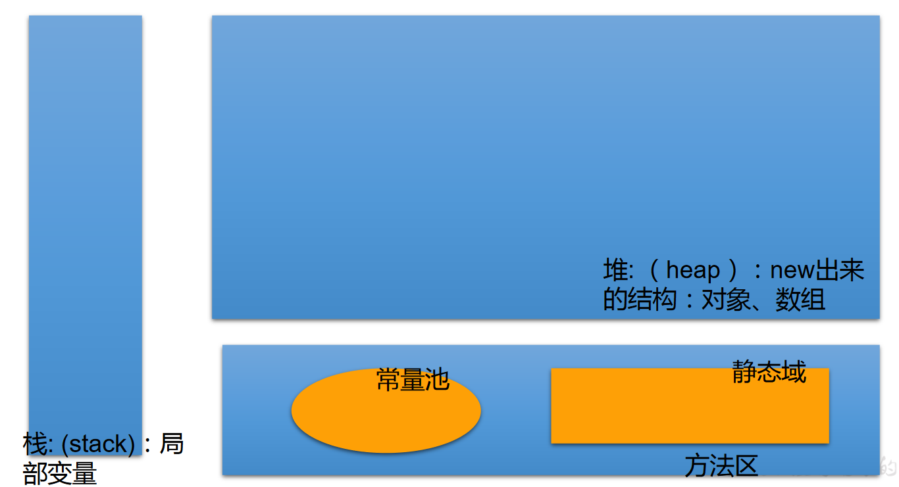

## 2.2、一维数组的内存解析

```java
int[] arr = new int[]{ 1,2,3};
String[] arr1 = new String[4];
arr1[1] = “刘德华”;
arr1[2] = “张学友”;
arr1 = new String[3];
System.out.println(arr1[1]);//null
123456
```

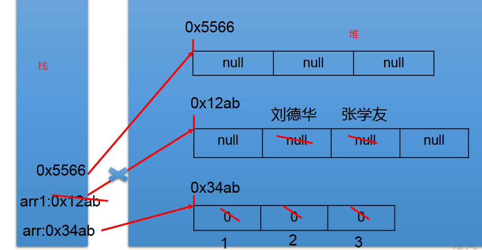

> 按照图中步骤，最后数组内存解析完成，数组内部值为null。
>

## 2.3、练习1

```java
/*
 * 升景坊单间短期出租4个月，550元/月（水电煤公摊，网费35元/月），空调、卫生间、厨房齐全。
 * 屋内均是IT行业人士，喜欢安静。所以要求来租者最好是同行或者刚毕业的年轻人，爱干净、安静。
 * eclipse代码一键格式规范化：Ctrl+Shift+F
 */
public class ArrayDemo { 
	public static void main(String[] args) { 
		int[] arr = new int[] {  8, 2, 1, 0, 3 };
		int[] index = new int[] {  2, 0, 3, 2, 4, 0, 1, 3, 2, 3, 3 };
		String tel = "";
		for (int i = 0; i < index.length; i++) { 
			tel += arr[index[i]];
		}
		System.out.println("联系方式：" + tel);
	}
}
12345678910111213141516
```

> 1、练习2
>

```java
/*
 * 2. 从键盘读入学生成绩，找出最高分，并输出学生成绩等级。
 * 成绩>=最高分-10    等级为’A’   
 * 成绩>=最高分-20    等级为’B’
 * 成绩>=最高分-30    等级为’C’   
 * 其余等级为’D’
 * 提示：先读入学生人数，根据人数创建int数组，存放学生成绩。
 */
import java.util.Scanner;
public class ArrayDemo2 { 
	public static void main(String[] args) { 
		//1.使用Scanner，读取学生的个数
		Scanner scan = new Scanner(System.in);
		System.out.print("请输入学生人数：");
		int num = scan.nextInt();
	
		//2.创建数组，存储学生成绩，动态初始化
		int[] str = new int[num];
		System.out.println("请输入" + num + "个学生成绩");
			
		//3.给数组中的元素赋值
		int maxnum = 0;
		for(int i = 0;i < str.length;i++){ 
			str[i] = scan.nextInt();
			//4.获取数组元素中的最大值：最高分
			if(maxnum < str[i]){ 
				maxnum = str[i];
			}
		}
	
		//5.根据每个学生成绩与最高分的差值，得到每个学生的等级，并输出等级和成绩
		char Grade;	//成绩等级
		for(int i = 0;i < str.length;i++){ 
			if(maxnum - str[i] <= 10){ 
				Grade = 'A';
			}else if(maxnum - str[i] <= 20){ 
				Grade = 'B';
			}else if(maxnum - str[i] <= 30){ 
				Grade = 'C';
			}else{ 
				Grade = 'D';
			}
		
			System.out.println("student " + i + "score is" + str[i] + 
					" grade is " + Grade);
		}
	}
}
123456789101112131415161718192021222324252627282930313233343536373839404142434445464748
```

## 03、 [多维数组](https://so.csdn.net/so/search?q=%E5%A4%9A%E7%BB%B4%E6%95%B0%E7%BB%84&spm=1001.2101.3001.7020)的使用

Java 语言里提供了支持多维数组的语法。

> 如果说可以把一维数组当成几何中的线性图形，那么[二维数组](https://so.csdn.net/so/search?q=%E4%BA%8C%E7%BB%B4%E6%95%B0%E7%BB%84&spm=1001.2101.3001.7020)就相当于是一个表格，像下图Excel中的表格一样。
>

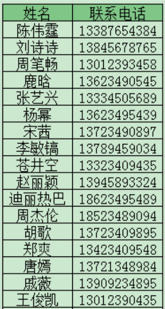

## 3.1、二位数组

> 1、代码案例——ArrayTest2.java
>

```java
/*
 * 二维数组的使用
 * 
 * 1.理解
 * 对于二维数组的理解，我们可以看成是一维数组array1又作为另一个一维数组array2的元素而存在。
 * 其实，从数组底层的运行机制来看，其实没有多维数组。
 * 
 * 2.二维数组的使用：
 * 	① 二维数组的初始化
 *  ② 如何调用数组的指定位置的元素
 *  ③ 如何获取数组的长度
 *  ④ 如何遍历数组
 *  ⑤ 数组元素的默认初始化值:见ArrayTest3.java
 *  ⑥ 数组的内存解析:见ArrayTest3.java
 * 
 */
public class ArrayTest2 { 
	public static void main(String[] args) { 
		//1.二维数组的声明和初始化
		int[] arr = new int[]{ 1,2,3};
		//静态初始化
		int[][] arr1 = new int[][]{ { 1,2,3},{ 4,5,6},{ 7,8,9}};
		//动态初始化1
		String[][] arr2 = new String[3][2];
		//动态初始化2
		String[][] arr3 = new String[3][];
	
		//错误的情况
//		String[][] arr4 = new String[][];
//		String[][] arr5 = new String[][4];
//		String[][] arr6 = new String[4][3]{ {1,2,3},{4,5,6},{7,8,9}};
	
		//正确的情况：
		int arr4[][] = new int[][]{ { 1,2,3},{ 4,5,12,6},{ 7,8,9}};
		int[] arr5[] = new int[][]{ { 1,2,3},{ 4,5,6},{ 7,8,9}};
		int[][] arr6 = { { 1,2,3},{ 4,5,6},{ 7,8,9}};	
	
		//2.如何调用数组的指定位置的元素
		System.out.println(arr1[0][1]);	//2
		System.out.println(arr2[1][1]);	//null
	
		arr3[1] = new String[4];	//定义arr3的[1]为长度为4的字符数组
		System.out.println(arr3[1][0]);	//没有上句，会报错
	
		//3.获取数组的长度
		System.out.println(arr4.length);	//3
		System.out.println(arr4[0].length);	//3
		System.out.println(arr4[1].length);	//4
	
		//4.如何遍历二维数组
		for(int i = 0;i < arr4.length;i++){ 
			for(int j = 0;j < arr4[i].length;j++){ 
				System.out.print(arr4[i][j] + " ");
			}
			System.out.println();
		}
	}
}
12345678910111213141516171819202122232425262728293031323334353637383940414243444546474849505152535455565758
```

> 2、代码案例——ArrayTest3.java
>

```java
/*
 * 二维数组的使用：
 * 	规定：二维数组分为外层数组的元素，内层数组的元素
 * 	int[][] arr = new int[4][3]; 
 *  外层元素:arr[0],arr[1]等
 *  内层元素:arr[0][0],arr[1][2]等
 *  
 * 	⑤ 数组元素的默认初始化值
 * 	针对于初始化方式一：比如：int[][] arr = new int[4][3];
 * 		外层元素的初始化值为：地址值
 * 		内层元素的初始化值为：与一维数组初始化情况相同
 * 
 * 针对于初始化方式而：比如：int[][] arr = new int[4][];
 * 		外层元素的初始化值为：null
 * 		内层元素的初始化值为：不能调用，否则报错。
 * 
 * 	⑥ 数组的内存解析
 */
public class ArrayTest3 { 
	public static void main(String[] args) { 
	
		int[][] arr = new int[4][3];
		System.out.println(arr[0]);	//[I@15db9742
		System.out.println(arr[0][0]);	//0
	
//		System.out.println(arr);	//ArrayTest3.java
	
		System.out.println("***********************");
		float[][] arr1 = new float[4][3];
		System.out.println(arr1[0]);	//地址值
		System.out.println(arr1[0][0]);	//0.0
	
		System.out.println("***********************");
	
		String[][] arr2 = new String[4][2];
		System.out.println(arr2[1]);	//地址值
		System.out.println(arr2[1][1]);	//null
	
		System.out.println("*********************");
		double[][] arr3 = new double[4][];
		System.out.println(arr3[1]);	//null
//		System.out.println(arr3[1][0]);	//报错
	}
}
1234567891011121314151617181920212223242526272829303132333435363738394041424344
```

## 3.2、二维数组的内存解析

> 1、案例1
>

```java
int[][] arr1 = new int[4][];
arr1[1] = new int[]{ 1,2,3};
arr1[2] = new int[4];
arr1[2][1] = 30;
1234
```

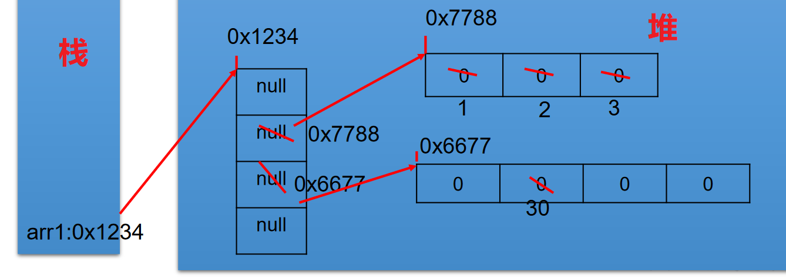

> 2、案例2
>

```java
int[][] arr4= newint[3][];
System.out.println(arr4[0]);//null
System.out.println(arr4[0][0]);//报错
arr4[0] = new int[3];
arr4[0][1] = 5;
arr4[1] = new int[]{ 1,2};
123456
```

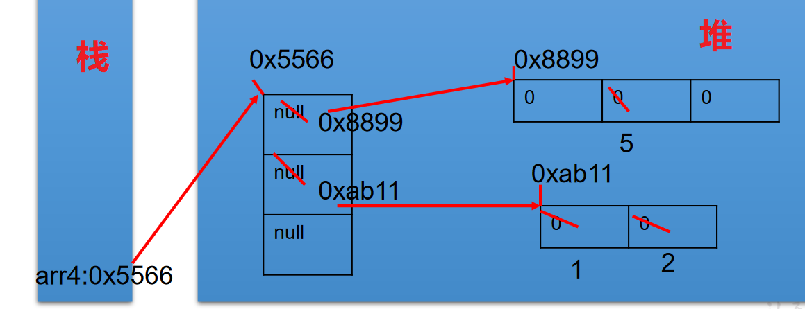

> 3、案例3
>

```java
int[][] arr = new int[3][];
arr[1] = new int[]{ 1,2,3};
arr[2] = new int[3];
System.out.println(arr[0]);//null
System.out.println(arr[0][0]);//报异常
12345
```

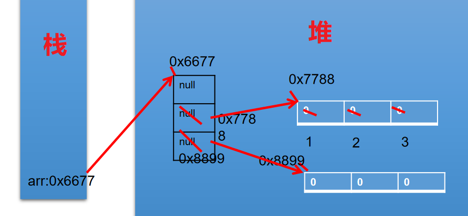

> 4、案例4
>

```java
int[][] arr1= newint[4][];
arr1[0] = new int[3];
arr1[1] = new int[]{ 1,2,3};
arr1[0][2] = 5;
arr1 = new int[2][];
12345
```

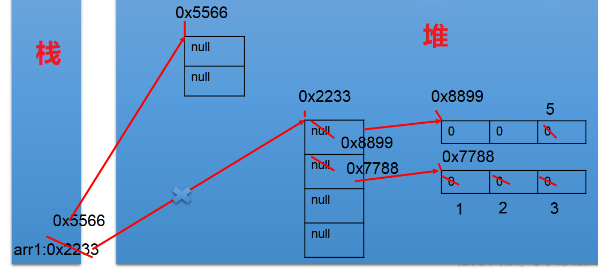

## 3.3、练习

> 1、练习1
>


```java
public class ArrayEver1 { 
	public static void main(String[] args) { 
		int[][] arr = new int[][]{ { 3,5,8},{ 12,9},{ 7,0,6,4}};
		int sum = 0;	//记录总和
		for(int i = 0;i < arr.length;i++){ 
			for(int j = 0;j < arr[i].length;j++){ 
				sum += arr[i][j];
			}
		}
		System.out.println(sum);
	}
}
123456789101112
```

> 2、练习 2
>

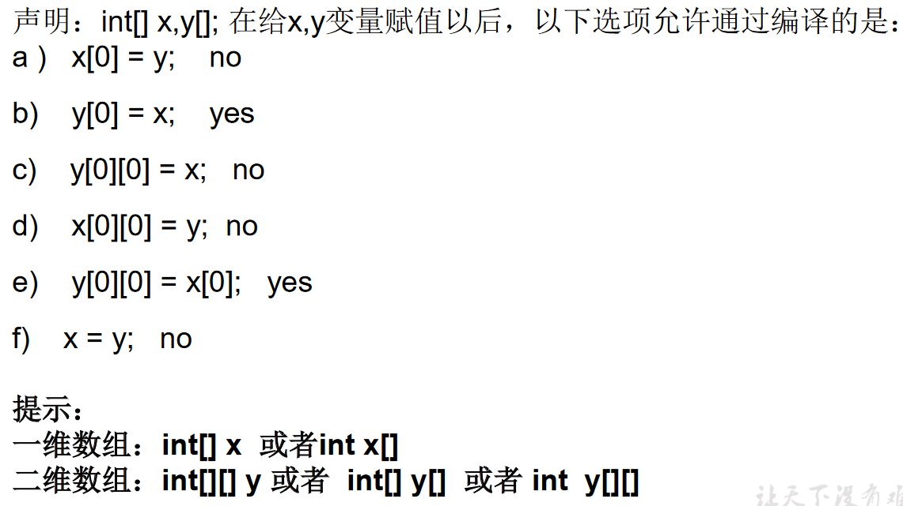

> 3、练习 3
>

使用二维数组打印一个 10 行杨辉三角。

```java
/*
 * 【提示】
 * 1. 第一行有 1 个元素, 第 n 行有 n 个元素
 * 2. 每一行的第一个元素和最后一个元素都是 1
 * 3. 从第三行开始, 对于非第一个元素和最后一个元素的元素。
 * 即：yanghui[i][j] = yanghui[i-1][j-1] + yanghui[i-1][j];
 */
public class ArrayEver2 { 
	public static void main(String[] args) { 
		//1.声明并初始化二维数组
		int[][] arr = new int[10][];
	
		//2.给数组的元素赋值，遍历二维数组
		for(int i = 0;i < arr.length;i++){ 
			arr[i] = new int[i+1];
		
			//2.1 给首末元素赋值
			arr[i][0]=arr[i][i]=1;
			//2.2 给每行的非首末元素赋值
		//	if(i > 1){ 
			for(int j = 1;j < arr[i].length-1;j++){ 
					arr[i][j] = arr[i-1][j-1] + arr[i-1][j];
				}
		//	}

		}
	
	//	3.遍历数组
		for(int i = 0;i < arr.length;i++){ 
			for(int j = 0;j <arr[i].length;j++){ 
				System.out.print(arr[i][j] + " ");
			}
			System.out.println();
		}
	
	}
}
12345678910111213141516171819202122232425262728293031323334353637
```

## 3.4、面试题目

> 1、创建一个长度为 6 的 int 型数组，要求取值为 1-30，同时元素值各不相同
>

```java
//此题只做了解，初学不必精通。
public class ArrayEver3 { 
	public static void main(String[] args) { 
		// 方式一：
//		int[] arr = new int[6];
//		for (int i = 0; i < arr.length; i++) {// [0,1) [0,30) [1,31)
//			arr[i] = (int) (Math.random() * 30) + 1;
//
//			boolean flag = false;
//			while (true) { 
//				for (int j = 0; j < i; j++) { 
//					if (arr[i] == arr[j]) { 
//						flag = true;
//						break;
//					}
//				}
//				if (flag) { 
//					arr[i] = (int) (Math.random() * 30) + 1;
//					flag = false;
//					continue;
//				}
//				break;
//			}
//		}
//
//		for (int i = 0; i < arr.length; i++) { 
//			System.out.println(arr[i]);
//		}
		// 方式二：
		int[] arr2 = new int[6];
		for (int i = 0; i < arr2.length; i++) { // [0,1) [0,30) [1,31)
			arr2[i] = (int) (Math.random() * 30) + 1;

			for (int j = 0; j < i; j++) { 
				if (arr2[i] == arr2[j]) { 
					i--;
					break;
				}
			}
		}

		for (int i = 0; i < arr2.length; i++) { 
			System.out.println(arr2[i]);
		}
	}
}  
12345678910111213141516171819202122232425262728293031323334353637383940414243444546
```

## 04、 数组中涉及到的常见算法

1. 数组元素的赋值(杨辉三角、回形数等)
2. 求数值型数组中元素的最大值、最小值、平均数、总和等
3. 数组的复制、反转、查找(线性查找、二分法查找)
4. 数组元素的排序算法

## 4.1、数组元素的赋值

```java
import java.util.Scanner;
/*
 * 此题了解！！！
 * 
 * 回形数格式方阵的实现
 * 从键盘输入一个整数（1~20） 
 * 则以该数字为矩阵的大小，把 1,2,3…n*n 的数字按照顺时针螺旋的形式填入其中。例如： 输入数字2，则程序输出： 1 2 
 * 4 3 
 * 输入数字 3，则程序输出：1 2 3 
 * 8 9 4 
 * 7 6 5 
 * 输入数字 4， 则程序输出： 
 * 1   2   3   4
 * 12  13  14  5 
 * 11  16  15  6 
 * 10  9   8   7
 */
public class ArrayTest { 
	public static void main(String[] args) { 
		Scanner scanner = new Scanner(System.in);
		System.out.println("输入一个数字:");
		int len = scanner.nextInt();
		int[][] arr = new int[len][len];
		int s = len * len;
		/*
		 * k = 1:向右 k = 2:向下 k = 3:向左 k = 4:向上
		 */
		int k = 1;
		int i = 0, j = 0;
		for (int m = 1; m <= s; m++) { 
			if (k == 1) { 
				if (j < len && arr[i][j] == 0) { 
					arr[i][j++] = m;
				} else { 
					k = 2;
					i++;
					j--;
					m--;
				}
			} else if (k == 2) { 
				if (i < len && arr[i][j] == 0) { 
					arr[i++][j] = m;
				} else { 
					k = 3;
					i--;
					j--;
					m--;
				}
			} else if (k == 3) { 
				if (j >= 0 && arr[i][j] == 0) { 
					arr[i][j--] = m;
				} else { 
					k = 4;
					i--;
					j++;
					m--;
				}
			} else if (k == 4) { 
				if (i >= 0 && arr[i][j] == 0) { 
					arr[i--][j] = m;
				} else { 
					k = 1;
					i++;
					j++;
					m--;
				}
			}
		}
		// 遍历
		for (int m = 0; m < arr.length; m++) { 
			for (int n = 0; n < arr[m].length; n++) { 
				System.out.print(arr[m][n] + "\t");
			}
			System.out.println();
		}
	}
}
1234567891011121314151617181920212223242526272829303132333435363738394041424344454647484950515253545556575859606162636465666768697071727374757677
```

## 4.2、数组元素的基本操作

```java
/*
 * 算法的考察：求数值型数组中元素的最大值、最小值、平均数、总和等
 * 
 * 定义一个 int 型的一维数组，包含 10 个元素，分别赋一些随机整数，
 * 然后求出所有元素的最大值，最小值，和值，平均值，并输出出来。
 * 要求：所有随机数都是两位数。
 * 
 * [10,99]
 * 公式：(int)(Math.random() * (99 - 10 + 1) + 10)
 */
public class ArrayTest1 { 
	public static void main(String[] args) { 
		int[] arr = new int[10];
		//数组赋值
		for(int i = 0;i <arr.length;i++){ 
			arr[i] = (int)(Math.random() * (99 - 10 + 1) + 10);
		}
	
		//遍历
		for(int i =0;i < arr.length;i++){ 
			System.out.print(arr[i] + " ");
		}
		System.out.println();
	
		//求数组元素的最大值
		int maxValue = arr[0];
		for(int i = 1;i <arr.length;i++){ 
			if(maxValue < arr[i]){ 
				maxValue = arr[i];
			}
		}
		System.out.println("最大值：" + maxValue);
	
		//求数组元素的最小值
		int minValue = arr[0];
		for(int i = 1;i <arr.length;i++){ 
			if(minValue > arr[i]){ 
				minValue = arr[i];
			}
		}
		System.out.println("最小值：" + minValue);
	
		//求数组元素的总和
		int sum = 0;
		for(int i = 1;i <arr.length;i++){ 
			sum += arr[i];
		}
		System.out.println("总和：" + sum);
	
		//求数组元素的平均数
		double avgVales = sum / arr.length;
		System.out.println("平均数：" + avgVales);	
	}
}
123456789101112131415161718192021222324252627282930313233343536373839404142434445464748495051525354
```

## 4.3、数组元素的基本操作 2

```java
/*
 * 使用简单数组
 * (1)创建一个名为 ArrayTest 的类，在 main()方法中声明 array1 和 array2 两个变量，他们是 int[]类型的数组。
 * (2)使用大括号{}，把 array1 初始化为 8 个素数：2,3,5,7,11,13,17,19。
 * (3)显示 array1 的内容。
 * (4)赋值 array2 变量等于 array1，修改 array2 中的偶索引元素，使其等于索引值(如 array[0]=0,array[2]=2)。打印出 array1。
 */
public class ArrayTest2 { 
	public static void main(String[] args) { 
		//声明 array1 和 array2 两个 int[]变量
		int[] array1,array2;
		//array1 初始化
		array1 = new int[]{ 2,3,5,7,11,13,17,19};
	
		//显示 array1 的内容==遍历。
		for(int i = 0;i < array1.length;i++){ 
			System.out.print(array1[i] + "\t");
		}
	
		//赋值 array2 变量等于 array1
        //不能称作数组的复制。
		array2 = array1;
	
		//修改 array2 中的偶索引元素，使其等于索引值(如 array[0]=0,array[2]=2)。
		for(int i = 0;i < array2.length;i++){ 
			if(i % 2 == 0){ 
				array2[i] = i;
			}
		}
		System.out.println();
	
		//打印出 array1。
		for(int i = 0;i < array1.length;i++){ 
			System.out.print(array1[i] + "\t");
		}
	}
}
12345678910111213141516171819202122232425262728293031323334353637
```

> 1、思考：上述 array1 和 array2 是什么关系？
>

```java
//array1 和 array2 地址值相同，都指向了堆空间的唯一的一个数组实体。
int[] array1,array2;
array1 = new int[]{ 2,3,5,7,11,13,17,19};
array2 = array1;
for(int i = 0;i < array2.length;i++){ 
	if(i % 2 == 0){ 
		array2[i] = i;
	}
}
123456789
```

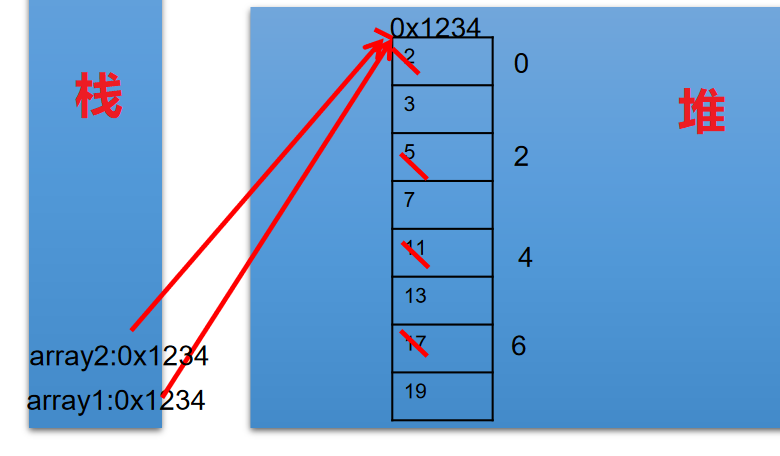

> 2、拓展：修改题目，实现 array2 对 array1 数组的复制
>

```java
int[] array1,array2;
array1 = new int[]{ 2,3,5,7,11,13,17,19};
//数组的复制
array2 = new int[array1.length];
for(int i = 0;i < array2.length;i++){ 
	array2[i] = array1[i];
}
1234567
```

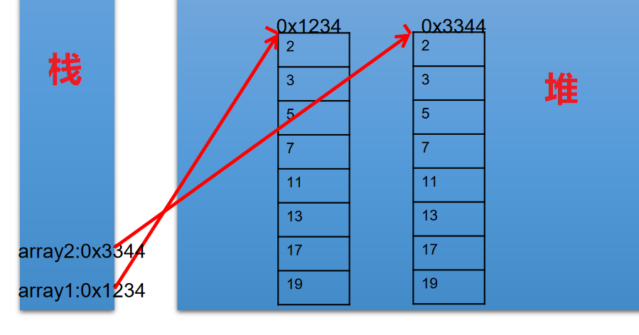

## 4.4、数组的复制、反转、查找

> 1、复制、反转
>

```java
/*
 * 算法的考察：数组的复制、反转、查找(线性查找、二分法查找)
 */
public class ArrayTest3 { 
	public static void main(String[] args) { 

		String[] arr = new String[]{ "SS","QQ","YY","XX","TT","KK","EE","GG"};
	
		//数组的复制
		String[] arr1 = new String[arr.length];
		for(int i = 0;i < arr1.length;i++){ 
			arr1[i] = arr[i];
		}
	
		//数组的反转
		//方法一：
//		for(int i = 0;i < arr.length / 2;i++){ 
//			String temp = arr[i];
//			arr[i] = arr[arr.length - i - 1];
//			arr[arr.length - i - 1] = temp;
//		}
	
		//方法二：
		for(int i = 0,j = arr.length - 1;i < j;i++,j--){ 
			String temp = arr[i];
			arr[i] = arr[j];
			arr[j] = temp;
		}
	
		//遍历
		for(int i = 0;i < arr.length;i++){ 
			System.out.print(arr[i] + "\t");
		}
		System.out.println();
	
		//查找（或搜索）
		//线性查找
		String dest = "BB";	//要查找的元素
		dest = "CC";
	
		boolean isFlag = true;
	
		for(int i = 0;i < arr.length;i++){ 
			if(dest.equals(arr[i])){ 
				System.out.println("找到了指定元素，位置为：" + i);
				isFlag = false;
				break;
			}
		}
		if(isFlag){ 
			System.out.println("很遗憾，没找到！");
		}
	
		//二分法查找：
	
	}
}
123456789101112131415161718192021222324252627282930313233343536373839404142434445464748495051525354555657
```

> 2、二分法查找算法
>


```java
public class ArrayTest3 { 
	public static void main(String[] args) { 
		//二分法查找：
		//前提：所要查找的数组必须有序
		int[] arr2 = new int[]{ -98,-34,2,34,54,66,79,105,210,333};
	
		int dest1 = -34;
		int head = 0;	//初始的首索引
		int end = arr2.length - 1;	//初始的末索引
		boolean isFlag1 = true;
		while(head <= end){ 
			int middle = (head + end)/2;
		
			if(dest1 == arr2[middle]){ 
				System.out.println("找到了指定元素，位置为：" + middle);
				isFlag1 = false;
				break;
			}else if(arr2[middle] > dest1){ 
				end = middle - 1;
			}else{ 	//arr2[middle] < dest1
				head = middle + 1;
			}
		}
	
		if(isFlag1){ 
			System.out.println("很遗憾，没找到！");
		}	
	}
}
1234567891011121314151617181920212223242526272829
```

## 4.5、数组元素的[排序算法](https://so.csdn.net/so/search?q=%E6%8E%92%E5%BA%8F%E7%AE%97%E6%B3%95&spm=1001.2101.3001.7020)

* 排序：假设含有 n 个记录的序列为{R1，R2，…,Rn},其相应的关键字序列为{K1，K2，…,Kn}。将这些记录重新排序为{Ri1,Ri2,…,Rin},使得相应的关键字值满足条 Ki1<=Ki2<=…<=Kin,这样的一种操作称为排序。

  * 通常来说，排序的目的是快速查找。
* 衡量排序算法的优劣：

  1. **时间复杂度** ：分析关键字的比较次数和记录的移动次数
  2. 空间复杂度：分析排序算法中需要多少辅助内存
  3. **稳定性** ：若两个记录 A 和 B 的关键字值相等，但排序后 A、B 的先后次序保持不变，则称这种排序算法是稳定的。
* 排序算法分类：**内部排序**和 **外部排序** 。

  * 内部排序：整个排序过程不需要借助于外部存储器（如磁盘等），所有排序操作都在内存中完成。
  * 外部排序：参与排序的数据非常多，数据量非常大，计算机无法把整个排序过程放在内存中完成，必须借助于外部存储器（如磁盘）。外部排序最常见的是多路归并排序。可以认为外部排序是由多次内部排序组成。

## 4.6、十大内部排序算法

* 选择排序

  * 直接选择排序、堆排序
* 交换排序

  * **冒泡排序、快速排序**
* 插入排序

  * 直接插入排序、折半插入排序、Shell 排序
* 归并排序
* 桶式排序
* 基数排序

1. 详细操作，见《附录》  
    [附录：尚硅谷_宋红康_排序算法.pdf](https://shimo.im/docs/TcdrXydwCTHY866T)

## 4.7、算法的 5 大特征

|输入（Input）|有 0 个或多个输入数据，这些输入必须有清楚的描述和定义|
| ---------------------------------| --------------------------------------------------------------------------------------|
|输出（Output）|至少有 1 个或多个输出结果，不可以没有输出结果|
|有穷性（有限性，Finiteness）|算法在有限的步骤之后会自动结束而不会无限循环，并且每一个步骤可以在可接受的时间内完成|
|确定性（明确性，Definiteness）|算法中的每一步都有确定的含义，不会出现二义性|
|可行性（有效性，Effectiveness）|算法的每一步都是清楚且可行的，能让用户用纸笔计算而求出答案|

> 说明：满足确定性的算法也称为：确定性算法。现在人们也关注更广泛的概念，例如考虑各种非确定性的算法，如并行算法、概率算法等。另外，人们也关注并不要求终止的计算描述，这种描述有时被称为过程（procedure）。
>

## 4.8、[冒泡排序](https://so.csdn.net/so/search?q=%E5%86%92%E6%B3%A1%E6%8E%92%E5%BA%8F&spm=1001.2101.3001.7020)(重要)

冒泡排序的基本思想：通过对待排序序列从前向后，依次比较相邻元素的排序码，若发现逆序则交换，使排序码较大的元素逐渐从前部移向后部。

因为排序的过程中，各元素不断接近自己的位置，如果一趟比较下来没有进行过交换，就说明序列有序， 因此要在排序过程中设置一个标志swap判断元素是否进行过交换。从而减少不必要的比较。


```java
/*
 * 数组的冒泡排序的实现
 * 
 */
public class BubbleSortTest { 
	public static void main(String[] args) { 
	
		int[] arr = new int[]{ 43,32,76,92,-65,85,71,-42};
	
		//冒泡排序
		for(int i = 0;i < arr.length - 1;i++){ 
		
			for(int j = 0;j < arr.length - 1 - i;j++){ 
			
				if(arr[j] > arr[j+1]){ 
					int temp = arr[j];
					arr[j] = arr[j+1];
					arr[j+1] = temp;
				}
			}
		}
	
		for(int i = 0;i < arr.length;i++){ 
			System.out.print(arr[i] + "\t");
		}
	}
}
123456789101112131415161718192021222324252627
```

## 4.9、[快速排序](https://so.csdn.net/so/search?q=%E5%BF%AB%E9%80%9F%E6%8E%92%E5%BA%8F&spm=1001.2101.3001.7020)(初学Java，仅作了解)

> 快速排序（Quick Sort）由图灵奖获得者Tony Hoare发明，被列为20世纪十大算法之一，是迄今为止所有内排序算法中速度最快的一种。冒泡排序的升级版，交换排序的一种。快速排序的时间复杂度为O(nlog(n))。
>

**排序思想：**

1. 从数列中挑出一个元素，称为"基准"（pivot），
2. 重新排序数列，所有元素比基准值小的摆放在基准前面，所有元素比基准值大的摆在基准的后面（相同的数可以到任一边）。在这个分区结束之后，该基准就处于数列的中间位置。这个称为分区（partition）操作。
3. 递归地（recursive）把小于基准值元素的子数列和大于基准值元素的子数列排序。
4. 递归的最底部情形，是数列的大小是零或一，也就是永远都已经被排序好了。虽然一直递归下去，但是这个算法总会结束，因为在每次的迭代（iteration）中，它至少会把一个元素摆到它最后的位置去。


```java
/**
  * 快速排序
  * 通过一趟排序将待排序记录分割成独立的两部分，其中一部分记录的关键字均比另一部分关键字小，
  * 则分别对这两部分继续进行排序，直到整个序列有序。
  *
 */
public class QuickSort { 
	private static void swap(int[] data, int i, int j) { 
		int temp = data[i];
		data[i] = data[j];
		data[j] = temp;
	}
	private static void subSort(int[] data, int start, int end) { 
		if (start < end) { 
			int base = data[start];
			int low = start;
			int high = end + 1;
			while (true) { 
				while (low < end && data[++low] - base <= 0)
					;
				while (high > start && data[--high] - base >= 0)
					;
				if (low < high) { 
					swap(data, low, high);
				} else { 
					break;
				}
			}
			swap(data, start, high);
		
			subSort(data, start, high - 1);//递归调用
			subSort(data, high + 1, end);
		}
	}
	public static void quickSort(int[] data){ 
		subSort(data,0,data.length-1);
	}

	public static void main(String[] args) { 
		int[] data = {  9, -16, 30, 23, -30, -49, 25, 21, 30 };
		System.out.println("排序之前：\n" + java.util.Arrays.toString(data));
		quickSort(data);
		System.out.println("排序之后：\n" + java.util.Arrays.toString(data));
	}
}
123456789101112131415161718192021222324252627282930313233343536373839404142434445
```

## 4.10排序算法性能对比

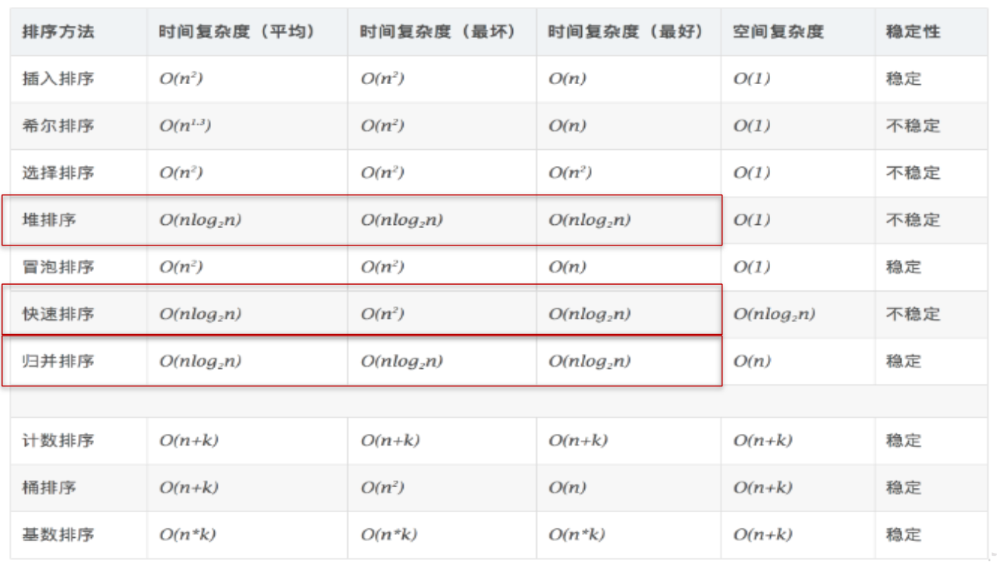

> **各种内部排序方法性能比较**
>

1. 从平均时间而言：快速排序最佳。但在最坏情况下时间性能不如堆排序和归并排序。
2. 从算法简单性看：由于直接选择排序、直接插入排序和冒泡排序的算法比较简单，将其认为是简单算法。对于Shell排序、堆排序、快速排序和归并排序算法，其算法比较复杂，认为是复杂排序。
3. 从稳定性看：直接插入排序、冒泡排序和归并排序是稳定的；而直接选择排序、快速排序、Shell排序和堆排序是不稳定排序
4. 从待排序的记录数n的大小看，n较小时，宜采用简单排序；而n较大时宜采用改进排序。

> **排序算法的选择**
>

(1) 若n较小(如n≤50)，可采用直接插入或直接选择排序。当记录规模较小时，直接插入排序较好；否则因为直接选择移动的记录数少于直接插入，应选直接选择排序为宜。  
 (2) 若文件初始状态基本有序(指正序)，则应选用直接插入、冒泡或随机的快速排序为宜；  
 (3) 若n较大，则应采用时间复杂度为O(nlgn)的排序方法：快速排序、堆排序或归并排序。

## 05、 Arrays 工具类的使用

> java.util.Arrays类即为操作数组的工具类，包含了用来操作数组（比如排序和搜索）的各种方法。
>

|1|boolean equals(int[] a,int[] b)|判断两个数组是否相等。|
| ---| -----------------------------------| ----------------------------------------|
|2|String toString(int[] a)|输出数组信息。|
|3|void fill(int[] a,int val)|将指定值填充到数组之中。|
|4|void sort(int[] a)|对数组进行排序。|
|5|int binarySearch(int[] a,int key)|对排序后的数组进行二分法检索指定的值。|

```java
import java.util.Arrays;
/*
 * java.util.Arrays:作数组的工具类，包含了用来操作数组（比如排序和搜索）的各种方法。
 */
public class ArrayTest4 { 
	public static void main(String[] args) { 
	
		//1.boolean equals(int[] a,int[] b)判断两个数组是否相等。
		int[] arr1 = new int[]{ 1,2,3,4};
		int[] arr2 = new int[]{ 1,2,9,3};
		boolean isEquals = Arrays.equals(arr1, arr2);
		System.out.println(isEquals);
	
		//2.String toString(int[] a)输出数组信息。
		System.out.println(Arrays.toString(arr1));	
	
		//3.void fill(int[] a,int val)将指定值填充到数组之中。
		Arrays.fill(arr1, 10);
		System.out.println(Arrays.toString(arr1));	
	
		//4.void sort(int[] a)对数组进行排序。
		Arrays.sort(arr2);
		System.out.println(Arrays.toString(arr2));
	
		//5.int binarySearch(int[] a,int key)对排序后的数组进行二分法检索指定的值。
		int[] arr3 = new int[]{ 43,32,76,92,-65,85,71,-42}; 
		int index = Arrays.binarySearch(arr3, 210);
		if(index >= 0){ 
			System.out.println(index);
		}else{ 
			System.err.println("未找到。");
		}	
	}
}
12345678910111213141516171819202122232425262728293031323334
```

## 06、 数组使用中的常见异常

```java
/*
 * 数组中的常见异常：
 * 1.数组角标越界的异常:ArrayIndexOutOfBoundsException
 * 
 * 2.空指针异常:NullPointerException
 * 
 */
public class ArrayExceptionTest { 
	public static void main(String[] args) { 
	
		//1.数组角标越界的异常:ArrayIndexOutOfBoundsException
		int[] arr = new int[]{ 1,2,3,4,5,6};
	
		//错误1：
//		for(int i = 0;i <= arr.length;i++){ 
//			System.out.println(arr[i]);
//		}
	
		//错误2：
//		System.out.println(arr[-2]);
	
		//错误3
//		System.out.println("hello");
	
		//2.空指针异常:NullPointerException
		//情况一:
//		int[] arr2= new int[]{1,2,3};
//		arr2 = null;
//		System.out.println(arr2[0]);
		//情况二:
//		int[][] arr2 = new int[4][];
//		System.out.println(arr2[0][0]);
	
		//情况三:
//		String[] arr3 = new String[]{"AA","QQ","YY","XX","TT","KK"};
//		arr3[0] = null;
//		System.out.println(arr3[0].toString());	
	}
}
123456789101112131415161718192021222324252627282930313233343536373839
```

> 作者做笔记不容易，请评个分吧！
>

* 1、如果觉得文章写行不错就点个  **赞** 。✌
* 2、如果觉得写得好就  **一键三连** ！✌✌✌
* 3、如果文章对你很有帮助，请  **打赏** 。 💃💃💃💃💃
