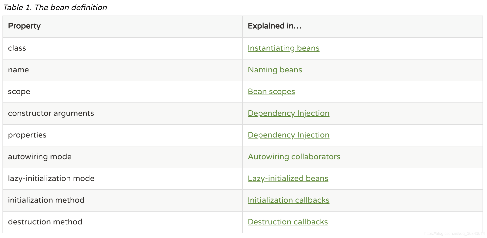
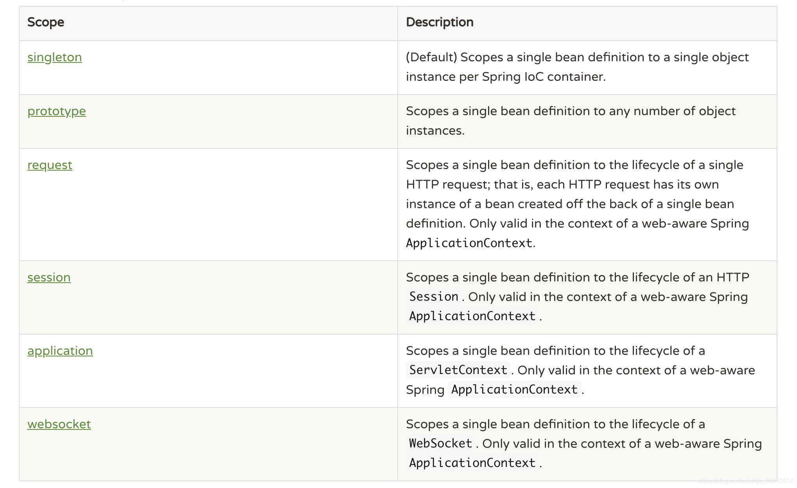

### 一、概念与定义

#### 1、什么是Spring beans?

**Bean:** 在Spring中，构成应用程序主干并由Spring IoC容器管理的对象称为bean。Bean是由Spring IoC容器实例化，组装和以其他方式管理的对象。否则，bean仅仅是应用程序中许多对象之一。Bean及其之间的依赖关系反映在容器使用的配置元数据中。

* Spring Beans是构成Spring应用核心的Java对象。这些对象由Spring IoC容器实例化、组装、管理。这些对象通过容器中配置的元数据创建，例如，使用XML文件中定义的创建。
* 在Spring中创建的beans都是单例的beans。在bean标签中有一个属性为”singleton”, 如果设为true，该bean是单例的，如果设为false，该bean是原型bean。Singleton属性默认设置为true。因此，spring框架中所有的bean都默认为单例bean。  
  ​

#### 2、 一个 Spring Bean 定义包含什么？

一个Spring Bean 的定义包含容器必知的所有配置元数据，包括如何创建一个bean，它的生命周期详情及它的依赖。

#### 3、如何给Spring 容器提供配置元数据?

这里有三种重要的方法给Spring 容器提供配置元数据。

（1）XML配置文件。  
 （2）基于注解的配置。  
 （3）基于Java的配置

### 二、Spring Beans注入属性（XML）

#### 1、使用xml配置注入属性，set方式注入属性，有参构造方法注入，下面演示2种方式注入属性

Step 1: 创建`Book.java`，`Orders.java`类

```java
/**
 * @Author m.kong
 * @Date 2021/2/23 下午3:07
 * @Version 1.0
 */
public class Book { 
    /**
     * 创建属性
     */
    private String bname;
    private String bauthor;

    /**
     * 创建对应的set方法
     */
    public void setBname(String bname) { 
        this.bname = bname;
    }

    public void setBauthor(String bauthor) { 
        this.bauthor = bauthor;
    }

    public void testDemo(){ 
        System.out.println(bname + "::" + bauthor );
    }
}

12345678910111213141516171819202122232425262728
```

```java
/**
 * @Author m.kong
 * @Date 2021/2/23 下午3:50
 * @Version 1.0
 */
public class Orders { 
    private String oname;
    private String address;

    public Orders(String oname, String address) { 
        this.oname = oname;
        this.address = address;
    }

    public void orderTest(){ 
        System.out.println(oname + "::" + address);
    }
}

12345678910111213141516171819
```

Step 2: 配置Book，Order对象创建（创建对象时候，默认也是执行无参数构造方法完成对象创建）

```java
	<!--配置Book对象创建,并注入属性
		id属性：唯一标识
		class属性：类全路径（包类路径） 
		set方法注入属性-->
    <bean id="book" class="com.micah.spring.Book">
      <!--使用Property来进行属性注入-->
        <property name="bname" value="上海...研究所"/>
        <property name="bauthor" value="Micah"/>
    </bean>
  
    <!--有参构造方法注入属性-->
    <bean id="orders" class="com.micah.spring.Orders">
        <constructor-arg index="0" value="haha"/>
        <constructor-arg index="1" value="hahhahahahha"/>
    </bean>
123456789101112131415
```

Step 3: 测试类中添加测试方法：

```java
@Test
public void testBookInsert(){ 
    ApplicationContext context = new ClassPathXmlApplicationContext("bean1.xml");
    Book book = context.getBean("book", Book.class);
    book.testDemo();
    System.out.println(book);
}

@Test
    public void testOrderInsert(){ 
        ApplicationContext context = new ClassPathXmlApplicationContext("bean.xml");
        Orders orders = context.getBean("orders", Orders.class);
        orders.orderTest();
        System.out.println(orders);
    }
123456789101112131415
```

  
 

#### 2、使用P名称空间注入（了解）

使用 p 名称空间注入，可以简化基于 xml 配置方式第一步 添加 p 名称空间在配置文件中

第一步：引入P名称空间

```xml
<beans xmlns="http://www.springframework.org/schema/beans"
       xmlns:xsi="http://www.w3.org/2001/XMLSchema-instance"
       xmlns:p="http://www.springframework.org/schema/p"
       xsi:schemaLocation="http://www.springframework.org/schema/beans http://www.springframework.org/schema/beans/spring-beans.xsd">
  
12345
```

第二步 进行属性注入，在 bean 标签里面进行操作

```xml
<!--2 set 方法注入属性-->
<bean id="book" class="com.atguigu.spring5.Book" p:bname="九阳神功"p:bauthor="无名氏">
</bean>
123
```

#### 3、注入一些特殊类型的属性

（1）字面量

```xml
<!--null 值-->
<property name="address">
	<null/>
</property>
1234
```

（2）属性值包含特殊符号

```xml
<!--属性值包含特殊符号 
        1 把<>进行转义 &lt; &gt; 
        2 把带特殊符号内容写到CDATA 
        -->
<property name="address">
	<value><![CDATA[<<南京>>]]></value>
</property>
1234567
```

#### 4、注入外部Bean

a. 创建两个类 service类和 dao类  
 b. 在 service调用 dao里面的方法

```java
/**
 * @Author m.kong
 * @Date 2021/2/23 下午8:45
 * @Version 1.0
 */
public class UserService { 

    // 创建UserDao的对象，并设置set()方法
    private UserDao userDao;

    public void setUserDao(UserDao userDao) { 
        this.userDao = userDao;
    }

    public void add(){ 
        System.out.println("service add...");

        // 1、原始方式：创建UserDao对象
        /*UserDao userDao = new UserDaoImpl();
        userDao.update(); */
    }
}

1234567891011121314151617181920212223
```

```java
public interface UserDao { 
    public void update();
}
123
```

```java
public class UserDaoImpl implements UserDao { 
    @Override
    public void update() { 

    }
}

1234567
```

c. 在 spring配置文件中进行配置

```xml
<!--1 service和dao的创建-->
    <bean id="userService" class="com.micah.spring.service.UserService">
        <!--注入UserDao的对象
            name:属性值，类里面属性名称
            ref:属性值，创建UserDao对象bean标签ID值
        -->
        <property name="userDao" ref="userDaoImpl"></property>
    </bean>
    <bean id="userDaoImpl" class="com.micah.spring.dao.UserDaoImpl"/>
123456789
```

#### 5、注入内部Bean属性

（1）一对多关系：部门和员工  
 一个部门有多个员工，一个员工属于一个部门部门是一，员工是多  
 （2）在实体类之间表示一对多关系，员工表示所属部门，使用对象类型属性进行表示

```java
/**
 * @Author m.kong
 * @Date 2021/2/24 下午1:50
 * @Version 1.0
 */
public class Department { 
    private String dname;

    public void setDname(String dname) { 
        this.dname = dname;
    }

    public String getDname() { 
        return dname;
    }

    @Override
    public String toString() { 
        return "Department{" +
                "dname='" + dname + '\'' +
                '}';
    }
}

123456789101112131415161718192021222324
```

```java
/**
 * @Author m.kong
 * @Date 2021/2/24 下午1:51
 * @Version 1.0
 */
public class Employee { 
    private String eName;
    private String gender;

    // 员工属于一个部门
    private Department department;

    public void setDepartment(Department department) { 
        this.department = department;
    }
	// 第二种写法新增
    public Department getDepartment() { 
        return department;
    }

    public void seteName(String eName) { 
        this.eName = eName;
    }

    public void setGender(String gender) { 
        this.gender = gender;
    }

    public void show(){ 
        System.out.println("eName:" + eName + ",department:" + department + ",gender" + gender);
    }
}

123456789101112131415161718192021222324252627282930313233
```

（3）在 spring配置文件中进行配置  
 第一种写法：

```xml
<bean id="employee" class="com.micah.spring.bean.Employee">
        <!--普通属性-->
        <property name="eName" value="Micah"/>
        <property name="gender" value="男"/>
        <!--设置对象属性-->
        <property name="department">
            <bean id="department" class="com.micah.spring.bean.Department">
                <property name="dname" value="安保部门"/>
            </bean>
        </property>
    </bean>
1234567891011
```

第二种写法：

```xml
<!--级联赋值-->
    <bean id="employee" class="com.micah.spring.bean.Employee">
        <!--普通属性-->
        <property name="eName" value="Micah"/>
        <property name="gender" value="男"/>
        <!--级联赋值-->
        <property name="department" ref="department"/>
        <property name="department.dname" value="技术部"/>
    </bean>
    <bean id="department" class="com.micah.spring.bean.Department">
        <property name="dname" value="财务部"/>
    </bean>
123456789101112
```

### 6、注入集合属性

（1）、注入数组类型属性  
 （2）、注入 List 集合类型属性  
 （3）、注入 Map 集合类型属性

```java
/**
 * @Author m.kong
 * @Date 2021/2/24 下午3:15
 * @Version 1.0
 */
public class Student { 
    private String[] courses;
    private List<String> list;
    private Map<String,String> map;
    private Set<String> set;
    private List<Course> courseList;

    public void setCourseList(List<Course> courseList) { 
        this.courseList = courseList;
    }

    public void setSet(Set<String> set) { 
        this.set = set;
    }

    public void setCourses(String[] courses) { 
        this.courses = courses;
    }

    public void setList(List<String> list) { 
        this.list = list;
    }

    public void setMap(Map<String, String> map) { 
        this.map = map;
    }

    public void show(){ 
        System.out.println(Arrays.toString(courses) + list.toString() + map.toString() + set.toString() +courseList.toString());
    }
}

12345678910111213141516171819202122232425262728293031323334353637
```

```xml
<!--集合类型的数据注入-->
    <bean id="student" class="com.micah.spring.collection.Student">
        <!--数据类型属性的注入-->
        <property name="courses">
            <array>
                <value>Java</value>
                <value>DataBase</value>
                <value>SoftWare Theory</value>
            </array>
        </property>
        <property name="list">
            <list>
                <value>Micah</value>
                <value>Maruko</value>
                <value>Mapper</value>
            </list>
        </property>
        <property name="map">
            <map>
                <entry key="JAVA" value="java"></entry>
                <entry key="DATABASE" value="database"></entry>
                <entry key="SOFTWARE THEORY" value="software theory"></entry>
            </map>
        </property>
        <property name="set">
            <set>
                <value>1</value>
                <value>2</value>
                <value>3</value>
            </set>
        </property>
        <!--注入list集合类型，但list元素是对象的属性-->
        <property name="courseList">
            <list>
                <ref bean="course1"/>
                <ref bean="course2"/>
            </list>
        </property>
    </bean>
123456789101112131415161718192021222324252627282930313233343536373839
```

```java
@Test
public void testBean(){ 
    ApplicationContext context = new ClassPathXmlApplicationContext("bean1.xml");
    Student student = context.getBean("student", Student.class);
    System.out.println(student);
    student.show();
}
1234567
```

  
 （4）、在集合里面设置对象类型值

```java
<!--创建多个 course对象-->
<bean id="course1" class="com.micah.spring.collectiontype.Course">
<property name="cname" value="Spring5 框架"></property>
</bean>
<bean id="course2" class="com.micah.spring.collectiontype.Course">
<property name="cname" value="MyBatis 框架"></property>
</bean>
<!--注入 list 集合类型，值是对象-->
<property name="courseList">
<list>
<refbean="course1"></ref>
<refbean="course2"></ref>
</list>
</property>
1234567891011121314
```

（5）把集合注入部分提取出来

a. 在 spring配置文件中引入名称空间 util

```java
<?xml version="1.0" encoding="UTF-8"?>
<beans xmlns="http://www.springframework.org/schema/beans"
       xmlns:xsi="http://www.w3.org/2001/XMLSchema-instance"
       xmlns:util="http://www.springframework.org/schema/util"
       xsi:schemaLocation="http://www.springframework.org/schema/beans http://www.springframework.org/schema/beans/spring-beans.xsd
                          http://www.springframework.org/schema/util http://www.springframework.org/schema/util/spring-util.xsd">
123456
```

b. 使用 util标签完成 list集合注入提取

```xml
    <!--1、提取list集合类型属性的注入-->
    <util:list id="booklist">
        <value>Spring</value>
        <value>Java</value>
        <value>JVM Machine</value>
    </util:list>

    <!--2、提取list集合类型属性的注入使用
    scope:(1)"prototype"多实例
        （2）"singleton"单实例
    -->
    <bean id="book" class="com.micah.spring.collection.Book" scope="prototype">
        <property name="list" ref="booklist"/>
    </bean>
</beans>
123456789101112131415
```

### 三、FactoryBean

#### 1、Spring 有两种类型 bean，一种普通 bean，另外一种工厂 bean（FactoryBean）

* 普通 bean：在配置文件中定义 bean 类型就是返回类型
* 工厂 bean：在配置文件定义 bean 类型可以和返回类型不一样

#### 2、 案例演示

* 第一步 创建类，让这个类作为工厂 bean，实现接口 FactoryBean
* 第二步 实现接口里面的方法，在实现的方法中定义返回的 bean 类型

```java
/**
 * @Author m.kong
 * @Date 2021/2/24 下午4:15
 * @Version 1.0
 */
public class MyBean implements FactoryBean<Course> { 

    /**
     * 定义返回bean
     */
    @Override
    public Course getObject() throws Exception { 
        Course course = new Course();
        course.setcName("abc");
        return course;
    }

    @Override
    public Class<?> getObjectType() { 
        return null;
    }

    @Override
    public boolean isSingleton() { 
        return false;
    }
}

12345678910111213141516171819202122232425262728
```

### 四、Spring Bean作用域

#### 1、在 Spring 里面，你怎样定义类的作用域?

当定义一个 在Spring里，我们还能给这个bean声明一个作用域。它可以通过bean 定义中的scope属性来定义。如，当Spring要在需要的时候每次生产一个新的bean实例，bean的scope属性被指定为prototype。另一方面，一个bean每次使用的时候必须返回同一个实例，这个bean的scope 属性 必须设为 singleton。

#### 2、解释Spring支持的几种bean的作用域。

Spring框架支持以下五种bean的作用域：

* **singleton** : bean在每个Spring ioc 容器中只有一个实例。
* **prototype** ：一个bean的定义可以有多个实例。
* **request** ：将单个bean定义的范围限定为单个HTTP请求的生命周期； 也就是说，每个HTTP请求都有一个自己的bean实例，它是在单个bean定义的后面创建的。 仅在基于Web的Spring ApplicationContext上下文中有效。
* **session** ：将单个bean定义的作用域限定为HTTP会话的生命周期。 仅在web的Spring ApplicationContext上下文中有效。
* **application** :将单个bean定义的作用域限定为ServletContext的生命周期。 仅在基于web的Spring ApplicationContext上下文中有效。
* **websocket** :将单个bean定义的作用域限定为WebSocket的生命周期。 仅在基于web的Spring ApplicationContext上下文中有效。 

#### 3、 Spring框架中的单例bean是线程安全的吗?

不，Spring框架中的单例bean不是线程安全的。

### 五、Spring Bean生命周期

#### 1、Spring框架中bean的生命周期。

[详细讲解：https://blog.csdn.net/wangxiang1292/article/details/102162890](https://blog.csdn.net/wangxiang1292/article/details/102162890)

* Spring容器 从XML 文件中读取bean的定义，并实例化bean。
* Spring根据bean的定义填充所有的属性。
* 如果bean实现了BeanNameAware 接口，Spring 传递bean 的ID 到 setBeanName方法。
* 如果Bean实现了 BeanFactoryAware 接口， Spring传递beanfactory 给setBeanFactory方法。
* 如果有任何与bean相关联的BeanPostProcessors，Spring会在postProcesserBeforeInitialization()方法内调用它们。
* 如果bean实现IntializingBean了，调用它的afterPropertySet方法，如果bean声明了初始化方法，调用此初始化方法。
* 如果有BeanPostProcessors 和bean关联，这些bean的postProcessAfterInitialization()方法将被调用。
* 如果bean实现了 DisposableBean，它将调用destroy()方法。

#### 2、哪些是重要的bean生命周期方法？ 你能重载它们吗？

有两个重要的bean 生命周期方法，第一个是setup ， 它是在容器加载bean的时候被调用。第二个方法是 teardown 它是在容器卸载类的时候被调用。

The bean 标签有两个重要的属性（init-method和destroy-method）。用它们你可以自己定制初始化和注销方法。它们也有相应的注解（@PostConstruct和@PreDestroy）。

### 六、Spring Bean自动装配

#### 1、什么是bean装配?

装配，或bean 装配是指在Spring 容器中把bean组装到一起，前提是容器需要知道bean的依赖关系，如何通过依赖注入来把它们装配到一起。

#### 2、什么是bean的自动装配？

Spring 容器能够自动装配相互合作的bean，这意味着容器不需要和配置，能通过Bean工厂自动处理bean之间的协作。

#### 3、解释不同方式的自动装配 。

有五种自动装配的方式，可以用来指导Spring容器用自动装配方式来进行依赖注入。

 **no** ：默认的方式是不进行自动装配，通过显式设置ref 属性来进行装配。  
  **byName** ：通过参数名自动装配，Spring容器在配置文件中发现bean的autowire属性被设置成byname，之后容器试图匹配、装配和该bean的属性具有相同名字的bean。  
  **byType** :：通过参数类型自动装配，Spring容器在配置文件中发现bean的autowire属性被设置成byType，之后容器试图匹配、装配和该bean的属性具有相同类型的bean。如果有多个bean符合条件，则抛出错误。  
  **constructor** ：这个方式类似于byType， 但是要提供给构造器参数，如果没有确定的带参数的构造器参数类型，将会抛出异常。  
  **autodetect** ：首先尝试使用constructor来自动装配，如果无法工作，则使用byType方式。

#### 4、自动装配有哪些局限性 ?

自动装配的局限性是：

 **重写** ： 你仍需用 和 配置来定义依赖，意味着总要重写自动装配。  
  **基本数据类型** ：你不能自动装配简单的属性，如基本数据类型，String字符串，和类。  
  **模糊特性** ：自动装配不如显式装配精确，如果有可能，建议使用显式装配。

#### 5、你可以在Spring中注入一个null 和一个空字符串吗？

可以。

### 七、Spring注解

#### 1、什么是基于Java的Spring注解配置? 给一些注解的例子.

基于Java的配置，允许你在少量的Java注解的帮助下，进行你的大部分Spring配置而非通过XML文件。

以@Configuration 注解为例，它用来标记类可以当做一个bean的定义，被Spring IOC容器使用。另一个例子是@Bean注解，它表示此方法将要返回一个对象，作为一个bean注册进Spring应用上下文。

#### 2、Spring 针对 Bean 管理中创建对象提供注解

（1） @Component  
 （2） @Service  
 （3） @Controller  
 （4） @Repository

* 上面四个注解功能是一样的，都可以用来创建bean 实例

#### 3、什么是基于注解的容器配置?

相对于XML文件，注解型的配置依赖于通过字节码元数据装配组件，而非尖括号的声明。

开发者通过在相应的类，方法或属性上使用注解的方式，直接组件类中进行配置，而不是使用xml表述bean的装配关系。

#### 4、怎样开启注解装配？

注解装配在默认情况下是不开启的，为了使用注解装配，我们必须在Spring配置文件中配置 context:annotation-config/元素。

#### 5、@Required 注解

这个注解表明bean的属性必须在配置的时候设置，通过一个bean定义的显式的属性值或通过自动装配，若@Required注解的bean属性未被设置，容器将抛出BeanInitializationException。

#### 6、@Autowired 注解

@Autowired 注解提供了更细粒度的控制，包括在何处以及如何完成自动装配。它的用法和@Required一样，修饰setter方法、构造器、属性或者具有任意名称和/或多个参数的PN方法。

#### 7、@Qualifier 注解

当有多个相同类型的bean却只有一个需要自动装配时，将@Qualifier 注解和@Autowire 注解结合使用以消除这种混淆，指定需要装配的确切的bean。

#### 8、案例演示

Step 1: 引入依赖`spring-aop-5.2.6.RELEASE.jar`  
 Step 2: 开启组件扫描

```xml
<!--开启组件扫描
        1、如果扫描多个包，就用逗号隔开
        2、dao和service，扫描包上层目录
    -->
    <context:component-scan base-package="com.micah"/>
12345
```

Step 3: 创建类，在类上面添加创建对象注解

```java
/**
 * @Author m.kong
 * @Date 2021/2/25 下午11:16
 * @Version 1.0
 */
// value可以不写，默认是首字母小写的类名
@Service(value = "userService") //<bean id="userService" class=""/>
public class UserService { 
	// 注入普通属性
    @Value(value = "Micah")
    private String name;

    /**
     * 定义dao类型属性，不需要添加set方法，添加注入属性注解
     * @Autowired : 根据类型注入
     * @Qualifier(value = "userDaoImplOne") : 和上面@Autowired一起配合使用
     */
    @Autowired
    @Qualifier(value = "userDaoImplOne")
    // @Resource 根据类型注入
    // @Resource(name = "userDaoImplOne") 根据名称注入
    private UserDao userDao;

    public void add(){ 
        System.out.println("add..." + name);
        userDao.add();
    }
}
12345678910111213141516171819202122232425262728
```

```java
@Repository(value = "userDaoImplOne")
public class UserDaoImpl implements UserDao{ 
    @Override
    public void add() { 
        System.out.println("dao add ... ");
    }
}

12345678
```

```java
/**
 * @Author m.kong
 * @Date 2021/2/26 下午10:04
 * @Version 1.0
 */
public interface UserDao { 
    public void add();
}
12345678
```

Step 4: 新建配置类，替代xml文件

```java
@Configuration // 作为配置类，替代xml文件
@ComponentScan(basePackages =  { "com.micah"})
public class SpringConfig { 

}
12345
```

Step 5: 测试

```java
// 添加SpringConfig之前
@Test
    public void testService(){ 
        ApplicationContext context = new ClassPathXmlApplicationContext("bean1.xml");
        UserService userService = context.getBean("userService", UserService.class);
        System.out.println(userService);
        userService.add();
    }
  
// 添加SpringConfig之后
@Test
    public void testService2(){ 
        ApplicationContext context = new AnnotationConfigApplicationContext(SpringConfig.class);
        UserService userService = context.getBean("userService", UserService.class);
        System.out.println(userService);
        userService.add();
    }
1234567891011121314151617
```

结果：  
 
