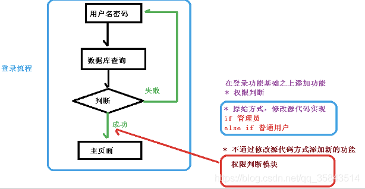
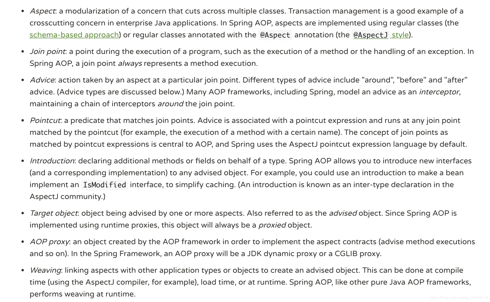
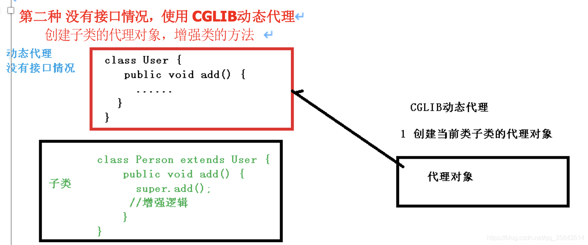
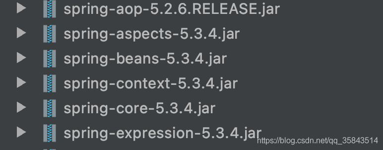
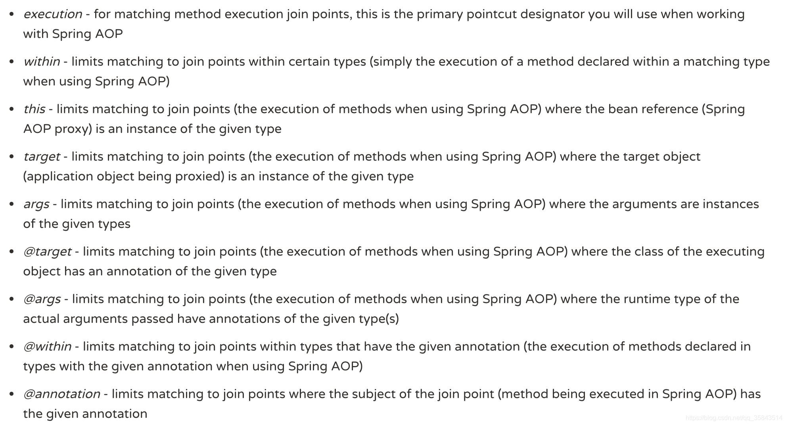
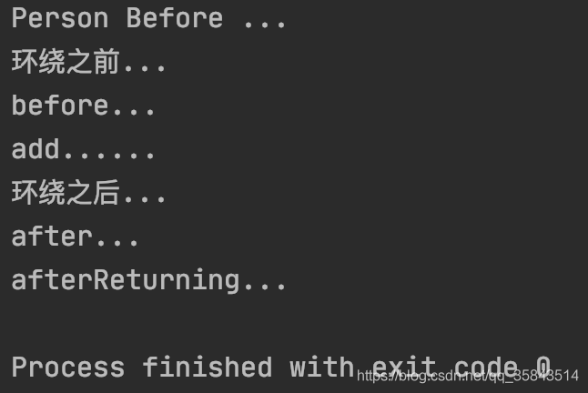

### 一、什么是AOP？

#### AOP 概念

`AOP（Aspect Oriented Programming）`，即**面向切面编程**，是OOP的补充，它也提供了模块化。在面向对象编程中，关键的单元是对象，AOP的关键单元是切面，或者说关注点（可以简单地理解为你程序中的独立模块）。一些切面可能有集中的代码，但是有些可能被分散或者混杂在一起，例如日志或者事务。这些分散的切面被称为`横切关注点`。一个横切关注点是一个可以影响到整个应用的关注点，而且应该被尽量地集中到代码的一个地方，例如事务管理、权限、日志、安全等。

#### 使用AOP可以干什么？

`AOP`让你可以使用简单可插拔的配置，在实际逻辑执行之前、之后或周围动态添加横切关注点。这让代码在当下和将来都变得易于维护。如果你是使用XML来使用切面的话，要添加或删除关注点，你不用重新编译完整的源代码，而仅仅需要修改配置文件就可以了。


 总而言之，AOP就是使用不修改源代码的方式，在主干功能里添加新的功能。

#### Spring AOP 中的一些概念（或术语）


  **切面(Aspect)** ：AOP核心就是切面，它将多个类的通用行为封装成可重用的模块，该模块含有一组API提供横切功能。比如，一个日志模块可以被称作日志的AOP切面。根据需求的不同，一个应用程序可以有若干切面。在Spring AOP中，切面通过带有@Aspect注解的类实现。

 **连接点(Join Point)** ：在程序执行过程中的一点，例如方法的执行或异常的处理。在Spring AOP中，连接点始终代表方法的执行。

 **通知(Advice)** ：AOP在特定的切入点上执行的增强处理，有before, after, afterReturning, afterThrowing, around

 **切入点（Pointcut）** ：决定处理如权限校验、日志记录等在何处切入业务代码中（即织入切面）。切点分为execution方式和annotation方式。前者可以用路径表达式指定哪些类织入切面，后者可以指定被哪些注解修饰的代码织入切面。

 **引介（Introduction）** ：引介让一个切面可以声明被通知的对象实现了任何他们没有真正实现的额外接口，而且为这些对象提供接口的实现使用 @DeclareParaents 注解来生成一个引介。

 **目标对象（Target object）** ：一个或多个切面通知的对象。也称为通知对象。由于Spring AOP是使用运行时代理实现的，因此该对象将始终是代理对象。

 **AOP代理（AOP proxy）** ：由AOP框架创建的对象，用于实施Aspect（处理方法执行等）。在Spring Framework中，AOP代理将是JDK动态代理或CGLIB代理。

 **织入（Weaving）** ：织入，就是通过动态代理，在目标对象方法中执行处理内容的过程。

#### 通知的类型

通知(advice)是你在你的程序中想要应用在其他模块中的横切关注点的实现。Advice主要有以下5种类型：

* `前置通知(Before Advice)`: 在连接点之前执行的Advice，不过除非它抛出异常，否则没有能力中断执行流。使用
  @Before 注解使用这个Advice。
* `返回之后通知(After Retuning Advice)`:
  在连接点正常结束之后执行的Advice。例如，如果一个方法没有抛出异常正常返回。通过 @AfterReturning 关注使用它。
* `抛出（异常）后执行通知(After Throwing Advice)`:
  如果一个方法通过抛出异常来退出的话，这个Advice就会被执行。通过 @AfterThrowing 注解来使用。
* `后置通知(After Advice)`:
  无论连接点是通过什么方式退出的(正常返回或者抛出异常)都会执行在结束后执行这些Advice。通过 @After 注解使用。
* `围绕通知(Around Advice):`
  围绕连接点执行的Advice，就你一个方法调用。这是最强大的Advice。通过@Around 注解使用。

#### 在Spring AOP中关注点和横切关注点有什么不同？

`关注点`：是我们想在应用的模块中实现的行为。关注点可以被定义为：我们想实现以解决特定业务问题的方法。
 `横切关注点`：是贯穿整个应用程序的关注点。像日志、安全和数据转换，它们在应用的每一个模块都是必须的，所以他们是一种横切关注点。

### 二、AOP的底层原理

#### AOP底层使用动态代理

有2种情况的动态代理

(1) 有接口情况使用JDK代理
 

(2) 没有接口的情况使用CGLIB动态代理
 

- 不使用代理

继承当前类的子类，通过子类增强add方法

- 使用代理

创建类的子类的代理对象，增强类的方法

#### 使用JDK动态代理

1. 使用 JDK 动态代理，使用 **Proxy** 类里面的方法创建代理对象
 


  
  **方法有三个参数：**
  `ClassLoder`，类加载器
  `类<?>[ ] interfaces`，增强方法所在的类，这个类实现的接口，支持多个接口
  `InvocationHandler`，实现这个接口 InvocationHandler，创建代理对象，写增强的部分

下面编写代码来演示使用JDK动态代理

创建UserDao接口

```java
public interface UserDao {
    /**
     * 2数相加
     */
    int add(int a, int b);

    /**
     *
     * @param id
     */
    void update(String id);
}
```

```java
public class UserDaoImpl implements UserDao{
    @Override
    public int add(int a, int b) {
        System.out.println("add方法执行了...");
        return a+b;
    }

    @Override
    public void update(String id) {
        System.out.println("update方法执行了" + id);
    }
}
```

```java

public class JDKProxy {

    public static void main(String[] args) {
        // 创建接口实现类代理对象
        Class[] interfaces = { UserDao.class};

        /*第三个参数传入匿名内部类
        Proxy.newProxyInstance(JDKProxy.class.getClassLoader(), interfaces, new InvocationHandler() {
            @Override
            public Object invoke(Object proxy, Method method, Object[] args) throws Throwable {
                return null;
            }
        });*/

        UserDaoImpl userDaoImpl = new UserDaoImpl();
        UserDao dao = (UserDao) Proxy.newProxyInstance(JDKProxy.class.getClassLoader(), interfaces, new UserDaoProxy(userDaoImpl));
        int sum = dao.add(1, 8);
        System.out.println("sum = " + sum);
    }
}

/**
 * 创建代理对象
 */
class UserDaoProxy implements InvocationHandler{
    private Object obj;

    // 1、创建的是谁的对象，就把谁传递过来
    public UserDaoProxy(Object obj){
        this.obj = obj;
    }

         	 /**
             * JDK增强逻辑
             * @param proxy 代理对象
             * @param method 代理方法
             * @param args 被代理的方法的参数
             * @return
             * @throws Throwable
             */
    @Override
    public Object invoke(Object proxy, Method method, Object[] args) throws Throwable {
        // 方法之前
        System.out.println("方法之前执行..." + method.getName() + ":传递的参数" + Arrays.toString(args));

        // 被增强的方法执行
        Object res = method.invoke(obj, args);

        // 方法之后
        System.out.println("方法之后执行" + obj);
        return res;
    }
}
```

### 三、Spring AOP的实现

=基于Java的主要AOP实现有：`AspectJ` `Spring AOP` `JBoss AOP`

#### 准备工作

（1）Spring 框架一般都是基于 `AspectJ `实现 AOP 操作

`AspectJ `不是 `Spring `组成部分，独立 `AOP `框架，一般把 `AspectJ `和 `Spirng `框架一起使用，进行 AOP 操作

（2）基于 AspectJ 实现 AOP 操作

* 基于` xml`配置文件实现
* 基于`注解`方式实现（使用）

（3）工程中，引入Spring AOP相关的依赖
 
 
 （4）切入点表达式（ Point Cut Expression）

`切入点表达式作用`：知道对哪个类里面的哪个方法进行增强
 `语法结构`：

```json
execution([权限修饰符] [返回类型] [类全路径] [方法名称]([参数列表]) )
```

`举例`：

```
举例 1：对 com.micah.dao.BookDao 类里面的 add 进行增强 execution(* com.atguigu.dao.BookDao.add(..))
举例 2：对 com.micah.dao.BookDao 类里面的所有的方法进行增强execution(* com.atguigu.dao.BookDao.* (..))
举例 3：对 com.atguigu.dao 包里面所有类，类里面所有方法进行增强execution(* com.micah.dao.*.* (..))
```

其它切入类型：
 

```java
@Pointcut("execution(public * *(..))")
private void anyPublicOperation() { }

@Pointcut("within(com.xyz.someapp.trading..*)")
private void inTrading() { }

@Pointcut("anyPublicOperation() && inTrading()")
private void tradingOperation() { }
```

**常见切入点表达式的一些示例在下面给出。**

the execution of any public method:

```java
execution(public * *(..))
```

名称以“ set”开头的任何方法的执行：

```java
execution(* set*(..))
```

AccountService接口定义的任何方法的执行：

```java
execution(* com.xyz.service.AccountService.*(..))
```

the execution of any method defined in the service package:

```java
execution(* com.xyz.service.*.*(..))
```

服务包或子包中定义的任何方法的执行：

```java
execution(* com.xyz.service..*.*(..))
```

服务包中的任何连接点（仅在Spring AOP中执行方法）：

```java
within(com.xyz.service.*)
```

服务包或子包中的任何连接点（仅在Spring AOP中执行方法）：

```java
within(com.xyz.service..*)
```

代理实现AccountService接口的任何连接点（仅在Spring AOP中是方法执行） ：

```java
this(com.xyz.service.AccountService)
```

#### AspectJ（此处之后单独讲一节，待补充）

`@AspectJ` refers to a style of declaring aspects as regular Java classes annotated with annotations. The `@AspectJ` style was introduced by the AspectJ project as part of the AspectJ 5 release. Spring interprets the same annotations as AspectJ 5, using a library supplied by AspectJ for pointcut parsing and matching. The AOP runtime is still pure Spring AOP though, and there is no dependency on the AspectJ compiler or weaver.

启用@AspectJ支持后，@AspectSpring将自动检测在应用程序上下文中使用@AspectJ方面（具有注释）的类定义的任何bean，并将其用于配置Spring AOP。

[深入了解可以To———`&gt;>`《AspectJ编程指南》](https://www.eclipse.org/aspectj/doc/released/progguide/index.html)

(1) 创建类，在类里面定义方法，添加@Component注解，创建对象

```java
@Component
public class User {
    /**
     * 前置通知
     */
    public void add(){
        System.out.println("add......");
    }
}
```

（2）创建增强类（编写增强逻辑），在增强类里面，创建方法，让不同方法代表不同通知类型

```java
@Component
@Aspect     // 生成代理对象
public class UserProxy {

    /**
     * 相同切入点抽取
     */
    @Pointcut(value = "execution(* com.micah.spring.aopnno.User.add(..))")
    public void pointCut(){

    }
    /**
     * 前置通知
     * @Before注解表示作为前置通知
     */
    @Order(3)
    @Before(value = "pointCut()")
    public void before(){
        System.out.println("before...");
    }

    /**
     * 后置通知（返回通知）
     */
    @AfterReturning(value = "execution(* com.micah.spring.aopnno.User.add(..))")
    public void afterReturning(){
        System.out.println("afterReturning...");
    }

    /**
     * 异常通知
     */
    @AfterThrowing(value = "execution(* com.micah.spring.aopnno.User.add(..))")
    public void afterThrowing(){
        System.out.println("afterThrowing...");
    }

    /**
     *最终通知
     */
    @After(value = "execution(* com.micah.spring.aopnno.User.add(..))")
    public void after(){
        System.out.println("after...");
    }

    /**
     * 环绕通知
     */
    @Around(value = "execution(* com.micah.spring.aopnno.User.add(..))")
    public void around(ProceedingJoinPoint proceedingJoinPoint) throws Throwable {
        System.out.println("环绕之前...");
        // 被增强的方法执行
        proceedingJoinPoint.proceed();
        System.out.println("环绕之后...");
    }
```

（3）添加项目xml配置文件

```xml
<?xml version="1.0" encoding="UTF-8"?>
<beans xmlns="http://www.springframework.org/schema/beans"
       xmlns:xsi="http://www.w3.org/2001/XMLSchema-instance"
       xmlns:context="http://www.springframework.org/schema/context"
       xmlns:aop="http://www.springframework.org/schema/aop"
       xsi:schemaLocation="http://www.springframework.org/schema/beans http://www.springframework.org/schema/beans/spring-beans.xsd
                        http://www.springframework.org/schema/context http://www.springframework.org/schema/context/spring-context.xsd
                        http://www.springframework.org/schema/aop http://www.springframework.org/schema/aop/spring-aop.xsd">
    <!-- 开启注解扫描 -->
    <context:component-scan base-package="com.micah.spring"></context:component-scan>

    <!-- 开启Aspect生成代理对象-->
    <aop:aspectj-autoproxy></aop:aspectj-autoproxy>
</beans>
```

（4）测试以及结果：

```java
@Test
    public void testAopAnno(){
        ApplicationContext context = new ClassPathXmlApplicationContext("bean1.xml");
        User user = context.getBean("user", User.class);
        user.add();
    }
```


 （5）有多个增强类多同一个方法进行增强，设置增强类优先级
 在增强类上面添加注解 @Order(数字类型值)，数字类型值越小优先级越高

```java
@Component
@Aspect
@Order(1)
public class PersonProxy
```

（6）完全使用注解开发
 创建配置类，不需要创建 xml 配置文件

```java
@Configuration
@ComponentScan(basePackages = { "com.micah"}) @EnableAspectJAutoProxy(proxyTargetClass = true)
public class ConfigAop {
}
```

#### Aspect配置文件

在 spring 配置文件中配置切入点

```xml
<!--配置 aop 增强-->
<aop:config>
	<!--切入点-->
	<aop:pointcut id="p" expression="execution(*com.micah.spring.aopxml.Book.buy(..))"/>
	<!--配置切面-->
	<aop:aspect ref="bookProxy">
	<!--增强作用在具体的方法上-->
	<aop:before method="before" pointcut-ref="p"/>
	</aop:aspect>
</aop:config>
```
