### 一、什么是事务？

#### 1、事务的定义

（1）事务是数据库操作最基本单元，逻辑上一组操作，要么都成功，如果有一个失败所有操作都失败。  
 （2）案例分析  
 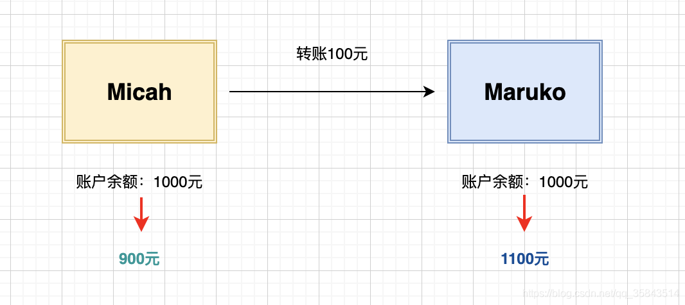

如上述例子，Micah给Maruko转账，只有在转账成功的情况下，Micah的账户余额才会减少，Maruko的账户余额增加，不存在Micah账户的余额减少了，而Maruko的账户余额却不变。要么转账成功，2边余额都改变；要么转账失败，2边余额都保持不变。

#### 2、事务的四大特性

* `原子性（Atomicity）`：事务是一个原子操作，由一系列动作组成。事务的原子性确保动作要么全部完成，要么完全不起作用。
* `一致性（Consistency）`：一旦事务完成（不管成功还是失败），系统必须确保它所建模的业务处于一致的状态，而不会是部分完成部分失败。在现实中的数据不应该被破坏。
* `隔离性（Isolation）`：可能有许多事务会同时处理相同的数据，因此每个事务都应该与其他事务隔离开来，防止数据损坏。
* `持久性（Durability）`：一旦事务完成，无论发生什么系统错误，它的结果都不应该受到影响，这样就能从任何系统崩溃中恢复过来。通常情况下，事务的结果被写到持久化存储器中。

#### 3、Spring事务管理

##### （1）[编程式事务](https://so.csdn.net/so/search?q=%E7%BC%96%E7%A8%8B%E5%BC%8F%E4%BA%8B%E5%8A%A1&spm=1001.2101.3001.7020)管理

编程式事务管理是侵入性事务管理，使用TransactionTemplate或者直接使用PlatformTransactionManager，对于编程式事务管理，Spring推荐使用TransactionTemplate。

##### （2）声明式事务管理

声明式事务管理建立在AOP之上，其本质是对方法前后进行拦截，然后在目标方法开始之前创建或者加入一个事务，执行完目标方法之后根据执行的情况提交或者回滚。编程式事务每次实现都要单独实现，但业务量大功能复杂时，使用编程式事务无疑是痛苦的，而声明式事务不同，声明式事务属于无侵入式，不会影响业务逻辑的实现，只需要在配置文件中做相关的事务规则声明或者通过注解的方式，便可以将事务规则应用到业务逻辑中。

显然声明式事务管理要优于编程式事务管理，这正是Spring倡导的非侵入式的编程方式。唯一不足的地方就是声明式事务管理的粒度是方法级别，而编程式事务管理是可以到代码块的，但是可以通过提取方法的方式完成声明式事务管理的配置。

#### 4、搭建事务操作环境

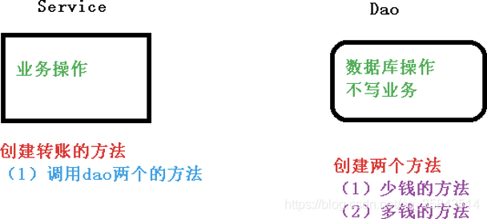

##### （1）创建数据表


##### （2）创建 service，搭建 dao，完成对象创建和注入关系

service 注入 dao，在 dao 注入 JdbcTemplate，在JdbcTemplate 注入 DataSource

```java
@Service
public class UserService { 
    //注入 dao 
    @Autowired
    private UserDao userDao;
} @Repository
public class UserDaoImpl implements UserDao { 
    @Autowired 
    private JdbcTemplate jdbcTemplate;
} 
12345678910
```

##### （3）在 dao 创建两个方法：多钱和少钱的方法，在 service 创建方法（转账的方法）

```java

@Repository
public class UserDaoImpl implements UserDao { 

    @Autowired
    private JdbcTemplate jdbcTemplate;

    //lucy 转账 100 给mary 
//少钱 
    @Override
    public void reduceMoney() { 
        String sql = "update t_account set money=money-? where username=?";
        jdbcTemplate.update(sql,100,"lucy");
    }

    //多钱 
    @Override
    public void addMoney() { 
        String sql = "update t_account set money=money+? where username=?";
        jdbcTemplate.update(sql,100,"mary");
    }
}

@Service
public class UserService { 
    //注入 dao 
    @Autowired
    private UserDao userDao;

    //转账的方法 
    public void accountMoney() { 
//lucy 少 100 
        userDao.reduceMoney();

//mary 多 100 
        userDao.addMoney();
    }
} 


12345678910111213141516171819202122232425262728293031323334353637383940
```

##### （4）上面代码，如果正常执行没有问题的，但是如果代码执行过程中出现异常，有问题

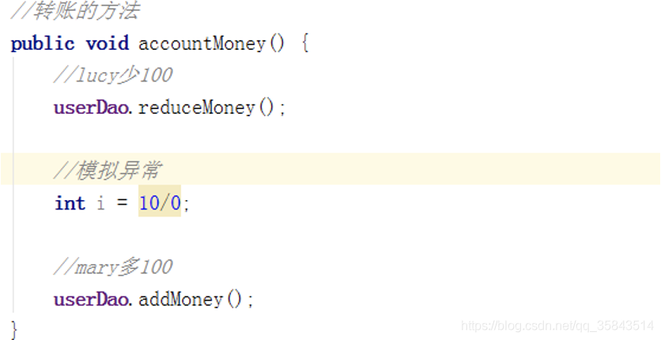  
 问：上面的问题如何解决呢？  
 答：使用事务解决问题

**事务操作过程：**

事务添加到 JavaEE 三层结构里面 Service 层（业务逻辑层）  
 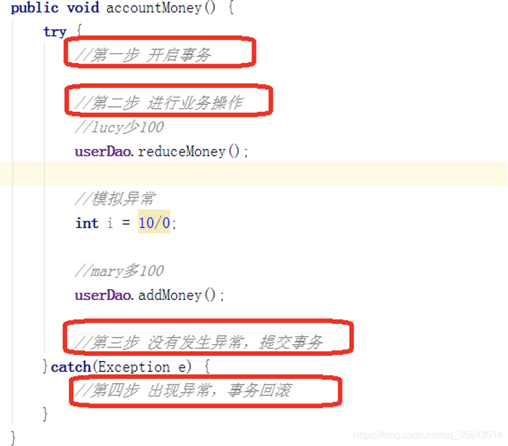

### 二、事务管理

在 Spring 进行事务管理操作，有两种方式：编程式事务管理和声明式事务管理（使用）

#### 1、声明式事务管理的实现方式：

（1）基于注解方式（使用）  
 （2）基于xml配置方式

#### 2、提供一个接口，代表事务管理器，这个接口针对不同的框架提供不同的实现类

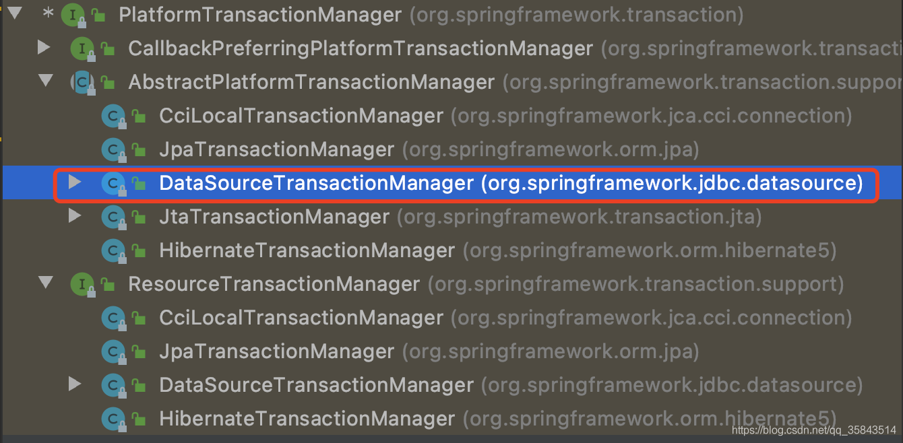

#### 3、注解式事务管理操作

（1）在Spring配置文件中，添加事务管理器，并开启事务注解这里需要注意，开启事务注解需要使用名称空间tx

```
xmlns:tx="http://www.springframework.org/schema/tx"
1
```

```java
 <!--创建事务管理器-->
    <bean id="transactionManager" class="org.springframework.jdbc.datasource.DataSourceTransactionManager">
        <!--注入数据源-->
        <property name="dataSource" ref="dataSource"/>
    </bean>

    <!--开启事务注解-->
    <tx:annotation-driven transaction-manager="transactionManager"/>
12345678
```

（2）在service类或者类方法上中添加transactional注解

* @Transactional，这个注解添加到类上面，也可以添加方法上面
* 如果把这个注解添加类上面，这个类里面所有的方法都添加事务
* 如果把这个注解添加方法上面，为这个方法添加事务

```java
@Service
@Transactional // 事务注解，类上面或者里面的方法上添加注解
public class UserService { 
    @Autowired
    private UserDao userDao;
}
123456
```

在 service 类上面添加注解@Transactional，在这个注解里面可以配置事务相关参数  
 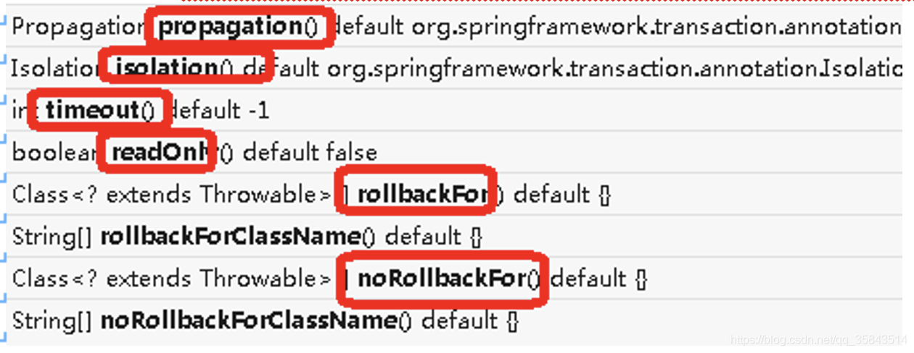

### 三、事务的传播行为

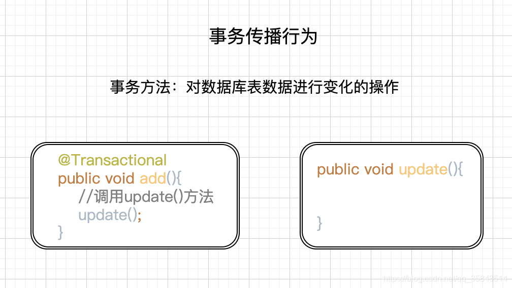  
 事务的传播性一般用在事务嵌套的场景，比如一个事务方法里面调用了另外一个事务方法，那么两个方法是各自作为独立的方法提交还是内层的事务合并到外层的事务一起提交，这就是需要事务传播机制的配置来确定怎么样执行。

**事务的传播行为有以下七种：**

`PROPAGATION_REQUIRED`：Spring默认的传播机制，能满足绝大部分业务需求，如果外层有事务，则当前事务加入到外层事务，一块提交，一块回滚。如果外层没有事务，新建一个事务执行

`PROPAGATION_REQUES_NEW`：该事务传播机制是每次都会新开启一个事务，同时把外层事务挂起，当当前事务执行完毕，恢复上层事务的执行。如果外层没有事务，执行当前新开启的事务即可

`PROPAGATION_SUPPORT`：如果外层有事务，则加入外层事务，如果外层没有事务，则直接使用非事务方式执行。完全依赖外层的事务  
 PROPAGATION_NOT_SUPPORT该传播机制不支持事务，如果外层存在事务则挂起，执行完当前代码，则恢复外层事务，无论是否异常都不会回滚当前的代码

`PROPAGATION_NEVER`：该传播机制不支持外层事务，即如果外层有事务就抛出异常

`PROPAGATION_MANDATORY`：与NEVER相反，如果外层没有事务，则抛出异常

`PROPAGATION_NESTED`该传播机制的特点是可以保存状态保存点，当前事务回滚到某一个点，从而避免所有的嵌套事务都回滚，即各自回滚各自的，如果子事务没有把异常吃掉，基本还是会引起全部回滚的。

传播规则回答了这样一个问题：一个新的事务应该被启动还是被挂起，或者是一个方法是否应该在事务性上下文中运行。

### 四、事务的隔离级别

#### 1、概述

事务的隔离级别定义一个事务可能受其他并发务活动活动影响的程度，可以把事务的隔离级别想象为这个事务对于事物处理数据的自私程度。

#### 2、三个读问题

在一个典型的应用程序中，多个事务同时运行，经常会为了完成他们的工作而操作同一个数据。并发虽然是必需的，但是会导致以下问题：

（1）`脏读（Dirty read）`  
 脏读发生在一个事务读取了被另一个事务改写但尚未提交的数据时。如果这些改变在稍后被回滚了，那么第一个事务读取的数据就会是无效的。  
 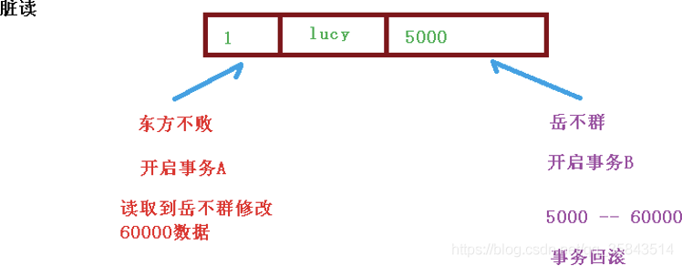

（2）`不可重复读（Nonrepeatable read）`  
 不可重复读发生在一个事务执行相同的查询两次或两次以上，但每次查询结果都不相同时。这通常是由于另一个并发事务在两次查询之间更新了数据。 =不可重复读重点在修改= 。  
 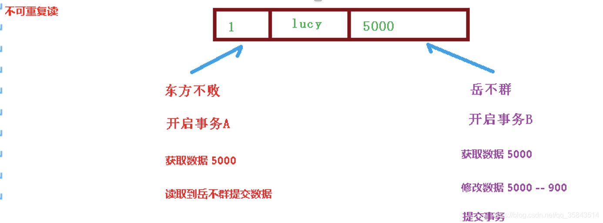

（3）`幻读（Phantom reads）`  
 幻读和不可重复读相似。当一个事务（T1）读取几行记录后，另一个并发事务（T2）插入了一些记录时，幻读就发生了。在后来的查询中，第一个事务（T1）就会发现一些原来没有的额外记录。 =幻读重点在新增或删除= 。

#### 3、隔离级别

在理想状态下，事务之间将完全隔离，从而可以防止这些问题发生。然而，完全隔离会影响性能，因为隔离经常涉及到锁定在数据库中的记录（甚至有时是锁表）。完全隔离要求事务相互等待来完成工作，会阻碍并发。因此，可以根据业务场景选择不同的隔离级别。  
 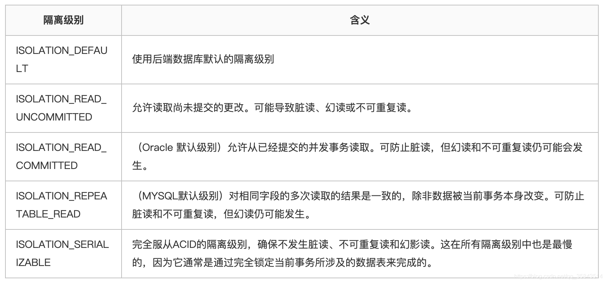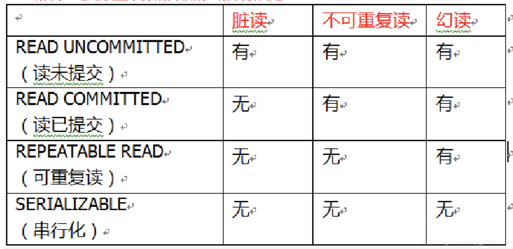

#### 4、timeout：超时时间

```
    （1）事务需要在一定时间内进行提交，如果不提交进行回滚
    （2）默认值是 -1，设置时间以秒单位进行计算
12
```

#### 5、readOnly：是否只读

```
    （1）读：查询操作，写：添加修改删除操作
    （2）readOnly默认值 false，表示可以查询，可以添加修改删除操作
    （3）设置 readOnly值是 true，设置成 true之后，只能查询
123
```

#### 6、rollbackFor：回滚

设置出现哪些异常进行事务回滚

#### 7、noRollbackFor：不回滚

设置出现哪些异常不进行事务回滚

### 五、两种事务管理

#### 1、XML声明式事务管理

（1）配置事务管理器  
 （2）配置通知  
 （3）配置切入点和切面

```xml
 <!--1 创建事务管理器-->
    <bean id="transactionManager" class="org.springframework.jdbc.datasource.DataSourceTransactionManager">
        <!--注入数据源-->
        <property name="dataSource" ref="dataSource"/>
    </bean>

    <!--2 配置通知-->
    <tx:advice id = "tx_advice">
        <!--配置事务的一些相关参数-->
        <tx:attributes>
            <!--指定哪种规则的方法上添加事务-->
            <tx:method name="account*" propagation="REQUIRED"/>
        </tx:attributes>
    </tx:advice>

    <!--3 配置切入点和切面-->
    <aop:config>
        <!--配置切入点-->
        <aop:pointcut id="pt" expression="execution(* com.micah.spring.service.UserService.*(..))"/>
        <!--配置切面-->
        <aop:advisor advice-ref="tx_advice" pointcut-ref="pt"/>
    </aop:config>
12345678910111213141516171819202122
```

#### 2、完全注解声明式事务管理

（1）创建配置类，用来替代配置文件

```xml
/**
 * @Author m.kong
 * @Date 2021/3/1 下午2:58
 * @Version 1.0
 */
@Configuration
@ComponentScan(basePackages = "com.micah") // 组建扫描
@EnableTransactionManagement //开启事务
public class TxConfig {
    /**
     * 创建数据库连接池
     */
    @Bean
    public DruidDataSource getDruidDataSource(){
        DruidDataSource druidDataSource = new DruidDataSource();
        druidDataSource.setDriverClassName("com.mysql.jdbc.Driver");
        druidDataSource.setUrl("jdbc:mysql:///user_db");
        druidDataSource.setUsername("root");
        druidDataSource.setPassword("jlq000321");
        return druidDataSource;
    }

    /**
     * 创建jdbcTemplate对象
     */
    @Bean
    public JdbcTemplate getJdbcTemplate(DataSource dataSource){
        // 到ioc容器中，根据类型找到dataSource
        JdbcTemplate jdbcTemplate = new JdbcTemplate();
        // 注入dataSource
        jdbcTemplate.setDataSource(dataSource);
        return jdbcTemplate;
    }

    /**
     * 创建事务管理器
     */
    @Bean
    public DataSourceTransactionManager getDataSourceTransactionManager(DataSource dataSource){
        DataSourceTransactionManager transactionManager = new DataSourceTransactionManager();
        transactionManager.setDataSource(dataSource);
        return transactionManager;
    }
}
1234567891011121314151617181920212223242526272829303132333435363738394041424344
```
