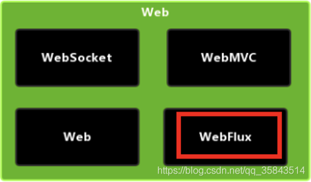
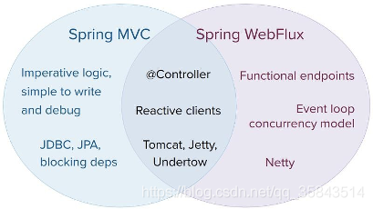
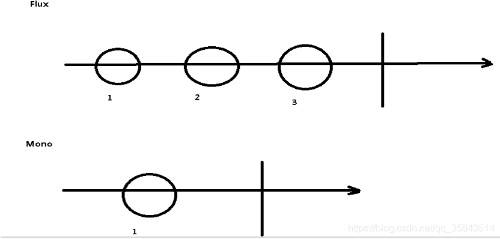
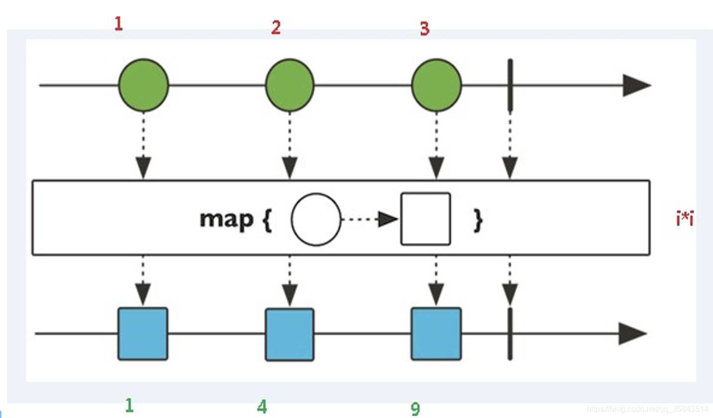
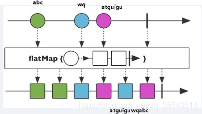
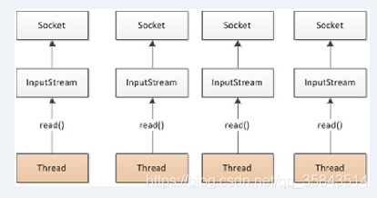
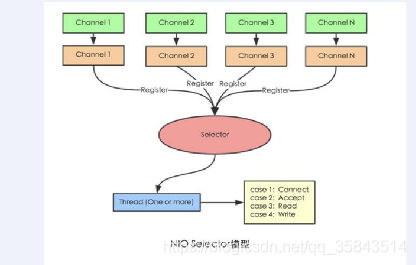
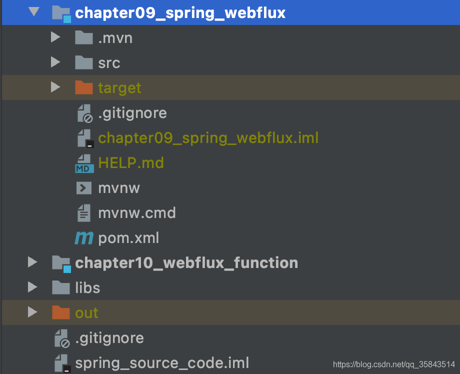
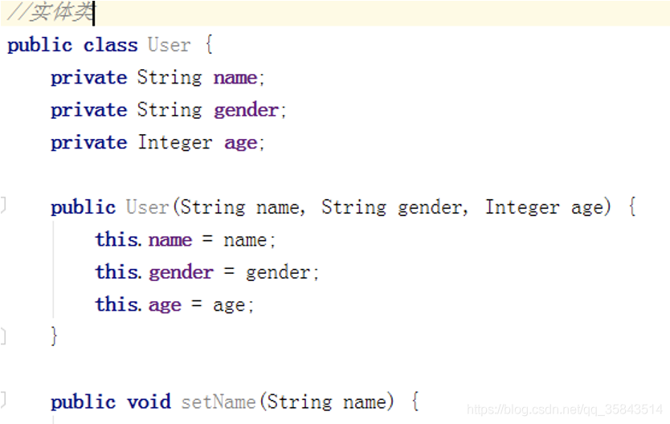

### 一、新的功能

Spring Framework 5.0是在Spring Framework 4.0之后将近四年内一次重大的升级。 在这个时间[框架](https://so.csdn.net/so/search?q=%E6%A1%86%E6%9E%B6&spm=1001.2101.3001.7020)内，主要的发展之一就是Spring Boot项目的演变。

#### 1、概述

Spring Framework 5.0的最大特点之一是响应式编程（Reactive Programming）。 响应式编程核心功能和对响应式endpoints的支持可通过Spring Framework 5.0中获得。 重要变动如下列表所示：

**常规升级**

* 对JDK 9运行时兼容性
* 在Spring Framework代码中使用JDK 8特性
* 响应式编程支持
* 函数式Web框架
* Jigsaw的Java模块化
* 对Kotlin支持
* 舍弃的特性

#### 2、基于Java8兼容Java9

整个 Spring5 框架的代码基于 Java8，运行时兼容 JDK9，许多不建议使用的类和方法在代码库中删除

**使用的一些Java 8特性如下：**

* 核心Spring接口中的Java 8 static 方法
* 基于Java 8反射增强的内部代码改进
* 在框架代码中使用函数式编程——lambdas表达式和stream流

#### 3、支持响应式编程

响应式编程是Spring Framework 5.0最重要的功能之一。

微服务通常基于事件通信的架构构建。 应用程序被设计为对事件（或消息）做出反应。

响应式编程提供了一种可选的编程风格，专注于构建应对事件的应用程序。

虽然Java 8没有内置的响应式性编程支持，但是有一些框架提供了对响应式编程的支持：

`Reactive Streams`：尝试定义与语言无关的响应性API。  
 `Reactor`：Spring Pivotal团队提供的响应式编程的Java实现。  
 `Spring WebFlux`：启用基于响应式编程的Web应用程序的开发。 提供类似于Spring MVC的编程模型。

#### 4、函数式Web框架

除了响应式特性之外，Spring 5还提供了一个函数式Web框架。

函数式Web框架提供了使用函数式编程风格来定义endpoints的功能。

### 二、Spring 5之日志框架

#### 1、Spring 5.0 框架自带了通用的日志封装

（1） Spring5已经移除 Log4jConfigListener，官方建议使用 Log4j2  
 （2） Spring5框架整合 Log4j2

**第一步引入jar 包**  
   
 **第二步：创建log4j2.xml**

```xml
<?xml version="1.0" encoding="UTF-8" ?>
<!--日志级别以及优先级排序: OFF> FATAL> ERROR> WARN> INFO> DEBUG> TRACE> ALL-->
<!--Configuration后面的 status用于设置 log4j2自身内部的信息输出，可以不设置， 当设置成trace时，可以看到log4j2内部各种详细输出-->
<configuration status="DEBUG">
    <!--先定义所有的 appender-->
    <appenders>
        <!--输出日志信息到控制台-->
        <console name="Console" target="SYSTEM_OUT">
            <!--控制日志输出的格式-->
            <PatternLayout pattern="%d{yyyy-MM-dd HH:mm:ss.SSS} [%t] %-5level %logger{36} - %msg%n"/>
        </console>
    </appenders>
    <!--然后定义 logger，只有定义 logger并引入的 appender，appender才会生效-->
    <!--root：用于指定项目的根日志，如果没有单独指定 Logger，则会使用 root作为默认的日志输出-->
    <loggers>
        <root level="info">
            <appender-ref ref="Console"/>
        </root>
    </loggers>
</configuration>
```

#### 2、Spring5 框架核心容器支持@Nullable 注解

（1）@Nullable注解可以使用在方法上面，属性上面，参数上面，表示方法返回可以为空，属性值可以为空，参数值可以为空

（2）注解用在方法上面，方法返回值可以为空

  
 （3）注解使用在方法参数里面，方法参数可以为空  
   
 （4）注解使用在属性上面，属性值可以为空  
 

#### 3、Spring5 核心容器支持函数式风格 GenericApplication Context

//函数式风格创建对象，交给 spring 进行管理

```java
@Test
public void testGenericApplicationContext() { 
    //1 创建 GenericApplicationContext 对象
    GenericApplicationContext context = new GenericApplicationContext();
    //2 调用 context 的方法对象注册
    context.refresh();
    context.registerBean("user1",User.class,() -> new User());
    //3 获取在 spring 注册的对象
    // User user = (User)context.getBean("com.atguigu.spring5.test.User");
    User user = (User)context.getBean("user1");
    System.out.println(user);
} 
123456789101112
```

#### 4、Spring5 支持整合 JUnit5

##### （1）整合 JUnit4

**第一步** 引入 Spring 相关针对测试依赖  
   
 **第二步** 创建测试类，使用注解方式完成

```java
@RunWith(SpringJUnit4ClassRunner.class) 
//单元测试框架
@ContextConfiguration("classpath:bean1.xml") 
//加载配置文件 
public class JTest4 { 
    @Autowired
    private UserService userService;
    @Test
    public void test1() { 
        userService.accountMoney();
    }
}

12345678910111213
```

##### （2）整合Junit5

 **第一步** ：引入jar包  
   
 **第二步：** 创建测试类，使用注解方式完成

```java
@ExtendWith(SpringExtension.class) 
@ContextConfiguration("classpath:bean1.xml") 
public class JTest5 { 
    @Autowired
    private UserService userService;
    @Test
    public void test1() { 
        userService.accountMoney();
    }
} 
12345678910
```

**第三步：** 使用一个复合注解代替上面2个注解完成整合

```java
@SpringJUnitConfig(locations = "classpath:bean1.xml")
public class JTest5{ 
    @Autowired
    private UserService userService;
    @Test
    public void test1() { 
        userService.accountMoney();
    }
} 
12345678
```

### 三、Spring Web Flux

#### 1、Spring Web Flux 介绍

(1）是 Spring5 添加新的模块，用于 web 开发的，功能和 SpringMVC 类似的，Webflux 使用当前一种比较流程响应式编程出现的框架。  
   
 （2）使用传统 web框架，比如 SpringMVC，这些基于 Servlet容器，WebFlux是一种异步非阻塞的框架，异步非阻塞的框架在 Servlet 3.1以后才支持，核心是基于 Reactor的相关 API实现的。

（3）解释什么是异步非阻塞

* 异步和同步
* 非阻塞和阻塞
* 上面都是针对对象不一样

 **异步和同步**针对调用者，调用者发送请求，如果等着对方回应之后才去做其他事情就是`同步`，如果发送请求之后不等着对方回应就去做其他事情就是`异步`

**阻塞和非阻塞**针对被调用者，被调用者受到请求之后，做完请求任务之后才给出反馈就是阻塞，受到请求之后马上给出反馈然后再去做事情就是非阻塞

（4）WebFlux特点：

`第一 非阻塞式`：在有限资源下，提高系统吞吐量和伸缩性，以 Reactor为基础实现响应式编程  
 `第二 函数式编程`：Spring5框架基于 java8，Webflux使用 Java8函数式编程方式实现路由请求

（5）比较 SpringMVC  
   
 第一 两个框架都可以使用注解方式，都运行在 Tomet 等容器中  
 第二 SpringMVC 采用命令式编程，Webflux 采用异步响应式编程

#### 2、响应式编程（Java 实现）

（1）什么是响应式编程

**响应式编程**是一种面向数据流和变化传播的编程范式。这意味着可以在编程语言中很方便地表达静态或动态的数据流，而相关的计算模型会自动将变化的值通过数据流进行传播。电子表格程序就是响应式编程的一个例子。单元格可以包含字面值或类似"=B1+C1"的公式，而包含公式的单元格的值会依据其他单元格的值的变化而变

（2）Java8及其之前版本

* 提供的观察者模式两个类 Observer和 Observable

```java
public class ObserverDemo extends Observable{ 

    public static void main(String[] args) { 
        ObserverDemo observer = new ObserverDemo();
//添加观察者 
        observer.addObserver((o,arg)->{ 
            System.out.println("发生变化");
        });
        observer.addObserver((o,arg)->{ 
            System.out.println("手动被观察者通知，准备改变");
        });
        observer.setChanged(); //数据变化 
        observer.notifyObservers(); //通知 
    }
} 
```

#### 3、响应式编程（Reactor 实现）

（1）响应式编程操作中，Reactor是满足 Reactive规范框架

（2）Reactor 有两个核心类，Mono 和 Flux，这两个类实现接口 Publisher，提供丰富操作符。Flux对象实现发布者，返回 N个元素；Mono实现发布者，返回 0或者 1个元素

（3）Flux和 Mono都是数据流的发布者，使用 Flux和 Mono都可以发出三种数据信号： 元素值，错误信号，完成信号，错误信号和完成信号都代表终止信号，终止信号用于告诉订阅者数据流结束了，错误信号终止数据流同时把错误信息传递给订阅者  
 （4）代码演示 Flux和 Mono

**第一步** 引入依赖

```xml
<dependency>
<groupId>io.projectreactor</groupId>
<artifactId>reactor-core</artifactId>
<version>3.1.5.RELEASE</version>
</dependency>
12345
```

**第二步** 编程代码

```java
public static void main(String[] args) { 
//just 方法直接声明 
        Flux.just(1,2,3,4);
        Mono.just(1);
//其他的方法 
        Integer[] array = { 1,2,3,4};
        Flux.fromArray(array);

        List<Integer> list = Arrays.asList(array);
        Flux.fromIterable(list);

        Stream<Integer> stream = list.stream();
        Flux.fromStream(stream);
}
1234567891011121314
```

（5）三种信号特点

* 错误信号和完成信号都是终止信号，不能共存的
* 如果没有发送任何元素值，而是直接发送错误或者完成信号，表示是空数据流
* 如果没有错误信号，没有完成信号，表示是无限数据流

（6）调用 just或者其他方法只是声明数据流，数据流并没有发出，只有进行订阅之后才会触发数据流，不订阅什么都不会发生的  
 

（7）操作符

* 对数据流进行一道道操作，成为操作符，比如工厂流水线  
  **第一** map 元素映射为新元素  
  ​

**第二** flatMap 元素映射为流  
 把每个元素转换流，把转换之后多个流合并大的流  
 

#### 4、SpringWebflux 执行流程和核心 API

Spring Web Flux 基于 Reactor，默认使用容器是 Netty，Netty 是高性能的 NIO 框架，异步非阻塞的框架  
 （1）Netty  
 BIO  
   
 NIO：

  
 （2）Spring WebFlux 执行过程和 SpringMVC 相似的

（4）SpringWebflux 实现函数式编程，两个接口：RouterFunction（路由处理） 和 HandlerFunction（处理函数）

#### 5、SpringWebflux（基于注解编程模型）

SpringWebflux 实现方式有两种：`注解编程模型`和`函数式编程模型`  
 使用注解编程模型方式，和之前 SpringMVC 使用相似的，只需要把相关依赖配置到项目中，SpringBoot 自动配置相关运行容器，默认情况下使用 Netty 服务器

（1）第一步 创建 SpringBoot 工程，引入 Webflux 依赖

  
 

（2）第二步：设置启动端口号  
   
 （3）创建包和相关类  
 

```java

/**
 * @Author m.kong
 * @Date 2021/3/2 上午10:37
 * @Version 1.0
 * @Description 用户操作接口
 */
public interface UserService { 
    /**
     * 根据id查询用户
     * @param id 主键
     * @return 指定id的用户
     */
    Mono<User> getUserById(int id);


    /**
     * 查询所有用户
     * @return 用户集合
     */
    Flux<User> getAllUser();

    /**
     * 添加一个用户
     * @param user 插入的用户
     * @return 无返回值
     */
    Mono<Void> saveUserInfo(Mono<User> user);
}
```

```java
package com.micah.webflux.service.impl;

import com.micah.webflux.entity.User;
import com.micah.webflux.service.UserService;
import org.springframework.stereotype.Service;
import reactor.core.publisher.Flux;
import reactor.core.publisher.Mono;

import java.util.HashMap;
import java.util.Map;

/**
 * @Author m.kong
 * @Date 2021/3/2 上午10:43
 * @Version 1.0
 */
@Service
public class UserServiceImpl implements UserService { 
    // 创建一个Map集合，来存储模拟数据
    private final Map<Integer, User> users = new HashMap<>();

    public UserServiceImpl() { 
        this.users.put(1, new User("Micah","男",22));
        this.users.put(2, new User("Maruko","女",19));
    }

    @Override
    public Mono<User> getUserById(int id) { 
        return Mono.justOrEmpty(this.users.get(id));
    }

    @Override
    public Flux<User> getAllUser() { 
        return Flux.fromIterable(this.users.values());
    }

    @Override
    public Mono<Void> saveUserInfo(Mono<User> userMono) { 
        return userMono.doOnNext(person -> { 
            // 向map中存放值
            int id = users.size() + 1;
            users.put(id, person);
        }).thenEmpty(Mono.empty());
    }
}
```

```java
/**
 * @Author m.kong
 * @Date 2021/3/2 上午11:20
 * @Version 1.0
 */
@RestController
public class UserController { 
    @Autowired
    private UserService userService;

    @GetMapping("/user/{id}")
    public Mono<User> getUserId(@PathVariable int id){ 
        return userService.getUserById(id);
    }

    @GetMapping("/user")
    public Flux<User> getUsers(){ 
        return userService.getAllUser();
    }

    @GetMapping("/save_user")
    public Mono<Void> saveUser(@RequestBody User user) { 
        Mono<User> userMono = Mono.just(user);
        return userService.saveUserInfo(userMono);
    }
}
```

**说明：**  
 SpringMVC 方式实现，同步阻塞的方式，基于 SpringMVC+Servlet+Tomcat SpringWebFlux 方式实现，异步非阻塞 方式，基于 SpringWebFlux+Reactor+Netty。

6、Spring WebFlux（基于函数式编程模型）  
 （1）在使用函数式编程模型操作时候，需要自己初始化服务器  
 （2）基于函数式编程模型时候，有两个核心接口：RouterFunction（实现路由功能，请求转发给对应的 handler）和 HandlerFunction（处理请求生成响应的函数）。核心任务定义两个函数式接口的实现并且启动需要的服务器。  
 （3）Spring WebFlux 请 求 和 响 应 不 再 是 ServletRequest 和 ServletResponse ，而是ServerRequest 和 ServerResponse

**第一步** 把注解编程模型工程复制一份 ，保留 entity 和 service 内容  
 **第二步** 创建 Handler（具体实现方法）

```java
/**
 * @Author m.kong
 * @Date 2021/3/9 上午9:51
 * @Version 1
 * @Description
 */
public class UserHandler { 
    @Autowired
    private final UserService userService;
    public UserHandler(UserService userService){ 
        this.userService = userService;
    }
    //根据 id 查询 
    public Mono<ServerResponse> getUserById(ServerRequest request) { 
        //获取 id 值 
        int userId = Integer.valueOf(request.pathVariable("id"));
        //空值处理 
        Mono<ServerResponse> notFound = ServerResponse.notFound().build();
        //调用 service 方法得到数据 
        Mono<User> userMono = this.userService.getUserById(userId);
        //把 userMono 进行转换返回 
        //使用 Reactor 操作符 flatMap 
        return
                userMono
                        .flatMap(person -> ServerResponse.ok().contentType(MediaType.APPLICATION_JSON)
                                .body(fromObject(person)))
                        .switchIfEmpty(notFound);
    }
  
    //查询所有 
    public Mono<ServerResponse> getAllUsers() { 
        //调用 service 得到结果 
        Flux<User> users = this.userService.getAllUser();
        return ServerResponse.ok().contentType(MediaType.APPLICATION_JSON).body(users,User.cl ass);
    }
  
    //添加 
    public Mono<ServerResponse> saveUser(ServerRequest request) { 
        //得到 user 对象 
        Mono<User> userMono = request.bodyToMono(User.class);
        return ServerResponse.ok().build(this.userService.saveUserInfo(userMono));
    }
}

```

**第三步** 初始化服务器，编写 Router

* 创建路由的方法

```java
//1、创建 Router 路由 
public RouterFunction<ServerResponse> routingFunction() { 
		//创建 hanler 对象 
        UserService userService = new UserServiceImpl();
        UserHandler handler = new UserHandler(userService);
		//设置路由 
        return RouterFunctions.route(  		
GET("/users/{id}").and(accept(APPLICATION_JSON)),handler::getUserById)      .andRoute(GET("/users").and(accept(APPLICATION_JSON)),handler::get AllUsers);
} 
123456789
```

* 创建服务器，完成适配

```java

//2 创建服务器完成适配 
public void createReactorServer() { 
        //路由和 handler 适配 
        RouterFunction<ServerResponse> route = routingFunction();
        HttpHandler httpHandler = toHttpHandler(route);
        ReactorHttpHandlerAdapter adapter = new ReactorHttpHandlerAdapter(httpHandler);
        //创建服务器 
        HttpServer httpServer = HttpServer.create();
        httpServer.handle(adapter).bindNow();
} 
1234567891011
```

* 最终调用

```java
public static void main(String[] args) throws Exception{ 
        Server server = newServer();
        server.createReactorServer();
        System.out.println("enter to exit");
        System.in.read();
}
123456
```

（4）使用 WebClient 调用

```java
public class Client { 
    public static void main(String[] args) { 
		//调用服务器地址 
        WebClient webClient = WebClient.create("http://127.0.0.1:5794");
		//根据 id 查询 
        String id = "1";
        User userresult = webClient.get().uri("/users/{id}", id)
.accept(MediaType.APPLICATION_JSON).retrieve().bodyToMono(User
                        .class)
                .block();
        System.out.println(userresult.getName());

//查询所有 
        Flux<User> results = webClient.get().uri("/users")
                .accept(MediaType.APPLICATION_JSON).retrieve().bodyToFlux(User
                        .class);
        results.map(stu -> stu.getName())
                .buffer().doOnNext(System.out::println).blockFirst();
    }
} 
```
